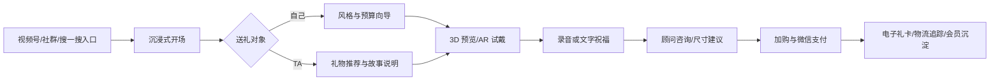
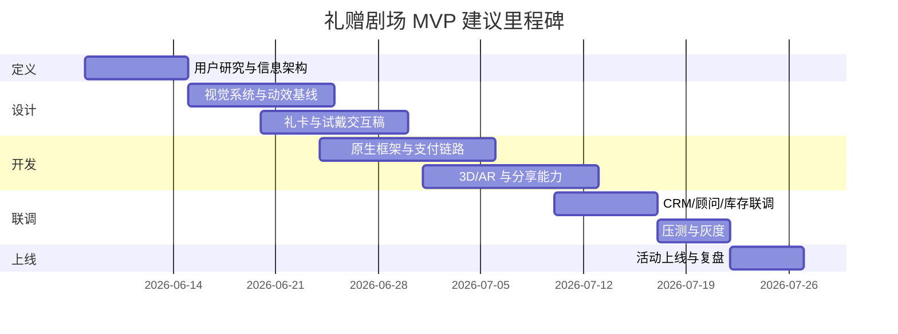
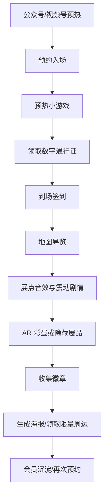
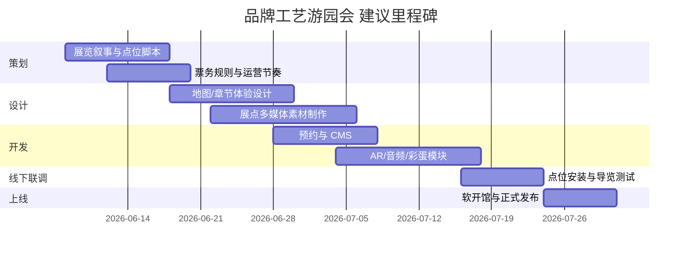
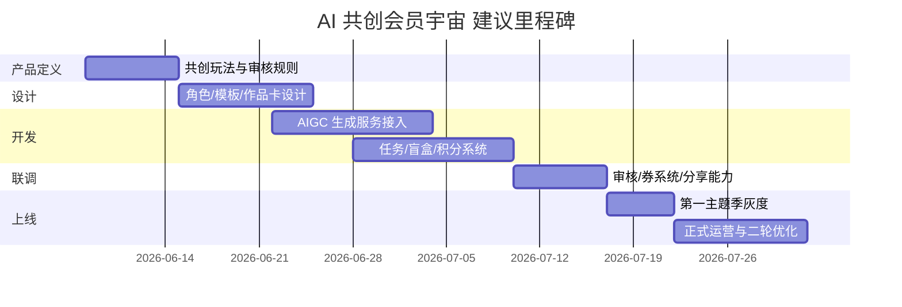

# 微信小程序中沉浸式与高格调品牌案例与可复用设计模式研究

## 执行摘要

从 2024 到 2026 年，微信小程序里最有价值的“沉浸式/高格调”品牌实践，已经不再是把官网或商城压缩进一个轻应用，而是把**内容、互动、顾问服务、社交凭证与支付闭环**压缩进一次可探索、可分享、可转化的品牌旅程。腾讯对品牌小程序运营演进的概括，已从早期“商城导向”升级到“会员/游戏化导向”；与此同时，QuestMobile 口径下，2024 年 10 月微信小程序用户已达 9.49 亿，月人均使用近 70 次，说明小程序不只是私域承接页，而是足以承接高审美、高互动、高客单价体验的主舞台。综合本报告中的 12 个案例可以看到：真正有效的沉浸感，并不等于重资产 3D，而是**章节式叙事、轻量 AR、个性化共创、顾问式服务、社交分享与极速交易**的组合设计。citeturn10search7turn6view0turn29view2

**结论要点**

- 小程序中的“高格调”最常见于三类场景：**节日礼赠、品牌展览/快闪、明星/IP 联名事件**。这三类场景天然适合把视觉语言、任务机制、分享动作与交易闭环绑在一起。citeturn29view0turn28view5turn28view2turn27view4
- 奢侈品与高客单品牌并不急于公开小程序 GMV；它们更在意的是**缩短决策链**，典型手段是礼赠向导、顾问咨询、预约、虚拟试戴/试衣与微信支付。citeturn29view0turn29view1turn28view4turn28view0
- 高频品牌最能把小程序做成“脉冲型增长器”：**口令红包、免单券、盲盒、限量周边、明星彩蛋**，比做一个很美但很重的页面更有效。citeturn27view3turn27view5turn29view3turn28view2turn18view0
- AIGC 在小程序里最适合做的是**身份化与共创**，而不是替代品牌美术：头像、歌曲、祝福、海报、角色皮肤，都比“自动生成一切”更容易兼顾审美与稳定性。citeturn28view1turn28view3
- 技术栈上，若目标是高帧率内容浏览与复杂转场，应优先考虑**原生小程序 + Skyline**；若目标是相机识别、AR 摆放、试戴/试妆，则优先考虑**原生小程序 + xr-frame/官方 AR 方案**，仅在既有 3D/H5 资产必须复用时再考虑重 WebView/three.js 混合。citeturn24view0turn24view1

## 案例库

下表选取了 12 个**非 SaaS、非单纯展示页**的品牌案例，覆盖奢侈品、零售、餐饮、美妆、文化/展览、娱乐/游戏跨界等场景。需要说明两点：其一，Dior 与 Tiffany 的节日 AR 模块首发于 2023 年末，但在 2024 年仍被持续运营或被行业反复复盘，因此纳入为“近两年仍具强参考价值”的模式样本；其二，多数品牌并不单独披露小程序 DAU/GMV，因此表中凡以“估”标注的数据，均为基于公开曝光、活动周期、品类客单、互动深度与微信小程序大盘活跃度的**区间估算**。截至 2024 年 10 月，微信小程序用户规模为 9.49 亿，月人均使用近 70 次；QuestMobile 也显示，奢侈品、运动与茶饮是近两年小程序私域化运营最活跃的几个赛道。citeturn6view0turn27view0turn27view1turn29view3

**说明：**“证据强度”格式为“体验证据 / 成效证据”；“高/低”表示功能真实性强，但商业结果主要依赖估算。

| 品牌 | 行业 | 关键时间 | 目标/场景 | 核心沉浸体验要素 | 关键技术实现 | UX 与商业成效 | 为什么能打动用户 | FDE 可复用性 | 证据强度 | 参考 |
|---|---|---|---|---|---|---|---|---|---|---|
| 路易威登 LV「520 甄礼指南」 | 奢侈品礼赠 | 2024 520 | 情感节点送礼、扩大从恋人到家庭/自我奖励的礼赠语境 | 主题化选礼场景、多价位礼物分区、可定制电子礼品卡、可附加个人信息/音频、无缝数字购物 | 公开可见为小程序主题场景 + 个性化电子礼卡 + 微信支付；估判为原生小程序、canvas 礼卡生成、音频上传/存储与会员画像联动 | 公开：腾讯称其触达更广泛客群，并把 Valentine 风格礼赠扩展为生活方式场景；未公开：估活动期 UV 50万-120万、礼赠页到结账转化 0.5%-1.2%（依据是礼赠高动机与高客单低频购买特征） | 送礼不再只是“买东西”，而是“替我说话”；音频/文字祝福把奢侈品购物转成情感表达 | **高**：礼赠导航、礼卡生成、音频祝福、支付收口都高度模块化 | 高 / 低 | 腾讯官方案例；微信大盘基线。citeturn29view0turn29view3 |
| BOSS 中国首家概念店微信互动体验 | 高端时尚零售 | 2024 | 概念店开业、VIP 邀请、O2O 体验旅程 | 个性化 VIP 邀请函、AR 展示、微信互动体验、虚拟试衣、数字艺术装置、离店后延续互动 | 公开：AR 拍照/展示、虚拟试衣、微信全生命周期互动；估判为原生小程序 + AR/试衣引擎 + 门店二维码/会员识别 + CRM | 公开：腾讯称其重塑动态购物环境，让用户离店后仍可参与；未公开：估首店期 AR/试衣互动 2万-6万、互动到留资率 10%-20% | 高端零售最容易陷入“拘谨”，而 BOSS 把进店前、进店中、离店后串成了一段连续的风格旅程 | **中高**：更适合旗舰店、快闪店、概念店；复用时要控制 AR 成本 | 高 / 低 | 腾讯官方案例。citeturn29view0 |
| FILA × McLaren 联名小程序旅程 | 运动零售 / 高端联名 | 2024 | 联名系列触达、店员连接、精英运动人群经营 | 从朋友圈/二维码到门店与店员的连续触点、个性化沟通、精英身份感、联名内容私域承接 | 公开：微信小程序连接用户与喜欢的门店/店员，企业微信 CRM 做个性化服务；估判为原生小程序 + 企业微信 + 会员标签/私域互通 | 公开：腾讯称其有助于提升销售额并获得消费者洞察；未公开：估咨询/加企微率 8%-18%，活动月销售 uplift 5%-12% | 对这类联名用户来说，最打动人的不是页面，而是“我被当成懂行的人服务” | **高**：非常适合时尚、运动、户外、腕表、汽车周边联名 | 高 / 低 | 腾讯官方案例；QuestMobile 对 FILA 小程序私域阵地的复盘。citeturn29view1turn29view3 |
| LOEWE《Crafted World 匠艺天地》展览小程序 | 奢侈品 / 文化展览 | 2024-03 至 2024-05 | 展览预约、线上预热、现场导览、线下后链路留存 | “探索式”而非“浏览式”UI、预约/地图导览、密语挑战、发音挑战、音效触发、震动触感、AR 隐藏艺术品、滤镜、壁纸、表情包、彩蛋 | 公开：地图导览、视频震动、环境音故事、AR 解锁；估判为原生小程序 + 音频/震动 API + camera AR + 云内容管理 + 分享海报 | 公开：媒体报道其为贯穿展览前中后期的线上体验，且官方小程序承担预约；未公开：估预约 UV 40万-100万、实际到展 8万-15万人（依据是免费高规格大展、约 6 周展期、预约排期靠后） | 真正打动人的是“匠艺”被感官化了：不是读说明，而是听见、摸到、找到、解锁 | **很高**：适用于展览、工艺品牌、博物馆、限时快闪与文化 IP | 高 / 中低 | 项目案例页；行业报道提到可通过官方小程序预约。citeturn28view5turn15search10turn29view3 |
| Mytheresa 微信小程序 | 奢侈品内容电商 | 2024-09-20 | 中国市场加码、本地化、精选式高端购物 | 中文品牌名“美遴世”、180+ 奢侈品牌精选、个性化推荐、7 天在线 live chat、专属活动、微信支付、豪华包装、Personal Shopping | 公开：个性化推荐、在线客服、微信支付、personal shopping；估判为原生小程序 + 推荐系统 + CRM + 即时客服 | 公开：小程序上线时可访问 180+ 奢侈品牌；公司 FY2024 GMV 为 €913.6m；未公开：估上线首月 UV 20万-50万、会话到下单 0.3%-0.8% | 它卖的不是“全”，而是“替你挑好”；这比传统货架更贴近高端用户的被服务感 | **中高**：适合买手店、精选电商、生活方式精品零售 | 高 / 中低 | 品牌投资者新闻稿。citeturn14view0turn28view4 |
| Dior「金蝶漫舞 / 金蝶献礼」 | 奢侈品节日营销 | 2023Q4 首发，2024 春节延续 | 圣诞与新年礼赠、包装即入口、审美记忆强化 | 巨幅蝴蝶开场、图像 AR 包装识别、AR 人脸滤镜、海报生成、语音/文字祝福卡、明星祝福、红包封面、壁纸奖励 | 公开：图像 AR、滤镜、海报、语音/文字贺卡；估判为小程序 AR 引擎 + canvas 海报合成 + 音频输入/存储 + 分享组件 | 公开：被行业总结为“为已购用户提供尊享体验并吸引更多目标用户购买”；未公开：估互动 UV 20万-60万、海报/贺卡生成率 15%-30%、礼袋识别参与率 8%-15% | 用户拿到的不只是礼袋，而是一把“打开节日奇境”的钥匙；包装成为品牌叙事的一部分 | **很高**：节日礼赠、包装 AR、祝福生成、红包封面是成熟可复制模式 | 中高 / 低 | 数英案例页；Kivicube 对同一节日 AR 类型的复盘。citeturn27view0turn7search10 |
| Tiffany 3D 节日奇幻城 / AR 珠宝试戴 | 珠宝奢侈品 | 2023Q4 首发，2024 持续被复盘 | 节日礼遇、线上试戴、缩短高客单决策链 | 3D 节日空间、会员注册解锁、360° 产品查看、AR 戒指/手镯试戴、海报生成分享 | 公开：高精度 3D 渲染、360 旋转缩放、AR 试戴、海报分享；估判为 WebGL/3D 组件 + AR 识别/跟踪 + 图片合成 | 公开：服务商明确指出其“大大缩短消费者决策链路，提升销量转化”；未公开：估试戴会话 10万-30万、收藏/分享率 15%-30%、购买转化提升 1-3 个百分点 | 珠宝最难解决的是“想象自己戴上的样子”；它把想象变成即时体验 | **很高**：高客单配饰、腕表、眼镜、珠宝都适用 | 中高 / 中低 | Kivicube 节日复盘；Kivicube 独立案例页。citeturn27view1turn28view0 |
| 维他柠檬茶「维他本涩混音室」 | 饮料 / 内容共创 | 2024-05 | 品牌焕新、年轻化、把 slogan 变成可参与内容 | AI 歌曲创作、用户声纹克隆、AI 改写歌词、曲风选择、混音、播放界面视频、一键分享；微信版与抖音版并行 | 公开：Tacotron2、端到端歌声合成、注意力同步、FFmpeg 视频流处理；估判为小程序前端 + 云端推理任务队列 | 公开：71106 位网友共同生成“数字音乐专辑”；项目从 0 到 1 开发周期约 1.5 个月；未公开：估总体验会话 15万-35万 | 它让用户不再“听品牌说”，而是“用自己的声音替品牌说” | **中高**：适合年轻化、明星合作、校园/音乐/潮流品牌，尤其适合发起 UGC 共创 | 高 / 高 | 数英项目页。citeturn18view0turn28view1 |
| 瑞幸 ×《黑神话：悟空》 | 餐饮 × 娱乐/游戏 | 2024-08-19 | 游戏大作发售前夜抢心智、联名套餐与周边转化 | 联名套餐、3D 光栅卡、杯套、部分门店主题化装修、限量周边、“首发前夜”节奏控制 | 公开：高并发套餐与限量周边联动；估判为小程序商品包、资格校验、库存联动、门店库存同步 | 公开：QuestMobile 口径下，8 月 19 日当日流量达 316 万；界面报道显示活动热度极高，并出现短时系统压力与周边售罄；未公开：估联名套餐转化 8%-15% | 它抓住的是“我必须第一时间拥有”的玩家情绪，而不是单纯新品尝鲜 | **中**：视觉不算最精致，但对高并发事件营销与库存闸门很有参考价值 | 中高 / 中高 | QuestMobile 年度盘点；界面新闻报道。citeturn29view3turn27view4 |
| 霸王茶姬「国际茶日 万里木兰」 | 茶饮 / 节日节点 | 2024-05-15 至 2024-05-21 | 节日爆发、会员活跃、社群裂变、新品教育 | 主题专场直播、口令红包、谜面解锁、官方社群推送、小程序会员门槛、限量免单券、好友助力/社交传播 | 公开：口令红包活动页、会员链路、每日限量券发放；估判为小程序会员中心 + 券系统 + 社群分发 + 直播/内容联动 | 公开：品牌在微信等平台推出“一亿杯”免单活动；活动期内每天 11:17 发放 10 万张新品免单券，QuestMobile 称其小程序流量出现两个高峰；未公开：估参与 UV 200万-500万 | 它把“喝茶”做成了共时性节日事件：定点开抢、文化故事、免费试新、社群一起玩 | **很高**：几乎是高频行业做小程序脉冲运营的范本 | 高 / 中高 | SocialBeta；活动说明页；QuestMobile 盘点。citeturn27view3turn27view5turn29view3 |
| 曼秀雷敦「M135 小程序」 | 美妆 / 会员社区 | 2025 | 135 周年焕新、百年品牌年轻化、IP 社区化 | AIGC 个性头像、虚拟社区、主题馆打卡、积分、抽奖、分享、公益捐赠、OMO 成长体系 | 公开：AIGC 头像、用户成长体系、线上线下数据打通；估判为原生小程序 + AIGC 生成服务 + 会员中台 + 积分商城 | 公开：案例页明确其以 AIGC 实现互动升级并打通线上线下数据；未公开：估注册用户 50万-150万、7 日回访 18%-30% | 它最强的地方不是“酷炫”，而是把百年 IP 变成可进入、可扮演、可做公益的身份 | **很高**：尤其适合 heritage brand、IP 焕新、会员体系升级 | 中高 / 低 | 数英案例复盘。citeturn21view0turn28view3 |
| SKECHERS「重返奇境 1999」 | 运动时尚 / 明星营销 | 2025-05 | 代言升级、品牌复古资产重构、内容导购 | 千禧叙事、沉浸式大片、主题门店、任务式线索找寻、小程序盲盒掉落未公开花絮、签到做任务、晒图开箱 | 公开：微博/小红书/门店/小程序联动；小程序盲盒每日掉落物料；估判为内容任务系统 + 盲盒掉落 + 门店核销/礼盒库存 | 公开：总曝光 13 亿+、总阅读 2 亿+、总互动 2300 万+、话题播放 2400 万+，GWP 礼盒 2 小时售罄，GMV 实现“千万级跃升” | 它成功把“怀旧”从审美符号变成可逐日追更、可收藏、可开箱的参与过程 | **很高**：适合明星官宣、品牌周年、潮流复古主题与限定发售 | 高 / 高 | 数英项目页。citeturn20view0turn28view2 |

## 对比评分与洞察

评分采用 1-5 分，分值越高表示该维度越强。表头分别代表：**视**（视觉）、**交**（交互）、**叙**（叙事）、**多**（多媒体）、**个**（个性化）、**社**（社交）、**支**（支付/预约闭环）、**AR**、**3D**、**商**（商业成效）。这里的“商业成效”优先看公开结果，其次看是否形成了强留资、预约、支付或权益兑换闭环。

| 品牌 | 视 | 交 | 叙 | 多 | 个 | 社 | 支 | AR | 3D | 商 | 评分理由 |
|---|---:|---:|---:|---:|---:|---:|---:|---:|---:|---:|---|
| 路易威登 LV | 4 | 4 | 3 | 3 | 4 | 2 | 5 | 1 | 2 | 4 | 典型节礼导购；支付闭环强，社交分享弱于 AR 型项目 |
| BOSS | 4 | 4 | 3 | 4 | 3 | 3 | 4 | 4 | 3 | 3 | 旗舰店/概念店体验完整，但公开结果偏定性 |
| FILA × McLaren | 3 | 4 | 2 | 2 | 4 | 3 | 5 | 1 | 1 | 4 | 强在 CRM 和交易闭环，不在重视觉 |
| LOEWE 展览小程序 | 5 | 5 | 5 | 5 | 3 | 3 | 2 | 4 | 3 | 4 | 是“品牌世界观小程序化”的近年顶级样本 |
| Mytheresa | 4 | 3 | 3 | 2 | 5 | 1 | 5 | 1 | 1 | 3 | 高级精选与顾问感强，但不追求炫技 |
| Dior 金蝶 | 5 | 5 | 4 | 5 | 3 | 4 | 2 | 5 | 2 | 4 | 节庆美学与 AR 包装识别结合得非常成熟 |
| Tiffany 试戴 | 5 | 5 | 3 | 4 | 3 | 3 | 4 | 5 | 5 | 4 | 试戴就是交易前体验，技术与转化耦合度高 |
| 维他本涩混音室 | 4 | 5 | 4 | 5 | 5 | 4 | 1 | 1 | 1 | 4 | 以 AIGC 共创驱动记忆和传播，交易闭环弱 |
| 瑞幸 × 黑神话 | 4 | 4 | 3 | 4 | 2 | 5 | 5 | 1 | 2 | 5 | 商业爆发力很强，更多是事件型转化 |
| 霸王茶姬 国际茶日 | 3 | 4 | 3 | 4 | 3 | 5 | 5 | 1 | 1 | 5 | 高频品牌里非常典型的“节点脉冲增长” |
| 曼秀雷敦 M135 | 4 | 5 | 4 | 4 | 5 | 4 | 3 | 1 | 1 | 4 | 适合长生命周期会员/品牌社区经营 |
| SKECHERS 重返奇境 1999 | 5 | 4 | 5 | 4 | 3 | 4 | 4 | 1 | 1 | 5 | 兼具高美学、连续任务与明确商业回收 |

如果把这些案例放在一起看，一个非常鲜明的规律是：**视觉/叙事最高分的项目，几乎都不是单纯商城，而是有“世界观”的项目。**LOEWE 用“探索”替代“浏览”，Dior 用包装与蝴蝶做节庆入口，Tiffany 用试戴把珠宝从静态展陈变成动态体验，SKECHERS 则把复古品牌资产改造成一套可追更的任务叙事。它们共同证明，真正的沉浸式小程序不是“页面更满”，而是“路径更像一段旅程”。citeturn28view5turn27view0turn27view1turn28view0turn28view2

**商业回报最硬的，却不一定是最炫的项目。**瑞幸、霸王茶姬、维他、SKECHERS 的共同点，是把小程序作为一次“脉冲”来运营：限时口令、盲盒掉落、节点联名、可分享的成果物、兑换型权益，这些设计都把参与门槛压低了，把社交扩散与兑换/购买通道拉近了。瑞幸在《黑神话：悟空》联名上线日拿到 316 万流量，霸王茶姬在国际茶日期间做出了双峰活跃，SKECHERS 公开披露了亿级曝光与千万级 GMV 跃升，VLT 则把品牌焕新口号转成了 7.1 万首共创歌曲。citeturn29view3turn27view4turn27view3turn27view5turn20view0turn18view0

另一个重要发现是，**高客单价品牌的“支付分”往往不是靠强促销，而是靠减少不确定性。**LV 的礼赠向导、Mytheresa 的 live chat 与精选推荐、Tiffany 的 3D/AR 试戴，都是在降低“我会不会买错”的心理成本；这与高频茶饮品牌用免单券快速拉活，是两种完全不同的逻辑。前者是“降低决策阻力”，后者是“提高参与频率”。citeturn29view0turn28view4turn28view0turn27view3

## 可复用设计模式与 FDE 实现清单

从微信官方技术与案例共性来看，一个现实而有效的策略是：**浏览型沉浸体验优先用 Skyline，AR/3D 体验优先用 xr-frame，内容重运营项目优先用原生小程序的任务/分享/支付能力做模块化组合**。微信官方 Skyline 示例集中已经提供“沉浸式商品浏览”“分类列表联动”等高帧率交互参考；官方 xr-frame 示例则覆盖了 2DMarker、OSDMarker、人脸/人手/人体识别、AR 模型摆放、遮挡与截图分享等能力，已经足够支撑绝大多数品牌级试戴/展览/快闪需求。citeturn24view0turn24view1

**成本档位说明**  
小：2-4 周，约 8万-20 万元  
中：4-8 周，约 20万-60 万元  
大：8-16 周，约 60万-200 万元以上

| 设计模式 | 目标 | 实现要点 | 技术栈建议 | 预估成本与周期 | 风险与注意事项 | 适用场景 |
|---|---|---|---|---|---|---|
| 世界观式首页序章 | 让用户不是“进商城”，而是“进入品牌空间” | 首屏只做一个核心动作；采用大标题、角色/物件/场景、1-2 个主入口；控制首屏信息密度 | 原生小程序 + Skyline；动态素材用 Lottie/序列帧 | 小到中 | 过度堆视觉会拖累首屏性能；必须把 CTA 做得清楚 | 奢侈品、周年庆、节日 campaign |
| 章节式场景浏览 | 把长内容切成章节，提升停留与阅读完成率 | 每章只有一个主情绪与一组动效；支持“继续探索”而不是无限瀑布流 | Skyline + 分段式滚动 + Worklet 动画 | 中 | 设计好看但信息层级混乱时，用户会迷路 | 叙事型品牌、展览、工艺故事 |
| 探索地图与现场导览 | 连接线上预热、线下到场与回访 | 小程序里包含预约、地图、路线、现场点位、彩蛋进度条 | 原生小程序 + 地图组件 + 云函数 + CMS | 中 | 线下动线变更会导致内容失效；要留后台改点位能力 | 展览、快闪、概念店 |
| 环境音与触觉提示 | 用低成本多感官增强“在场感” | 关键视频节点加震动；音频采用按点位/章节触发；只在少量节点使用，避免疲劳 | 原生 API + 音频管理 + vibration API | 小 | 安卓/iOS 体验不完全一致；要设置静音与关闭选项 | 工艺、自然、旅行、展览导览 |
| 轻量 AR 包装识别 | 把包装/海报/门店物料变成入口 | 识别目标物只保留 1-3 个；识别成功后立即给奖励或解锁内容 | xr-frame / 图像识别 AR 方案 + 云识别 | 中 | 识别不稳会严重伤体验；线下物料必须统一印刷品质 | 节日礼盒、快闪海报、包装互动 |
| 3D 商品查看器 | 降低高客单/高细节品类的理解成本 | 支持旋转、缩放、热点说明、光影变化；热点不超过 5 个 | xr-frame 优先；已有 WebGL 资产时可 WebView/three.js 混合 | 中到大 | 模型过重会掉帧；贴图和法线必须移动端优化 | 珠宝、箱包、鞋服、家居单品 |
| 虚拟试戴 / 试妆 | 缩短“想象自己使用”的决策差 | 先做单部位高精度，再扩品类；把“拍照/保存/分享”做成流程的一部分 | xr-frame / 专用试戴引擎 / AI 识别 | 大 | 算法精度与肤色/手型/光照适配是核心；不要全量 SKU 一次全上 | 珠宝、腕表、眼镜、美妆 |
| 礼赠配置器 | 提升礼赠场景转化与客单 | 选择对象、预算、风格、祝福文案/录音、礼卡预览一体化 | 原生小程序 + 表单引擎 + canvas + 音频上传 | 小到中 | 礼卡预览必须稳定；结账前不要跳出太多步骤 | 七夕、520、圣诞、新年 |
| 任务签到脉冲 | 在短周期内拉高回访与活跃 | 每日 1 个低门槛动作；奖励池分“即时奖/累计奖”；支持裂变任务 | 原生小程序 + 任务系统 + 券/积分中心 | 小到中 | 任务过多会降低完成率；要留 anti-cheat 与限领机制 | 茶饮、咖啡、潮流零售 |
| 盲盒与彩蛋掉落 | 用不确定性拉长追更周期 | 奖励按“内容彩蛋/权益彩蛋/实物彩蛋”分层；掉落概率透明 | 原生小程序 + 权益/库存系统 + 埋点 | 中 | 若奖池设计不公，会伤害口碑；实物要管库存与补货 | 明星官宣、联名、周年庆 |
| AIGC 共创工作台 | 把用户变成内容共同作者 | 只给用户改一小部分：头像、声音、祝福、歌词、贴图，而不是全自动生成 | 原生小程序 + 云端 AIGC 服务 + 审核队列 + FFmpeg/图像处理 | 中到大 | 审核、版权、时延、生成稳定性是四大风险 | 饮料、年轻化品牌、音乐/时尚 |
| 顾问对话与企微承接 | 让高客单转化从页面延伸到服务 | 商品页、预约页、活动页都提供“咨询同一顾问”；会话资料回流 CRM | 原生小程序 + 企业微信 + CRM + 客服系统 | 中 | 顾问响应慢会反噬体验；必须区分客服与导购话术 | 奢侈品、汽车、家居、高端美妆 |
| 社区积分与身份成长 | 把一次 campaign 变成长期会员社区 | 发帖、签到、评论、打卡、公益都能赚分；高等级有强稀缺权益 | 原生小程序 + 会员中台 + UGC 审核 + 权益中心 | 中到大 | 社区冷启动最难；没有持续内容运营时不要硬上 | heritage brand、IP 社区 |
| 限量 drop 与高并发闸门 | 在爆发节点保护转化体验 | 商品包、资格校验、库存预扣、回流门店、失败补偿文案都要提前设计 | 原生小程序 + 高并发库存服务 + 消息通知 | 中到大 | 爆单失败是传播级事故；压测必须充分 | 联名首发、限量周边、明星礼盒 |

如果只能给一个实施顺序建议，我会推荐品牌按这样的优先级推进：**先做礼赠/任务/顾问/地图这类“轻沉浸、强闭环”模块，再做 3D/AR 这类“强感知、重实现”模块。**换句话说，先把“用户为何留”和“为何买”解决，再去解决“为何惊艳”。这也是为什么很多看上去最华丽的案例，真正可复用的核心并不是 3D 本身，而是**节奏、奖励、身份、分享与支付**。citeturn29view0turn28view5turn28view0turn28view3turn20view0

## 三个可落地的产品概念

**方向一：礼赠剧场**

这个方向适合奢侈品、高端美妆、珠宝、精选零售。核心不是做“礼物商城”，而是把送礼过程做成一段剧场化体验：用户先进入一个主题场景，选择“送给谁 / 为什么送 / 什么风格”，然后依次走过 3D 预览、AR 试戴、祝福生成、顾问建议与支付闭环。它直接借鉴了 LV 的礼赠导购、Dior 的祝福与包装 AR、Tiffany 的试戴逻辑。citeturn29view0turn27view0turn28view0

**MVP 功能清单**

- 主题化首屏与对象/预算向导
- 3D 预览或重点 SKU 的 AR 试戴
- 文字/语音祝福卡
- 在线顾问入口
- 微信支付与物流进度
- 分享电子礼卡与礼物清单

**目标假设与变现路径**

目标假设可以设为：访问到礼物向导点击率 35% 以上，试戴/预览完成率 20% 以上，加购率 8%-15%，支付转化 0.8%-1.5%，礼卡分享率 20% 以上。变现路径以商品 GMV 为主，辅以刻字/包装升级、到店预约、礼品卡充值等增值项。

**方向二：品牌工艺游园会**

这个方向面向展览、文化品牌、奢侈品工艺线、城市快闪与博物馆合作。核心体验是：线上不是 PDF 导览，而是一张可探索的“工艺地图”；用户在到场前先完成预热小游戏与预约，到场后通过地图、环境音、震动和 AR 彩蛋完成“边走边玩”，离场后再带走一张专属海报/徽章。这个结构最接近 LOEWE《匠艺天地》的做法。citeturn28view5turn15search10

**MVP 功能清单**

- 展览预约与分时票
- 探索式导览地图
- 2 个预热小游戏
- 3-5 个现场互动点
- 1 个 AR 彩蛋模块
- 勋章/海报生成
- 内容后台与点位配置后台

**目标假设与变现路径**

目标假设可以设为：预约转化 8%-20%，到场核销率 50%-75%，人均停留时长提升 20% 以上，UGC 分享率 15%-25%，会员留资率 20%-35%。变现路径包括预约费或保证金、限定周边、到店导购、品牌联名合作位、后续会员活动售卖。

**方向三：AI 共创会员宇宙**

这个方向最适合饮料、美妆、潮流零售、娱乐联名和年轻化转型品牌。它不追求一次性“爆”完，而是以 4-8 周运营周期，让用户通过 AIGC 做头像、歌曲、祝福、lookbook 或角色皮肤，然后用签到、任务、盲盒、社交分享和限量权益驱动持续回访。VLT 的 AI 歌曲共创、曼秀雷敦的 AIGC 社区、SKECHERS 的盲盒掉落，都是这个方向的前置验证。citeturn28view1turn28view3turn28view2

**MVP 功能清单**

- 简化版 AIGC 生成器，只开放 1-2 类成果物
- 作品卡与一键分享
- 7 天签到任务
- 盲盒奖励池
- 券与商城/门店核销
- 基础会员积分与等级

**目标假设与变现路径**

目标假设可以设为：生成器完成率 20%-35%，作品分享率 25%-40%，7 日签到留存 18%-30%，券核销率 12%-25%，新会员注册提升 15%-30%。变现路径以新品券核销、限定礼盒、IP 联名付费包、会员加价权益和数据沉淀后的复购触达为主。

## 视觉与交互参考

下表优先列出**带有项目图像/GIF 或明确在线示例入口**的参考页，并标注最值得复用的元素。由于系统要求不直接裸露 URL，表中的来源引用即为可点击的在线案例页。

| 参考 | 类型 | 可复用元素 | 在线示例 |
|---|---|---|---|
| Dior「金蝶漫舞」 | 节日互动小程序 | 包装 AR、蝴蝶世界观首屏、祝福卡生成、海报分享 | 数英案例页 citeturn27view0 |
| Dior「金蝶献礼」 | 节日互动小程序 | 明星祝福、红包封面、壁纸奖励 | 数英案例页 citeturn27view0 |
| Tiffany 节日奇幻城 | 3D 节日空间 | 会员注册后解锁内容、3D 场景探索、礼遇叙事 | Kivicube 复盘页 citeturn27view1 |
| Tiffany AR 珠宝试戴 | 试戴式成交工具 | 360° 珠宝查看、AR 试戴、海报导出 | Kivicube 案例页 citeturn28view0 |
| LOEWE《匠艺天地》 | 展览导览小程序 | 探索式 UI、地图导览、环境音、震动、AR 彩蛋 | 数英项目页 citeturn28view5 |
| LV 520 甄礼指南 | 礼赠导购 | 多价位礼物编排、电子礼品卡、情感 CTA | 腾讯官方案例页 citeturn29view0 |
| BOSS 概念店互动旅程 | O2O 零售体验 | VIP 邀请、AR 展示、虚拟试衣、离店后延续互动 | 腾讯官方案例页 citeturn29view0 |
| FILA × McLaren | 联名零售 | 店员连接、圈层化导购、人店绑定 | 腾讯官方案例页 citeturn29view1 |
| Mytheresa 微信小程序 | 精选内容电商 | 高级精选、7 天 live chat、WeChat Pay、顾问化服务 | 品牌新闻稿 citeturn28view4 |
| 维他本涩混音室 | AIGC 共创 | 声纹克隆、歌词改写、作品卡分享 | 数英项目页 citeturn18view0turn28view1 |
| 瑞幸 × 黑神话：悟空 | 事件型联名 | 高并发商品包、限量周边资格、首发日节奏 | QuestMobile / 界面报道 citeturn29view3turn27view4 |
| 霸王茶姬 国际茶日 | 高频脉冲活动 | 口令红包、限时免单、社群分发、节点双峰 | SocialBeta / 活动说明页 citeturn27view3turn27view5 |
| 曼秀雷敦 M135 | AIGC 社区 | 头像生成、虚拟社区、打卡积分、公益捐赠 | 数英复盘页 citeturn28view3 |
| SKECHERS 重返奇境 1999 | 明星 + 复古任务 | 盲盒掉落、签到做任务、千禧视觉语法 | 数英项目页 citeturn28view2 |
| 微信官方 Skyline 示例集 | 官方交互样例 | 沉浸式商品浏览、半屏弹窗、卡片转场、分类联动 | 微信官方 GitHub citeturn24view0 |
| 微信官方 xr-frame-demo | 官方 AR/3D 样例 | AR 摆放、2DMarker、OSD、脸/手/人体识别、截屏分享 | 微信官方示例集 citeturn24view1 |

如果你只挑 5 个最值得反复看的参考，我会推荐：**LOEWE《匠艺天地》、Dior 金蝶、Tiffany 试戴、SKECHERS 重返奇境 1999、Skyline 官方“沉浸式商品浏览”示例**。前四个回答“如何让品牌小程序更好看、更有世界观”，最后一个回答“如何把这种体验交付得更稳定”。citeturn28view5turn27view0turn28view0turn28view2turn24view0

## 方法论与数据来源说明

本文的检索与筛选，采用了四条并行策略：其一，用“品牌名 × 微信小程序 × 2024/2025/2026”确认是否存在**品牌自有小程序或明确小程序模块**；其二，用“品牌名 × AR/3D/试戴/展览/礼赠/会员/案例”寻找**沉浸体验证据**；其三，用“品牌名 × 微信小程序 × GMV/转化/留存/DAU/曝光/互动”寻找**商业结果**；其四，用“微信小程序 × 奢侈品/餐饮/运动/美妆 × 案例/官方/腾讯”去补足**行业横向比较**。时间范围覆盖 **2024 年 1 月至 2026 年 5 月公开资料**；其中个别 2023 年末上线、但在 2024 年仍被持续运营或反复复盘的高价值模块，也被纳入模式样本。

**优先来源顺序**如下：

- **A 级高可信**：微信/腾讯官方文章、品牌官网/投资者新闻稿、官方技术文档与官方 GitHub 示例集。本文中的腾讯官方奢侈品案例、Mytheresa 官方上线公告、Skyline 与 xr-frame 官方示例，均属于这一层。citeturn29view0turn29view1turn29view2turn28view4turn24view0turn24view1
- **B 级中高可信**：品牌合作方、服务商、代理商的项目案例页。它们通常最能提供交互细节，但商业数据披露较少。本报告中的 LOEWE、Tiffany、VLT、SKECHERS、曼秀雷敦案例，大多来源于这一层。citeturn28view5turn28view0turn18view0turn20view0turn28view3
- **C 级中可信**：行业媒体、商业媒体、QuestMobile 转述稿。它们适合补流量峰值、市场规模、活动说明与平台大盘，但需要和 A/B 级来源交叉验证。本报告中的微信小程序 9.49 亿用户、瑞幸 316 万流量峰值、霸王茶姬双峰活跃，即使用了这一层交叉校正。citeturn6view0turn29view3turn27view4turn27view5
- **D 级低可信**：作者估算。凡表格中用“估”标记的数值，均非企业披露，而是基于公开曝光、活动期长短、互动结构、品类客单、是否有支付/预约闭环等因素，给出**宽区间而非单点值**。

**估算方法**采取了保守口径：
- 奢侈品/高客单项目优先估算 **UV、互动率、咨询率、预约率**，而不是武断给出某个精准 GMV。
- 高频快消/餐饮项目优先估算 **参与 UV、券领取/核销、活动峰值流量**。
- 展览/快闪项目优先估算 **预约人数、到场核销、停留时长 uplift**。
- 任何无法由公开材料、类目常识与交互结构共同支撑的数字，我都宁可不写。

因此，**你可以把这份报告看作一份“案例事实 + 设计推理 + 工程复用”的研究稿**：事实层面尽量靠近官方与原始材料，推理层面以 FDE 可落地性为核心，结论层面则服务于“下一次你要做一个高格调品牌小程序，具体该怎么做”。