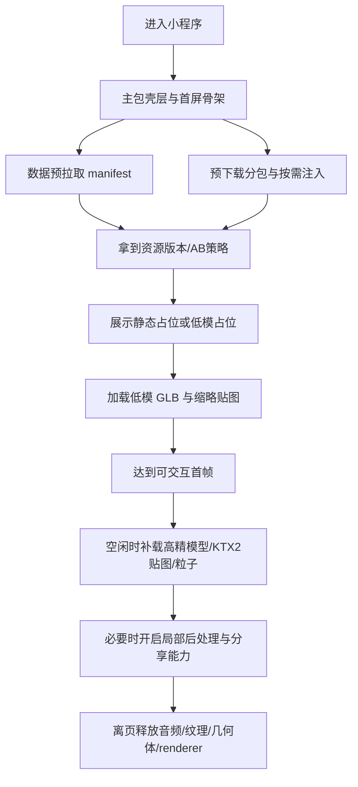
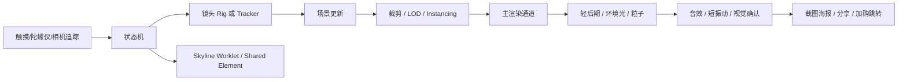

# 微信小程序中基于 WebGL 的优秀案例与沉浸式高格调体验研究报告

## 执行摘要

过去两年里，微信小程序里真正值得参考的 WebGL/XR 公开样本，呈现出一个很清晰的分化：**官方与平台型能力在持续增强，商业品牌案例在公开存档层面反而更碎片化**。就“可验证、可访问、可复用”的资料而言，最有工程价值的仍然是微信官方 XR/3D 能力栈、VisionKit 与 three.js 适配链路，以及少量仍可访问的品牌 AR/3D 营销案例；大量 2024–2026 的活动型项目因为投放周期短、二维码入口失效、案例页下线，公开可查的“现成成品”并不多。微信官方仍持续维护 XR-FRAME、VisionKit、Skyline 与性能/加载相关文档；其中 XR-FRAME 被定位为官方 XR/3D 方案，VisionKit 明确覆盖了 WebGL & three.js 的 3D 放置与平面检测，而 Skyline 则把 worklet 动画、手势系统、自定义路由、共享元素动画等“类原生体验”能力拉到了更高水位。 citeturn13search2turn27search0turn30search0turn30search11

如果只看“做得漂亮、用户愿意停留、同时又能落地”的案例，近年的优质方向主要集中在三类：**奢侈品/消费品 3D 试戴试鞋与产品细节浏览**、**线下导览/快闪店/公共艺术的扫描解锁式叙事**、以及**官方/社区 Demo 级能力展示**。前两类负责告诉我们“沉浸感与格调感要怎么设计”，后一类负责告诉我们“在微信小程序里这些东西到底怎么实现、哪里容易炸、哪些能力是官方推荐路径”。像 Tiffany、GRAFF、VALENTINO、LOEWE、花王×屈臣氏、深圳地铁×央美这类项目，虽然多数公开时间集中在 2023，但至今仍是小程序 WebGL/XR 商业体验里最有方法论价值的一批标本；而腾讯云开发 XR Demo、官方 xr-frame-demo，则更接近当下可复现的实施蓝本。 citeturn10search2turn10search3turn10search5turn31search0turn10search6turn9search8turn23search0turn29search11

在技术上，当前最值得遵循的路线不是“盲目把网页 3D 方案原样塞进小程序”，而是**把小程序能力栈拆成壳层、交互层、3D 层、资产层、分享层**来设计：主包只放壳与首屏骨架，3D 能力与重资源分包；业务数据预拉取与代码按需注入一起做；模型用 glTF/GLB，几何优先考虑 Meshopt 或 Draco，贴图优先 KTX2/Basis；远景和重复物体必须使用 LOD 与 Instancing；材质和金属反射依赖环境数据而不是“盲开高光”；对 AR 场景中的重后处理要格外克制。官方与 Khronos / three.js 文档对这些关键点的支持链已经很完整：InstancedMesh 可显著减少 draw calls，LOD 是距离分级的基础机制，GLTFLoader 原生支持 DRACO / KTX2 / Meshopt，KTX 2.0 的目标正是减少纹理的内存、带宽与功耗成本，而 gltfpack / meshoptimizer 能同时优化下载大小与渲染速度。 citeturn15search0turn15search2turn15search3turn17search1turn17search2turn17search3turn17search6turn28search0turn28search3

对“强沉浸感与高格调体验”的判断，本报告的核心结论是：**微信小程序里的高级感，更多来自节制而稳定的系统设计，而不是堆更多特效**。真正有效的做法通常是：让 3D 只承担“记忆点最强的 20%”，其余体验通过 Skyline 的转场、节奏、同层 UI、短振动反馈、音效层次、分享海报收尾来完成；镜头运动要稳，光照要少而准，材质要统一，交互要低学习成本，首帧要快，切场要顺，退出时要彻底释放资源。Skyline 明确以更接近原生 App 的体验为目标，官方也持续强调性能诊断、按需注入、数据预拉取与分包能力；与此同时，官方适配版 `threejs-miniprogram` 公开仓库仍停留在 three.js `0.108.0`，这意味着团队若要做更新世代的材质、压缩与后处理链路，应优先评估 XR-FRAME、VisionKit+自维护适配、或更受控的原生 WebGL 方案，而不应默认把旧适配层当成长期核心底座。 citeturn30search0turn13search19turn21search0turn26search6turn22search1turn15search31

## 生态现状与选型判断

微信小程序里的 3D / XR 开发，今天已经不是单一的“canvas + WebGL”问题，而是一套由**渲染 API、XR 能力、页面壳体验、资源下载与性能治理**共同决定的系统工程。底层上，WebGL 仍是核心图形能力：Khronos 将 WebGL 1.0 定义为基于 OpenGL ES 2.0 的 Canvas 3D 渲染上下文，WebGL 2.0 则对应 OpenGL ES 3.0；而可检索到的微信小程序开发文档镜像也明确表明，`canvas.getContext()` 在小程序环境中支持 `webgl` 与 `webgl2`。这意味着小程序端并不缺“画 3D”的入口，难点在于你如何在微信运行时里，把图形能力和小程序的包体、路由、相机、分享、UI 体系协同起来。 citeturn18search0turn18search8turn13search1

从能力定位看，当前最重要的四条路线分别是 **XR-FRAME**、**VisionKit + three.js**、**threejs-miniprogram**、以及**更底层的原生 WebGL**。XR-FRAME 的官方说明强调其是“基于混合方案实现、性能逼近原生”的 XR/3D 方案；VisionKit 的文档索引则直接把“VKSession 渲染、WebGL & three.js 放置 3D 模型、平面检测”放到了同一条能力线上；`threejs-miniprogram` 作为官方适配版 three.js，优势是上手门槛低，但公开仓库说明其当前适配的 three.js 版本仍为 `0.108.0`；而原生 WebGL 则适合对渲染管线、shader、内存清理和非标准风格有极强控制需求的团队。 citeturn13search2turn27search0turn22search1

一个很容易被忽略，但实际决定“高级感”的关键点，是 **Skyline 与 3D 页面的关系**。如果你把 3D 仅仅看成一个全屏 canvas，往往最后得到的是“技术很强，但很像 demo”。而 Skyline 的意义，是把页面切换、共享元素、手势反馈、卡片展开、细腻节奏这些“壳层体验”做得接近原生 App，从而让 3D 内容被一种更稳定、更贵气的外层体验包住。官方 Skyline 最佳实践明确提到，worklet 动画、手势系统、自定义路由、共享元素动画，都是为了让小程序更接近原生 App；这正是“高格调”感知里最容易被误判为美术、但实际上更像系统设计的问题。 citeturn30search0turn30search8turn30search11

下面这张表可以概括当前主流选型判断。

| 方案 | 适合场景 | 明显优势 | 主要短板与注意点 |
|---|---|---|---|
| XR-FRAME | AR 识别、扫描解锁、带相机背景的沉浸体验、品牌互动、展陈导览 | 官方 3D/XR 方案；示例覆盖粒子、后处理、透明画布、渲染目标、分享系统、环境数据等；与小程序能力结合自然。 citeturn13search2turn29search1turn23search3 | 视频纹理与部分音视频链曾长期有兼容问题；不同基础库与客户端版本差异较大；真机验证比开发者工具更重要。 citeturn23search3turn29search8 |
| VisionKit + three.js | 平面检测放置 3D、与现有 three.js 资产管线复用、对材质/镜头语言有要求的 AR | 官方文档已给出 WebGL & three.js 路线；更容易复用 glTF、PBR、现有 three.js 生态。 citeturn27search0turn15search2 | 在 AR 相机背景下做重后处理并不顺手；已有开发者反馈 renderTarget 会导致相机画面丢失。 citeturn22search15 |
| threejs-miniprogram | 轻量产品查看器、交互式 3D 卡片、学习/验证 | 官方适配版；门槛低；最接近多数前端团队熟悉的 three.js 写法。 citeturn22search1 | 公开仓库仍基于 three.js `0.108.0`，与 today’s three.js 版本代差明显；实际 issue 里可见 DRACO、读像素卡顿、重复进入 OOM 等问题。 citeturn22search1turn22search5turn22search20turn15search31 |
| 原生 WebGL | 极致风格化 shader、非常轻的自定义 3D 交互、需要绝对可控的 draw-call/内存策略 | 最小依赖、可完全定制管线；最适合“视觉很贵，但内容不重”的极简沉浸页面。 citeturn18search0turn18search8 | 开发门槛最高；需要自己处理相机、材质、资源格式、兼容与释放问题；对前端团队要求高。 |

工程上还要接受一个现实：**小程序的 3D 不是纯网页环境**。官方镜像检索与社区文档都表明，分包、按需注入、数据预拉取、性能诊断是官方推荐性能路径；而同层、原生组件层级、真机与开发者工具行为差异，仍然会实打实影响交互设计与验收方式。换句话说，小程序里的 3D 成功与否，通常不由“引擎是否够炫”决定，而由“是否把微信的运行时约束纳入第一原则”决定。 citeturn13search17turn21search0turn13search19turn13search27turn23search3

## 案例清单与拆解

需要先说明一条研究边界：**近两年公开、可验证、仍能访问的微信小程序 WebGL/XR 商业案例并不丰富**。很多品牌项目是短期营销投放，公开页只保留概念介绍，不保留可直接体验入口，也极少披露首帧、帧率、包体、CPU/内存明细。因此，下表采用“**近两年可访问的实现型样本 + 仍具代表性的 2023 典型商业案例**”的混合清单，并明确标注年份。它更适合做方法论与工程判断，而不是做“活跃产品排行榜”。 citeturn31search14turn23search0turn29search11

| 案例名 | 公开时间 | 链接 | 开发者/公司 | 渲染引擎或框架 | 关键技术点 | 性能指标 | 沉浸感/格调体现 |
|---|---|---|---|---|---|---|---|
| 微信小程序 `xr-frame-demo` 官方/社区示例集 | 2023-04 更新；2026 仍可访问 | GitHub 仓库；README 指向“官方文档-示例”二维码。 citeturn23search0turn29search1 | dtysky 维护；内容围绕微信小程序 `xr-frame` 系统。 citeturn23search0 | XR-FRAME；示例包括 PBR、透明画布、灯光、动画、视频、渲染目标、粒子、后处理、环境数据、AR tracker、分享系统。 citeturn29search1turn23search3 | 同层 UI 覆盖、tracker 扫描、相机子节点、渲染纹理、粒子与后处理、截图/分享。 citeturn23search3turn29search1 | 未公开首帧/FPS；公开 QA 显示团队重点关注 OOM、视频纹理、覆盖层与金属材质黑化等问题。 citeturn23search3turn22search6 | 更像“能力样本库”而非单一作品；它把“扫描—出现—微交互—分享”的完整 XR 节奏演示得很清楚。 citeturn29search1turn23search3 |
| 基于微信小程序云开发的 XR 小程序 Demo | 2024-11-12 | 腾讯云开发者社区示例页。 citeturn29search11 | 腾讯云开发者社区作者示例。 citeturn29search11 | XR-FRAME + 云开发。 citeturn29search11 | 3D 场景、资源加载、用户头像纹理注入、与云函数交互。 citeturn29search11 | 未公开。 citeturn29search11 | 个性化头像进入 3D 场景，是“小程序社交身份 + XR”的低成本沉浸范式。 citeturn29search11 |
| LOEWE 罗意威 AR 寻宝与滤镜 | 2023-12-18 | 案例/行业页。 citeturn31search0turn31search10 | LOEWE；技术服务视角来自 Kivicube。 citeturn31search0turn31search10 | Kivicube 小程序 AR / WebXR 平台；底层具体引擎未公开。 citeturn31search0 | 多入口投放到公众号、小程序和朋友圈；6 款 AR 滤镜；寻宝式互动。 citeturn31search0 | 未公开。 citeturn31search0 | 奢侈品牌少见地把“童真、收集、社交扩散”与高奢视觉做了统一，说明格调不一定等于庄重。 citeturn31search0 |
| 深圳地铁 × 中央美术学院 AR 公共艺术 | 2023-08-03 | 案例页。 citeturn9search8 | 深圳地铁 × 中央美术学院；服务视角来自 Kivicube。 citeturn9search8 | Kivicube 平台；底层具体引擎未公开。 citeturn9search8 | 图像识别、AR 公共艺术叙事、出行场景中的文化增益。 citeturn9search8 | 未公开。 citeturn9search8 | 叙事气质强，说明“沉浸感”不必依赖重特效，也可以来自场所感与故事感。 citeturn9search8 |
| Tiffany 小程序 AR 珠宝试戴 | 2023-08-18 | 案例页。 citeturn10search2 | Tiffany & Co.；服务视角来自 Kivicube。 citeturn10search2 | Kivicube 平台；公开描述强调高精度 3D 渲染，未披露底层具体引擎。 citeturn10search2 | 360° 3D 预览、手腕/手指 AR 试戴、角度与尺寸调整、海报分享。 citeturn10search2 | 未公开。 citeturn10search2 | 典型“高格调电商交互”：极近景、强材质、低学习成本、最后落到优雅海报。 citeturn10search2 |
| GRAFF 元宇宙 3D 空间与 AR 试戴 | 2023-08-17 | 案例页。 citeturn10search3 | GRAFF；服务视角来自 Kivicube。 citeturn10search3 | Kivicube 平台；底层具体引擎未公开。 citeturn10search3 | 珠宝 3D 展示、放大缩小旋转、AR 试戴、多平台上架。 citeturn10search3 | 未公开。 citeturn10search3 | 光感、切面、细节观察是核心卖点，说明珠宝/腕表类最适合用 PBR 与环境反射营造高级感。 citeturn10search3 |
| VALENTINO 多平台线上 AR 试鞋 | 2023-08-17 | 案例页。 citeturn10search5 | VALENTINO；服务视角来自 Kivicube。 citeturn10search5 | Kivicube 平台；实时足部追踪，高仿真 3D 模型。 citeturn31search18turn10search5 | 3D 看鞋、足部追踪、AR 试鞋、购物车跳转。 citeturn10search5turn31search18 | 未公开。 citeturn10search5 | 时尚行业里，这是“沉浸体验直接服务转化”的代表：先美，再准，再买。 citeturn10search5turn31search18 |
| 花王 × 屈臣氏 乐而雅绵绵花园 AR 线下体验 | 2023-07-30 | 案例页。 citeturn10search6 | 花王 × 屈臣氏；服务视角来自 Kivicube。 citeturn10search6 | Kivicube 平台；图像识别/平面 AR。 citeturn10search6 | 扫门头进入 AR 花海；扫产品显示 3D 棉花模型与商品信息。 citeturn10search6 | 未公开。 citeturn10search6 | 很适合快消：轻 world-building、强情绪氛围、低门槛门店转化。 citeturn10search6 |
| SK-II 快闪店门头扫描 AR 互动 | 2026-02 复盘文引用；项目实际上线时间未披露 | 行业复盘页。 citeturn31search4turn31search8 | SK-II；文中未明确披露技术服务商。 citeturn31search4 | 小程序 AR + WebAR；底层具体引擎未公开。 citeturn31search4 | 扫描快闪店门头触发互动；将排队等待时间转为小游戏式参与。 citeturn31search4 | 未公开。 citeturn31search4 | 说明沉浸感不仅服务展示，也能服务“队列中的注意力管理”。 citeturn31search4 |

从这些案例中，可以读出三条非常稳定的规律。

第一，**小程序里最成功的沉浸感，往往不是“大世界自由探索”，而是“高识别度入口 + 几秒内触发惊喜 + 明确的分享或转化收束”**。LOEWE 的寻宝、花王的门店/包装扫描、SK-II 的门头扫描、深圳地铁的站内公共艺术，都是把线下物理锚点变成数字入口；它们不像传统网页 3D 那样要求用户先理解世界观，而是让用户先完成一次低阻力的触发，再逐步进入叙事。 citeturn31search0turn10search6turn31search4turn9search8

第二，**“高格调”最适合被用在高单价、高细节、高材质敏感度的品类里**。Tiffany、GRAFF、VALENTINO 这几个案例都不是在做复杂场景，而是在做“材质、尺度、微动作、可购买”的组合：3D 预览、旋转缩放、试戴试穿、截图海报、加购。它们本质上是一种“低叙事密度，但高审美密度”的产品体验结构，非常适合预算有限但追求高级品牌感的团队借鉴。 citeturn10search2turn10search3turn10search5

第三，**公开商业案例几乎都不披露硬指标**。这并不代表性能不重要，而是说明小程序 3D 项目的性能治理必须前置到团队工程流程里。官方已有性能诊断工具、分包、用时注入、数据预拉取等路径；而从 GitHub issue 与官方 QA 也能看到，OOM、视频纹理、离页释放、读像素卡顿、同层 UI 与真机差异，是真实存在的线上问题。 citeturn13search19turn13search17turn21search0turn22search5turn22search6turn23search3turn33search0

## 技术实现与优化

从实现角度看，微信小程序里的强沉浸体验，不应该用“网页 3D 项目”的思维去复制，而应该用“**壳层快、3D 晚、资源分层、交互前置、离页必清理**”的思路去组织。底层 API 没问题，真正难的是生命周期和资源治理。Khronos 与微信文档说明都表明，小程序拥有 WebGL/WebGL2 的 canvas 上下文能力，XR-FRAME 则提供小程序内更接近原生的 3D/XR 组织方式；VisionKit 则适用于平面检测与 three.js 路线。 citeturn18search0turn18search8turn13search1turn13search2turn27search0

### 实现要点与推荐做法

| 技术点 | 推荐做法 | 在微信小程序环境中的意义 |
|---|---|---|
| 场景管理 | 把体验拆成“首屏壳层 → 低模占位 → 可交互场景 → 高精细节补齐”四段，不要一次性把所有 3D 资源抛给首屏。 citeturn21search0turn13search17 | 既能配合数据预拉取，又能让 3D 与页面动效解耦，避免冷启动变成纯 3D 等待。 |
| 资源流式加载 | 主包放壳层、关键状态机、低模或截图占位；重 glb / 解码器 / HDR 转换结果放分包；结合数据预拉取与按需注入。 citeturn21search0turn21search5turn13search17turn26search6 | 小程序单包约束仍然很强；公开资料对总包上限存在 20M/30M 口径差异，但单包 2MB 基本一致，立项时应保守预算。 citeturn19search5turn19search8turn19search16 |
| 几何压缩 | 中大模型优先 Meshopt；几何主导、体积明显偏大的模型可选 Draco；上线前先用 gltfpack 统一做自动优化。 citeturn17search1turn17search27turn28search0turn28search3 | Meshopt 解码轻、适合广谱内容；Draco 对大几何压缩收益高，但对很小模型可能不划算。 |
| 贴图压缩 | 贴图统一走 KTX2/Basis；大面积漫反射、背景图或低频纹理优先 ETC1S；高光/法线/珠宝鞋面这类高细节纹理优先 UASTC。 citeturn17search2turn17search6turn16search27 | KTX2 的价值不只是减下载，更重要的是减 GPU 内存和带宽占用。 |
| LOD | 近中远三级就够，大多数品牌项目没必要做更多；用 glTF Transform 或 gltfpack 先做简化，再在 runtime 切换。 citeturn15search3turn28search4turn28search17 | 小程序设备跨度大，LOD 比“死磕满精度”更接近线上收益。 |
| GPU Instancing | 重复物件如粒子挂件、陈列道具、花叶、奖章、漂浮 UI、礼盒阵列，一律优先实例化。 citeturn15search0 | 降 draw calls 是移动端持续帧率的第一优先级之一。 |
| 离屏渲染/Render Target | 只把它用在局部镜面、贴花、UI 纹理、分享图合成等确定收益的地方；在 VisionKit+three 的 AR 相机背景中避免重型全屏后处理。 citeturn29search1turn22search15 | AR 背景和后处理链可能互相干扰，过重的 composer 更容易导致“不高级，只更卡”。 |
| 粒子/后期/光照 | 粒子做“少量但高识别度”；后期只留 Bloom / 色调映射 / 轻微景深这类能解释品牌气质的效果；金属材质必须配环境数据。 citeturn29search1turn23search7turn23search3 | 小程序更适合“看起来贵”的小剂量特效，而不是游戏式满屏特效。 |
| 音视频 | 视频纹理慎用于生产；若必须做视频贴图，控制时长、尺寸和触发次数；音频对象离页必须 `destroy()`。 citeturn23search3turn29search8turn33search0 | 视频解码器与音频对象都是典型隐性资源坑。 |

### 环境限制与对策

公开可检索资料里，微信小程序 3D/XR 开发最值得提前写进项目章程的限制有五类。

其一是**包体与代码注入**。公开工程实践资料与开发者工具提示，都反复指向“单个主包/分包 2MB”的硬约束；但总大小在公开资料中出现了 20MB、30MB、以及“服务商代开发 20MB”几种不同口径。更重要的是，官方按需注入文档明确说明：启动时并不是只下载代码，还涉及注入与执行；插件包和扩展库目前也不支持按需注入，如果要异步化插件，需要把插件放进分包。保守做法是：**把 3D 解码器、特效资源、重组件、活动页隔离为分包，把主包压到极瘦**。 citeturn19search5turn19search8turn19search16turn13search17turn26search6

其二是**缓存与离线能力**。微信文档镜像显示，`wx.downloadFile` 单次下载允许的最大文件为 200MB；而常见的本地 key-value 存储上限为 10MB。工程上不应把 3D 资源塞进 storage，而应把 storage 当成 manifest、hash、版本号与轻量状态缓存，把大资源交给文件系统缓存与 CDN。为了减少首屏空白，数据预拉取非常适合用来提早拿到“资源 manifest / 活动配置 / AB 方案 / 首屏文案”。 citeturn20search0turn25search13turn21search0turn21search5

其三是**同层与原生组件行为**。官方镜像与 xr-frame-demo QA 都在提醒一个事实：canvas / XR 场景与普通页面元素的层级协同，开发者工具不一定等价于真机；有些“盖在 3D 上方”的 UI，在真机才是可信结果。因此，所有涉及引导浮层、扫码提示、分享按钮、分层遮罩的页面，必须把真机验证写进验收标准。 citeturn13search27turn23search3

其四是**资源释放**。GitHub issue 与更新日志都显示，WebGL 资源释放、重复进入页面导致的 OOM、以及 `InnerAudioContext.destroy()` 未调用引发的内存泄漏，都不是理论问题。对小程序 3D 页面来说，`onHide` 与 `onUnload` 不是“可选清理点”，而是稳定性的生命线。 citeturn22search6turn22search20turn33search0

其五是**开放数据域并不属于常规小程序 3D 主路径**。开放数据域本质上是微信小游戏为关系链数据设计的独立 JavaScript 作用域，只能把内容渲染到 `sharedCanvas` 再由主域上屏，主域到开放数据域是单向通信。若你的产品目标是“沉浸式品牌体验、展陈、试戴、导览、电商”，通常不应把开放数据域当主方案；只有当你想做强社交排行榜或好友对战玩法时，才应认真评估转小游戏而不是继续留在常规小程序里。 citeturn24search1turn24search16turn24search12

### 资源加载流程示意

下面这条流程，最适合“要有沉浸感，但不能慢”的小程序 3D 页面：先用小程序能力把**入口时间**抢回来，再用 3D 能力把**记忆点**做出来。这个流程结合了数据预拉取、分包、按需注入、gltfpack/KTX2 优化，以及离页清理。 citeturn21search0turn13search17turn28search0turn17search2



### 渲染与交互管线示意

这条管线强调一个理念：**3D 内容只是其中一层，真正决定“质感”的是状态机、镜头、转场、反馈和收束**。Skyline 负责 UI 与转场的高级感，3D 负责空间与材质，音效和振动负责确认感。 citeturn30search0turn30search11turn33search5



### 可直接落地的代码片段要点

如果你走 `threejs-miniprogram` 或自维护 three 适配路线，推荐把“加载器、压缩、分包、离页释放”放到最小骨架里，而不是最后再补。`GLTFLoader` 官方支持接入 DRACO、KTX2 和 Meshopt；而官方 `threejs-miniprogram` 则提供 `createScopedThreejs` 的适配入口。 citeturn15search2turn22search1

```js
// 方向性示例：适合作为小程序 3D 页面骨架
import { createScopedThreejs } from 'threejs-miniprogram'
import { GLTFLoader } from './three/addons/loaders/GLTFLoader.js'
import { DRACOLoader } from './three/addons/loaders/DRACOLoader.js'
import { KTX2Loader } from './three/addons/loaders/KTX2Loader.js'
// MeshoptDecoder 建议放分包或静态资源目录

Page({
  async onReady() {
    const res = await new Promise(resolve => {
      wx.createSelectorQuery().select('#webgl').node().exec(resolve)
    })

    const canvas = res[0].node
    const THREE = createScopedThreejs(canvas)

    this.THREE = THREE
    this.scene = new THREE.Scene()
    this.camera = new THREE.PerspectiveCamera(45, canvas.width / canvas.height, 0.1, 100)
    this.renderer = new THREE.WebGLRenderer({ canvas, antialias: true, alpha: true })

    const manager = new THREE.LoadingManager()
    const draco = new DRACOLoader(manager)
    draco.setDecoderPath('/subpackage-draco/')

    const ktx2 = new KTX2Loader(manager)
    ktx2.setTranscoderPath('/subpackage-ktx2/')

    const loader = new GLTFLoader(manager)
    loader.setDRACOLoader(draco)
    loader.setKTX2Loader(ktx2)
    // loader.setMeshoptDecoder(MeshoptDecoder)

    loader.load('https://cdn.example.com/model/product.glb', (gltf) => {
      this.scene.add(gltf.scene)
      this.startLoop()
    })
  },

  startLoop() {
    const tick = () => {
      // 更新状态机 / 动画 / 交互
      this.renderer.render(this.scene, this.camera)
      this.raf = this.renderer.setAnimationLoop
        ? this.renderer.setAnimationLoop(tick)
        : canvas.requestAnimationFrame(tick)
    }
    tick()
  },

  onUnload() {
    // 非常关键：离页就清
    this.audio?.destroy?.()
    this.scene?.traverse((obj) => {
      if (obj.geometry) obj.geometry.dispose?.()
      if (obj.material) {
        const mats = Array.isArray(obj.material) ? obj.material : [obj.material]
        mats.forEach((m) => {
          Object.keys(m).forEach((k) => m[k]?.dispose?.())
          m.dispose?.()
        })
      }
    })
    this.renderer?.dispose?.()
  }
})
```

如果你走 XR-FRAME 路线，重点不是重写 three.js，而是**把工具链前置**。`xr-frame-toolkit` 的说明已经非常明确：它可以把环境贴图转换为 `env-data`，也能对 glTF 做预处理、压缩纹理并打包为 `glb`，且明确指出压缩纹理依赖基础库 `3.0.1` 以上。这类预处理链越早引入，项目表现越稳定。 citeturn29search12

## 交互与审美设计模式

### 可复用的交互模式

从前面的案例与官方能力样本来看，小程序里的沉浸感最好不要靠“复杂操作”获得，而要靠“**镜头控制 + 低阻力触发 + 轻反馈 + 清晰收束**”获得。下面这些模式最容易复用。

| 模式 | 适用场景 | 实现建议 | 注意事项 |
|---|---|---|---|
| 镜头前导与英雄镜头 | 珠宝、腕表、鞋履、汽车单品、文创主视觉 | 首屏不要自由旋转先行，先给 1 段 1.2–2.0 秒的缓入镜头，再交给用户接管。可把 3D 单品放在浅场景中，用 Skyline 的共享元素从列表卡片放大进入。 citeturn10search2turn10search3turn30search0 | 切忌让用户一上来面对“空场景 + 自己找东西”；那是 demo 感的主要来源。 |
| 扫描解锁式探索 | 快闪店、门店、包装、地铁导览、文旅导览 | 用线下门头、包装、海报、站内艺术品作为锚点，扫描成功后只给一个核心惊喜，不要给太多分支。 citeturn10search6turn9search8turn31search4turn31search0 | 识别成功后的第一屏必须“够值”，否则用户不会进行第二次扫描。 |
| 微物理交互 | 试戴试鞋、礼盒拆封、奖章浮动、场景内小道具 | 不是上完整物理引擎，而是做阻尼、回弹、跟手、轻微惯性。用户需要的是“真”，不是“复杂”。 | 小程序里不建议长时间高频的刚体模拟；只在局部细节处体现物理感。 |
| 触觉确认 | 扫描成功、加入购物车、抽奖命中、切换材质 | 扫描、收纳、达成类动作可配合 `wx.vibrateShort`；短振感比长振更高级。 `wx.vibrateShort` 文档给出的持续时间是约 15ms。 citeturn33search5 | 触觉应稀缺使用；频繁振动会迅速拉低“高级感”。 |
| 节奏型引导 | 首次触达、活动页、品牌叙事页 | 把节奏拆成“3 秒内见到核心内容、7 秒内完成第一次交互、20 秒内触发一次分享/收藏/跳转”。这是产品节奏建议，不是平台硬指标。 | 节奏过慢，用户觉得重；节奏过快，又像广告弹层。 |
| 海报式收束 | 奢侈品、电商、展陈纪念、节日营销 | 体验结束后生成一张可保存/分享的画面，是小程序里最稳定的闭环之一。XR-FRAME 的分享系统支持输出 Buffer、本地文件路径与分享给朋友。 citeturn23search3turn10search2 | 分享图不要只是截图，应该有品牌 Logo、主题文案、统一背景和留白。 |

如果要把这些模式进一步提炼成一句产品原则，那就是：**镜头负责“贵”，互动负责“真”，反馈负责“稳”，收束负责“值”**。LOEWE、Tiffany、GRAFF、花王这些案例看似分属不同行业，但节奏结构都类似：用户先被视觉吸引，再用最低门槛进入 3D/AR，再被轻度互动留住，最后以海报或转化收尾。 citeturn31search0turn10search2turn10search3turn10search6

### 视觉与声音如何一起做出格调感

很多团队会把“格调”误解成“更黑、更高级灰、更多镜面、更多 bloom”。实际上在小程序里，这类做法很容易把性能和观感同时做坏。高格调更推荐以下组合：

| 维度 | 建议 | 在小程序中的实现方式 |
|---|---|---|
| 配色 | 以低饱和中性色做背景基底，只留 1 个品牌强调色；奢侈品类更适合偏暖金、墨绿、深蓝、骨白，而不是满屏霓虹。 | 用 Skyline 壳层承担大片色块和留白，3D 里只让强调色出现在品牌核心物件上。 citeturn30search0 |
| 材质 | 高级感来自粗糙度、边缘高光、微法线，而不是全局镜面。珠宝、金属和皮革尤其需要受控环境反射。 | XR-FRAME 里优先准备 `env-data`；官方 toolkit 支持环境图转 `env-data`，QA 也明确提示“金属变黑”通常是没配环境光。 citeturn29search12turn23search3turn23search7 |
| 光照 | 一主光、一轮廓光、一个环境源通常就够；把阴影当“点睛”，不要当“默认全开”。 | 轻场景里优先环境光 + 定向光；低端机型适当舍弃实时阴影。 |
| 动画节奏 | 高级感更接近“呼吸”和“仪式感”，少用夸张弹跳；壳层动画 180ms/320ms/600ms 三档就足够构成层次。 | Skyline 的 worklet 更适合承接卡片展开、标题入场、按钮吸附，而不是把这些动作也塞给 3D 摄像机。 citeturn30search0turn30search11 |
| 音效 | 用 2–3 层而不是很多层：环境底噪 + 核心触发音 + 转场氛围即可。 | 短音效建议极短、极轻；长音轨尽量不跟页面生命期解绑，离页立即销毁音频对象。 citeturn33search0 |
| 资源格式 | 模型优先 GLB；几何优先 Meshopt/Draco；贴图优先 KTX2；环境图预烘焙而不是线上临时求值。 | `GLTFLoader` 原生支持 DRACO/KTX2/Meshopt；XR-FRAME toolkit 也支持 glTF 预处理与压缩纹理。 citeturn15search2turn17search1turn17search27turn29search12 |
| 音画耦合 | 不做真正“空间音频”也可以做接近空间感的体验：用距离、朝向、触发区域控制音量与滤波。 | 若视频与音频必须严格同步，可评估 `MediaAudioPlayer` 路线；否则用普通音频上下文更轻。 citeturn33search1 |

一条非常实用的经验是：**把“贵”的工作做在线下预处理，而不是在线上 runtime**。例如，环境贴图离线转成 `env-data`，模型先过 gltfpack，纹理先做 KTX2，再决定是不是上 Bloom。这样做会让小程序里的“格调”更多来自资产准备与镜头语言，而不是把线上设备当离线渲染器。 citeturn29search12turn28search0turn17search2

## 可落地方案与开发路线图

下面给出三档可执行方案。为避免误导，这里的工时和预算是**基于本报告案例复杂度、资产制备链、常见团队效率做的作者估算**，不是公开招投标或官方报价；适合拿来做立项级粗估，而不是替代详细排期。

### 三档方案总览

| 档位 | 目标体验 | 功能清单 | 推荐技术栈 | 估算人时 | 推荐人员构成 | 粗预算估算 | 关键风险 | 缓解措施 |
|---|---|---|---|---:|---|---:|---|---|
| 轻量演示 | 一屏式品牌展示或单品 3D 英雄页 | 首屏转场、1 个 GLB、基础旋转缩放、1 套环境光、少量粒子、分享海报 | Skyline + `threejs-miniprogram` 或原生 WebGL；资产经 gltfpack + KTX2 预处理。 citeturn22search1turn28search0turn17search2 | 120–180 | 前端/技术美术 1；视觉 0.5；PM/QA 0.5 | 3–8 万 RMB | 旧适配层能力不足；首屏慢 | 资源极简；主包只放壳层；重资源 CDN；首屏先图后 3D |
| 中等交互体验 | 扫描解锁、轻导览、试戴/试鞋、快闪店互动 | 2–3 个识别点、状态机、海报分享、短振反馈、简单任务环、商品/活动跳转 | XR-FRAME 或 VisionKit + three.js；Skyline 负责壳层动效与切页。 citeturn13search2turn27search0turn30search0 | 400–700 | 前端 1；TA/图形 1；3D 设计 1；UI/UX 0.5；音效 0.2；PM/QA 0.8 | 15–35 万 RMB | 识别稳定性、真机层级问题、视频纹理兼容 | 优先使用 marker/平面识别；避免重视频纹理；所有层级以真机为准 |
| 旗舰沉浸式 | 多场景叙事、强品牌世界观、精致转场、丰富分享与运营闭环 | 多段镜头语言、场景切换、动态环境数据、局部 render target、分包资源调度、埋点与性能看板 | XR-FRAME + Skyline；特殊 shader 区域可混合原生 WebGL；完整资产压缩链。 citeturn13search2turn30search0turn29search12turn15search0turn15search3 | 1200–2200 | 前端 2；图形/TA 1；后端/云函数 1；3D 美术 2；UI/动效 1；音效 0.5；QA 1；PM 1 | 60–150 万 RMB 以上 | 设备碎片化、内存峰值、审美失控、内容生产过重 | 建立低/中/高机型档；限定单场景复杂度；审美先做 style frame 与节奏板再开做 |

### 各档方案的实施重点

轻量演示档最适合“**先把品牌质感做对**”。它不追求完整世界观，而追求一屏震撼、快速可交互、可分享。此时最重要的不是上 XR，而是把**镜头、环境反射、转场节奏和海报收尾**做好。如果团队 only 有前端和设计，优先选老适配层或原生 WebGL 做单品展示，不要一开始就碰复杂 AR。官方 `threejs-miniprogram` 容易起步，但要接受其版本较旧；如果确实需要更现代的压缩与材质链，宁可用更少效果，也不要堆不稳定的适配。 citeturn22search1turn15search31

中等交互体验档适合活动页、快闪店、导览和试戴试鞋。它的关键不是“场景更大”，而是**状态更多**：扫描前、识别中、识别后、交互中、分享后，每一步都要有明确反馈。此档最推荐 XR-FRAME 或 VisionKit+three.js，因为这些方案和相机、跟踪、分享、同层 UI 的结合更自然。需要注意的是，AR 背景下的重后处理收益并不高，甚至会和相机背景冲突；因此品牌感应优先做在线下烘焙的环境、节制的粒子和壳层转场上。 citeturn27search0turn22search15turn23search3turn30search0

旗舰沉浸式档最容易犯的错误，是把小程序做成“想象中的 WebGL 大作”。实际上，小程序旗舰体验更像是**高度控制的体验电影 + 选择性交互**：镜头语言比自由漫游更重要，节奏比内容数量更重要，设备分级比绝对画质更重要，分享与运营闭环比单次观看炫技更重要。工程上必须在立项第一周就定义好：每个场景最大贴图预算、最大 draw-call 预算、单次峰值内存目标、哪些功能低端机降级、哪些效果在 AR 模式里禁用。官方性能诊断链与 issue 历史已经足够说明，不做这些约束，最后问题大概率不是“没那么高级”，而是“根本不稳”。 citeturn13search19turn22search5turn22search6turn33search0

### 推荐的开源库与工具组合

对大多数团队而言，最稳的工具组合不是追求“最全”，而是追求“最短链路”。

| 目标 | 推荐工具 | 用法要点 |
|---|---|---|
| 3D 运行时 | XR-FRAME / VisionKit + three.js / `threejs-miniprogram` | 先按业务定路线：有识别与相机就 XR-FRAME 或 VisionKit；单品展示再考虑 three 适配。 citeturn13search2turn27search0turn22search1 |
| 模型优化 | `gltfpack`、glTF Transform | 上线前统一做简化、量化、合并与压缩，不要把 DCC 导出的原始资产直接上线。 citeturn28search0turn28search4turn28search3 |
| 纹理压缩 | KTX-Software / KTX2/Basis | 贴图按材质类型分 ETC1S / UASTC，不要“一把梭”同参数。 citeturn17search2turn17search6 |
| 环境数据 | `xr-frame-toolkit` | 统一生成 `env-data`，让金属/高光材质稳定可控。 citeturn29search12 |
| 性能体检 | 微信开发者工具性能诊断 | 把它当准入门槛，而不是上线前最后一次点一下。 citeturn13search19 |
| UI 质感 | Skyline worklet / shared-element | 把“高级感”的主体放在转场、吸附、共享元素、轻手势上。 citeturn30search0turn30search11 |

### 开发顺序建议

如果项目要稳，推荐采用下面的实际顺序，而不是“先把 3D 模型做出来再说”。

1. 先做 **style frame 与节奏板**：确认品牌气质、主镜头、主交互、壳层动效语法。  
2. 再做 **低模可交互原型**：先验证扫描、放置、转场、分享路径是否顺，而不是急着上最终材质。  
3. 然后完善 **资产处理流水线**：gltfpack、Meshopt/Draco、KTX2、环境数据、分包结构一次定型。  
4. 最后才是 **审美加法**：粒子、微光、海报模板、音效分层、短振确认。  

这样做的好处是，项目在第二阶段就能知道“它是不是高级”，而不是到最后一周才发现：画面很满，但节奏很像 demo；效果很多，但首帧很慢。对微信小程序里的 WebGL 项目来说，**先把体验骨架做贵，再把视觉细节做满**，几乎总比反过来更容易成功。 citeturn30search0turn21search0turn28search0turn29search12