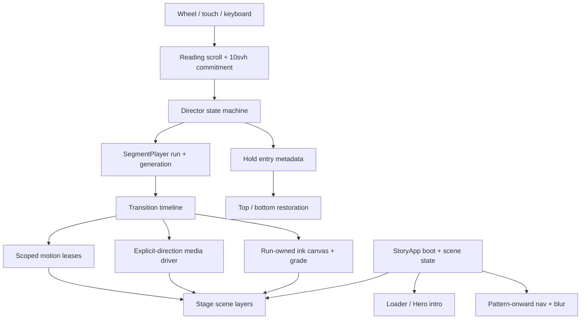
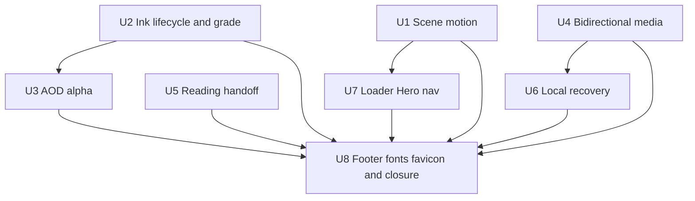
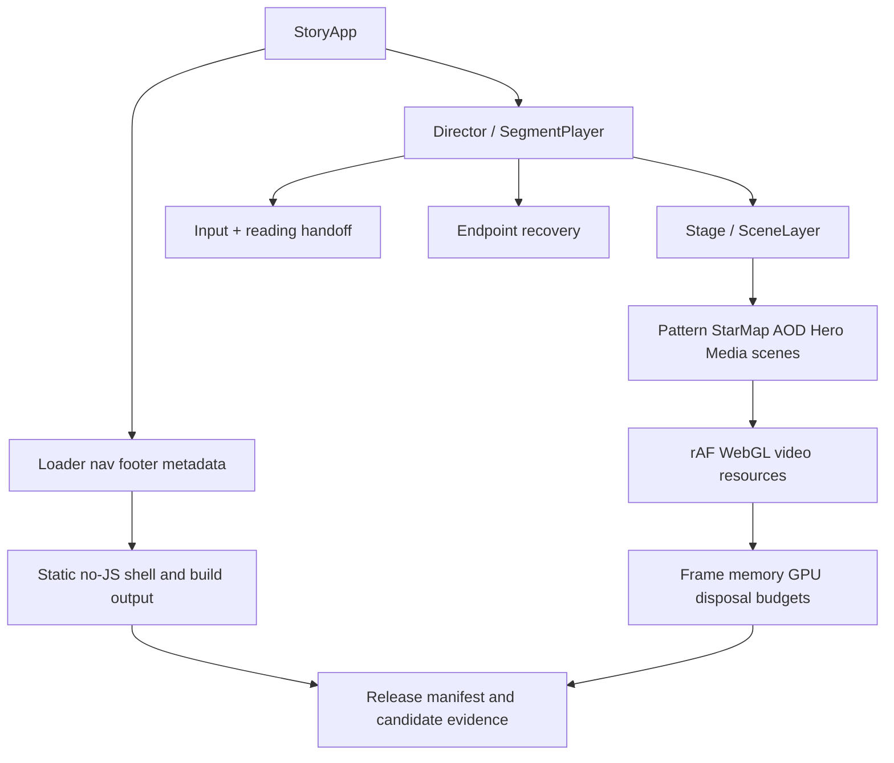

# R5 Production Story Parity Repair Plan

## Overview

This plan repairs the 20 production parity regressions reported against the R5 StoryApp on `codex/react-refactor-r5-parity-cutover` at `59065730712c6d9718928fd25cba23e33455395e`.

The work keeps the React Director/Stage/canonical-spine architecture. Legacy `main` and the exact navigation reference commit `f0d6e1dd670d90484dc09f2cfb7b19a8fe0f9002` are behavioral and styling references only; the legacy runtime must not return to the production path.

This is a planning-only pass. It does not modify runtime code, execute tests, perform screenshots, or require manual visual review. Implementation verification will use deterministic state, DOM, media-lifecycle, build, and performance assertions; no new screenshot baseline is part of acceptance.

## Problem Frame

R5 closed the structural cutover goals, but several accepted R4/R5 contracts froze implementation details that conflict with the intended production behavior:

- Pattern and Star Map animation are tied to `role === 'current'`, so visible transition layers become static.
- `pattern-star-map` explicitly calls `freezeMotion: true`, and existing tests currently require Star Map motion to be off during handoff.
- Star Map → AOD keeps a scene-owned WebGL canvas after destroying and explicitly losing its context, so later runs can retain the horizontal clip while losing the ink renderer.
- AOD → Method keeps Method at opacity `0` until 80% and leaves opaque AOD paper surfaces above it, defeating the alpha asset.
- Figure2 reverse is explicitly mapped to `videoMode: 'none'`; TTG/PH direction is inferred from mutable DOM progress and uses non-atomic seek/play handoffs.
- Reading input relies on a one-pixel edge test and browser event targeting instead of consuming the scene-owned scrollport deterministically.
- Any transition recovery first replaces the LayerWindow with the global Hero fallback, which explains Contact reverse appearing to jump to Hero when Crane preparation/playback fails.
- Production shell parity was not carried over: the loader lifecycle, Hero intro/parallax stacking context, progressive nav blur, footer, canonical favicon, and legacy font setup are missing or replaced.

The plan treats these as shared lifecycle and ownership defects, not isolated animation tweaks.

## Requirements Trace

### Scene motion, compositing, and ink

- **R1 — AOD alpha handoff:** During AOD → Method, the AOD visual must composite through its authored alpha for at least the first third of the run instead of covering Method with an opaque scene.
- **R3 — Hero/Pattern motion:** Pattern must keep rotating throughout Hero ↔ Pattern in both directions whenever it is visibly participating.
- **R4 — Collapsed Pattern motion:** Pattern must keep rotating after its structural collapse and while the radial handoff runs.
- **R5 — Star Map Perlin:** Star Map’s existing Perlin/noise renderer must continue changing while it is visible during Pattern ↔ Star Map.
- **R6 — AOD ink reliability:** Star Map ↔ AOD must render the ink body on every forward and reverse run, not intermittently fall back to a straight horizontal clip.
- **R17 — Figure2 foreground ownership:** The retained near horizontal arch must stay outside the depth ink grade/mask during Figure2 → Proof opening.
- **R20 — Ink grade decision:** Make darkening independent from ink boundary ownership. Production defaults to the confirmed edge-only, non-darkening grade; retain the dark grade only as an explicit comparison/opt-in preset.

### Timed and bidirectional media

- **R2 — Crane duration:** Crane → Contact must complete in about 2.5–3.0 seconds; the selected target is 3.0 seconds.
- **R15 — Figure2 reverse playback:** Figure2 stage 2 → stage 1 must animate automatically through intermediate reverse frames.
- **R18 — PH/TTG reliability:** PH and TTG must remain re-entrant in both directions after repeated, interrupted, or reversed runs.
- **R19 — TTG reverse endpoint:** TTG reverse must not expose a stale forward terminal frame or flicker in its final frames.

### Reading, navigation, and recovery

- **R9 — Reading ownership:** Scrolling a long scene such as Method must move its copy before it can charge a scene transition.
- **R10 — Boundary feel:** Separate reading scroll from transition intent with an explicit 10svh commitment band.
- **R13 — Contact reverse locality:** Reverse input at Contact must traverse Crane; preparation or playback failure must never route through Hero.
- **R14 — Reverse reading entry:** Returning from a later scene to a long reading scene must enter at that scene’s bottom, not its top.

### Production shell and global parity

- **R7 — Loader and Hero parity:** Restore the legacy loader sequence, Hero entrance timing, pointer parallax, and correct person/text occlusion.
- **R8 — Progressive top bar:** Restore the sibling progressive blur navigation from `f0d6e1d`; it must be hidden on Hero and first appear from Pattern.
- **R11 — Footer and filing:** Restore the footer and add `服务备案号 沪ICP备2024086119号-3` linked to `https://beian.miit.gov.cn/`.
- **R12 — Favicon parity:** Replace the inline R5 placeholder favicon with the canonical `assets/favicon.svg` used by legacy `main`.
- **R16 — Font parity:** Restore the canonical title font and the legacy sans/traditional-serif stacks across production and no-JS content.

## Scope Boundaries

- Keep all 18 holds, 17 segments, scene identity, copy, and canonical order unchanged.
- Keep production and harness dynamic-import boundaries unchanged; do not reintroduce legacy bootstraps, selectors, or global scroll runtime.
- Do not redesign the scenes, rewrite copy, replace media assets, or introduce a new animation library.
- Do not change reduced-motion semantics: motion loops stop and transitions resolve to deterministic endpoints.
- Do not move or overwrite the immutable `react-refactor-r5-candidate` tag. Any implementation changes require a new candidate identity after a separate release/HITL decision.
- Do not merge or deploy `main` as part of this plan.
- Do not add screenshot baselines or require a manual visual-review pass for completion.

## Context & Research

### Relevant Code and Patterns

- `graphify-out/GRAPH_REPORT.md` identifies `StorySpine`, `HandleRegistry`, `SegmentPlayer`, the Director machine, and the Pattern/Star Map/AOD transition communities as the central blast-radius hubs.
- `app/src/story/canonical-spine.ts` and `app/src/story/manifest.ts` remain the single sequence and policy sources.
- `app/src/story/segment-player.ts` owns run generation, staged legs, disposal, and reverse settlement. Shared fixes must preserve its stale-run and LayerWindow invariants.
- `app/src/scenes/pattern/patternBloomRenderer.ts` already separates structural collapse phase from wall-clock live motion; the defect is lifecycle ownership, not missing rotation math.
- `app/src/scenes/star-map/index.tsx` already contains the required 12fps Perlin/noise repaint loop; it is disabled for incoming/outgoing roles.
- `app/src/transitions/shared/ink.ts`, `app/src/transitions/shared/sceneInk.ts`, and `app/src/vendor/ink-scene-transition.js` are the shared ink ownership and renderer lifecycle.
- `app/src/transitions/star-map-aod/index.ts` is an exception that reuses `[data-aod-ink-canvas]` with `removeCanvasOnDestroy: false`; renderer disposal still calls `WEBGL_lose_context`, leaving a reusable DOM canvas with a lost context.
- `app/src/transitions/aod-method-top/index.ts` keeps Method hidden until 80%; `app/src/styles.css` leaves `.aod-transition`, sticky, reveal surface, and figure backdrop opaque.
- `app/src/transitions/figure2-distance-expand/index.ts` returns `none` for every reverse media frame.
- `app/src/scenes/ttg-animation/index.tsx` and `app/src/scenes/ph-animation/index.tsx` infer direction from dataset progress and issue seeks/play calls without an atomic frame handoff.
- `app/src/production/input-controller.ts` and `app/src/runtime/director.actor.ts` duplicate a one-pixel reading-edge decision; `app/src/production/StoryApp.tsx` does not carry entry direction to reading-position restoration.
- `app/src/runtime/director.machine.ts` sends every transition failure through `fallbackLayerWindow()`, whose first static fallback is Hero.
- `app/src/production/StoryApp.tsx`, `app/index.html`, and `app/src/styles.css` currently contain the replacement pill nav, inline placeholder favicon, no interactive footer, no loader, and no loaded `Tongye Title` font face.

### Legacy Baselines

| Area | Authoritative reference | Planning conclusion |
|---|---|---|
| Loader/Hero | `main:js/main.js`, `main:js/site/runtime.js`, `main:js/sections/hero.js`, `main:css/sections/hero-stage.css` | Preserve the two-phrase ink loader, 2.7s Hero intro, delayed title reveal, parallax coefficients, and one shared Hero stacking context. |
| Nav blur | `f0d6e1d:css/components/scroll-edge-blur-nav.css`, `f0d6e1d:css/components/lost-wax-glass-nav.css`, `f0d6e1d:src/partials/nav.html` | Restore the `.site-nav.has-scroll-edge-blur` + sibling `.scroll-edge-blur` structure and seven progressive blur layers. |
| Crane | `main:js/components/crane-transition.js` | Legacy total timeline is 3.5s, while flock runs 0–2.5s and the main figure runs 0.5–3.0s. R5 stretched it to 4.2s. The user’s requested range takes precedence; use 3.0s total. |
| Footer/favicon/fonts | `main:src/partials/footer.html`, `main:index.html`, `main:css/styles.css` | Reuse the canonical SVG favicon, `Tongye Title` font face, SF/PingFang sans stack, and Songti/Source Han serif stack. |

### Institutional Learnings

- No matching `docs/solutions/` or `critical-patterns.md` entry exists.
- `docs/superpowers/plans/2026-07-11-r4-ink-boundary-pattern-proof-polish.md` established single-boundary ownership and a retained foreground arch, but it also froze Pattern/Star Map motion and a dark foreground grade that this user report now supersedes.
- `docs/react-refactor/reports/r5-performance-budget.md` explicitly records idle-motion freezing as a performance choice. Re-enabling authored motion therefore requires preserving the existing 24fps Pattern and 12fps Star Map caps and re-running the same budgets.
- `docs/react-refactor/reports/r5-regression-matrix.md` asserts reading-edge and media recovery at a coarse endpoint level; the new tests must cover residual gesture distance, repeated runs, and transient frame states.

### External References

- None. The required behavior, assets, timing, and architecture are all defined locally.

## Key Technical Decisions

| Decision | Rationale and tradeoff |
|---|---|
| Add scoped scene-motion leases | A layer’s React role is not the same as visual participation. A transition-owned lease lets Pattern and Star Map animate while visible, then guarantees release on settle, abort, seek, recovery, and reduced motion without permanently enabling hidden loops. |
| Keep structural progress separate from live time | Pattern collapse remains deterministic and reversible while rotation stays wall-clock continuous. This uses the renderer’s existing two-phase design instead of faking rotation with a second CSS transform. |
| Use run-owned ink canvases | Every ink run gets a fresh Stage-level effect canvas and WebGL context. Scene-owned canvases may be retained for scene rendering, but a destroyed/lost transition context is never reused. |
| Make ink grade an explicit preset | Boundary clipping and ownership must remain deterministic even when dark wash is disabled. `edge-only` and `dark` become separate choices instead of one hard-coded cinematic preset. |
| Use one explicit-direction media driver and readiness contract | Figure2, PH, TTG, and Crane should receive direction/run identity from the transition, coalesce seeks, ignore stale callbacks, and switch paired media only after the destination frame is ready. Required media keys must be direction-specific so a run cannot time out waiting for an unused forward/reverse asset. DOM progress comparison is not an authoritative direction source. |
| Treat 10svh as post-edge commitment distance | Internal copy remains fully readable to the physical edge. Only additional same-direction overscroll accumulates toward a 10svh transition intent; the last 10svh of content is not skipped. This is the confirmed 1A behavior. |
| Restore reading position once per entry | Sequential forward entry starts at top; sequential reverse entry starts at bottom. Menu/hash entry starts at top. Hold rendering must not reset scroll every frame. |
| Keep recovery local | Boot failure may use Hero as the global static fallback. Segment preparation/playback failure preserves the current hold while recovering to that segment’s directional endpoint; if recovery also fails, it stays on the current static hold. |
| Port shell behavior into React | Loader, nav, Hero controls, footer, and metadata become production React/build responsibilities. Legacy JS remains a read-only reference and is never imported by the new app. |
| Set Crane to 3.0s | This matches the user’s 2.5–3.0s requirement and the legacy figure window ending at 3.0s, while removing R5’s unexplained 4.2s stretch. |

## Decisions and Open Questions

### Confirmed by User

- **1A — 10svh semantics:** The section consumes content scroll all the way to the physical edge, then requires 10svh of additional same-direction gesture distance before Director charge can fire. The final 10svh of copy is never skipped.
- **2A — Production ink grade:** `edge-only` is the production default for radial, horizontal, and depth handoffs: retain colored ink edge/particles and boundary ownership without a scene-wide dark wash.
- **2B — Comparison preset:** Preserve the current cinematic `dark` grade as a named preset selectable only through the existing transition harness or an explicit per-segment opt-in. It is not the production default and its comparison is not an acceptance gate.

No implementation unit remains blocked on a product decision.

### Resolved During Planning

- **Crane’s conflicting durations:** Legacy whole timeline is 3.5s, its meaningful figure window ends at 3.0s, and R5 is 4.2s. Use 3.0s because the user explicitly requested 2.5–3.0s.
- **When nav appears:** Hidden for Hero hold; reveal when Pattern becomes the committed current hold. On reverse, it hides when Hero is committed. The nav and its blur sibling share one visibility state.
- **Favicon source:** `assets/favicon.svg` is canonical; the inline R5 `T` icon is retired.
- **Filing URL:** Use the MIIT filing portal, with the exact provided filing text.
- **Figure2 near arch:** Keep the one retained arch as a foreground plane outside both depth masks and above the depth ink grade until Proof → Brand owns its exit.

### Deferred to Implementation

- Derive exact media endpoint epsilon from decoded duration/frame rate rather than keep unrelated hard-coded `.02`/`.045` values. This is an implementation detail as long as endpoint-frame readiness tests pass.
- Confirm whether all target browsers expose `requestVideoFrameCallback`; the driver must include a `seeked`/ready-state fallback with the same generation guard.
- Determine whether the canonical favicon can be emitted directly from the HTML asset reference or needs a small Vite emit hook. Acceptance is the same-source hash in `dist`, not a duplicated manually maintained icon.

## High-Level Technical Design

> *This illustrates the intended approach and is directional guidance for review, not implementation specification. The implementing agent should treat it as context, not code to reproduce.*

Behavioral mode contract:

| Mode | Motion | Media | Reading | Chrome |
|---|---|---|---|---|
| Current hold | Scene base motion active when authored | Endpoint frame/hold policy | Native-looking scene-owned scrolling | Nav visible from Pattern onward |
| Visible transition layer | Active only under a run-scoped lease | Timeline owns direction and frame | Input is buffered/blocked by Director policy | Nav follows committed hold, not transient opacity |
| Reduced motion | No continuous lease animation | Deterministic endpoint | Same reading/edge semantics without smooth animation | Loader/intro collapse to accessible static states |
| Abort/seek/recovery | All leases and rAF are released | Stale callbacks ignored by generation | Entry position applied only after committed hold | No unrelated Hero flash for local recovery |

## Implementation Units

- [x] **Unit 1: Make visible-scene motion transition-aware**

**Goal:** Keep Pattern rotation and Star Map Perlin motion alive whenever those surfaces are visibly participating in Hero ↔ Pattern or Pattern ↔ Star Map, without leaking hidden rAF loops.

**Requirements:** R3, R4, R5

**Dependencies:** None

**Files:**
- Create: `app/src/stage/scene-motion.ts`
- Create: `app/src/stage/scene-motion.test.ts`
- Modify: `app/src/scenes/pattern/index.tsx`
- Modify: `app/src/scenes/pattern/patternBloomRenderer.ts`
- Modify: `app/src/scenes/pattern/progress.test.ts`
- Modify: `app/src/scenes/star-map/index.tsx`
- Modify: `app/src/transitions/hero-pattern/index.ts`
- Modify: `app/src/transitions/hero-pattern/index.test.ts`
- Modify: `app/src/transitions/pattern-star-map/index.ts`
- Modify: `app/src/transitions/pattern-star-map/index.test.ts`
- Modify: `app/src/harness/r4/group1Manifest.test.ts`
- Modify: `app/e2e/r4-g1.spec.ts`

**Approach:**
- Introduce a scene-root motion controller with two inputs: base activation from the committed hold and reference-counted leases from active transition runs.
- Acquire a Pattern lease during Hero ↔ Pattern and throughout both Pattern ↔ Star Map stages. Remove `freezeMotion: true`; timeline progress continues to drive structural collapse while the renderer’s live-time phase remains monotonic.
- Acquire Star Map motion only when its reveal surface is actually visible in the ink stage; keep it active through reverse conceal and release it once fully hidden.
- Every lease is keyed by run identity and released from normal dispose, abort, seek, recovery, and unmount paths. Duplicate release is idempotent.
- Preserve the current 24fps Pattern structural cap and 12fps Star Map repaint cap; do not increase texture upload frequency.
- Update tests that currently enshrine `starMapCanvasMotionActive === false` during transition. This user report supersedes that old performance-era contract.

**Execution note:** Start with failing motion-lifecycle tests and the stale R4 contract assertions before changing the renderers.

**Patterns to follow:**
- `app/src/scenes/pattern/patternBloomRenderer.ts` `patternFramePhases()` separation.
- `app/src/story/segment-player.ts` run/dispose generation ownership.
- `app/src/stage/SceneLayer.tsx` idempotent cleanup expectations.

**Test scenarios:**
- **Happy path:** Hero → Pattern at two intermediate clock samples keeps Pattern’s structural progress stable while its texture revision/live phase increases.
- **Happy path:** Pattern collapses to structural progress `1`, remains rotating at the stage pause, and continues rotating through the radial ink leg.
- **Happy path:** Once Star Map becomes visible in the ink leg, two time-separated samples increase `inkTextureRevision` in both forward and reverse runs.
- **Edge case:** A lease acquired twice by the same run is not double-counted; disposal leaves no active owner.
- **Error path:** Seek/abort during the overlap releases both scene leases and cancels hidden rAF work.
- **Reduced motion:** Structural endpoints still render, but revisions do not continue after the static frame.
- **Integration:** Role changes from `next` to `current` transfer ownership from transition lease to base hold without a stopped frame or duplicate loop.

**Verification:**
- Pattern is continuously animated anywhere it is visible in the two relevant transitions.
- Star Map Perlin changes during its visible handoff interval.
- Hidden/reduced-motion layers report no active motion and no orphan frame callbacks.

- [x] **Unit 2: Rebuild ink ownership, renderer lifecycle, and foreground grading**

**Goal:** Eliminate intermittent horizontal-only handoffs, separate dark grade from boundary ownership, and keep the Figure2 retained arch outside depth ink.

**Requirements:** R6, R17, R20

**Dependencies:** None

**Files:**
- Modify: `app/src/transitions/shared/ink.ts`
- Modify: `app/src/transitions/shared/inkField.ts`
- Modify: `app/src/transitions/shared/sceneInk.ts`
- Modify: `app/src/transitions/shared/ink.test.ts`
- Modify: `app/src/vendor/ink-scene-transition.js`
- Modify: `app/src/vendor/ink-scene-transition.lifecycle.test.ts`
- Modify: `app/src/transitions/star-map-aod/index.ts`
- Modify: `app/src/transitions/star-map-aod/inkCurtain.test.ts`
- Modify: `app/src/harness/r3/PilotHarness.tsx`
- Modify: `app/src/harness/r3/pilot-contract.test.ts`
- Modify: `app/src/scenes/aod-animation/index.tsx`
- Modify: `app/src/transitions/figure2-distance-expand/index.ts`
- Modify: `app/src/transitions/figure2-proof-chain.test.ts`
- Modify: `app/src/stage/RetainedFigure2Arch.tsx`
- Modify: `app/src/stage/RetainedFigure2Arch.test.tsx`
- Modify: `app/src/styles.css`

**Approach:**
- Replace Star Map ↔ AOD’s persistent scene-owned effect context with a run-owned Stage sibling canvas created and removed per timeline.
- Never call `WEBGL_lose_context` on a canvas that a later transition intends to reuse. A context loss during a run should recreate a fresh run canvas once or fall back to the same deterministic ownership clip while reporting a recoverable renderer failure; it must not silently claim ink is active when no renderer exists.
- Keep one boundary field as the source for receiver clip and ink body in both directions.
- Add explicit grade configuration. Boundary geometry and reveal/conceal ownership remain identical across grades; only cover/seam/color treatment changes.
- Make `edge-only` the production default: retain the jade/gold edge and particles without a full-screen dark core.
- Preserve `dark` as a named comparison preset with identical geometry/ownership. Expose it through the existing Star Map ↔ AOD harness control/API, while production transition construction stays on `edge-only` unless a future named segment is explicitly configured otherwise.
- Keep the retained Figure2 arch outside depth-mask targets and outside the depth-grade plane. Its z-plane remains above the depth ink canvas until Proof → Brand removes it on that later segment.

**Execution note:** Characterize two consecutive runs with a mock WebGL context that cannot be reused after `loseContext()`; this should fail before the lifecycle change.

**Patterns to follow:**
- Run-scoped disposal in `app/src/story/segment-player.ts`.
- Single boundary ownership in `app/src/transitions/shared/ink.ts`.
- Singleton retained arch rules in `app/src/stage/RetainedFigure2Arch.tsx`.

**Test scenarios:**
- **Happy path:** Ten alternating Star Map ↔ AOD runs each create an active renderer, a visible ink body at mid-progress, and exactly one effect canvas.
- **Edge case:** StrictMode-style build/dispose/build does not reuse a lost WebGL context and does not leave a zero-sized scene canvas.
- **Error path:** A synthetic `webglcontextlost` invalidates the current renderer generation; a stale render callback cannot write into the replacement run.
- **Happy path:** `edge-only` and `dark` produce the same boundary frame and ownership clips but different grade parameters.
- **Configuration:** Production assembly resolves `edge-only`; the pilot harness can explicitly select `dark` and reports the active preset in its deterministic snapshot.
- **Integration:** Reverse uses the same ink seed/direction mapping and never produces only a straight reveal clip while the effect renderer is absent.
- **Figure2:** The depth mask targets background/depth/figure/proof surfaces but never the retained arch; the arch remains one DOM node and above the depth grade.
- **Dispose:** Both endpoints clear clip attributes, canvases, elevations, and renderer resources exactly once.

**Verification:**
- Repeated Star Map ↔ AOD runs cannot lose the ink body while retaining the horizontal transition.
- Production uses `edge-only`; `dark` remains available for isolated comparison without silently changing any production segment.
- Figure2’s near arch retains its foreground brightness/ownership through Proof opening.

- [x] **Unit 3: Restore AOD alpha compositing into Method**

**Goal:** Let Method exist beneath the alpha AOD animation for at least the first third, while preserving copy ownership and reverse symmetry.

**Requirements:** R1

**Dependencies:** Unit 2’s canvas-lifecycle portion, because both units touch the AOD transition surface/canvas structure; it does not wait for the R20 grade decision

**Files:**
- Modify: `app/src/transitions/aod-method-top/index.ts`
- Modify: `app/src/scenes/aod-animation/progress.ts`
- Modify: `app/src/scenes/aod-animation/index.tsx`
- Modify: `app/src/scenes/method-top/index.tsx`
- Modify: `app/src/styles.css`
- Modify: `app/src/harness/r3/pilot-contract.test.ts`
- Modify: `app/src/transitions/aod-method-top/media.test.ts`
- Modify: `app/e2e/r3-pilot.spec.ts`

**Approach:**
- Separate Method paper/background visibility from Method copy visibility. The receiver background may be present beneath AOD from transition start; the Method copy still follows its single copy-cue owner.
- Add an AOD → Method compositing mode that makes the AOD root, sticky field, and non-authored paper backing transparent for progress `0` through at least `0.333`.
- Preserve the WebM’s authored alpha rather than lowering the entire layer opacity. Cloud/sun/figure remain independently rendered; transparent video pixels expose Method underneath.
- Move paper wash/solid ownership to the receiver or begin it only after the guaranteed alpha interval, avoiding two competing opaque paper planes.
- Keep forward Method entry at top, but perform that positioning once at committed entry through Unit 5 rather than on every animation frame.
- Maintain one copy cue activation and symmetric `0 → 1 → 0 → 1` sampling.

**Execution note:** Add sampled compositing assertions before changing opacity curves or DOM surfaces.

**Patterns to follow:**
- `app/src/transitions/aod-method-top/index.ts` copy-cue contract.
- Legacy AOD alpha asset and timing metadata in `main`.
- Receiver/background vs copy ownership used by other R4 handoffs.

**Test scenarios:**
- **Happy path:** At progress `0.20` and `0.333`, receiver background is visible, AOD paper backings are transparent, and the AOD figure remains visible through asset alpha.
- **Boundary:** Method copy is hidden before its cue, activates once at the cue, and remains the only copy owner afterward.
- **Reverse:** Samples at matching forward/reverse progress produce the same compositing surfaces and no opaque flash.
- **Reduced motion:** Resolves directly to the correct endpoint without exposing both copies.
- **Integration:** Method’s reading scroll position is not reset during intermediate render calls.

**Verification:**
- The first third of AOD → Method is a true alpha composition rather than an opaque AOD scene over a hidden Method layer.
- Copy cue, endpoint visibility, and timeline invariants remain valid.

- [x] **Unit 4: Unify deterministic bidirectional media playback and Crane timing**

**Goal:** Make Figure2, PH, TTG, and Crane re-entrant and frame-correct in both directions, and set Crane’s total duration to 3.0 seconds.

**Requirements:** R2, R15, R18, R19

**Dependencies:** None

**Files:**
- Create: `app/src/media/timeline-video-driver.ts`
- Create: `app/src/media/timeline-video-driver.test.ts`
- Create: `app/src/runtime/media-ready.test.ts`
- Modify: `app/src/story/types.ts`
- Modify: `app/src/scenes/figure2-animation/index.tsx`
- Modify: `app/src/transitions/figure2-distance-expand/index.ts`
- Modify: `app/src/scenes/ttg-animation/index.tsx`
- Modify: `app/src/transitions/ttg-lab/index.ts`
- Modify: `app/src/scenes/ph-animation/index.tsx`
- Modify: `app/src/transitions/ph-education/index.ts`
- Modify: `app/src/scenes/crane-animation/index.tsx`
- Modify: `app/src/transitions/crane-contact/index.ts`
- Modify: `app/src/story/manifest.ts`
- Modify: `app/src/story/manifest.test.ts`
- Modify: `app/src/runtime/media-ready.ts`
- Modify: `app/src/transitions/figure2-proof-chain.test.ts`
- Modify: `app/src/transitions/group5-transitions.test.ts`
- Modify: `app/src/transitions/group6-transitions.test.ts`
- Modify: `app/src/transitions/group7-transitions.test.ts`

**Approach:**
- Introduce a shared timeline media driver whose inputs are run identity, explicit direction, normalized progress, media segment bounds, and endpoint policy.
- Coalesce seeks while a previous seek is unresolved; keep only the latest desired time. Guard `play()`, `seeked`, metadata, and frame-ready callbacks by generation so prior directions cannot complete into the current run.
- Treat native playback rejection as a run-local fallback to timeline seeking, not a permanent WeakSet state on the element.
- Express required media per playback direction. TTG forward waits for the forward source; TTG reverse waits for the reverse source. An inactive surface needed only for a terminal handoff is prepared opportunistically and may delay the surface swap, but it must not make the whole segment enter global timeout recovery.
- Figure2 reverse must use timeline-driven intermediate media progress; remove the reverse `none` branch. Stage pauses remain Director-owned, but once stage 2 → stage 1 resumes, the video progresses automatically through every reverse sample.
- PH uses the same driver in both directions instead of issuing an unconditional pause/seek every render frame.
- TTG uses the canonical forward poster while committed at progress zero and parks both video surfaces at metadata-only readiness, so Services → TTG does not decode an animation it does not play. When a surface becomes the requested direction or terminal target, promote it, seek the target frame, and wait for decoded/presented readiness before switching the active class. Keep the reverse surface active through its terminal frame; never reveal a stale forward terminal frame while seeking the forward start.
- Crane keeps its legacy phase windows but normalizes the total transition to 3000ms. Manifest, scene timing constants, copy cue timing, tests, and performance accounting use the same source constant.

**Execution note:** Implement the shared driver test-first, then migrate one media family at a time without mixing scene-layout changes into this unit.

**Patterns to follow:**
- Run/prepare generation guards in `app/src/story/registry.ts` and `app/src/story/segment-player.ts`.
- Metadata fallback handling in `app/src/scenes/figure2-animation/index.tsx`.
- Media readiness contracts in `app/src/runtime/media-ready.ts`.

**Test scenarios:**
- **Happy path:** Explicit progress `0 → 0.6 → 0.4` changes direction only when the transition says so; stale dataset values cannot override direction.
- **Edge case:** Rapid forward/reverse/forward input while a seek is pending presents only the final generation’s requested frame.
- **Error path:** A transient `play()` rejection falls back for that run, and the next run is allowed to try native playback again.
- **Readiness:** Forward and reverse contracts wait only for their direction’s required assets; a delayed unused TTG surface does not block the active direction.
- **Figure2:** Reverse stage leg samples multiple intermediate times in descending order; it never jumps directly from terminal to first frame.
- **PH/TTG:** Twenty alternating runs settle at the correct endpoints and remain operable in both directions.
- **TTG:** The inactive surface is frame-ready before class activation; reverse terminal never exposes the stale forward end frame.
- **Crane:** Manifest, transition, and renderer all report/use 3000ms; the figure window still maps 0.5–3.0s and copy cue occurs at the intended normalized point.
- **Reduced motion:** Every family resolves to its directional endpoint without starting playback.

**Verification:**
- Figure2 stage reverse animates automatically.
- PH and TTG do not become one-direction-only after interruption or repetition.
- TTG reverse endpoint switching is atomic.
- Crane completes in 3.0 seconds from Director play start to transition completion.

- [x] **Unit 5: Make reading scroll and transition intent deterministic**

**Goal:** Give long-scene copy exclusive ownership of input until its physical edge and an explicit 10svh commitment distance have been consumed, then restore the correct entry edge.

**Requirements:** R9, R10, R14

**Dependencies:** None; 1A post-edge commitment semantics are confirmed

**Files:**
- Create: `app/src/production/reading-handoff.ts`
- Create: `app/src/production/reading-handoff.test.ts`
- Modify: `app/src/production/input-controller.ts`
- Modify: `app/src/production/input-controller.test.ts`
- Modify: `app/src/production/input-normalizer.ts`
- Modify: `app/src/production/input-normalizer.test.ts`
- Modify: `app/src/stage/reading.ts`
- Modify: `app/src/stage/Stage.reading.test.ts`
- Modify: `app/src/runtime/input-router.ts`
- Modify: `app/src/runtime/input-router.test.ts`
- Modify: `app/src/runtime/director.actor.ts`
- Modify: `app/src/runtime/director.actor.test.ts`
- Modify: `app/src/runtime/director.machine.ts`
- Modify: `app/src/runtime/director.machine.test.ts`
- Modify: `app/src/story/types.ts`
- Modify: `app/src/production/StoryApp.tsx`
- Modify: `app/src/scenes/method-top/index.tsx`

**Approach:**
- Extend normalized input to retain both physical pixel distance and viewport-fraction intent. Apply physical pixels to the current scene-owned scrollport and 10svh accumulator; pass normalized fractions to Director only after reading ownership releases them.
- Prevent default while a reading hold owns the gesture, regardless of whether the pointer is over Method’s sticky lead or its list.
- Consume content distance first. At the physical edge, accumulate additional same-direction distance against a viewport-derived 10svh commitment budget. Only after that budget is satisfied may residual intent reach Director charge.
- Map keyboard input through the same policy: the existing `±0.1` viewport step is exactly one 10svh commitment only after content reaches its edge; it does not bypass remaining copy.
- Reset the commitment accumulator on direction reversal, gesture idle, scene change, seek, entry repositioning, resize, or orientation/dynamic-viewport change. Momentum from scrolling into an edge cannot silently inherit a prior scene’s accumulator.
- Keep Director’s reading check as a safety invariant, but make one layer authoritative so the production controller and actor cannot disagree by one pixel.
- Carry committed hold-entry metadata through Director settlement: sequential forward entry positions top, sequential reverse entry positions bottom, menu/hash entry positions top, and ordinary re-render preserves current position.
- Apply entry positioning once after the target scrollport is mounted/ready. Remove transition-specific per-frame resets and migrate the two existing reverse-position exceptions to the generic rule.

**Execution note:** Characterize Method with wheel events targeted at both the sticky copy and nested list before altering input routing.

**Patterns to follow:**
- `app/src/stage/reading.ts` as the single scrollport resolver.
- Director run/settling metadata rather than scene-index inference in React.
- Existing `positionFromReadingOnReverse` behavior as parity evidence to generalize.

**Test scenarios:**
- **Happy path:** Wheel over Method’s sticky lead scrolls the nested Method list and sends no Director input before the edge.
- **Happy path:** Wheel, touch drag, PageDown, PageUp, ArrowDown, and ArrowUp all use the same content-first/commitment-second policy.
- **Boundary:** At bottom with 9.9svh accumulated, no transition fires; crossing 10svh sends only the post-threshold intent once.
- **Edge case:** Direction reversal at 9svh clears the forward accumulator and begins a separate reverse accumulator.
- **Edge case:** A large trackpad event that reaches the edge spends its residual distance in the commitment band rather than immediately transitioning.
- **Entry:** Forward sequential entry is top; reverse sequential entry is exact bottom after layout; menu/hash is top.
- **Re-entry:** Leaving a long scene and immediately reversing lands at the copy tail, not its head.
- **Integration:** Hold re-render, focus management, copy cue, and resize do not overwrite the user’s scroll position.

**Verification:**
- Long-scene copy always scrolls before scene transition intent.
- The boundary has a measurable, consistent 10svh commitment feel.
- Reverse entry to every reading scene starts at its bottom edge.

- [x] **Unit 6: Keep transition recovery local and fix Contact reverse**

**Goal:** Ensure Contact reverse targets Crane and that any segment-local preparation/playback failure never flashes or settles on Hero.

**Requirements:** R13

**Dependencies:** Unit 4, so Crane media preparation/playback has stable run semantics before recovery is finalized

**Files:**
- Modify: `app/src/runtime/recovery.ts`
- Modify: `app/src/runtime/recovery.test.ts`
- Modify: `app/src/runtime/director.machine.ts`
- Modify: `app/src/runtime/director.machine.test.ts`
- Modify: `app/src/runtime/director.actor.ts`
- Modify: `app/src/runtime/director.actor.test.ts`
- Modify: `app/src/production/runtime-assembly.test.ts`
- Modify: `app/src/production/StoryApp.tsx`
- Modify: `app/src/transitions/group7-transitions.test.ts`
- Modify: `app/e2e/r5-production.spec.ts`

**Approach:**
- Split global boot fallback from segment-local recovery. `BOOT_FAILED` may expose the first static fallback; `PREPARE_TIMEOUT`, `BUILD_TIMEOUT`, and `PLAYBACK_FAILED` retain the current committed hold and LayerWindow while endpoint recovery runs.
- Preserve the failing segment and direction in recovery context. Recovery attempts the directional endpoint (`crane-animation` for Contact reverse), then seeks there only if the same interaction generation is still current.
- If endpoint reconstruction also fails, remain on Contact with input unlocked and an error status; do not route to an unrelated static scene.
- Make stale recovery completion harmless after new input, menu seek, history navigation, or retry.
- Distinguish the intentional Contact “回到首屏” link from scroll input in tests; only that explicit navigation may go to Hero.

**Execution note:** Reproduce the current Hero jump with an injected Crane reverse media timeout before changing recovery state transitions.

**Patterns to follow:**
- Existing `recoveryEndpoint()` direction mapping in `app/src/runtime/director.actor.ts`.
- Interaction-generation cancellation used for seek/recovery races.
- LayerWindow invariants in `app/src/stage/LayerWindow.ts`.

**Test scenarios:**
- **Happy path:** Contact reverse prepares and plays `crane-contact:-1`, then settles on `crane-animation`.
- **Error path:** Crane reverse media timeout leaves Contact visible while recovering and then lands on Crane if the endpoint can be built; Hero is never a cursor or visible layer.
- **Error path:** Endpoint build also fails; Contact remains the single interactable hold and can retry.
- **Race:** User opens a menu target during recovery; stale recovery cannot overwrite the explicit seek.
- **Race:** Duplicate timeout/playback-failed events trigger one recovery generation.
- **Integration:** The explicit “回到首屏” action still navigates to Hero, proving scroll and link behavior are not conflated.

**Verification:**
- Reverse scroll from Contact cannot produce a Hero flash or Hero hold.
- Recovery leaves a usable endpoint/current hold and never locks input.

- [x] **Unit 7: Restore loader, Hero entrance/parallax, and progressive navigation**

**Goal:** Port the legacy production boot presentation and navigation chrome into React while preserving progressive enhancement and scene lifecycle cleanup.

**Requirements:** R7, R8

**Dependencies:** Unit 1, because both units update Hero ↔ Pattern lifecycle/tests and nav visibility must observe the corrected committed/transition motion states

**Files:**
- Create: `app/src/production/StoryLoader.tsx`
- Create: `app/src/production/StoryLoader.test.tsx`
- Create: `app/src/production/StoryNav.tsx`
- Create: `app/src/production/StoryNav.test.tsx`
- Create: `app/src/scenes/hero/motion.ts`
- Create: `app/src/scenes/hero/motion.test.ts`
- Modify: `app/src/production/StoryApp.tsx`
- Modify: `app/src/stage/Stage.tsx`
- Modify: `app/src/stage/SceneLayer.tsx`
- Modify: `app/src/scenes/hero/index.tsx`
- Modify: `app/src/scenes/hero/progress.test.ts`
- Modify: `app/src/styles.css`

**Approach:**
- Implement the legacy two-phrase loader (`同人于野`, `观象知幂`) with the local ink-text behavior and timing contract from `main`, without importing the legacy boot runtime or CDN dependencies.
- Mount the loader in a pre-hydration-visible production shell, separate from the Stage visibility rule. On boot failure/safety timeout, remove the loader and leave the crawlable static shell available; never create an infinite loading cover.
- Expose loader phrase/status changes through one restrained live region, keep the overlay non-focusable, and make it inert/non-intercepting as soon as exit begins so it cannot trap keyboard or pointer input.
- Run the full loader sequence only for a cold Hero entry. Direct deep links use the readiness cover/reduced sequence and must not wait through the full Hero intro.
- Start the 2.7s Hero layer entrance only after loader exit on a Hero boot. Delay title activation to the legacy intro threshold; reduced motion renders the endpoint without the cinematic sequence.
- Move Hero copy back into the same isolated stage stacking context as back/middle/person layers. The person’s higher local z-plane then occludes only the intersecting center of the split title instead of the copy sitting above the entire stage context.
- Restore pointer parallax using the legacy back/middle/figure coefficients and smoothing, active only after intro completion, only while Hero is current/visible, and never for touch or reduced motion. Release listeners/rAF on role change and unmount.
- Replace the R5 pill header with a React `site-nav has-scroll-edge-blur` component followed immediately by the exact seven-layer blur sibling. Base/tint tone derives from committed scene chrome metadata.
- Nav and blur are hidden/inert on Hero, animate in when Pattern becomes the committed current hold, and hide again only when reverse commits Hero. Both surfaces share one visibility state; hidden links leave the tab order, visible links expose `aria-current` and preserve the existing keyboard/touch navigation contract.

**Execution note:** Port behavior from the named legacy files, but keep the implementation within production React modules and current lazy boundaries.

**Patterns to follow:**
- `main:js/site/runtime.js` loader failure/safety behavior.
- `main:js/sections/hero.js` intro and parallax curves.
- `f0d6e1d:src/partials/nav.html` sibling structure.
- `f0d6e1d:css/components/scroll-edge-blur-nav.css` progressive masks.

**Test scenarios:**
- **Happy path:** Cold Hero boot runs loader sequence once, exits, then advances Hero intro from `0` to `1` and activates title at the authored threshold.
- **Direct entry:** `#method` and `#contact` do not run the full Hero intro and still expose their target hold.
- **Error path:** Hero preload/boot timeout removes the loader and leaves static no-JS content readable.
- **Reduced motion:** Loader uses its accessible static/fallback path, Hero renders final state, and no parallax listener/loop is active.
- **Stacking:** Hero copy and person share one stacking context; person is above copy locally, while the copy remains above the back layer.
- **Parallax:** Pointer samples produce distinct back/middle/person offsets and return to zero on leave; hidden/unmounted Hero stops updates.
- **Nav:** Hero has hidden/inert nav and blur; Pattern has visible nav; reverse commit to Hero hides both.
- **DOM:** `.site-nav.has-scroll-edge-blur` is immediately followed by one `.scroll-edge-blur` with seven layer spans and one tint span.
- **Accessibility:** Loader announcements do not repeat indefinitely; hidden Hero nav cannot receive focus, and committed-section navigation exposes the active destination.

**Verification:**
- Loader, Hero entrance, parallax, and center-person copy occlusion follow the legacy contract.
- Progressive nav blur appears only from Pattern onward and cleans up correctly on reverse/direct entry.

- [x] **Unit 8: Restore footer, favicon, fonts, and close the corrected candidate contract**

**Goal:** Finish global production/no-JS parity and verify all repaired behavior without a visual-review gate.

**Requirements:** R11, R12, R16, and closure evidence for R1–R20

**Dependencies:** Units 1–7

**Files:**
- Create: `app/src/content/site-meta.ts`
- Create: `app/src/components/SiteFooter.tsx`
- Create: `app/src/components/SiteFooter.test.tsx`
- Create: `docs/react-refactor/contract-diff/R5-production-parity-repair.md`
- Modify: `app/src/scenes/contact/index.tsx`
- Modify: `app/build/static-shell.ts`
- Modify: `app/src/production/static-shell.test.ts`
- Modify: `app/index.html`
- Modify: `app/vite.config.ts`
- Modify: `app/src/styles.css`
- Modify: `app/scripts/verify-release-build.mjs`
- Modify: `app/src/production/release-manifest.test.ts`
- Modify: `docs/react-refactor/reports/r5-regression-matrix.md`
- Modify: `docs/react-refactor/reports/r5-performance-budget.md`

**Approach:**
- Create one site-meta source for company footer strings, filing text/URL, and canonical metadata used by both interactive Contact and static-shell generation.
- Add a semantic footer at the bottom of Contact and in the crawlable/no-JS shell. Preserve the legacy company/tagline text and add the exact filing link.
- Replace the inline placeholder icon in `app/index.html` with the canonical `assets/favicon.svg`, emitted by Vite from the same source asset. Build verification compares the emitted asset/source identity and rejects an inline substitute.
- Restore `@font-face` for `Tongye Title` from `assets/fonts/qiji-title-subset.ttf`; define shared title, sans, and traditional-serif tokens matching legacy `main`, then migrate production/no-JS selectors away from the current Inter-first and unbound font declarations.
- Ensure font fallback remains usable if the title font fails, and keep `font-synthesis: none` so browsers do not fabricate traditional heading weights.
- Update static-shell/build tests for footer link, canonical favicon, font emission, and no-JS visibility.
- Update the R5 contract diff and regression/performance reports to record the corrected contracts, especially the deliberate reversal of “Pattern/Star Map frozen during transition.”
- Run focused and full contract suites, root lint/typecheck/test/build, clean-tree release checks, existing functional forward/reverse/input/media matrix, and performance/disposal budgets. Do not capture screenshots or require manual visual signoff.
- Treat the existing candidate tag as immutable. If all correction evidence passes and release work is separately authorized, create a new candidate tag/manifest instead of moving the old tag.

**Execution note:** Keep site-meta/footer/font changes independent from release identity; a new candidate freeze is a separate authorized operation.

**Patterns to follow:**
- `main:index.html` canonical favicon and font preload intent.
- `main:css/styles.css` title/sans/traditional-serif stacks.
- `main:src/partials/footer.html` footer structure.
- `app/build/static-shell.ts` progressive-enhancement ownership.

**Test scenarios:**
- **Happy path:** Interactive Contact renders company, tagline, exact filing text, and MIIT URL once.
- **No-JS:** Static shell contains the same footer and filing link without script execution.
- **Build:** Built HTML references the emitted canonical SVG favicon and built CSS references/emits the canonical title font.
- **Fallback:** Missing title font falls through to the declared legacy sans stack; traditional headings retain the Songti/Source Han chain.
- **Regression:** All 20 requirements map to at least one deterministic assertion and no stale test still requires transition motion to be frozen or ink to be globally dark.
- **Performance:** Re-enabled transition motion stays within the existing frame, memory, GPU, bundle, and disposal budgets; loader does not create an infinite or failed LCP state.
- **Lifecycle:** Repeated full forward/reverse traversal leaves settled LayerWindow/resource counts within current R5 invariants.
- **Release integrity:** Existing immutable candidate identity is unchanged; corrected output cannot claim the old tag/manifest.

**Verification:**
- Footer, filing, favicon, and font parity are present in both enhanced and no-JS paths.
- Focused/full automated evidence passes with no screenshot or manual visual-review requirement.
- Documentation distinguishes the frozen old candidate from any future corrected candidate.

## Alternative Approaches Considered

- **Keep role-only motion and add CSS spin:** Rejected because it would animate a wrapper rather than the authored Pattern renderer, would not activate Star Map Perlin, and would desynchronize structural and live phases.
- **Keep the AOD scene-owned ink canvas and avoid removing it:** Rejected because a destroyed/lost WebGL context is not a safe reusable transition resource; this is the direct mechanism behind horizontal-only repeats.
- **Infer media direction from current vs previous DOM progress:** Rejected because endpoints, staged pauses, StrictMode remounts, and stale callbacks can all make that mutable value non-authoritative.
- **Start scene transition inside the last 10svh of copy:** Not recommended because it can skip unread content. Post-edge commitment keeps the same tactile distance without sacrificing copy.
- **Fix Contact by special-casing Crane → Contact:** Rejected because every segment-local failure currently has the same global Hero fallback risk.
- **Import legacy Hero/nav/loader JS directly:** Rejected because it would restore global listeners and legacy runtime ownership on the production path, violating R5 cutover architecture.
- **Keep one mandatory dark ink grade:** Rejected for production because receiver masks already own scene reveal; the dark cover is a style choice. It remains available as the confirmed 2B comparison preset.

## Success Metrics

- AOD → Method samples through progress `0.333` show Method behind the AOD alpha asset with no opaque AOD backing.
- Crane’s authoritative duration is 3000ms in renderer, manifest, transition, and tests.
- Pattern/Star Map revisions advance during all visible transition intervals and stop when hidden/reduced.
- Ten alternating Star Map ↔ AOD runs render a live ink body every time.
- Production ink uses `edge-only`; the harness can select `dark` for comparison without changing boundary geometry or production defaults.
- Method and all reading scenes consume content scroll, then 10svh commitment, before a transition fires.
- Sequential reverse entry positions long scenes at exact bottom.
- Contact reverse and its failure paths never make Hero current or visible.
- Figure2 reverse includes intermediate frames; PH/TTG remain bidirectional after repeated interruption; TTG does not expose stale endpoint frames.
- Hero loader/intro/parallax and Pattern-onward progressive nav contracts are deterministic and cleaned up.
- Interactive and no-JS output contain the restored footer/filing, canonical favicon, and canonical font setup.
- Existing frame, memory, GPU, bundle, disposal, SEO/no-JS, and LayerWindow budgets remain green.

## System-Wide Impact

- **Interaction graph:** Input normalization feeds reading ownership before Director; Director supplies run/direction to SegmentPlayer; timelines own motion/media/ink resources; committed hold metadata feeds reading position and StoryApp chrome.
- **Error propagation:** Renderer/media failures remain associated with a segment/run. Boot failures expose global static fallback; local failures preserve current hold and attempt directional endpoint recovery.
- **State lifecycle risks:** Motion leases, video callbacks, WebGL canvases, recovery generations, and reading accumulators all require idempotent cleanup on settle, abort, seek, StrictMode remount, and unmount.
- **API surface parity:** `SceneComponentProps`, Director context/snapshot, transition context, tests/harness APIs, and release diagnostics may gain lifecycle metadata. No public navigation hash or canonical scene ID changes.
- **Integration coverage:** Unit mocks prove curves and generations; production functional traversal must prove browser media readiness, touch/wheel/key reading ownership, history/menu coexistence, and resource disposal.
- **Stakeholders:** End users regain intended motion and navigation feel; developers get shared lifecycle primitives instead of scene exceptions; release/operations must treat the old tag as immutable and re-run budgets before a new candidate.
- **Unchanged invariants:** Canonical spine, max two visible transition layers, one interactable hold, lazy-loaded production boundary, crawlable static copy, reduced-motion endpoints, and no legacy default route remain mandatory.

## Risks & Dependencies

| Risk | Likelihood | Impact | Mitigation |
|---|---|---|---|
| Pattern + Star Map + ink overlap exceeds frame budget | Medium | High | Preserve 24fps/12fps caps, activate only while visible, avoid texture recapture, and rerun the existing worst-frame/mobile budgets. |
| Neutral ink exposes a seam previously hidden by dark occlusion | Medium | Medium | Keep clip ownership deterministic, test boundary equivalence across grades, retain the harness-only `dark` comparison preset, and keep any future production opt-in explicit per segment. |
| WebKit seek/frame callbacks arrive out of order | High | High | Generation guards, coalesced seeks, decoded-frame-before-swap, and a tested `seeked` fallback. |
| Loader delays useful content or hides boot failure | Medium | High | Keep static shell until valid hold, use safety completion, collapse deep-link/reduced paths, and preserve LCP/no-JS checks. |
| 10svh feels too heavy on small/mobile viewports | Medium | Medium | Derive from current `svh`, reset per gesture, cover touch/wheel/key, and keep the threshold as one configurable policy constant. |
| New font URL is not emitted by Vite | Low | Medium | Build-level asset identity test and release verifier; avoid an unverified duplicate in `app/public`. |
| Existing tests reject corrected behavior because they encode old choices | High | Medium | Update only assertions explicitly superseded by R3–R5/R17/R20; retain structural/reverse/disposal invariants. |
| New code accidentally mutates the old candidate identity | Low | High | Never move the tag or reuse its manifest; release freeze is separately authorized and uses a new identity. |
| Non-visual assertions miss a compositor-only appearance defect | Medium | Medium | Assert z-order, transparency, canvas activity, decoded-frame readiness, and transient states deterministically; retain this as an explicit residual risk because the requested scope excludes screenshot/manual visual review. |

## Phased Delivery

### Phase 1 — Shared lifecycle correctness

- Units 1, 2, and 4 establish motion, ink, and media ownership before scene-specific tuning.

### Phase 2 — Handoff and navigation behavior

- Units 3, 5, and 6 repair AOD composition, reading boundaries, and local recovery on top of stable lifecycle primitives.

### Phase 3 — Production shell parity and closure

- Units 7 and 8 restore presentation chrome and global assets, then rerun the complete non-visual acceptance matrix and performance budgets.

## Documentation / Operational Notes

- Add `docs/react-refactor/contract-diff/R5-production-parity-repair.md` because this work intentionally changes previously accepted R4/R5 contracts for transition motion, ink grade, and recovery fallback.
- Update performance evidence specifically for simultaneous Pattern/Star Map/ink work and loader lifecycle.
- Update regression evidence with repeated-direction counts and 10svh reading commitment, not only endpoint assertions.
- Do not update the existing candidate tag, manifest, or cutover branch as if it contained these fixes.
- A corrected candidate freeze, tag name, manifest, rollback rehearsal, merge, and deploy remain outside this implementation plan until separately authorized.
- No screenshots, visual evidence capture, or manual visual-review checklist is required by this plan. Functional browser assertions may continue where the existing R5 matrix already uses them.

## Sources & References

- `graphify-out/GRAPH_REPORT.md`
- `docs/react-refactor/goals/R5-parity-cutover.md`
- `docs/react-refactor/reports/r5-candidate.md`
- `docs/react-refactor/reports/r5-regression-matrix.md`
- `docs/react-refactor/reports/r5-performance-budget.md`
- `docs/superpowers/plans/2026-07-11-r4-ink-boundary-pattern-proof-polish.md`
- `docs/superpowers/plans/2026-07-11-r4-ink-main-parity-root-fix.md`
- `app/src/story/canonical-spine.ts`
- `app/src/story/manifest.ts`
- `app/src/story/segment-player.ts`
- `app/src/runtime/director.machine.ts`
- `app/src/runtime/director.actor.ts`
- `app/src/production/StoryApp.tsx`
- `app/src/production/input-controller.ts`
- `app/src/stage/SceneLayer.tsx`
- `app/src/stage/reading.ts`
- `app/src/transitions/shared/ink.ts`
- `app/src/transitions/shared/sceneInk.ts`
- `app/src/vendor/ink-scene-transition.js`
- `app/src/transitions/star-map-aod/index.ts`
- `app/src/transitions/aod-method-top/index.ts`
- `app/src/transitions/figure2-distance-expand/index.ts`
- `app/src/scenes/pattern/patternBloomRenderer.ts`
- `app/src/scenes/star-map/index.tsx`
- `app/src/scenes/ttg-animation/index.tsx`
- `app/src/scenes/ph-animation/index.tsx`
- `app/src/scenes/crane-animation/index.tsx`
- Legacy reference `main` (`a78b064d65f024a301a3b179c62a458a1445bbf6`)
- Nav reference `f0d6e1dd670d90484dc09f2cfb7b19a8fe0f9002`
