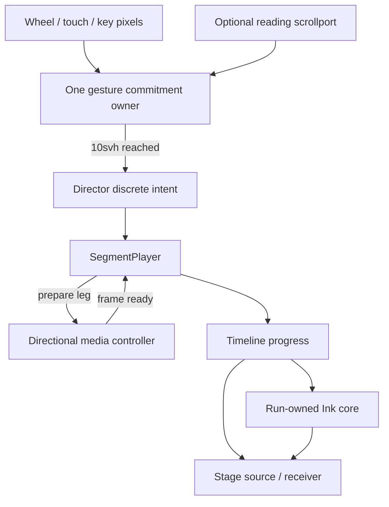
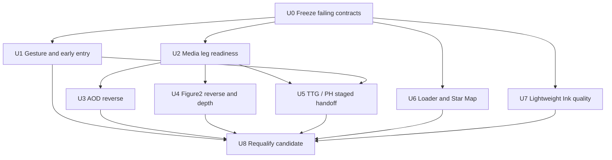

# R5 HITL Regression Closure and Candidate Requalification Plan

## 2026-07-13 Execution Update

The regression architecture in Units 0–7 is implemented on `codex/react-refactor-r5-parity-cutover`. Candidate-v2 remains immutable and rejected. The follow-up lifecycle/release blockers are implemented under `2026-07-13-003-fix-r5-candidate-v3-lifecycle-gates-plan.md`: cancellable timed preparation, presented-frame-only readiness, two-phase surface commit, Figure2 hold/depth-Ink restoration, preparing reversal input, schema-3 identity-bound RSS qualification, and TTG decoder-memory closure.

At pre-freeze head `00ceba1`, `pnpm run verify:all` passed 83 files / 568 tests plus lint, typecheck, build, static/release checks, and frozen bundle budgets. Exact candidate-v3 RSS passed but dirty-tree finalization failed closed. Candidate-v4 passed exact identity-bound RSS/finalization (`1,423,048,704B`), HTTP smokes, and same-port rollback, but default E2E stopped at 42/44. Commit `6cde26d` closed its Figure2 defect and TTG oracle. Candidate-v5 then passed exact RSS/finalization (`1,475,641,344B`), smokes, rollback, and 44/44 default E2E, but release E2E stopped at 49/54 applicable cases with 42 declared skips. All five failures were stale TTG terminal-still/AOD endpoint-failure oracles, now aligned at `5785ce5`. Candidate-v3/v4/v5 remain immutable and unqualified; candidate-v6 repeats every exact gate and is the only allowed successor.

## Overview

This plan reopens the R5 HITL gate after a code-first review of the runtime delivered around `c0ae4d1`. The remote branch had advanced to `2501704` when this review was completed; the commits after `c0ae4d1` change Playwright server isolation and release documentation, not the runtime defects covered here. Therefore the runtime findings apply to both `c0ae4d1` and the reviewed branch head.

The R5 structure is largely present: the production StoryApp, canonical spine, Director/Stage ownership, lazy production/harness split, SEO/no-JS shell, release build, and rollback machinery exist. The current branch is nevertheless **not an acceptable R5 candidate**. User-observed navigation locks, missing loader Ink, reverse-media failures, flashes, stale reading entry, and the degraded horizontal Ink edge directly violate the original R5 regression gate. The existing immutable tag `react-refactor-r5-parity-repair-candidate` points to `1849069` and does not contain the later R21/R22 work; no immutable tag currently identifies the reviewed runtime.

This is a planning-only artifact. It does not change runtime code and does not add a visual-review step during implementation. Implementation uses deterministic DOM, state-machine, decoded-frame, WebGL, release, and performance evidence. Aesthetic acceptance still returns to the existing final HITL gate after a new immutable candidate is produced; automated green tests alone must not relabel the current branch as accepted.

## Review Scope and Sources

- Original release goal: `docs/react-refactor/goals/R5-parity-cutover.md`
- Previous repair plan: `docs/plans/2026-07-12-001-fix-production-story-parity-plan.md`
- Current contract claims: `docs/react-refactor/contract-diff/R5-production-parity-repair.md`
- Current release evidence: `docs/react-refactor/reports/r5-parity-repair-candidate.md`
- Lightweight Ink design: `docs/superpowers/specs/2026-07-12-lightweight-horizontal-ink-contour-design.md`
- Legacy behavior references: `js/effects/ink-text-reveal.js`, `js/site/runtime.js`, `js/sections/hero.js`, and the Figure2/AOD transition components on `main`
- Code graph: `graphify-out/GRAPH_REPORT.md`; the blast-radius hubs remain `StorySpine`, `HandleRegistry`, `SegmentPlayer`, the Director machine, and the shared Ink/media communities.

No browser screenshot or manual visual comparison was used for this review. The only asset-level inspection was non-visual metadata/frame analysis. The canonical TTG forward/reverse files are both 60-frame, 24fps, 2.5-second assets and their reversed sequence remains closely aligned; the dominant TTG defect is runtime surface preparation, not a missing reverse asset.

## Outcome: The Previous Goal Is Not Closed

### Original R5 stage gate

| R5 area | Status at reviewed head | Reason |
|---|---|---|
| T5.0 baseline and branch | Pass | Branch lineage and immutable historical tags remain available. |
| T5.1 production StoryApp | Partial | Structural assembly is present, but reading ownership, from/to presentation, and several reverse paths fail in production interaction. |
| T5.2 default toolchain and entry | Pass by code | Root production entry, lazy harness split, CI/build paths, and legacy default-path exclusion remain implemented. |
| T5.3 SEO/no-JS | Pass by code | Crawlable copy, no-JS escape, footer, metadata, favicon, and emitted font checks remain present. |
| T5.4 full regression matrix | **Fail** | Method/Lab transitions can lock; Contact reverse is gesture-rate dependent; AOD/Figure2/TTG reverse paths fail or flash; PH/Education exposes stale receiver presentation. These are explicit cutover blockers. |
| T5.5 performance | **Requalification required** | TTG and Figure2 visibly stall despite aggregate frame-budget claims. New reverse-surface and Ink work changes decode/memory/frame pacing and must be measured again. |
| T5.6 rollback | Historical pass only | The rehearsal covers `14743aa`, not the future corrected runtime or a new immutable candidate. |
| T5.7 release gate | **Fail** | HITL has identified blockers, current R21/R22 runtime has no immutable candidate identity, and the reports overstate closure. |

### Previous repair requirements R1–R22

| Requirement | Review status | Code-level conclusion |
|---|---|---|
| R1 AOD alpha handoff | Pass, preserve | The first third clears non-authored AOD paper backings. Do not regress this while fixing reverse playback. |
| R2 Crane duration | Pass, preserve | `CRANE_CONTACT_DURATION_MS` is 3000ms. |
| R3 Hero/Pattern motion | Pass by code | Transition-scoped motion leases keep Pattern live. |
| R4 collapsed Pattern motion | Pass by code | Pattern structural progress and live renderer time are separated. |
| R5 Star Map Perlin | Pass by code | The 12fps scene-motion lease is present; the new Star Map defect is text opacity, not Perlin touching DOM text. |
| R6 AOD/Ink reliability | Partial | Canvases are run-owned, but renderer creation/context loss can still silently continue as polygon-only ownership because a null/invalid renderer does not fail the run. |
| R7 loader/Hero parity | Partial | Hero intro/parallax/stacking are implemented; the loader copied timings and phrases but replaced the legacy Ink renderer with a straight CSS inset wipe. |
| R8 progressive top bar | Pass by code | The nav and seven-layer sibling blur exist and are hidden for Hero. |
| R9 reading ownership | Fail in integration | The production handoff consumes the scrollport, then the Director independently re-queries the reading edge and can discard the released intent. |
| R10 10svh boundary feel | Fail in integration | Reading and non-reading holds use different intent models; the Director's fast decay makes Contact depend on rapid wheel events. |
| R11 footer/filing | Pass by code | Interactive and static footer use the exact filing text and MIIT link. |
| R12 favicon | Pass by code | Build verification compares the emitted SVG bytes with `assets/favicon.svg`. |
| R13 Contact reverse locality | Partial | Segment recovery is local, but the user can still be trapped at Contact by the charge/decay policy. |
| R14 reverse reading entry | Partial | Directional top/bottom positioning happens only after settlement, so a receiver can first appear at stale scroll position and then jump. |
| R15 Figure2 reverse | Fail | Tests prove decreasing `currentTime` writes on synchronous fakes, not decoded intermediate frames; production seeks two videos every animation frame despite existing reverse assets. |
| R16 fonts | Pass by code | Canonical title font and traditional/sans stacks are emitted and shared. |
| R17 Figure2 foreground ownership | Pass, preserve | The retained near arch is outside depth-mask targets and above the depth Ink. |
| R18 PH/TTG re-entry | Fail | New-timeline alternation tests miss a direction reversal at the staged pause inside one active run. |
| R19 TTG reverse endpoint | Fail | Per-frame preparation invalidates its own pending token; the endpoint surface can switch late or expose a stale frame. |
| R20 edge-only grade | Pass structurally | Production cover alpha is zero and dark remains opt-in; horizontal seam quality still fails under R21. |
| R21 lightweight horizontal contour | Partial/fail | DOM and WebGL share a 32-sample macro contour, but source ownership is usually not complementary, the polygon is visibly coarse, the shader still displaces its visible front away from the ownership contour, and the horizontal seam core is disabled. |
| R22 TTG/PH Ink cancellation | Partial | Ink is removed and a 600ms dissolve exists, but staged media readiness and early receiver entry are not closed; PH/Education can visually present Education twice. |

## Root-Cause Findings

### F1 — Reading intent has two owners, while Contact uses a different decaying model

`app/src/production/reading-handoff.ts` consumes content and emits a complete 0.1 Director delta when its 10svh budget is reached. `app/src/runtime/director.actor.ts` then routes that event through a second `readingCanScroll()` query. Fractional/stale scroll metrics can make this second owner classify the event as `innerScroll` and drop it. Existing controller tests stop at a mocked `runtime.send()` and therefore never cover the drop.

Contact is not a reading hold, so it bypasses the physical-pixel commitment path. Its small trackpad deltas are accumulated by `app/src/runtime/charge.ts`, where `0.001` viewport units decay per millisecond can erase a normal 60Hz gesture faster than it accumulates. This explains “continuous fast swipes work; ordinary upward scrolling does not.” Tuning the threshold alone would preserve the architectural split and is not the fix.

### F2 — Reading entry is applied after the receiver has already been shown

`app/src/production/StoryApp.tsx` calls `positionReadingAtEdge()` only after the Director reaches the destination hold. During PH → Education's dissolve, the live Education scrollport can still retain the position from a prior visit. It is then moved to the top at settlement. The Stage still owns one canonical Education DOM root; the apparent duplicate is stale receiver presentation followed by a late entry jump, not two allowed Education scenes.

### F3 — AOD reverse is explicitly allowed to skip media readiness

`app/src/transitions/aod-method-top/index.ts` and `app/src/story/manifest.ts` declare AOD reverse as `static-fallback`, `required: false`. `renderAodTransitionProgress()` also writes `video.currentTime` directly on every frame instead of using the shared coalescing/presented-frame driver. A reverse run reached without a prior warm forward traversal is therefore neither media-gated nor frame-presented.

### F4 — Figure2 reverse proves seek requests, not playable reverse animation

`figure2VideoModeForProofTransition()` selects `seek` for the reverse intro leg. Two large VP9 surfaces receive a new target on every timeline frame. The test fake completes seeks synchronously, so three descending writes pass even though the browser can display only an endpoint while decoding catches up. Existing `figure2a-alpha-reverse-lite.webm` and `figure2b-alpha-reverse-lite.webm` provide a native-playback route that is not used.

The Figure2 → Opening flash has a separate cause: `createDepthThresholdMask()` attaches SVG masks whose `<image>` resources have no readiness/commit gate. `timelineReady` is reported by numeric progress, not by the decoded depth resource. A mask can therefore become active before its rank image is usable in either direction.

### F5 — TTG surface preparation invalidates itself during a staged-pause reversal

In `app/src/scenes/ttg-animation/index.tsx`, `prepareAndActivate()` keys pending work by the exact requested progress. Once a staged run reverses at the media pause, every animation frame requests a different reverse progress, increments the token, and makes the preceding frame-preparation promise stale. The reverse surface may never become active while the timeline continues, producing an endpoint-only reverse. A fresh reverse run from Lab works because `createStagedMediaHandoff()` awaits one fixed terminal preparation before progress begins; current tests mostly alternate fresh timelines and miss the same-run case.

`parkSurface()` also disposes/reloads surfaces from render-time code, and TTG promotes from metadata-only to decode at playback start. These state changes explain first-run decode stutter and terminal snapping. Surface loading, activation, playback, terminal hold, and parking need to be state transitions, not per-frame side effects.

### F6 — Loader parity is timing-only

`app/src/production/StoryLoader.tsx` renders two DOM text copies. `app/src/styles.css` reveals them through `clip-path: inset(...)`. The legacy loader uses the canvas controller in `js/effects/ink-text-reveal.js` with a text mask, FBM warp, wet/pore breakup, droplets, and font-readiness handling. The React loader kept the 5.38s phrase schedule but did not port the effect or its entrance lifecycle.

### F7 — Star Map copy is deliberately translucent twice

Perlin is confined to `.r3-star-map__canvas`; it cannot directly alter the sibling copy DOM. The perceived transparency comes from CSS: the scene defaults `--r3-star-copy-opacity` to `.72`, and `.large-copy--standalone` also uses an alpha `.72` text color. Hold rendering raises only the first value to `1`. The copy therefore remains translucent over the moving canvas.

### F8 — The lightweight horizontal Ink closes only a coarse macro contour

`app/src/transitions/shared/horizontalInkContour.ts` serializes a 32-point polygon with a maximum normalized displacement of 0.055. `app/src/vendor/ink-scene-transition.js` samples the same one-row texture, but then adds a separate procedural field and tendril displacement to the rendered edge. At the same time, horizontal mode multiplies seam occlusion by zero. The result is a binary, faceted DOM edge that is not fully covered by the organic Ink front. High-contrast scene pairs expose it; Education → Crane hides it because both sides are light.

This plan keeps the user-selected lightweight architecture. It does **not** revive the discarded two-dimensional SVG rank-map design and does not use a scene-wide dark wash to hide the seam.

## Requirements for This Closure

- **N1 Loader:** Cold Hero entry uses a real production-owned Ink canvas sequence and hands off to the existing Hero intro only after the loader is hidden.
- **N2 Star Map copy:** Hold copy is fully opaque; Perlin remains canvas-only and live during relevant transitions.
- **N3 AOD reverse:** Method → AOD is media-gated, uses presented intermediate frames, and succeeds without a prior forward traversal.
- **N4 Gesture boundary:** Method → Figure2, Lab → PH, and Contact → Crane each fire after one slow or fast physical 10svh same-direction commitment, without double routing or gesture-rate dependence.
- **N5 Figure2:** Stage 2 → Stage 1 uses continuous native reverse media; Figure2 ↔ Opening cannot expose an unready depth mask or blank/flash frame.
- **N6 TTG:** Forward playback is predecoded before its timed leg; same-run reversal at the first pause works; endpoint surface changes are atomic and never play the wrong endpoint.
- **N7 PH/Education:** The staged dissolve remains Ink-free, owns one PH source and one Education receiver, and shows the receiver at its correct entry edge before its first visible frame.
- **N8 Horizontal Ink:** Source, receiver, and visible core share one lightweight contour revision/threshold; the binary edge is covered by a narrow organic core without full-screen darkening. Deterministic coverage closes ownership correctness; final aesthetic quality remains a HITL decision.
- **N9 Candidate truth:** Current reports are downgraded until the fixes pass; a new immutable candidate is built and rehearsed before returning to HITL.

## Key Technical Decisions

| Decision | Rationale |
|---|---|
| Production physical input emits one discrete commitment event | It removes the second reading-edge decision and the Director decay race while retaining raw `INPUT_DELTA` support for harnesses/scrub policies. |
| Use the same 10svh physical gate for non-reading snap/staged holds | Contact and reading boundaries should not have different gesture-rate semantics. This preserves the Director's existing normalized 0.1 distance; it replaces cadence-sensitive decay rather than increasing the authored threshold. Content is consumed first only when a reading scrollport exists. |
| Position a destination reading layer during prepare, before visibility | This prevents stale top/bottom content from appearing during Ink/dissolve and makes settlement idempotent. |
| Add an asynchronous staged-leg readiness hook | SegmentPlayer must not start a timed leg until its requested media surface/frame is ready. Per-frame rendering is too late to perform surface preparation. |
| Use native reverse assets for Figure2 | Existing reverse-lite assets avoid reverse seek storms. Only the active direction decodes; inactive surfaces remain metadata-only. |
| Keep AOD/PH scrub media on the coalescing timeline driver | They have scrub-oriented single assets; the fix is explicit reverse readiness and presented-frame ownership, not an unnecessary asset pair. |
| Keep lightweight horizontal contours, strengthen the core | A denser run-owned 1D contour plus an exactly aligned narrow WebGL core addresses the visible seam without the rejected SVG/2D design or full-screen darkening. |
| Treat renderer loss as run failure, not a half-effect fallback | A straight polygon with no Ink body is explicitly unacceptable. Local recovery settles to the directional endpoint. |
| Requalify release evidence from the final immutable source | Historical green matrices cannot certify code that they did not contain, and current HITL findings override report labels. |

## High-Level Interaction Design

The diagram is directional guidance, not an implementation specification.

## Implementation Units

- [ ] **Unit 0: Freeze the production failures before changing shared hubs**

**Goal:** Replace false-positive endpoint tests with characterization coverage for the exact production races reported at HITL.

**Requirements:** N1–N9; closure evidence for R6, R7, R9, R10, R14, R15, R18, R19, R21, and R22

**Dependencies:** None

**Files:**
- Create: `app/src/transitions/aod-method-top/index.test.ts`
- Modify: `app/src/production/input-controller.test.ts`
- Modify: `app/src/production/reading-handoff.test.ts`
- Modify: `app/src/runtime/director.machine.test.ts`
- Modify: `app/src/story/segment-player.test.ts`
- Modify: `app/src/transitions/figure2-proof-chain.test.ts`
- Modify: `app/src/transitions/group5-transitions.test.ts`
- Modify: `app/src/transitions/group6-transitions.test.ts`
- Modify: `app/src/transitions/shared/stagedMediaHandoff.test.ts`
- Modify: `app/src/production/StoryLoader.test.tsx`
- Modify: `app/src/scenes/star-map/progress.test.ts`
- Modify: `app/src/transitions/shared/ink.test.ts`
- Modify: `app/src/vendor/ink-scene-transition.lifecycle.test.ts`
- Modify: `docs/react-refactor/reports/r5-parity-repair-candidate.md`
- Modify: `docs/react-refactor/reports/r5-regression-matrix.md`

**Approach:**
- Test through the actual input-controller → runtime route instead of stopping at a mocked `send()` call.
- Use deferred `seeked` and `requestVideoFrameCallback` fakes so a requested frame is distinct from a presented frame.
- Exercise reversal at an existing staged pause inside the same run; fresh forward/reverse timeline construction is not sufficient.
- Model a delayed depth image and a WebGL context loss.
- Assert the loader owns a canvas controller, not only classes named “ink.”
- Before runtime changes, mark the reviewed candidate and regression matrix as HITL-rejected/open. Preserve historical measurements, but remove any current “fully verified” or cutover-ready conclusion.

**Execution note:** Characterization-first. Existing tests that encode `static-fallback` AOD reverse, endpoint-only Figure2 seeks, or fresh-run-only TTG alternation must be corrected rather than retained as compatibility contracts.

**Test scenarios:**
- Integration — Method at its physical bottom receives several small wheel events totaling 10svh; exactly one transition intent reaches Director.
- Integration — Contact receives the same event cadence and reverses to Crane without a rapid burst.
- Edge case — A reading handoff reaches the edge with fractional scroll metrics; the released event cannot be reclassified as inner scroll.
- Edge case — TTG reaches stage 0, reverses before Lab, and continues receiving progress while the reverse frame is delayed; progress must wait rather than invalidate preparation.
- Error path — WebGL context loss during a horizontal transition must produce local run failure/recovery, never polygon-only continuation.
- Error path — Figure2 depth resource delay keeps endpoint presentation stable until the mask is ready.
- Happy path — Loader frame samples drive the legacy two-phrase Ink controller and Hero intro starts only after loader hidden.

**Verification:** Every new test fails for the reviewed runtime for the intended reason, without relying on screenshots or arbitrary sleeps.

- [ ] **Unit 1: Establish one physical gesture owner and prepare reading entry before reveal**

**Goal:** Make the 10svh contract deterministic across long copy, normal holds, and staged pauses; eliminate late top/bottom jumps.

**Requirements:** N4, N7, R9, R10, R13, R14

**Dependencies:** Unit 0

**Files:**
- Create: `app/src/production/gesture-intent-gate.ts`
- Create: `app/src/production/gesture-intent-gate.test.ts`
- Modify: `app/src/production/input-controller.ts`
- Modify: `app/src/production/reading-handoff.ts`
- Modify: `app/src/stage/reading.ts`
- Modify: `app/src/production/StoryApp.tsx`
- Modify: `app/src/runtime/director.actor.ts`
- Modify: `app/src/runtime/director.machine.test.ts`
- Modify: `app/src/production/input-controller.test.ts`
- Modify: `app/src/stage/Stage.reading.test.ts`
- Modify: `app/src/production/runtime-assembly.test.ts`

**Approach:**
- Make `reading-handoff.ts` a pure scroll-consumption adapter that returns consumed/residual physical pixels. Move commitment, latching, reset, and one-shot emission ownership into `gesture-intent-gate.ts`.
- Make the production gate consume physical content pixels first when the current hold has a reading scrollport, then consume one post-edge 10svh commitment.
- For non-reading snap/staged holds, start the same 10svh commitment immediately. Direction reversal, gesture idle, viewport change, scene/run/pause change, seek, and dispose reset the gate.
- Emit a discrete Director commitment after the threshold. Do not send a synthetic 0.1 `INPUT_DELTA` that will be routed through another DOM edge check. Keep raw input charging available for harness/programmatic paths and scrub segments.
- Use a practical CSS-pixel edge tolerance and explicitly clamp a consumed scrollport to its exact top/bottom endpoint.
- During `waitForTargetReady`, position only the destination reading layer at top for forward or bottom for reverse before timeline construction can reveal it. Preserve the current source scroll position. The later hold-entry effect becomes an idempotent assertion/fallback.

**Patterns to follow:**
- Director's existing `CHARGE_FIRED` discrete event
- Existing directional `holdEntry` metadata and local recovery generation guards

**Test scenarios:**
- Happy path — Slow 20px wheel events, one 100px event, one PageDown/PageUp, and touch deltas all require the same 10svh physical distance.
- Happy path — Method and Lab consume all remaining copy before commitment; Services keeps the same semantics.
- Edge case — 9.9svh never fires; the crossing event fires once; momentum after the fire cannot double-trigger.
- Edge case — Direction reversal at 9svh clears the old budget and first scrolls content in the new direction.
- Edge case — A `visualViewport`/layout-height change during commitment resets the old pixel budget instead of firing against a stale 10svh value.
- Integration — Method → Figure2, Lab → PH, and Contact → Crane work with ordinary trackpad cadence.
- Integration — Reverse entry to Method is already at the bottom on its first visible transition frame; forward entry to Education is already at the top during dissolve.

**Verification:** Input behavior is independent of event frequency, Director no longer has two owners for one released reading event, and no destination reading layer changes scroll position after it becomes visible.

- [ ] **Unit 2: Add asynchronous staged-leg and directional-surface readiness**

**Goal:** Make media readiness a prerequisite for timed progress rather than a render-time side effect.

**Requirements:** Shared prerequisite for N3, N5, N6, N7, R15, R18, and R19

**Dependencies:** Unit 0

**Files:**
- Create: `app/src/media/directional-media-controller.ts`
- Create: `app/src/media/directional-media-controller.test.ts`
- Modify: `app/src/media/timeline-video-driver.ts`
- Modify: `app/src/media/timeline-video-driver.test.ts`
- Modify: `app/src/story/types.ts`
- Modify: `app/src/story/segment-player.ts`
- Modify: `app/src/story/segment-player.test.ts`

**Approach:**
- Add an optional asynchronous leg-preparation contract to staged timelines. SegmentPlayer awaits it before starting that leg's clock and rechecks run identity after resolution. The leg remains logically paused while preparation is pending; staged-resumed diagnostics and timed progress begin only after readiness succeeds.
- Model paired surfaces as explicit states: parked, preparing, ready, active, terminal. Only state transitions may change `preload`, call `load()`, dispose a driver, or toggle the active class.
- Preparation targets a fixed start/terminal frame for the upcoming leg. Per-frame progress may drive only the already-active surface; it may not restart preparation.
- Separate “seek requested,” “decoded/presented,” and “native playback started.” Native playback begins only after its initial requested frame is presented.
- Keep generation/run/direction guards and coalesced timeline fallback for single scrub assets.

**Test scenarios:**
- Happy path — A ready native surface begins once and is not reloaded or reactivated on subsequent progress frames.
- Edge case — Same-run direction reversal invalidates the old leg once, prepares a fixed opposing endpoint, then starts time from that presented frame.
- Edge case — Rapid supersession resolves old preparation as stale and cannot activate its surface.
- Error path — Play rejection falls back to coalesced timeline frames for that run only.
- Error path — Unmount/context disposal releases listeners, frame callbacks, pending promises, and decoded surfaces idempotently.
- Integration — SegmentPlayer's staged progress remains frozen while leg preparation is pending and resumes with the original duration after readiness.

**Verification:** No media source selection, `load()`, driver disposal, or surface activation occurs in a per-frame render loop.

- [ ] **Unit 3: Make Method → AOD a required, presented-frame reverse**

**Goal:** Restore deterministic AOD reverse playback without regressing the first-third alpha composition.

**Requirements:** N3, R1, R18

**Dependencies:** Unit 2

**Files:**
- Modify: `app/src/transitions/aod-method-top/index.ts`
- Modify: `app/src/scenes/aod-animation/progress.ts`
- Modify: `app/src/story/manifest.ts`
- Modify: `app/src/story/manifest.test.ts`
- Modify: `app/src/runtime/media-ready.test.ts`
- Modify: `app/src/harness/r3/pilot-contract.test.ts`
- Modify: `app/src/harness/r4/mediaGate.test.ts`
- Test: `app/src/transitions/aod-method-top/index.test.ts`
- Test: `app/src/scenes/aod-animation/progress.test.ts`

**Approach:**
- Make `renderAodTransitionProgress()` presentation-pure; remove direct video writes from the scene renderer.
- Drive the scrub asset through the shared timeline driver with explicit run direction and presented-frame readiness.
- Declare reverse timeline media required and direction-gate the same AOD key before timeline start.
- Preserve alpha backings through raw progress 1/3 and the existing Method copy cue at 0.8.

**Test scenarios:**
- Happy path — Method → AOD from a direct Method hash, with no prior AOD forward traversal, presents multiple monotonically decreasing media frames and settles at AOD.
- Edge case — Reverse begins while metadata is delayed; Method remains the stable current hold until AOD's required frame is ready.
- Error path — Decode/seek failure recovers locally to the directional endpoint and never Hero.
- Regression — Progress 0.20 and 1/3 still show Method through AOD's authored alpha with all synthetic paper backings at zero.

**Verification:** No AOD reverse contract remains `static-fallback`, and no AOD scene renderer assigns `currentTime` directly.

- [ ] **Unit 4: Use native Figure2 reverse media and atomically arm the depth handoff**

**Goal:** Make Stage 2 → Stage 1 continuous and prevent Figure2 ↔ Opening mask flashes in both directions.

**Requirements:** N5, R15, R17

**Dependencies:** Unit 2

**Files:**
- Modify: `app/src/scenes/figure2-animation/index.tsx`
- Modify: `app/src/transitions/figure2-distance-expand/index.ts`
- Modify: `app/src/transitions/shared/depthThresholdMask.ts`
- Modify: `app/src/story/manifest.ts`
- Modify: `app/src/story/manifest.test.ts`
- Modify: `app/src/runtime/media-ready.test.ts`
- Modify: `app/src/transitions/figure2-proof-chain.test.ts`
- Modify: `app/src/stage/RetainedFigure2Arch.test.tsx`
- Modify: `app/src/styles.css`
- Reference assets: `assets/figure2a-alpha-reverse-lite.webm`
- Reference assets: `assets/figure2b-alpha-reverse-lite.webm`
- Fallback assets: `assets/figure2a-alpha-reverse.webm`
- Fallback assets: `assets/figure2b-alpha-reverse.webm`

**Approach:**
- Qualify the existing reverse-lite pair before wiring it: verify dimensions, alpha stream, duration, frame count, endpoint correspondence, and reversed-sequence continuity non-visually. Use it as native forward-playing reverse media when it passes; otherwise use the existing full reverse pair and record the size/performance tradeoff.
- Register direction-specific Figure2 media and compute playback rate from decoded duration and the 2600ms authored leg; do not seek the forward assets backward every frame.
- Keep inactive reverse surfaces metadata-only and decode only the requested pair. Activate the pair only after both first frames are presented.
- Refactor depth-mask creation into prepare and commit phases. Decode/load the depth image while masks are detached; attach complementary masks and expose receiver visibility in one commit. Resource failure rejects the run into local recovery.
- Preserve the retained near arch outside all depth mask/grade targets.

**Test scenarios:**
- Happy path — Stage 2 → Stage 1 plays both reverse assets natively through intermediate presented frames at the authored duration.
- Edge case — Reverse assets become ready at different times; neither figure surface switches until the pair is ready.
- Edge case — Direction changes at the Figure2 staged pause without an endpoint-only jump.
- Error path — Delayed/failed depth image never applies an empty mask; the currently owned endpoint remains visible.
- Regression — Retained near arch identity, brightness, transform, and mask exclusion stay unchanged through forward/reverse depth progress.
- Performance — Active decode count and heap/GPU usage stay inside the existing scene budget despite the parked reverse surfaces.

**Verification:** Figure2 reverse contains decoded intermediate frames with no per-frame reverse seek storm, and mask readiness—not numeric progress—gates the first depth-owned frame.

- [ ] **Unit 5: Stabilize TTG/PH staged media and receiver uniqueness**

**Goal:** Keep the Ink-free two-step chapter handoff while making every leg ready, reversible, and visually single-owned.

**Requirements:** N6, N7, R18, R19, R22

**Dependencies:** Units 1 and 2

**Files:**
- Modify: `app/src/transitions/shared/stagedMediaHandoff.ts`
- Modify: `app/src/transitions/shared/stagedMediaHandoff.test.ts`
- Modify: `app/src/transitions/ttg-lab/index.ts`
- Modify: `app/src/transitions/ph-education/index.ts`
- Modify: `app/src/scenes/ttg-animation/index.tsx`
- Modify: `app/src/scenes/ph-animation/index.tsx`
- Modify: `app/src/transitions/group5-transitions.test.ts`
- Modify: `app/src/transitions/group6-transitions.test.ts`
- Modify: `app/e2e/r4-g5.spec.ts`
- Modify: `app/e2e/r4-g6.spec.ts`

**Approach:**
- Move source terminal preparation and direction-surface promotion into the Unit 2 leg-preparation hook.
- TTG forward leg prepares the forward start frame before its 2500ms clock. Same-run reverse prepares reverse frame zero while the forward terminal remains visible, then atomically activates and plays the reverse asset.
- During the 600ms dissolve, keep the source terminal frozen and stop all media-time writes. At reverse completion, prepare the canonical forward-start frame before swapping away from the reverse terminal; never start playback at the endpoint.
- PH keeps its one scrub asset and uses presented-frame timeline fallback, but preparation is fixed per leg rather than inferred from mutable DOM progress.
- Rely on Unit 1 to put the Education receiver at top before its first forward dissolve frame. Assert one canonical Stage root for each scene and complementary layer opacity throughout the dissolve.

**Test scenarios:**
- Happy path — TTG forward pauses at terminal, the second input dissolves to Lab, reverse dissolves to terminal, and the next input plays the reverse asset.
- Edge case — At TTG's first pause, reverse before visiting Lab; delayed reverse decode pauses the leg clock and then plays normally.
- Edge case — Repeat direction changes and interruptions within active staged runs, not only across 20 newly built timelines.
- Edge case — TTG terminal and canonical forward-start surfaces swap only after presented-frame readiness; no class interval has zero or two active surfaces.
- Happy path — PH → Education uses one source, one top-positioned receiver, no Ink canvas/clip/mask, and no post-dissolve scroll jump.
- Error path — Active-direction media failure remains local; an unused parked direction cannot time out the whole segment.

**Verification:** TTG works identically before and after visiting Lab, PH/Education never presents stale receiver content, and render-time code no longer churns driver/surface lifecycle.

- [ ] **Unit 6: Port the loader Ink lifecycle and make Star Map copy opaque**

**Goal:** Close the two production-shell presentation gaps without changing the accepted Hero, Perlin, or no-JS architecture.

**Requirements:** N1, N2, R5, R7

**Dependencies:** Unit 0

**Files:**
- Create: `app/src/production/loader-ink-reveal.ts`
- Create: `app/src/production/loader-ink-reveal.test.ts`
- Modify: `app/src/production/StoryLoader.tsx`
- Modify: `app/src/production/StoryLoader.test.tsx`
- Modify: `app/src/production/StoryApp.tsx`
- Modify: `app/src/scenes/star-map/index.tsx`
- Modify: `app/src/scenes/star-map/progress.test.ts`
- Modify: `app/src/styles.css`
- Modify: `app/index.html`
- Reference only: `js/effects/ink-text-reveal.js`
- Reference only: `js/site/runtime.js`

**Approach:**
- Port the legacy text-mask/FBM/wet-edge/droplet behavior into an app-owned, instance-scoped loader controller. Do not import or execute legacy bootstrap code.
- Mount one visual canvas in the React loader, wait for the canonical title font, drive the existing phrase schedule, resize safely, and dispose all GL/listener/timer resources when hidden.
- Keep the current CSS wipe only as the reduced-motion or WebGL-unavailable fallback. Preserve the static no-JS safety escape and loader timeout.
- Preserve the existing handshake: loader hidden → Hero intro running → title reveal/parallax endpoint.
- Set Star Map hold copy container and actual text color to opaque production values. Keep canvas strength independent and retain the transition motion lease.

**Test scenarios:**
- Happy path — Cold Hero runs both phrases through canvas reveal/hold/conceal, exits, then starts the 2.7s Hero intro once.
- Edge case — Font readiness resolves late without starting two sequences.
- Error path — WebGL creation/context loss falls back accessibly and cannot leave an infinite loader cover.
- Reduced motion — Static text exits quickly, no continuous GL/RAF loop remains, and Hero is at its deterministic endpoint.
- Happy path — Star Map hold writes copy opacity 1 and an opaque text color while the Perlin canvas revision continues advancing under a motion lease.

**Verification:** A class name or CSS inset cannot satisfy the loader Ink contract; the live loader owns an active canvas controller, and Star Map text opacity is independent from canvas noise/strength.

- [ ] **Unit 7: Strengthen the lightweight horizontal Ink contour without SVG or full-screen darkening**

**Goal:** Hide the faceted binary ownership seam under an organic, exactly aligned lightweight Ink core while retaining per-run variation and bounded cost.

**Requirements:** N8, R6, R20, R21

**Dependencies:** Unit 0

**Files:**
- Modify: `app/src/transitions/shared/horizontalInkContour.ts`
- Modify: `app/src/transitions/shared/horizontalInkContour.test.ts`
- Modify: `app/src/transitions/shared/inkField.ts`
- Modify: `app/src/transitions/shared/inkField.test.ts`
- Modify: `app/src/transitions/shared/ink.ts`
- Modify: `app/src/transitions/shared/ink.test.ts`
- Modify: `app/src/transitions/shared/sceneInk.ts`
- Modify: `app/src/transitions/shared/sceneInk.lifecycle.test.ts`
- Modify: `app/src/transitions/star-map-aod/index.ts`
- Modify: `app/src/transitions/star-map-aod/inkCurtain.test.ts`
- Modify: `app/src/vendor/ink-scene-transition.js`
- Modify: `app/src/vendor/ink-scene-transition.lifecycle.test.ts`
- Modify: `app/e2e/r4-ink-occlusion.spec.ts`

**Approach:**
- Keep one immutable per-run 1D contour and one threshold. Increase bounded contour density enough to remove visible polygon facets at supported widths while retaining one revision upload rather than per-frame texture creation.
- Apply the reveal polygon to the receiver and the complementary conceal polygon to the source by default. Explicitly excluded retained foregrounds remain outside both.
- In horizontal shader mode, derive the opaque core from the exact shared contour rank. Procedural FBM/tendrils may decorate outside that core but may not move the ownership-covering front.
- Add a narrow contour-centered coverage belt sized to cover clip antialiasing/high-contrast seams. It can carry the jade/gold wet-edge treatment, but `coverAlpha` remains zero outside the belt and the existing dark preset remains opt-in only.
- If the renderer is unavailable at build or becomes invalid during a run, fail the run into local recovery. The renderer exposes an invalidation state/callback, the active timeline records a typed failure, and the next scheduled progress frame throws into segment-local recovery. Never continue as a bare polygon.
- Keep radial and Figure2 depth contracts unchanged in this unit.

**Test scenarios:**
- Happy path — Source, receiver, and canvas expose the same revision, direction, and threshold at every sampled horizontal frame.
- Happy path — Forward and reverse use complementary source/receiver polygons with no unowned endpoint and clear all geometry on dispose.
- Edge case — High-contrast synthetic source/receiver colors still receive a minimum opaque WebGL core along every contour sample, verified through shader/readback contracts rather than screenshots.
- Edge case — New run variation changes the contour; one run remains stable; resize changes presentation atomically without mixing revisions.
- Error path — WebGL creation failure and context loss cannot produce a horizontal-only clip.
- Reduced motion — The deterministic directional endpoint settles without a live Ink loop, stale clip geometry, or a scene-wide grade.
- Performance — One contour upload per revision, bounded polygon points, no per-frame texture/image allocation, and frame budgets remain within R5 limits.
- Regression — Education → Crane, Services → TTG, Lab → PH, Method → Figure2, and custom Star Map → AOD all use the same shared contract; radial/depth behavior is unchanged.

**Verification:** Horizontal Ink remains lightweight and edge-only, but the visible ownership seam is always covered by an organic core centered on the same contour; no SVG mask/profile or scene-wide dark wash is introduced.

- [ ] **Unit 8: Re-run the real gate, correct release records, and produce a new immutable candidate**

**Goal:** Make candidate identity and evidence match the corrected source, then stop for HITL.

**Requirements:** N9 and the full R5 T5.4–T5.7 boundary

**Dependencies:** Units 1–7

**Files:**
- Modify: `docs/react-refactor/contract-diff/R5-production-parity-repair.md`
- Modify: `docs/react-refactor/reports/r5-parity-repair-candidate.md`
- Modify: `docs/react-refactor/reports/r5-regression-matrix.md`
- Modify: `docs/react-refactor/reports/r5-performance-budget.md`
- Modify: `docs/react-refactor/reports/r5-seo-no-js.md`
- Modify: `docs/react-refactor/runbooks/react-cutover-rollback.md`
- Modify: `docs/react-refactor/README.md`
- Modify: `docs/react-refactor/ROADMAP.md`
- Modify: `app/scripts/verify-performance-budgets.mjs`
- Modify: `app/scripts/verify-release-build.mjs`

**Approach:**
- Replace Unit 0's provisional rejected/open records with evidence generated from the final exact source; do not carry historical green claims forward without rerunning their owning checks.
- Run root lint, typecheck, tests, build, static-shell/release checks, all canonical forward and required reverse paths, reduced motion, direct hashes, slow media/recovery, and input modalities.
- Add focused frame-pacing samples for TTG first forward, same-run TTG reverse, Figure2 native reverse, AOD reverse, and active horizontal Ink. Report first-decode delay separately from steady playback.
- Re-run process memory/disposal with parked Figure2 reverse surfaces and the denser Ink contour.
- Build from a clean exact commit, record a new manifest/hash, and perform same-port corrected candidate → immutable legacy → identical corrected candidate rollback.
- Create a new versioned immutable candidate tag only after all gates pass. Candidate creation is in scope for this closure; never move or repoint existing candidate tags.
- Stop for HITL. Do not merge/deploy `main`, create `react-refactor-r5-cutover`, or begin R6 cleanup.

**Test scenarios:**
- Full story — Ordinary slow wheel/trackpad/touch/keyboard traversal reaches all 18 holds forward and required reverse paths without lock, duplicate scene, blank frame, or Hero fallback.
- Media — AOD/Figure2/TTG/PH direction changes, interruptions, delayed readiness, play rejection, stale callbacks, and endpoint swaps pass with presented-frame evidence.
- SEO/no-JS — Core copy, footer/filing, favicon/font, direct hashes, loader escape, and disabled-JS extraction remain unchanged.
- Performance — Desktop/mobile frame, long-frame, bundle, transfer, GPU/RSS/heap, active media, WebGL, and disposal budgets pass on the final commit.
- Rollback — The exact candidate manifest is identical before and after legacy rollback; legacy has no candidate manifest and still passes its frozen smoke.

**Verification:** Reports identify one exact immutable candidate that contains all fixes and all evidence. The branch is left at the HITL stop boundary with no main merge/deploy/cutover tag.

## Acceptance Matrix for the Nine Current Reports

| Report | Deterministic acceptance |
|---|---|
| 1. Loader missing Ink/entry | Live loader owns one active Ink canvas/controller; both phrase phases and loader→Hero handshake are lifecycle-tested. |
| 2. Star Map translucent text | Hold copy container and text color are opaque; only the canvas carries Perlin/noise opacity. |
| 3. Method → AOD reverse fails | Reverse is required/media-gated and presents intermediate decreasing frames from a cold/direct Method entry. |
| 4. Method/Lab cannot advance | Slow physical deltas totaling 10svh fire exactly once through the real runtime route. |
| 5. Figure2 flash/jank | Depth mask commits only when ready; reverse plays direction-specific assets natively with decoded-frame evidence. |
| 6. TTG flash/jank/endpoint-only reverse | Same-run pause reversal awaits one fixed reverse start frame; one active surface; no render-time reload/activation churn. |
| 7. PH/Education appears twice | One canonical source and receiver; Education is at top before first forward dissolve frame and does not jump at settlement. |
| 8. Contact reverse needs rapid swipes | Same 10svh physical commitment works at ordinary event cadence and targets Crane. |
| 9. Horizontal Ink degraded | Shared complementary contour plus aligned narrow organic core; no bare polygon, SVG rank map, or full-screen dark wash. |

## System-Wide Impact

- **Interaction graph:** physical input → gesture gate → Director → SegmentPlayer leg readiness → transition → Stage. Each arrow gets one owner; no layer repeats the preceding decision.
- **Error propagation:** media/Ink readiness errors fail the active segment and use existing segment-local recovery. Only boot failure may use the global Hero fallback.
- **State lifecycle:** gesture scopes, media surfaces, frame callbacks, depth masks, motion leases, and Ink contexts are keyed to run/prepare generation and disposed idempotently on settle, abort, seek, recovery, unmount, and StrictMode remount.
- **Performance:** native Figure2 reverse reduces seek work but adds parked media elements/assets; TTG predecode shifts first-decode cost before the clock; denser Ink geometry adds CSS work. All require targeted and whole-run budget evidence.
- **Release truth:** current reports and immutable historical tags are audit inputs only. None may be relabeled as proof for the future corrected commit.
- **Unchanged invariants:** 18 holds, 17 segments, canonical order, copy, hashes, scene identity, production/harness lazy split, reduced-motion endpoint semantics, edge-only production grade, footer/favicon/fonts, and no-JS shell remain unchanged.

## Risks and Mitigations

| Risk | Impact | Mitigation |
|---|---|---|
| A shared input change alters every hold's feel | High | Keep the user-confirmed 10svh distance, test wheel/touch/key at several cadences, and preserve scrub raw deltas. |
| Staged leg preparation introduces perceived latency | Medium | Predecode the fixed first frame before starting the authored clock and report preparation delay separately; never hide it by advancing progress early. |
| Extra Figure2 reverse surfaces increase memory | High | Park inactive directions metadata-only, decode one pair, dispose outside LayerWindow, and rerun GPU/RSS/heap budgets. |
| SVG depth readiness differs across engines | High | Separate prepare/commit and test Chromium/WebKit resource events; failure recovers locally without attaching an empty mask. |
| Horizontal seam belt becomes a dark wipe | High | Bound it to a narrow contour-local core; keep scene-wide cover alpha zero and dark as harness-only. |
| Denser polygons regress frame pacing | Medium | Bound sample count, reuse run data, upload once per revision, and profile active Ink on desktop/mobile. |
| Existing tests resist corrected contracts | Medium | Remove assertions that require static AOD reverse, synchronous seek success, or fresh-run-only TTG re-entry while preserving identity/dispose/recovery invariants. |
| Release docs again get ahead of source | High | Downgrade status first, regenerate evidence from exact source last, and bind every claim to commit/tag/manifest identity. |

## Alternatives Rejected

- Lowering Director charge threshold or decay only: leaves two input owners and different reading/Contact semantics.
- Repeatedly calling TTG surface preparation until one wins: preserves the self-invalidating progress race.
- Continuing Figure2 reverse seeks with larger tolerances: may reduce writes but still cannot guarantee decoded intermediate frames.
- Hiding horizontal seams with the `dark` grade: violates confirmed 2A and masks rather than fixes boundary coverage.
- Returning to the full two-dimensional SVG rank-map plan: explicitly outside the selected lightweight architecture for this closure.
- Declaring the green non-visual matrix sufficient: contradicted by current HITL blockers and by tests that do not model asynchronous browser presentation.

## Success Metrics

- All nine current user reports have deterministic regression coverage and pass on the final source.
- R1–R22 closure matrix contains no false “pass”; any remaining limitation is explicitly accepted by HITL rather than inferred from tests.
- Ordinary slow input completes Method → Figure2, Lab → PH, and Contact → Crane at exactly one post-edge/hold 10svh commitment.
- AOD, Figure2, TTG, and PH show direction-correct presented-frame progress after cold entry, same-run reversal, interruption, and recovery.
- No active transition can continue with an unavailable Ink renderer or depth mask.
- Initial JS/harness split, SEO/no-JS, bundle, frame, GPU/RSS/heap, LayerWindow, and disposal budgets remain green.
- One new immutable candidate commit/tag/manifest passes clean rollback and then stops for explicit HITL approval.

## Documentation and Stop Boundary

The implementation must update the contract diff with the corrected root causes rather than append another unconditional closure claim. The current review result means HITL is not approved. Until a new immutable candidate passes and the user explicitly approves it:

- do not merge or deploy `main`;
- do not create `react-refactor-r5-cutover`;
- do not move existing candidate tags;
- do not begin destructive R6 cleanup.
