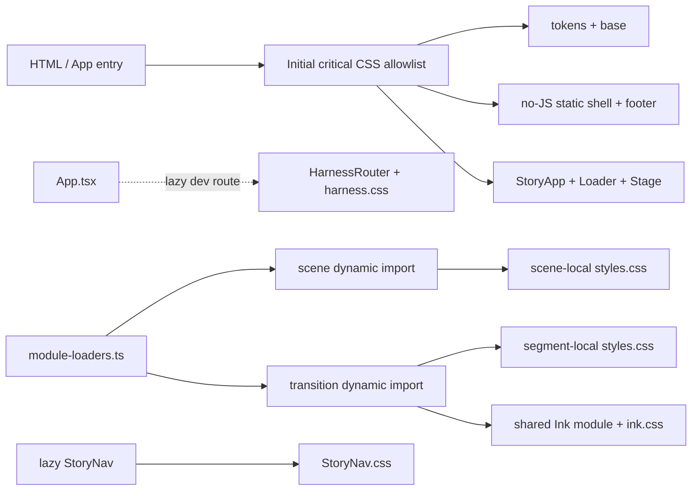
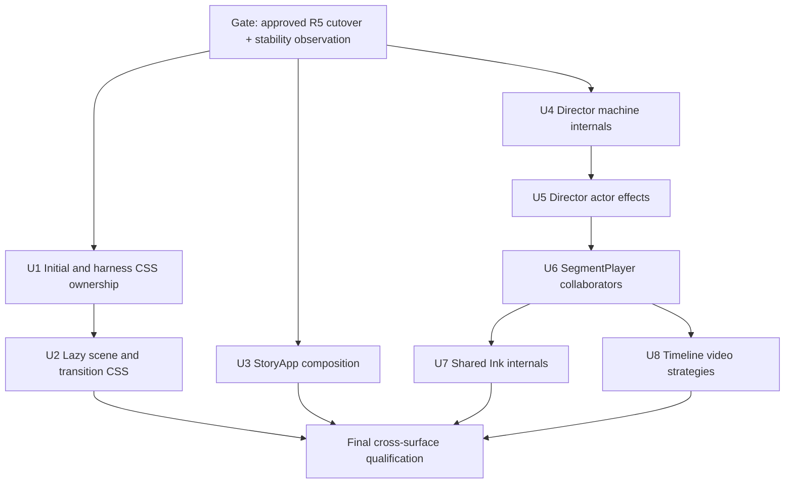

# refactor: Modularize post-cutover style and runtime ownership

## Overview

本计划基于 `codex/react-refactor-r5-parity-cutover` 的最新远端一致提交 `9a602e9fab2199ff2aa8753d46a25e0fc0f9d9c1`（tag：`react-refactor-r5-parity-repair-candidate-v8`）制定，目标是把已经通过多轮 parity 修复、但职责逐渐集中的样式与 runtime 大文件，按真实 ownership、加载边界和生命周期拆开。

结论不是“文件超过某个行数就拆”，而是：

- `app/src/styles.css` 应拆，并且 scene / transition 样式必须跟随对应 lazy module 才能真正缩小首屏 CSS。
- `StoryApp.tsx`、Director machine、Director actor、SegmentPlayer 应按编排、纯状态逻辑和副作用边界拆分。
- `ink.ts` 应拆，但不能重复抽取已经独立存在的 `sceneInk.ts`、`inkField.ts`、`depthThresholdMask.ts` 职责。
- `timeline-video-driver.ts` 在 candidate-v8 已增长到 778 行，原先“487 行、暂时不用拆”的判断已过时；现在有清晰的 native playback、精确 seek、presented-frame waiters、abort/error 四类边界，纳入本计划。
- `patternBloomRenderer.ts` 虽然仍有 896 行，但职责相对集中且优先级低，本轮不拆；未来只有在独立维护痛点出现时，再抽 pure model、asset preload 与 texture cache。

本计划只描述实施方案，不授权在 candidate-v8 上改代码。根据 R5/R6 阶段契约，真正实施必须从 HITL 批准且完成稳定性观察的 `react-refactor-r5-cutover` 创建 R6 工作分支；若正式 cutover 与本计划基线不同，先重新盘点再执行。

## Problem Frame

当前问题不是单纯的“大文件”，而是多个高风险 owner 被压在同一编译、加载或生命周期边界内：

| 文件 | candidate-v8 行数 | 当前判断 | 主要原因 |
|---|---:|---|---|
| `app/src/styles.css` | 4,020 | 立即拆 | 全局、no-JS、harness、Stage、18 scenes、transition 状态与 responsive/keyframes 混装；全部进入初始样式 |
| `app/src/production/StoryApp.tsx` | 638 | 高优先级拆 | runtime 创建、boot、module window、navigation/history、reading、diagnostics 与 JSX 共存 |
| `app/src/runtime/director.machine.ts` | 936 | 高优先级拆 | types、context reducers、guards、actions 与九态拓扑混装 |
| `app/src/runtime/director.actor.ts` | 681 | 高优先级拆 | runtime facade、synthetic adapter、segment effect、recovery 与 diagnostics 混装 |
| `app/src/story/segment-player.ts` | 895 | 高风险、分阶段拆 | build cache、run ownership、scrub mailbox、staged prepare/commit/abort/settle 共存 |
| `app/src/transitions/shared/ink.ts` | 777 | 中优先级拆 | boundary DOM、surface/renderer lifecycle 与 timeline orchestration 共存 |
| `app/src/media/timeline-video-driver.ts` | 778 | 中优先级拆 | candidate-v8 已形成多套明确策略和 waiter lifecycle，不再是单一职责的小型 driver |
| `app/src/scenes/pattern/patternBloomRenderer.ts` | 896 | 本轮不拆 | 大但内聚；当前没有比核心 runtime 更强的 ownership 或故障定位收益 |

`styles.css` 的约 4,000 行是长期累积结果，不应表述成某一轮新增了 4,000 行。类似 `+258/-106` 的增删统计只有绑定明确比较基线才有效，因此不作为长期计划事实；实施时以正式 cutover commit 重新生成 diff 和行数基线。

不处理也有可量化成本：candidate-v8 的已构建 initial CSS 为 74,613B，而既有上限是 76,800B，只剩 2,187B headroom；继续把新 scene 样式放进 monolith 很容易直接触发 release budget。runtime 侧则已在 candidate qualification 中多次出现 prepare/abort/dispose、presented-frame 与 renderer ownership 问题。拆文件本身不会自动消灭这些缺陷，但把 policy、effect 与 resource lifecycle 分开，能让后续修改和故障定位落到唯一 owner。

图谱与代码依赖都显示 `StorySpine`、`HandleRegistry`、`SegmentPlayer` 和 Director 是高连接度核心。为控制 blast radius，本计划只拆 SegmentPlayer 与 Director 的内部 ownership，不改 `StorySpine`、`HandleRegistry` 或 canonical 18 holds / 17 segments。

## Requirements Trace

- **R1 — 阶段边界：** candidate-v8 只作为规划与审查基线；没有 `react-refactor-r5-cutover`、HITL 批准和稳定性观察结论时，不开始实施。
- **R2 — 行为零变化：** 不改变视觉、copy、selector 名、timing、state topology、event contract、navigation/history、reading、reduced motion、recovery 或 media readiness 语义。
- **R3 — CSS ownership：** 初始关键样式、harness、scene、transition 和共享 visual primitive 必须有单一 owner；禁止把所有新文件再次由一个初始 bundle 全量导入。
- **R4 — lazy CSS：** scene / transition CSS 由对应 dynamic import graph 引入；no-JS shell、fonts/tokens、loader、Stage 基础和通用 footer 继续留在初始 CSS。
- **R5 — cascade parity：** CSS 第一遍只机械迁移，保留 selector、declaration、media query、keyframe 与相对顺序；token 归一、去重、selector 改名和 `@layer` 不与迁移同批进行。
- **R6 — runtime API parity：** `createDirectorRuntime`、Director events/snapshots、`SegmentPlayer` facade、Ink factory 和 timeline-video public exports 保持兼容。
- **R7 — lifecycle parity：** run id、prepare token、timeout、AbortSignal、presented-frame readiness、commit-before-play、settlement、recovery 和 disposal 顺序保持 candidate-v8 语义。
- **R8 — characterization-first：** 每个高风险 unit 先固化当前 contract，再移动实现；不靠最终 E2E 单独兜底。
- **R9 — 构建预算可信：** performance verifier 必须汇总全部 initial stylesheet links；release verifier 必须区分 initial critical CSS 与 lazy scene CSS。
- **R10 — 可审查交付：** 每个 unit 是可独立回滚的 ownership change；一个 unit 内不混入视觉修复、性能调参或 dead-code 大扫除。
- **R11 — 文档一致：** 最终 module ownership、加载边界、验证矩阵和 deferred work 写入长期架构文档。

## Scope Boundaries

- 不在 `codex/react-refactor-r5-parity-cutover` 或任何 immutable candidate tag 上实施代码重构。
- 不授权 main merge、deploy、cutover、tag 移动或 release qualification 行为。
- 不做视觉重设计，不调整色彩、字体、z-index、响应式 breakpoint、动画参数或 transition timing。
- 不在机械 CSS 迁移中做 token 合并、重复声明清理、selector 重命名、CSS Modules 化或 cascade layer 引入。
- 不修改 canonical scene/segment ids、18 holds / 17 segments、manifest schema 或 URL/hash contract。
- 不重写 Director、SegmentPlayer、Ink 或 video driver；只把现有职责移到可测试的内部模块，public facade 保持稳定。
- 不拆 `StorySpine`、`HandleRegistry`、`sceneInk.ts`、`inkField.ts`、`depthThresholdMask.ts` 或 `horizontalInkContour.ts`。
- 本轮不拆 `patternBloomRenderer.ts`；其后续边界记录在 Future Considerations。
- 不删除 legacy runtime、release artifact、rollback 资产或一次性迁移脚本；破坏性 cleanup 仍按 R6 独立审计执行。
- Playwright 不作为每个小 unit 的默认验证；只在 CSS 加载边界和最终跨生命周期回归这两个关键环节运行现有 browser suites。

## Context & Research

### Frozen Planning Baseline

- Branch：`codex/react-refactor-r5-parity-cutover`
- Local HEAD / origin：`9a602e9fab2199ff2aa8753d46a25e0fc0f9d9c1`
- Tag：`react-refactor-r5-parity-repair-candidate-v8`
- Commit：`fix(release): reject failed memory profiler exits`
- Baseline worktree 在调研时为 clean；本计划文件是后续新增的唯一预期文档变更。
- `docs/react-refactor/goals/R6-cleanup.md` 明确把 R6 阻塞在 HITL-approved cutover 与稳定性观察之后；该约束高于本计划的实施顺序。
- 当前 `docs/react-refactor/reports/r5-parity-repair-candidate.md` 与 `docs/react-refactor/ROADMAP.md` 的状态文字仍落后于 candidate-v8。R5 必须在正式 cutover 前自行收口这项文档事实；本计划引用它们的阶段契约，不把其中旧 candidate 状态当作 v8 qualification evidence。

### Relevant Code and Patterns

- `app/src/App.tsx` 当前静态导入 `app/src/styles.css`，所以 monolith CSS 跟随初始入口。
- `app/vite.config.ts` 已启用 `cssCodeSplit: true`，无需引入新 bundler；缺失的是 owner-local CSS import。
- `app/src/production/module-loaders.ts` 已对每个 canonical scene 和 transition 使用 dynamic import，是 lazy CSS 应挂接的现有边界。
- `app/src/production/StoryNav.tsx` 已本地导入 `app/src/production/StoryNav.css`，是 lazy component CSS ownership 的直接先例。
- `app/scripts/verify-performance-budgets.mjs` 目前只取第一个 stylesheet link；拆分后会低估多 initial stylesheet 的总量。
- `app/scripts/verify-release-build.mjs` 已能读取所有 initial stylesheet，但目前把 Star Map selector 当作 initial CSS contract；拆分后应在全部 emitted CSS 中验证 scene contract，同时在 initial CSS 中验证 critical contract。
- `app/src/runtime/recovery.ts` 已是 recovery policy owner；Director machine/actor 拆分不得再复制一份 recovery policy。
- `app/src/transitions/shared/sceneInk.ts`、`inkField.ts`、`depthThresholdMask.ts` 与 `horizontalInkContour.ts` 已分别拥有 scene-grade/lifecycle、field math、depth mask 和 contour；`ink.ts` 的拆分必须围绕剩余职责。
- 当前相关 characterization 体量充足：Director machine 528 行测试、Director actor 900 行、SegmentPlayer 1,092 行、Ink 822 行、timeline video 426 行。计划应重组这些测试的 ownership，而不是丢弃它们。

### Institutional Learnings

- 仓库没有 `docs/solutions/` 或可复用的 institutional learnings 文档。本计划以现有 architecture、R5/R6 goals、implementation plans、source contracts 和 tests 为依据。

### External References

- 本轮不需要外部研究。Vite CSS code splitting、React composition、XState machine assembly 和现有 media lifecycle 在仓库内都有直接模式；外部最佳实践不会改变本计划的核心边界。

## Key Technical Decisions

1. **实施基线与规划基线分离。** `9a602e9` 用于描述当前事实；真正代码分支必须从正式 `react-refactor-r5-cutover` 开始。若两者有差异，先重跑 ownership/LOC/import/test inventory，并更新本计划的 baseline appendix。
2. **CSS 按加载 owner 拆，不按视觉章节名或行数均分。** initial-critical、harness、component、scene、transition、shared visual primitive 各自拥有入口；Hero 属于 scene，不属于 production chrome。
3. **初始 CSS 有明确 allowlist。** fonts/tokens、reset/base、static shell、StoryApp/Loader、Stage 基础、通用 SiteFooter 可以 initial；StoryNav、harness、scene、transition、Ink scene-specific styles 不进入 HTML initial stylesheet。
4. **共享不等于全局首屏。** `TextReveal.css` 与 Ink CSS 可被多个 lazy chunks 共享，但只能从使用方 import，不从 `styles/entry.css` import。
5. **跨 scene selector 归 transition。** 例如 `aod-method-top` copy cue、`star-map-aod` composite、`figure3-services` 和 `crane-contact` receiver state，由对应 transition stylesheet 拥有；scene base 只拥有自身静态和可变量化外观。
6. **不为没有声明的 transition 创建空 CSS 文件。** ownership inventory 只有在某个 segment 确实拥有 selector block 时才创建 `styles.css`，避免形式化 microfiles。
7. **CSS 迁移分两次落地。** Unit 1 拆 initial/harness foundation 并暂时保留 residual scene bundle；Unit 2 把 residual 全部挂到 lazy owners 后删除 `app/src/styles.css`。两次都必须可单独构建、回滚。
8. **不使用 `@layer` 保序。** 引入 layer 会改变 specificity/cascade 语义；本轮通过稳定 import order、局部 scope 和 mechanical relocation 保持 parity。
9. **StoryApp 保留 composition root。** React lifecycle 留在 hooks；可纯化的 runtime factory、navigation calculation、reading decision 和 diagnostic serialization 保持为普通函数，避免为了“拆文件”把所有逻辑都包装成 hook。
10. **Director topology 保持一处可读。** `director.machine.ts` 最终仍展示完整九态拓扑；types/context reducers/guards/action adapters 外移。现有 `runtime/recovery.ts` 继续是 policy source of truth。
11. **SegmentPlayer facade 不变。** build cache、active run、scrub 和 staged playback 变成内部 collaborators；run/abort/settle/result contract 不变，不把 Director recovery policy塞进 SegmentPlayer。
12. **Ink 只拆剩余 owner。** boundary DOM、canvas/surface lifecycle、timeline orchestration 外移；grade、field、depth mask、contour 保留当前文件。
13. **timeline video 现在值得拆。** candidate-v8 的 778 行已经包含可独立测试的 seek queue、native playback、frame presentation/waiters；拆分以 public driver facade 和 WeakMap ownership不变为前提。
14. **LOC 不是验收阈值。** 不设“必须低于 300 行”的硬指标；验收看单一 owner、单向依赖、可独立测试、无重复 policy 与 chunk boundary 是否正确。
15. **新增模块是 concrete collaborators，不是新框架。** 每个内部模块只服务当前 facade 与现有 consumers；不新增 plugin registry、通用 lifecycle framework 或只有一个实现的 speculative interface。

## Resolved and Deferred Questions

### Resolved During Planning

- **是否需要把 `styles.css` 拆成多个文件？** 需要，而且必须与 dynamic module graph 对齐；只改成多个仍由 App 静态导入的 CSS 文件无法解决首屏和 ownership 问题。
- **是否把 Hero 放在 production 目录？** 不放；Hero 是 canonical scene，样式跟随 `app/src/scenes/hero`。
- **是否统一创建 `transitions/ink.css` 与 `handoff.css` 两个大桶？** 不创建新的 transition monolith；shared Ink 只放真正共享的 surface 样式，segment-specific handoff selector 跟随各 segment。
- **是否立即拆 Pattern renderer？** 不拆。当前优先处理跨 owner 与高连接度 runtime；Pattern 只记录未来边界。
- **是否继续保留 timeline video 不拆？** 不保留原结论。candidate-v8 已从 487 行增长到 778 行并形成多 lifecycle owner，本计划纳入拆分。
- **是否在同一轮顺便去重 tokens/selectors？** 不做；机械迁移和语义清理分开。

### Deferred to Implementation

- **正式 cutover 的准确 commit 是什么？** 只有 HITL 和稳定性观察结束后才能确定；Unit 1 开始前把实际 tag 写入 ownership 文档。
- **total emitted CSS 的长期 hard budget 是多少？** 先从实际 cutover build 冻结 raw/gzip baseline；本轮禁止提高现有 initial 75 KiB cap，并把 total CSS 作为可见指标，稳定后再决定 hard cap。
- **少量无引用 selector 是否删除？** 第一遍不删。机械迁移后另做 reference audit，只有 source、build 与 browser contract 都证明不可达时才进入 R6 dead-code cleanup。
- **Pattern renderer 是否在后续拆分？** 由本计划完成后的 change frequency、failure localization 与 test ownership 决定，不以行数单独触发。

## High-Level Technical Design

> *This illustrates the intended approach and is directional guidance for review, not implementation specification. The implementing agent should treat it as context, not code to reproduce.*

### CSS loading boundary

### Delivery dependencies

CSS 与 StoryApp 可以在技术上独立，但默认仍按 Unit 顺序落地，避免多个未完成 ownership migration 同时改变初始加载和 runtime 调试面。Director machine → actor → SegmentPlayer 保持串行，因为三者共享 event/result/recovery 生命周期。

## Target Ownership Map

### Initial-critical styles

| Owner | Planned path | Notes |
|---|---|---|
| font faces and immutable custom properties | `app/src/styles/tokens.css` | 只迁移现值，不做 token 归一 |
| reset, root/body, generic route fallback | `app/src/styles/base.css` | 保留 hydration 与 viewport 基础 contract |
| crawlable no-JS content/header/main | `app/src/styles/static-shell.css` | 必须由 HTML initial stylesheet 覆盖 |
| production app frame/status/progress | `app/src/production/StoryApp.css` | 不含 Hero scene |
| loader and CSS fallback animation | `app/src/production/StoryLoader.css` | 必须在 scene module 前可用 |
| reusable footer base | `app/src/components/SiteFooter.css` | initial shell 依赖；contact override 留在 contact scene |
| Stage/layer/reading/retained proof ground | `app/src/stage/Stage.css` | Stage 结构与 reading overflow owner |
| initial import order | `app/src/styles/entry.css` | 仅 allowlisted critical styles；最终不引用任何 scene/harness bundle |

### Lazy and owner-local styles

| Owner | Planned path | Notes |
|---|---|---|
| existing lazy nav | `app/src/production/StoryNav.css` | 保持现状，作为模式参考 |
| all harness and reference scenes | `app/src/harness/harness.css` | 只由 lazy `HarnessRouter` import |
| text reveal primitive | `app/src/components/TextReveal.css` | 只从使用该 primitive 的 lazy graph 引入 |
| Hero | `app/src/scenes/hero/styles.css` | 包含 Hero responsive；TextReveal keyframe 留共享 owner |
| Pattern | `app/src/scenes/pattern/styles.css` | 不改 renderer |
| Star Map | `app/src/scenes/star-map/styles.css` | release verifier 在 emitted lazy CSS 中验证 canonical color |
| AOD | `app/src/scenes/aod-animation/styles.css` | `.aod-transition` base 属于 scene；segment composite override 除外 |
| Method | `app/src/scenes/method-top/styles.css` | scene base；copy-cue transition selector 除外 |
| Figure2 | `app/src/scenes/figure2-animation/styles.css` | depth field、media layers、responsive |
| Figure2 proof chain | `app/src/scenes/figure2-proof/styles.css` | opening/cards/closing 共享且由三个 scene imports 引用，避免复制 |
| Brand | `app/src/scenes/brand/styles.css` | scene base |
| Figure3 | `app/src/scenes/figure3-animation/styles.css` | animation surface base |
| Services | `app/src/scenes/services/styles.css` | receiver transition override 除外 |
| TTG | `app/src/scenes/ttg-animation/styles.css` | media layers and endpoint surface |
| Lab | `app/src/scenes/lab/styles.css` | production scene；`r4-lab-ref` 留 harness |
| PH | `app/src/scenes/ph-animation/styles.css` | media layers and responsive |
| Education | `app/src/scenes/education/styles.css` | production scene；`r4-education-ref` 留 harness |
| Crane | `app/src/scenes/crane-animation/styles.css` | media layers and responsive |
| Contact | `app/src/scenes/contact/styles.css` | contact-specific footer override |
| shared Ink surface | `app/src/transitions/shared/ink.css` | canvas/surface only；由 shared Ink graph 引入 |
| Star Map → AOD override | `app/src/transitions/star-map-aod/styles.css` | transparent composite selector |
| AOD → Method override | `app/src/transitions/aod-method-top/styles.css` | alpha composite and copy cue selectors |
| Figure2 → proof override | `app/src/transitions/figure2-distance-expand/styles.css` | retained proof Ink elevation selector |
| Figure3 → Services override | `app/src/transitions/figure3-services/styles.css` | receiver handoff selector |
| Crane → Contact override | `app/src/transitions/crane-contact/styles.css` | receiver handoff selector |

如果 ownership inventory 发现其他 segment-specific selector，追加到对应现有 transition 目录；不得放进一个新的通用 `handoff.css`。

## Implementation Units

- [ ] **Unit 1: Establish initial-critical and harness CSS ownership**

**Goal:** 建立稳定的 CSS entry allowlist，把 no-JS、production chrome、Stage 与 harness 从 monolith 中分离，同时保持 residual scene CSS 暂时仍可构建。

**Requirements:** R1, R2, R3, R5, R8, R10

**Dependencies:** 正式 `react-refactor-r5-cutover` 已建立并完成稳定性观察；从该点创建 R6 工作分支；cutover baseline inventory 已记录。

**Files:**
- Create: `docs/react-refactor/inventory/module-ownership.md`
- Create: `app/src/styles/entry.css`
- Create: `app/src/styles/tokens.css`
- Create: `app/src/styles/base.css`
- Create: `app/src/styles/static-shell.css`
- Create: `app/src/production/StoryApp.css`
- Create: `app/src/production/StoryLoader.css`
- Create: `app/src/components/SiteFooter.css`
- Create: `app/src/stage/Stage.css`
- Create: `app/src/harness/harness.css`
- Modify: `app/src/App.tsx`
- Modify: `app/src/harness/HarnessRouter.tsx`
- Modify: `app/src/styles.css`
- Modify: `app/src/styles.fixed-background.test.ts`
- Modify: `app/src/production/global-assets.test.ts`
- Modify: `app/src/production/static-shell.test.ts`
- Test: `app/src/production/StoryLoader.test.tsx`
- Test: `app/src/components/SiteFooter.test.tsx`
- Test: `app/src/stage/Stage.reading.test.ts`
- Test: `app/src/stage/Stage.retained-proof.test.tsx`

**Approach:**
- 先在 module ownership 文档记录 cutover commit、每个现有 selector block、consumer、initial/lazy classification 和目的文件；迁移过程中以该表为 checklist。
- `App.tsx` 只导入 `app/src/styles/entry.css`。`entry.css` 按当前 cascade 顺序导入 allowlisted critical owner files，并在本 unit 末尾暂时导入已经删去 initial/harness blocks 的 residual `app/src/styles.css`。
- fonts/tokens、base、static shell、StoryApp、Loader、SiteFooter 和 Stage 只做原样搬移；不调整 declaration order、specificity 或 media query。
- HarnessRouter 本地导入 `harness.css`；所有 `.app-shell`、synthetic、HUD、R3/R4 harness shell 和 reference scene rules 从 initial graph 移除。
- `.r4-visually-hidden` 当前被 StoryLoader 使用，应归入 initial base/accessibility owner，而不是仅放 harness。
- SiteFooter base 保持 initial，以覆盖 Vite 生成的 static shell；`.r4-contact .site-footer` 仍留 residual，等待 Unit 2 归 contact scene。

**Execution note:** 先为现有 hydration/no-JS/Stage/harness source contracts增加 characterization，再做机械搬移；本 unit 不追求 initial CSS 体积下降到最终值。

**Patterns to follow:**
- `app/src/production/StoryNav.tsx` 与 `app/src/production/StoryNav.css` 的 owner-local import 模式。
- `app/src/production/static-shell.test.ts` 对 no-JS content contract 的验证方式。
- `app/src/production/global-assets.test.ts` 对 font/token contract 的 source-level 验证方式。

**Test scenarios:**
- **Happy path:** 未 hydration 的 HTML 使用 static shell、header、main 和 SiteFooter 样式；hydration 后 static content 按原 contract 隐藏，StoryApp 显示。
- **Happy path:** Loader 在任何 scene module 加载前拥有完整字体、Ink CSS fallback、exit/hidden 和 reduced-motion 样式。
- **Integration:** Stage 保持 fixed/full-viewport layer、reading overflow、retained Figure2 ground/arch 与 mobile breakpoint 行为。
- **Integration:** `/harness/*` 动态加载后拥有 HUD、synthetic scene 和 reference scene 样式；production root 的 initial CSS 不再包含 harness-only selectors。
- **Edge case:** non-existent route 的 loading/not-found 样式仍在 initial CSS，不依赖 harness chunk。
- **Regression:** residual scene bundle 被临时导入时，所有 canonical scene 仍保持原有 cascade 与 selector 文本。

**Verification:**
- 所有 initial-critical selector 有明确 owner，harness selector 不再由 App entry 静态加载。
- `app/src/styles.css` 只剩待 lazy 化的 scene/transition blocks，没有 fonts、reset、static shell、production chrome、Stage 或 harness rules。
- source tests、typecheck、lint 和 production build 通过；无 selector/declaration diff，除文件位置与 import graph 外无行为变化。

- [ ] **Unit 2: Move scene and transition CSS onto lazy module boundaries**

**Goal:** 删除 residual monolith，使 canonical scene / transition CSS 跟随对应 dynamic import，并修正 build/release budget 对多 CSS chunks 的理解。

**Requirements:** R2, R3, R4, R5, R8, R9, R10

**Dependencies:** Unit 1。

**Files:**
- Create: `app/src/components/TextReveal.css`
- Create: `app/src/scenes/hero/styles.css`
- Create: `app/src/scenes/pattern/styles.css`
- Create: `app/src/scenes/star-map/styles.css`
- Create: `app/src/scenes/aod-animation/styles.css`
- Create: `app/src/scenes/method-top/styles.css`
- Create: `app/src/scenes/figure2-animation/styles.css`
- Create: `app/src/scenes/figure2-proof/styles.css`
- Create: `app/src/scenes/brand/styles.css`
- Create: `app/src/scenes/figure3-animation/styles.css`
- Create: `app/src/scenes/services/styles.css`
- Create: `app/src/scenes/ttg-animation/styles.css`
- Create: `app/src/scenes/lab/styles.css`
- Create: `app/src/scenes/ph-animation/styles.css`
- Create: `app/src/scenes/education/styles.css`
- Create: `app/src/scenes/crane-animation/styles.css`
- Create: `app/src/scenes/contact/styles.css`
- Create: `app/src/transitions/shared/ink.css`
- Create: `app/src/transitions/star-map-aod/styles.css`
- Create: `app/src/transitions/aod-method-top/styles.css`
- Create: `app/src/transitions/figure2-distance-expand/styles.css`
- Create: `app/src/transitions/figure3-services/styles.css`
- Create: `app/src/transitions/crane-contact/styles.css`
- Modify: `app/src/scenes/hero/index.tsx`
- Modify: `app/src/scenes/pattern/index.tsx`
- Modify: `app/src/scenes/star-map/index.tsx`
- Modify: `app/src/scenes/aod-animation/index.tsx`
- Modify: `app/src/scenes/method-top/index.tsx`
- Modify: `app/src/scenes/figure2-animation/index.tsx`
- Modify: `app/src/scenes/figure2-proof-opening/index.tsx`
- Modify: `app/src/scenes/figure2-proof-cards/index.tsx`
- Modify: `app/src/scenes/figure2-proof-closing/index.tsx`
- Modify: `app/src/scenes/brand/index.tsx`
- Modify: `app/src/scenes/figure3-animation/index.tsx`
- Modify: `app/src/scenes/services/index.tsx`
- Modify: `app/src/scenes/ttg-animation/index.tsx`
- Modify: `app/src/scenes/lab/index.tsx`
- Modify: `app/src/scenes/ph-animation/index.tsx`
- Modify: `app/src/scenes/education/index.tsx`
- Modify: `app/src/scenes/crane-animation/index.tsx`
- Modify: `app/src/scenes/contact/index.tsx`
- Modify: `app/src/transitions/star-map-aod/index.ts`
- Modify: `app/src/transitions/aod-method-top/index.ts`
- Modify: `app/src/transitions/figure2-distance-expand/index.ts`
- Modify: `app/src/transitions/figure3-services/index.ts`
- Modify: `app/src/transitions/crane-contact/index.ts`
- Modify: `app/src/components/TextReveal.tsx`
- Modify: `app/src/transitions/shared/ink.ts`
- Modify: `app/src/production/module-loaders.test.ts`
- Modify: `app/src/styles.fixed-background.test.ts`
- Modify: `app/src/scenes/star-map/progress.test.ts`
- Modify: `app/src/scenes/aod-animation/progress.test.ts`
- Modify: `app/src/scenes/group7-scenes.test.ts`
- Modify: `app/src/scenes/figure2-proof-scenes.test.ts`
- Modify: `app/src/stage/RetainedFigure2Arch.test.tsx`
- Modify: `app/src/transitions/group4-transitions.test.ts`
- Modify: `app/src/transitions/group5-transitions.test.ts`
- Modify: `app/src/transitions/pattern-star-map/index.test.ts`
- Modify: `app/scripts/verify-performance-budgets.mjs`
- Modify: `app/scripts/verify-release-build.mjs`
- Create: `app/src/production/css-build-contract.test.ts`
- Delete: `app/src/styles.css`
- Test: `app/src/production/global-assets.test.ts`
- Test: `app/src/components/TextReveal.test.ts`
- Test: `app/e2e/r5-nojs.spec.ts`
- Test: `app/e2e/r5-production.spec.ts`
- Test: `app/e2e/r5-matrix.spec.ts`

**Approach:**
- 从 residual 文件按 Target Ownership Map 机械搬移；每个 scene index 直接导入自己的 CSS，三个 Figure2 proof scenes 共同导入一个 proof-chain stylesheet。
- 先迁移一个首段动画 scene、一个 direct-hash reading scene 和一个带跨 scene override 的 transition，检查 Vite 实际 emitted CSS 与到达顺序；只有这三个代表性 owner 通过 initial/lazy 断言后，再批量迁移其余 blocks。
- `.aod-transition` 等 scene DOM base 留在 AOD scene CSS；仅 data-attribute composite/copy-cue override 归对应 transition CSS。
- `r4-services-ref`、`r4-lab-ref`、`r4-education-ref` 等 harness-only reference scenes 归 `harness.css`，不误放进 production scene chunks。
- 每个原来读取 `styles.css` 的测试改为读取它实际拥有的一个或少数 CSS 文件；禁止新增“把所有 CSS 拼回一个字符串”的 test helper。
- `module-loaders.test.ts` 增加 source contract：每个 canonical scene 有 owner stylesheet import；已登记 transition-owned selector 的 segment 有 local stylesheet import；harness CSS 不由 production graph 引入。
- performance verifier 收集所有 HTML initial stylesheet links 并汇总 raw bytes；报告同时列出 initial CSS files、all emitted CSS raw bytes 和最大 lazy CSS chunk。现有 75 KiB initial cap 不提高。
- release verifier 在 initial CSS 中检查 fonts/tokens/static shell/loader contract，在全部 emitted CSS 中检查 Star Map 和 scene-specific contract，并明确断言代表性 lazy selectors 不在 initial CSS。
- `css-build-contract.test.ts` 使用临时 dist fixtures 覆盖多 stylesheet links、initial/lazy selector 分布和缺失 asset/error path，防止 verifier 只在当前单 CSS 产物上“碰巧正确”。
- 不依赖异步 CSS 的加载顺序覆盖另一个异步 chunk；跨 owner override 必须被 segment/scene scope 限定。

**Execution note:** mechanical relocation first。若发现需要改 selector 或 declaration 才能通过，停止该 owner 的迁移并记录为独立 parity defect，不在本 unit 偷带修复。

**Patterns to follow:**
- `app/src/production/module-loaders.ts` 的 canonical dynamic import switch。
- `app/src/production/StoryNav.tsx` 的 local CSS import。
- `app/scripts/verify-release-build.mjs` 现有 initial asset enumeration 与 contract assertions。

**Test scenarios:**
- **Happy path:** root 首次加载时 initial CSS 包含 fonts/tokens/static shell/loader/Stage，不包含任何 scene、transition 或 harness selector；scene module resolve 后对应 CSS 可用。
- **Happy path:** direct hash 到 Method、Services、Education、Contact 等 reading scene 时，Loader 持续覆盖加载窗口，目标 scene CSS 在显示前到达，无 unstyled frame。
- **Happy path:** 正向与反向跨 `star-map-aod`、`aod-method-top`、Figure2 proof、`figure3-services`、`crane-contact` 时，transition-owned override 与 receiver scene CSS 同时可用。
- **Integration:** no-JS shell 在 JavaScript 完全禁用时仍有可读 header/main/footer，且不依赖任何 lazy chunk。
- **Integration:** production build 的 HTML initial stylesheet 汇总通过 75 KiB cap；all emitted CSS 中仍能找到每个迁移 contract。
- **Edge case:** scene/transition import 失败并重试时，module cache 清理仍工作；样式 import 不改变 rejection/retry contract。
- **Edge case:** Harness route 只在 dev/explicit harness build 加载 harness CSS；默认 production build 的 JavaScript/CSS 不出现 harness reference selector。
- **Error path:** build verifier 遇到零 stylesheet、丢失 CSS asset 或多个 initial stylesheets 中任一超出汇总预算时 fail closed，而不是只检查第一项。
- **Regression:** desktop/mobile、reduced motion、short viewport 和 reverse traversal 的 computed style/视觉证据与 cutover baseline 一致。

**Verification:**
- `app/src/styles.css` 被删除；App initial entry 没有 scene/harness catch-all import。
- 每个 selector block 在 ownership 文档中只有一个 source owner；没有为了拆分产生重复 CSS declarations。
- 初始 CSS raw bytes 不超过既有 75 KiB cap，并应低于 cutover baseline；total CSS 变化被报告且能解释。
- 现有 build/release/static/performance gates 与关键 no-JS/direct-hash/browser parity 通过。

- [ ] **Unit 3: Reduce StoryApp to a composition root**

**Goal:** 把 runtime construction、scene window、boot/presentation、navigation/history、reading entry 和 diagnostics 从 JSX composition 中分离，保留一个可读的 StoryApp orchestration shell。

**Requirements:** R2, R6, R8, R10

**Dependencies:** execution gate；建议在 CSS units 后进行，以便 runtime 调试时样式 ownership 已稳定。

**Files:**
- Create: `app/src/production/story-runtime.ts`
- Create: `app/src/production/use-scene-window.ts`
- Create: `app/src/production/use-story-boot.ts`
- Create: `app/src/production/use-story-navigation.ts`
- Create: `app/src/production/use-reading-entry.ts`
- Create: `app/src/production/use-story-diagnostics.ts`
- Modify: `app/src/production/StoryApp.tsx`
- Modify: `app/src/production/runtime-assembly.test.ts`
- Test: `app/src/production/navigation.test.ts`
- Test: `app/src/production/reading-handoff.test.ts`
- Test: `app/src/production/input-controller.test.ts`
- Test: `app/src/production/module-loaders.test.ts`
- Test: `app/src/production/StoryLoader.test.tsx`
- Test: `app/e2e/r5-production.spec.ts`
- Test: `app/e2e/r5-matrix.spec.ts`

**Approach:**
- `story-runtime.ts` 只负责创建 production Director/ready gate/registries 并明确单 mount lifetime；React effect 不进入该文件。
- `use-scene-window.ts` 负责 active/neighbor scene 与 transition module requests、retry 和 ready synchronization。
- `use-story-boot.ts` 负责 boot once、loader exit、hydrated marker、initial presentation/focus 和 reduced-motion activation。
- `use-story-navigation.ts` 负责 Director intent、hold/hash synchronization、history replay suppression 与 adjacent preload。
- `use-reading-entry.ts` 负责 reading scene entry/exit、focus/scroll owner 与 input handoff，不复制 `reading-handoff.ts` 的纯规则。
- `use-story-diagnostics.ts` 负责 window diagnostic API、snapshot serialization 与 cleanup；production behavior 不读取 diagnostics 反向驱动 runtime。
- StoryApp 保留 hook composition、derived view state、Stage/Loader/Nav/Footer JSX 和最小 handler wiring。
- 不引入新的 hook-testing library；hook 内需要分支的决策下沉到已有纯 helpers 并由 Vitest 覆盖，完整 effect ordering 由现有 browser contract 验证。

**Execution note:** 先用现有 integration tests 固化 boot once、history suppression、direct hash、reading focus 与 diagnostics cleanup，再逐块搬移；每次只移动一个 lifecycle owner。

**Patterns to follow:**
- `app/src/production/navigation.ts` 与 `reading-handoff.ts` 的纯函数边界。
- `app/src/production/input-controller.ts` 的 explicit lifecycle/dispose 模式。
- `app/src/runtime/director.actor.ts` 的 stable runtime facade。

**Test scenarios:**
- **Happy path:** root mount 创建一个 Director runtime，loader 完成后只 boot/present Hero 一次，Stage/Nav 状态与当前 hold 一致。
- **Happy path:** ordinary forward/reverse navigation 更新 hold 与 hash；programmatic history replay 不产生第二个 navigation intent。
- **Happy path:** direct hash 启动时加载目标 scene window，进入 reading scene 后 focus 和 inner-scroll owner 与现有 contract 相同。
- **Edge case:** reduced motion、tab visibility/focus recovery、rapid opposing input 和 module load retry 不重复 boot 或泄漏 listeners。
- **Error path:** scene/transition load rejection 保留现有 diagnostic/recovery surface，后续 retry 不使用 stale promise。
- **Integration:** diagnostics API mount 时可用、snapshot 与 Director state 同步、unmount 后完全移除；它不进入 no-JS/SSR 路径。

**Verification:**
- StoryApp 只承担 composition 和少量 view derivation；每个 lifecycle effect 有单一 hook owner。
- public DOM/data attributes、window diagnostics、hash/history 与 loader behavior 未变化。
- focused Vitest 与关键 production browser cases 通过，无新增 listener/timer/runtime instance 泄漏。

- [ ] **Unit 4: Separate Director machine data logic from topology**

**Goal:** 让 `director.machine.ts` 聚焦完整九态拓扑，同时把类型、初始 context、纯 reducers、guards 和薄 action adapters 放到可独立测试的模块。

**Requirements:** R2, R6, R7, R8, R10

**Dependencies:** execution gate；在 Director actor 和 SegmentPlayer units 之前。

**Files:**
- Create: `app/src/runtime/director.types.ts`
- Create: `app/src/runtime/director.context.ts`
- Create: `app/src/runtime/director.guards.ts`
- Create: `app/src/runtime/director.actions.ts`
- Create: `app/src/runtime/director.context.test.ts`
- Create: `app/src/runtime/director.guards.test.ts`
- Modify: `app/src/runtime/director.machine.ts`
- Modify: `app/src/runtime/director.machine.test.ts`
- Test: `app/src/runtime/recovery.test.ts`
- Test: `app/src/story/spine.test.ts`
- Test: `app/src/stage/LayerWindow.test.ts`

**Approach:**
- `director.types.ts` 成为 Director state name、context 与 machine options 的共用 owner；canonical `DirectorEvent`、scene/segment ids 和 story contracts 继续由 `app/src/story/types.ts` 拥有。`director.machine.ts` 对既有 Director type imports 提供兼容 re-export。
- `director.context.ts` 拥有 initial context 和纯 context patch/reducer；不得导入 XState actor 或 browser/runtime side effects。
- `director.guards.ts` 只接受显式 state/context/event input，保留当前方向、queue、reading、recovery predicates。
- `director.actions.ts` 是薄 XState adapter，调用 pure reducers；避免在 action adapter 和 reducer 中各维护一套业务规则。
- `director.machine.ts` 保留 `setup` composition 和完整 state node/transition topology，使 reviewer 能在一个文件中理解九态图。
- `runtime/recovery.ts` 继续拥有 recovery policy；machine 只负责把 event/context 映射给它。
- 对当前疑似 definition-only helper（包括 `finalizeAndPrepareQueued`）先做 reference audit；机械拆分不顺手删除，dead code 另列 R6 cleanup commit。

**Execution note:** characterization-first；先记录 state node ids、允许事件、queued intent/recovery 结果，再移动 pure logic。

**Patterns to follow:**
- `app/src/runtime/charge.ts`、`input-normalizer.ts` 与 `recovery.ts` 的 pure policy module。
- `app/src/runtime/director.machine.test.ts` 的 event-sequence contract。

**Test scenarios:**
- **Happy path:** boot → hold、forward/reverse play、settle、reading enter/exit 和 return-to-hold 的 state/context 结果与 cutover baseline 相同。
- **Edge case:** rapid opposing intents 在 preparing/playing/settling 时的 queue/replace/decay 规则不变。
- **Error path:** build/play/media failure 映射到相同 recovery decision、attempt count、fallback hold 和 diagnostic reason。
- **Invariant:** machine context 不新增 per-frame progress；LayerWindow、active segment、run id 和 queued intent patch 保持 atomic。
- **Integration:** actor 使用新 machine assembly 后，snapshot value、context shape 和 emitted commands 与原测试一致。

**Verification:**
- `director.machine.ts` 一眼可读完整 topology，pure logic 无 XState/browser 副作用，action adapters 不复制 policy。
- 所有现有 machine/recovery/spine/layer-window tests 通过；public event/type imports 有兼容 re-export 或完成受控内部迁移。

- [ ] **Unit 5: Isolate Director actor adapters, effects, recovery, and diagnostics**

**Goal:** 保留 `director.actor.ts` 作为 public runtime facade 与 pump owner，把 synthetic transitions、event diagnostics、SegmentPlayer adapter 和 recovery runner 分开。

**Requirements:** R2, R6, R7, R8, R10

**Dependencies:** Unit 4。

**Files:**
- Create: `app/src/runtime/director-diagnostics.ts`
- Create: `app/src/runtime/director-diagnostics.test.ts`
- Create: `app/src/runtime/synthetic-transitions.ts`
- Create: `app/src/runtime/director-segment-runtime.ts`
- Create: `app/src/runtime/director-recovery-runner.ts`
- Create: `app/src/runtime/director-recovery-runner.test.ts`
- Modify: `app/src/runtime/director.actor.ts`
- Modify: `app/src/runtime/director.actor.test.ts`
- Modify: `app/src/harness/harness-director.ts`
- Test: `app/src/harness/r3/pilot-contract.test.ts`
- Test: `app/src/production/runtime-assembly.test.ts`
- Test: `app/e2e/r2-stage.spec.ts`
- Test: `app/e2e/r5-production.spec.ts`

**Approach:**
- diagnostics module 拥有 bounded ring、event normalization 和 snapshot serialization；不得控制 runtime 决策。
- synthetic transitions 成为独立的 harness/test adapter owner，但保留 `createDirectorRuntime` 当前“没有 transition loader 时使用 synthetic transitions”的默认语义。本轮不以移出 production chunk 为目标；默认 production assembly 必须继续显式提供 real transition loader，确保运行时不选择 synthetic path。
- Director segment runtime adapter 把 machine commands 映射到 SegmentPlayer prepare/play/scrub/abort/settle，不拥有 machine policy。
- recovery runner 只执行 `runtime/recovery.ts` 已决定的动作、generation checks 和 failure reporting；不重算 policy。
- `director.actor.ts` 保留 `createDirectorRuntime`、actor subscription、pump scheduling、public snapshot/API 和 top-level dispose。
- 所有 async continuation 在写回前检查 runtime generation/current run；dispose 先停止新 pump，再终止 active effect，再清 subscriber/diagnostic resources。

**Execution note:** 先按 diagnostics → synthetic adapter → segment adapter → recovery runner 顺序搬移，每一步保持 facade tests 绿。

**Patterns to follow:**
- `app/src/runtime/director.actor.test.ts` 的 injected fake runtime/segment behavior。
- `app/src/story/segment-player.ts` 的 explicit result rather than thrown-control-flow contract。

**Test scenarios:**
- **Happy path:** actor 收到 machine command 后仅启动一个对应 SegmentPlayer operation，完成结果写回一次并继续 pump。
- **Happy path:** scrub、prepare、play、settle 与 recovery effect 的 diagnostics 顺序、payload 和 bounded retention 不变。
- **Edge case:** stale async completion、superseded run、reentrant send 和 dispose-during-preparation 不触发第二次 state mutation。
- **Error path:** SegmentPlayer failed/aborted result 与 thrown adapter error 进入各自现有 machine/recovery path，不被 diagnostics 吞掉。
- **Integration:** harness 和 actor tests 继续使用 synthetic transitions；默认 production assembly 始终提供 real transition loader，运行时不选择 synthetic path。
- **Invariant:** `createDirectorRuntime` 返回值、snapshot fields、send/subscribe/dispose semantics 不变。

**Verification:**
- actor facade、effect adapters、recovery execution 和 diagnostics 各有单一 owner；依赖方向为 actor → adapters → SegmentPlayer/policy，不反向循环。
- actor focused tests、runtime assembly 和代表性 Stage/production browser contract 通过。

- [ ] **Unit 6: Split SegmentPlayer into build, run, scrub, and staged-playback collaborators**

**Goal:** 在不改变 `SegmentPlayer` public contract 的前提下，把 build cache、active run ownership、scrub mailbox 和 staged prepare/commit lifecycle 分开。

**Requirements:** R2, R6, R7, R8, R10

**Dependencies:** Unit 5；Director facade 已稳定后再改变 SegmentPlayer internals。

**Files:**
- Create: `app/src/story/segment-build-cache.ts`
- Create: `app/src/story/segment-build-cache.test.ts`
- Create: `app/src/story/segment-run.ts`
- Create: `app/src/story/segment-run.test.ts`
- Create: `app/src/story/scrub-playback.ts`
- Create: `app/src/story/scrub-playback.test.ts`
- Create: `app/src/story/staged-playback.ts`
- Create: `app/src/story/staged-playback.test.ts`
- Modify: `app/src/story/segment-player.ts`
- Modify: `app/src/story/segment-player.test.ts`
- Test: `app/src/runtime/director.actor.test.ts`
- Test: `app/src/transitions/shared/stagedMediaHandoff.test.ts`
- Test: `app/src/transitions/aod-method-top/media.test.ts`
- Test: `app/e2e/r5-production.spec.ts`
- Test: `app/e2e/r5-ttg-alpha.spec.ts`

**Approach:**
- build cache 拥有 transition build promise、ready gate、build timeout、cache invalidation 和 retry；不拥有 active run。
- segment run 拥有 run id/generation、timeline handle、terminal result、settlement once 和 dispose ordering。
- scrub playback 拥有 progress mailbox/coalescing、direction change 和 settle request，不处理 staged media preparation。
- staged playback 拥有 leg plan、preparing timeout、linked AbortSignal、prepare token、current-run assertion、synchronous commit 和 authored clock start。
- `SegmentPlayer` 保留 public facade、collaborator assembly、top-level operation serialization 和 result mapping。
- Director recovery policy不进入这些模块；SegmentPlayer 只返回当前 typed failed/aborted/completed result。
- 把 1,092 行现有测试按 owner 移动，保留少量 facade/integration cases 在 `segment-player.test.ts`；不通过删除重复覆盖来人为缩短测试。

**Execution note:** 这是最高风险 unit。先新增/迁移 characterization tests，再依次抽 build cache、run、scrub、staged playback；任一 lifecycle parity 不清晰时停止，不同时做性能优化。

**Patterns to follow:**
- `app/src/media/media-preparation.ts` 的 typed timeout/abort failure。
- `app/src/transitions/shared/stagedMediaHandoff.ts` 的 prepare/commit ownership。
- current `SegmentPlayer` run id、mailbox 和 settlement tests。

**Test scenarios:**
- **Happy path:** build once/cache hit、forward/reverse play、scrub coalescing、multi-leg staged playback 与 settle endpoint 返回相同 result。
- **Edge case:** opposing scrub while an animation frame is pending，只应用 latest mailbox value，不重复 settle。
- **Edge case:** same segment rebuild after failed build 清除 rejected cache；successful cache 不重复 build。
- **Error path:** prepare timeout、parent abort、media error、seek failure、missing frame callback 和 timeline throw 保留 typed failure/cause。
- **Lifecycle:** abort/dispose 先终止 current preparation signal，再 dispose timeline；stale readiness resolution 不 commit、不启动 clock、不改变 surface。
- **Lifecycle:** completion/abort/failure 只 settle 一次，run id/prepare token 防止上一代 callback 写入新 run。
- **Integration:** Director 收到的 result/status/reason 与 refactor 前一致；AOD/Figure2/TTG/PH staged handoff 保持 invisible-before-commit。

**Verification:**
- facade public API 与 `story/types.ts` contract 不变；内部四个 collaborators 不互相复制 state owner。
- SegmentPlayer、Director actor、staged media 与 representative production/TTG contracts 通过。
- 没有新增 timer、RAF、AbortController 或 timeline handle leak。

- [ ] **Unit 7: Separate shared Ink boundary, surface, and timeline ownership**

**Goal:** 把 `ink.ts` 中的 boundary DOM、canvas/renderer surface lifecycle 和 timeline orchestration 分离，同时保留现有 field/grade/depth/contour owner。

**Requirements:** R2, R6, R7, R8, R10

**Dependencies:** Unit 6；SegmentPlayer settle/abort contract 已稳定。

**Files:**
- Create: `app/src/transitions/shared/inkBoundary.ts`
- Create: `app/src/transitions/shared/inkBoundary.test.ts`
- Create: `app/src/transitions/shared/inkSurface.ts`
- Create: `app/src/transitions/shared/inkSurface.test.ts`
- Create: `app/src/transitions/shared/inkTimeline.ts`
- Create: `app/src/transitions/shared/inkTimeline.test.ts`
- Modify: `app/src/transitions/shared/ink.ts`
- Modify: `app/src/transitions/shared/ink.test.ts`
- Test: `app/src/transitions/shared/sceneInk.lifecycle.test.ts`
- Test: `app/src/transitions/shared/inkField.test.ts`
- Test: `app/src/transitions/shared/horizontalInkContour.test.ts`
- Test: `app/src/transitions/shared/depthThresholdMask.test.ts`
- Test: `app/src/harness/r4/inkE2eContract.test.ts`
- Test: `app/e2e/r4-ink-occlusion.spec.ts`

**Approach:**
- boundary module 只负责 donor/receiver managed surfaces、CSS variables/data attributes、complementary ownership 和 deterministic cleanup。
- surface module 只负责 canvas host/remount、elevation、持有 renderer reference 与 top-level dispose；renderer creation、grade、readiness、context-loss detection 和 destroy implementation 继续委托 `sceneInk.ts`。
- timeline module 只负责 progress mapping、animate/scrub/settle、current run/generation 检查与对 boundary/surface 的协调。
- `ink.ts` 保留 public types/factory facade 与 collaborator assembly，现有 transition imports 不改 API。
- grade preset、renderer bootstrap/context-loss lifecycle 继续由 `sceneInk.ts` 拥有；field math 留 `inkField.ts`；128-sample contour 留 `horizontalInkContour.ts`；Figure2 depth ownership留 `depthThresholdMask.ts` 和其 transition。
- renderer invalidation 继续是 local typed failure/recovery，禁止恢复 polygon-only 或 silent fallback 路径。

**Execution note:** characterization-first，特别固定 dispose、context loss、boundary cleanup 和 reverse ownership；不调整 shader/grade/visual parameters。

**Patterns to follow:**
- `app/src/transitions/shared/sceneInk.lifecycle.test.ts` 的 renderer lifecycle fixtures。
- `app/src/transitions/shared/horizontalInkContour.test.ts` 的 deterministic contour contract。

**Test scenarios:**
- **Happy path:** forward/reverse Ink 使用同一 deterministic boundary，donor/receiver ownership互补且 endpoint 完整交接。
- **Happy path:** renderer ready 后 surface elevation、visibility、one-upload-per-revision 和 zero production cover alpha 保持现状。
- **Edge case:** scrub direction reversal、settle at 0/1、repeated dispose 和 detached DOM host 都能 deterministic cleanup。
- **Error path:** renderer init failure、context loss或 invalidation 产生相同 typed segment failure，不留下 canvas/attributes/elevation。
- **Integration:** Figure2 depth mask 仍由专用 owner 管理；shared Ink refactor 不绕过 mask readiness 或恢复 polygon fallback。
- **Regression:** 128-sample horizontal contour、aligned opaque core、desktop/mobile occlusion 与 reverse visual evidence不变。

**Verification:**
- `ink.ts` 成为稳定 facade；boundary、surface、timeline 各自可独立测试且无 grade/depth responsibility duplication。
- shared Ink unit/lifecycle/harness tests 与关键 occlusion browser suite 通过；WebGL/canvas ownership预算不回退。

- [ ] **Unit 8: Split timeline video strategies behind the existing driver facade**

**Goal:** 把 exact seek queue、presented-frame waiters、native playback strategy 和 public driver orchestration 分离，保持每个 media element 的 single owner 与现有 readiness semantics。

**Requirements:** R2, R6, R7, R8, R10, R11

**Dependencies:** Unit 6；可在 Unit 7 后执行，避免同时改变多个 media/renderer lifecycle owner。

**Files:**
- Create: `app/src/media/timeline-video-types.ts`
- Create: `app/src/media/timeline-video-seek-queue.ts`
- Create: `app/src/media/timeline-video-seek-queue.test.ts`
- Create: `app/src/media/timeline-video-frame-presenter.ts`
- Create: `app/src/media/timeline-video-frame-presenter.test.ts`
- Create: `app/src/media/timeline-video-native-playback.ts`
- Create: `app/src/media/timeline-video-native-playback.test.ts`
- Modify: `app/src/media/timeline-video-driver.ts`
- Modify: `app/src/media/timeline-video-driver.test.ts`
- Test: `app/src/media/directional-media-controller.test.ts`
- Test: `app/src/transitions/aod-method-top/media.test.ts`
- Test: `app/src/transitions/shared/stagedMediaHandoff.test.ts`
- Test: `app/e2e/r5-production.spec.ts`
- Test: `app/e2e/r5-ttg-alpha.spec.ts`

**Approach:**
- types module 拥有 public input/result/options types；`timeline-video-driver.ts` re-export 保持现有 import compatibility。
- seek queue 拥有 target coalescing、exact currentTime assignment、priming 与 seek completion/failure，不决定 native playback。
- frame presenter 拥有 `requestVideoFrameCallback` waiter、presented-frame validation、abort/error rejection 和 waiter cleanup；80ms timer 不得误报未呈现帧 ready。
- native playback module 拥有正向可原生播放条件、play/pause/end/error fallback 和切回 exact-frame strategy 的决策。
- driver facade 保留 per-element WeakMap、current strategy、snapshot、drive/prepare/dispose orchestration 与 public helper exports。
- 不改变 directional media controller、SegmentPlayer 或 transition-facing contract；不更换 media assets/encoding。

**Execution note:** 先为 candidate-v8 新增 strategy-boundary characterization，再抽纯/局部策略；任何浏览器 media timing 差异都视为 blocker，而不是通过放宽 readiness assertion 解决。

**Patterns to follow:**
- `app/src/media/media-preparation.ts` 的 typed error and linked abort semantics。
- current `app/src/media/timeline-video-driver.test.ts` 的 fake media/frame callback harness。

**Test scenarios:**
- **Happy path:** repeated target updates coalesce to latest exact frame；presented callback 后才 resolve readiness。
- **Happy path:** eligible forward playback 使用 native strategy，reverse/precise endpoint 使用 exact-frame strategy，snapshot 与 active strategy一致。
- **Edge case:** already-presented frame、same target、rapid direction switch、zero duration/metadata-late 与 multiple waiters 保持 current behavior。
- **Error path:** currentTime assignment throw、seek/media error、play rejection、missing frame callback、abort 和 dispose 分别 reject typed failure并清理 listeners/waiters。
- **Lifecycle:** disposed driver 不再接受 stale callback；WeakMap facade 对同一 element 复用一个 owner，dispose 后可创建新 generation。
- **Integration:** AOD/Figure2/TTG/PH prepare/commit 只在严格 presented frame 后继续；TTG terminal still 与 reverse surface contract不变。

**Verification:**
- public exports 与 callers 无语义变化；三个策略模块没有各自维护冲突的 element state。
- timeline driver、directional controller、staged media 和 production/TTG contracts 通过。
- process memory、active decoder、waiter/listener 和 media element disposal 指标不回退。

## Phased Delivery

### Phase 0 — Gate and re-baseline

- 等待 HITL-approved `react-refactor-r5-cutover` 与稳定性观察结论。
- 从 cutover tag 创建 `codex/react-refactor-r6-cleanup`，记录准确 commit、clean status、line counts、initial/total CSS、JS/CSS chunks、测试计数和当前 browser/memory evidence。
- 若 cutover 与 `9a602e9` 有实质 diff，先更新本计划 ownership map；不得把 candidate-v8 结论盲套到新代码。

### Phase 1 — Loading and style ownership

- 完成 Unit 1、Unit 2。
- Phase gate：source/unit/build/release/performance checks 全绿；执行一次关键 no-JS、direct-hash、desktop/mobile/reduced-motion browser parity 和 baseline visual comparison。
- 该 gate 通过后才开始 runtime internals，避免 CSS 与 runtime 问题互相遮蔽。
- Phase 1 可独立交付；是否继续 Phase 2 需要一次明确 code review/范围确认，不因 umbrella plan 存在而自动推进全部 units。

### Phase 2 — Composition and core runtime

- 完成 Unit 3–6，严格按 StoryApp → machine → actor → SegmentPlayer 顺序。
- 每个 unit 独立落地并保留 facade compatibility；若某 unit 暴露行为 defect，回退该 unit，不把修复扩散到下一 owner。
- Phase gate：完整 Vitest、lint、typecheck、build 与 existing production/default browser matrix 通过。
- Phase 2 可独立交付；进入 visual/media internals 前再次确认 Unit 7–8 的维护收益仍大于当时的变更风险。

### Phase 3 — Visual/media lifecycle internals

- 完成 Unit 7–8。
- Final gate：完整 non-browser validation、release browser matrix、Ink occlusion、TTG/AOD/Figure2/PH lifecycle、no-JS/static shell、performance budget 与 process memory/disposal evidence 全部通过。
- 只在 final gate 后更新 R6 docs、ownership inventory 和迁移总结；本计划完成不自动触发 deploy。

## Success Metrics

- `app/src/styles.css` 不再存在，且没有新的全量 `global-scenes.css` / `handoff.css` monolith。
- HTML initial CSS 只包含 allowlist owner；representative scene、transition 与 harness selectors 明确不在 initial CSS。
- initial CSS raw bytes 不超过现有 75 KiB cap，并相对正式 cutover baseline 下降；total emitted CSS raw/gzip 和 largest lazy CSS chunk 被报告且无无法解释的重复膨胀。
- direct hash、forward/reverse traversal 和 retry 路径没有 FOUC、blank frame、黑闪、重复 scene/copy 或 style race。
- StoryApp、Director machine/actor、SegmentPlayer、Ink 和 timeline video 保持相同 public contract、state/result/error semantics 与 dispose ordering。
- unit tests 按新 owner 分布，facade tests 继续证明跨模块 contract；不是仅靠文件变小或总测试数不变判定成功。
- full release/browser/memory budgets 不回退；no-JS shell 与 rollback 所需资产不受影响。
- `docs/react-refactor/inventory/module-ownership.md` 能让后续维护者从 selector、hook、state action、segment run、Ink surface 或 media waiter 快速定位唯一 owner。

## System-Wide Impact

- **Interaction graph:** App entry → initial CSS；module loaders → scene/transition JS+CSS；StoryApp → Director → SegmentPlayer → transition/media/Ink → Stage。每个 unit 只移动一个边界，facade 保持稳定。
- **Error propagation:** module import rejection、Director recovery、SegmentPlayer typed result、Ink renderer failure 和 media readiness error 继续沿当前方向上报；diagnostics 只观察，不改变错误决策。
- **State lifecycle risks:** lazy CSS arrival、React effect cleanup、Director generation、SegmentPlayer run/prepare token、Ink renderer generation 和 video waiter generation 都可能产生 stale completion；每层只接受 current owner 的 completion。
- **API surface parity:** existing scene/transition module exports、Director runtime API、SegmentPlayer methods/results、Ink factory/types 和 timeline video exports 保持兼容，避免一次性修改所有 callers。
- **Integration coverage:** unit tests不能证明 CSS chunk arrival、history/focus、WebGL occlusion、presented video frame 或 process memory；这些由两个关键 browser gates 和最终 memory evidence覆盖。
- **Unchanged invariants:** canonical spine、copy、assets、hashes、no-JS content、visual timing、nine-state topology、recovery policy、LayerWindow/Stage ownership、renderer/media strict readiness 全部保持。

## Alternative Approaches Considered

- **保留单一 `styles.css`，只增加注释：** 无法改变 ownership、lazy loading、首屏预算或测试耦合，拒绝。
- **拆成多个文件但全部由 `App.tsx` 导入：** 只改善导航，不改善 initial CSS；不采用。
- **集中到 `styles/scenes/` 与 `styles/transitions/`：** 比单文件好，但 owner 距离 implementation 仍远，lazy import 容易再次被 central entry 聚合；采用 co-location，仅保留真正全局的 `styles/`。
- **使用 CSS Modules 或统一 selector rename：** 会触及 transition data attributes、release assertions 和 visual parity，超出机械 refactor；不采用。
- **引入 `@layer` 强制 cascade：** 可能改变未分层 declaration 的优先级，本轮风险高于收益；不采用。
- **一次性拆所有 runtime 文件：** Director/SegmentPlayer/Ink/media 是相连高风险 lifecycle；采用 facade-first、characterization-first 的串行 units。
- **同时拆 Pattern renderer：** 增加 visual/performance blast radius，却不解决当前最紧迫的跨 owner 问题；延期。
- **按行数设硬门槛：** 容易制造 microfiles 和 proxy abstractions；改用 owner、dependency direction、testability 与 load boundary 作为门槛。

## Risks & Dependencies

| Risk | Likelihood | Impact | Mitigation |
|---|---|---|---|
| R5 尚未正式 cutover，candidate-v8 继续变化 | High | High | implementation gate；从正式 tag re-baseline，不在 candidate branch 改代码 |
| CSS import order 改变 cascade | Medium | High | mechanical relocation、稳定 entry order、禁止 `@layer`/rename/dedupe、computed-style/visual parity gate |
| direct hash 在 lazy CSS 到达前显示 scene | Medium | High | Loader/ready gate 保持 initial；scene module resolve 与 CSS chunk readiness由 bundler import共同完成；browser direct-hash coverage |
| shared async CSS 被 Vite 提升或重复 | Medium | Medium | build artifact inspection、initial allowlist assertions、total CSS metrics、无 central import |
| no-JS shell 丢字体/footer/base | Low | High | tokens/static-shell/SiteFooter 显式 initial allowlist，release verifier只在 initial CSS 断言 critical contract |
| machine 拆分产生 circular imports 或 topology drift | Medium | High | types/pure reducers/guards单向依赖；topology留在单文件；state/event characterization |
| actor/SegmentPlayer stale async completion | Medium | High | 保留 generation/run id/prepare token；dispose/abort ordering tests；串行 units |
| recovery policy 被复制 | Low | High | `runtime/recovery.ts` 继续唯一 policy owner；其他模块只适配/执行 |
| synthetic transition 被打入 production | Low | Medium | explicit injection 与 production source/build marker assertions |
| Ink/context loss cleanup 回退 | Medium | High | lifecycle fixtures、typed failure、occlusion browser gate、canvas ownership budget |
| video strict readiness被“简化” | Medium | High | presenter专有 tests；禁止 timer 假 ready；media/release browser与 memory evidence |
| 大计划执行时间长导致中途混合状态 | Medium | Medium | 每个 unit 独立构建/回滚，phase gates，ownership文档持续更新 |

## Documentation / Operational Notes

- `docs/react-refactor/inventory/module-ownership.md` 是实施期 live checklist，记录每个旧 block/symbol 的新 owner、initial/lazy classification、tests 和完成状态。
- Unit 8 后更新 `docs/react-refactor/ARCHITECTURE.md`，描述 CSS load graph、StoryApp composition、Director/SegmentPlayer internal collaborators 与 public facade invariants。
- 按真实实施阶段更新 `docs/react-refactor/goals/R6-cleanup.md`、`docs/react-refactor/ROADMAP.md` 和最终迁移总结；不得在 gate 前把 R6 标成进行中。
- release/performance report schema 如新增 CSS metrics，应版本化且更新对应 tests/docs；不静默改变历史 candidate evidence。
- 本计划不要求新 Playwright 场景优先。先复用现有 R5/R4 suites；只有 ownership-specific gap 无法由现有 case 覆盖时才增加最小新 case。

## Future Considerations

- 若 `patternBloomRenderer.ts` 在本计划后仍频繁同时修改 model、asset preload 与 texture cache，可单独规划：`patternBloomModel.ts`（pure layout/snapshot/phases）、`patternBloomAssets.ts`（URLs/preload）、`patternBloomTextures.ts`（texture cache/drawing helpers），renderer class 保留 lifecycle/scheduler facade。
- CSS mechanical migration稳定后，可另开 semantic cleanup plan 处理重复 serif/color/z-index/responsive tokens；该计划必须有独立 visual baseline，不能回填到本计划。
- 如 total CSS 显示 Vite 对共享 async stylesheet 产生显著 duplication，再评估 shared scene primitives；不预先创建新的 global lazy bundle。
- `StorySpine` 与 `HandleRegistry` 虽为高连接度核心，但没有当前 ownership defect；除非未来 contract change 直接需要，不因图谱度数单独拆分。

## Sources & References

- `docs/react-refactor/goals/R5-parity-cutover.md`
- `docs/react-refactor/goals/R6-cleanup.md`
- `docs/react-refactor/ARCHITECTURE.md`
- `docs/react-refactor/ROADMAP.md`
- `docs/react-refactor/reports/r5-parity-repair-candidate.md`
- `docs/plans/2026-07-13-003-fix-r5-candidate-v3-lifecycle-gates-plan.md`
- `app/src/App.tsx`
- `app/src/production/module-loaders.ts`
- `app/src/production/StoryApp.tsx`
- `app/src/runtime/director.machine.ts`
- `app/src/runtime/director.actor.ts`
- `app/src/story/segment-player.ts`
- `app/src/transitions/shared/ink.ts`
- `app/src/media/timeline-video-driver.ts`
- `app/src/scenes/pattern/patternBloomRenderer.ts`
- `app/scripts/verify-release-build.mjs`
- `app/scripts/verify-performance-budgets.mjs`
