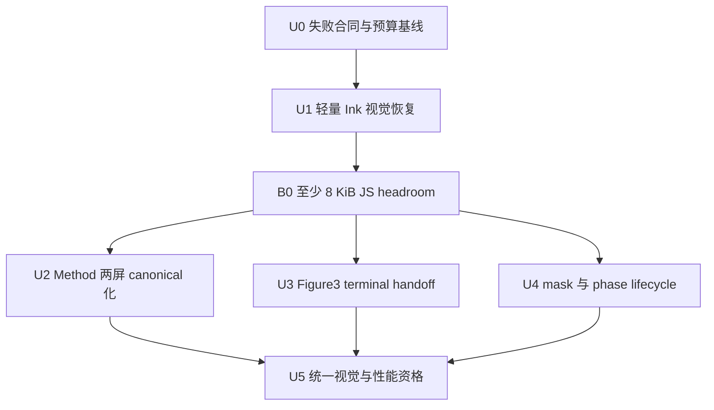

# fix: Close R5 ink visual regressions and Method scene parity

## Overview

这是 007 实施后的快速闭环计划，集中修复四项新确认的视觉/信息架构回归，并收掉仍未关闭的 Figure3、Figure2 与 Hero 生命周期问题。修复必须同时满足两条硬约束：

1. 恢复 Main 的径向墨滴、水平双层侵蚀和方块粒子语言；
2. 不恢复旧 procedural FBM/hash 热路径，不新增 DOM 粒子、额外 effect canvas 或每帧分配。

本计划新建 008，不回写 006/007 的实施记录。当前工作树最后一次已知 total JS raw 为 `581,600 / 581,632 bytes`，只有 32 bytes 余量；实施必须先获得可用 headroom，禁止提高预算后再补功能。

## Problem Frame

当前实现通过 noise atlas 和 field specialization 降低了 Ink 成本，但发生了三类合同漂移：

- Hero 首屏由不规则径向墨滴退化为 CSS `circle()`；开发态还可能因重复 cleanup 后 `loseContext()` 只剩硬圆 fallback。
- 水平 Ink 被收敛为单一 ownership contour，测试甚至明确禁止 secondary gate，墨体和波浪层消失。
- 方块/点状粒子仍存在于 shader 文本，却因 LINEAR atlas 插值后再走高阈值而近乎不可见。

同时，Method 的 `method-upper` 与 `method-lower` 被错误合并为一屏；Figure3 terminal video 仍二值隐藏；Figure2 depth mask 仍在 endpoint remove/reapply；Hero phase barrier 没有 abort/timeout。

## Requirements Trace

- **R1 — Hero 径向 Ink：** Hero 首屏背景由不规则径向墨滴揭示；生产路径不得再用 `clip-path: circle(...)` 拥有 reveal。
- **R2 — 水平 Ink 层次：** 所有水平 Ink 至少具有主体墨层、主侵蚀前沿和相位错开的次级波浪；次级层不得创建第二 canvas 或第二 contour texture。
- **R3 — 轻量粒子：** 恢复 Main 的方块 spatter 与点状粒子密度/形态，但不恢复 procedural hash/FBM 循环，不增加网络资产或每帧 JS 粒子系统。
- **R4 — Method 两屏：** AOD 后先停留 Method 章节引导整屏，再以 fresh gesture 进入独立的 1–5 方法整屏，之后才进入 Figure2。
- **R5 — Endpoint 连续：** Figure3→Services 尾段无二值 video jump；Proof→Figure2 reverse 不 remove/reapply mask、不闪白；Hero phase boundary 有界且可取消。
- **R6 — 性能与预算：** Ink 仍保持一次 draw call、DPR cap 1、256×256 单 atlas、active RAF 零 program/texture allocation；total JS raw 不超过 581,632 bytes，最终至少保留 4 KiB headroom。
- **R7 — 验收真实性：** 性能样本只有在 shader active、粒子可见、双层边缘可见时才有效；renderer unavailable 或视觉降级不能产生假 green。

## Scope Boundaries

- 不修改或重新压缩任何 WebM/WebP；保留现有 Figure2 reverse 与 Crane flock 资产。
- 不改变已经确认的 Hero 900/1800ms、Pattern collapse+copy 同相、AOD alpha 36%、AOD reverse、Proof 三屏滚动和 Figure2/TTG/PH 1000ms dwell。
- 不添加 DOM 粒子、2D canvas 粒子循环、第二 Ink canvas、第二 noise atlas、WebCodecs bridge 或 poster fallback。
- 不把 Main 的完整重型 shader 原样搬回；Main 只作为视觉和粒子分布 authority。
- 不新增公开导航入口；`#method` 仍指向 Method 引导首屏，`method-bottom` 是 canonical 内部 hold。
- 不提高 JS、initial transfer、媒体、LCP、heap、GPU surface 或 memory budget。

## Context & Research

### Relevant Code and Patterns

- Main 径向/水平 Ink authority：`js/effects/ink-scene-transition.js`、`js/sections/hero.js`。
- 当前轻量 renderer：`app/src/vendor/ink-scene-transition.js`、`app/src/transitions/shared/sceneInk.ts`。
- 当前 ownership：`app/src/transitions/shared/inkField.ts`、`app/src/transitions/shared/horizontalInkContour.ts`、`app/src/transitions/shared/inkOwnership.ts`。
- Hero intro：`app/src/scenes/hero/index.tsx`、`app/src/transitions/shared/radialInkIntro.ts`。
- Method 与 canonical spine：`app/src/scenes/method-top/index.tsx`、`app/src/story/canonical-spine.ts`、`app/src/production/module-loaders.ts`。
- Endpoint lifecycle：`app/src/transitions/figure3-services/index.ts`、`app/src/scenes/figure3-animation/index.tsx`、`app/src/transitions/shared/depthThresholdMask.ts`、`app/src/transitions/hero-pattern/index.ts`。
- 前序决策与性能门禁：`docs/plans/2026-07-15-007-fix-r5-ink-frame-pacing-choreography-media-plan.md`。

仓库没有匹配的 `docs/brainstorms/*-requirements.md` 或 `docs/solutions/` 记录。本计划以用户确认的视觉要求、2026-07-10 HTML 中 `method-upper/method-lower` 结构、Main 实现和本轮代码 review 为依据。代码库已有直接实现模式，不需要外部研究。

## Key Technical Decisions

| 范围 | 决策 | 性能保护 | 明确不采用 |
|---|---|---|---|
| Hero intro | 复用现有 Hero intro canvas，在 radial 专用 program 中一次上传已解码 Hero 背景并由 Ink threshold 直接合成；完成后无差异交给 DOM 背景 | 仅 Hero intro 多一个 target texture；prewarm 一次上传，其他 Ink program 不包含该 sampler | CSS circle、逐帧 DOM mask、第二 canvas |
| 连续噪声 | 保留 256×256 RGBA atlas 与 LINEAR 连续采样 | module singleton、每 generation 一次 upload | 恢复 4–5 octave procedural FBM |
| 离散粒子 | 同一 atlas 使用 texel-center 离散采样；一个 RGBA texel 同时提供 seed、jitter、radius | 圆点属性一次 packed lookup；方块 spatter 最多再一次 lookup；只在 edge/spray envelope 内参与合成 | 第二 NEAREST texture、CPU 粒子数组、提高阈值隐藏粒子 |
| 水平双层 | 同一 contour RGBA sample 同时推导 primary/secondary rank，secondary 使用相位偏移和 erosion channel | 不新增 sampler、texture、canvas 或 draw call | 第二 ownership polygon、第二 WebGL pass |
| Method | 新增 `method-bottom` canonical hold 与 600ms `method-top-method-bottom` snap continuation segment | 只用 opacity/translate3d，不引入 Ink/WebGL | 继续在 intro 内嵌套滚动 1–5 |
| Endpoint | transition 持有 source layer；mask 拓扑保持稳定；phase barrier 有 timeout/abort | endpoint 只改变标量，不重新建 mask、seek 或 surface | endpoint 二值 hide、mask remove/reapply、无限等待 |

### 粒子轻量化冻结合同

- atlas 仍为单个 256×256 RGBA、约 256 KiB GPU 数据，不增加网络资源。
- 连续噪声可 LINEAR；方块和粒子 seed 必须采样 texel center，禁止让插值后的平均值进入 `0.975/0.985` 离散阈值。
- 方块 spatter 保留 Main 的离散阈值/密度语言；若性能不足，只能收窄 effect 的 edge/spray 计算窗口或减少重复 lookup，不能再次提高阈值把粒子隐藏掉。
- 点状粒子的 seed、二维 jitter、radius 从同一 RGBA lookup 解包；同一 fragment 的粒子属性不允许四次独立 atlas lookup。
- active progress 不生成粒子对象、不上传 atlas、不编译 shader、不读取 layout；保持一次 draw call。
- 粒子只在 ink edge 与向外 spray band 可见；shader 先计算 cheap envelope，再守卫 particle-specific atlas lookup，已完成区域和远离边界区域不得执行这组专用 lookup。
- DPR 上限保持 1；不以提高 DPR 恢复细节，也不以降低到模糊静态图制造性能 green。

## High-Level Technical Design

> 下图是用于评审的方向性说明，不是实现代码；执行者应以 Requirements 和各 Unit 的验收合同为准。

## Implementation Units

- [ ] **U0 — Characterization、错误合同替换与预算基线**

**Goal:** 在改变 production 行为前，把当前四项新回归和三个未关闭生命周期问题变成会失败的可观测合同，并冻结 fresh build 预算。

**Requirements:** R1–R7

**Dependencies:** none

**Files:**

- Modify: `app/src/vendor/ink-scene-transition.test.ts`
- Modify: `app/src/vendor/ink-scene-transition.lifecycle.test.ts`
- Modify: `app/src/transitions/shared/radialInkIntro.test.ts`
- Modify: `app/src/transitions/shared/horizontalInkContour.test.ts`
- Modify: `app/src/transitions/shared/inkField.test.ts`
- Modify: `app/src/scenes/method-top/copy.test.ts`
- Modify: `app/src/story/manifest.test.ts`
- Modify: `app/e2e/r4-ink-occlusion.spec.ts`
- Modify: `app/e2e/r5-performance.spec.ts`
- Modify: `app/scripts/verify-performance-budgets.mjs`

**Approach:**

- 删除“没有 secondary horizontal gate”“Method 不存在 method-bottom”“粒子字符串存在即等于视觉存在”等错误测试合同。
- focused browser probe 在固定 progress 读取 canvas alpha/RGB：验证 renderer active、边界非空、离散 particle cells 非零；上述前置失败时，frame pacing 结果标记 invalid，而不是 pass。
- 将 Hero radial Ink、horizontal Ink、Figure2 depth 从整段采样拆成独立窗口；Figure3 保留 final 500ms 独立窗口。
- fresh build 记录 initial/total/largest-lazy JS raw；以 581,632 bytes 为固定硬上限，不沿用旧报告数值冒充当前基线。

**Execution note:** Characterization-first；本 Unit 只建立失败 witness 和预算事实，不通过修改期望值把当前实现判绿，也不运行 Playwright 矩阵。

**Test scenarios:**

- Current Hero intro 使用 `circle()` 或 canvas unavailable 时，radial visual contract 失败。
- Current horizontal mid-progress 只有一个 alpha front 时，double-wave contract 失败。
- Current LINEAR 离散采样在高阈值下几乎没有 square cells 时，particle occupancy contract 失败。
- Current canonical spine 缺少 `method-bottom` 与 `method-top-method-bottom` 时，story contract 失败。
- Current Figure3 progress 0.96 触发 video 1→0、depth mask endpoint remove/reapply、Hero barrier 无 timeout 时，对应 lifecycle contract 失败。

**Verification:** 当前错误必须能被 deterministic unit/static witness 捕获；性能报告必须拒绝 renderer unavailable 的假样本。

- [ ] **U1 — 恢复轻量径向、水平双层和方块粒子**

**Goal:** 在单 atlas、单 canvas、单 draw call 架构内恢复 Ink 视觉语言，同时修复 Hero dev/StrictMode context 生命周期，并净回收 JS headroom。

**Requirements:** R1, R2, R3, R6, R7

**Dependencies:** U0

**Files:**

- Modify: `app/src/vendor/ink-scene-transition.js`
- Modify: `app/src/vendor/ink-scene-transition.d.ts`
- Modify: `app/src/vendor/ink-scene-transition.test.ts`
- Modify: `app/src/vendor/ink-scene-transition.lifecycle.test.ts`
- Modify: `app/src/transitions/shared/sceneInk.ts`
- Modify: `app/src/transitions/shared/sceneInk.lifecycle.test.ts`
- Modify: `app/src/transitions/shared/radialInkIntro.ts`
- Modify: `app/src/transitions/shared/radialInkIntro.test.ts`
- Modify: `app/src/transitions/shared/inkField.ts`
- Modify: `app/src/transitions/shared/inkField.test.ts`
- Modify: `app/src/transitions/shared/horizontalInkContour.ts`
- Modify: `app/src/transitions/shared/horizontalInkContour.test.ts`
- Modify: `app/src/transitions/shared/ink.ts`
- Modify: `app/src/transitions/shared/ink.test.ts`
- Modify: `app/src/scenes/hero/index.tsx`
- Modify: `app/src/styles.css`
- Test: `app/e2e/r4-g1.spec.ts`
- Test: `app/e2e/r4-ink-occlusion.spec.ts`
- Test: `app/e2e/r5-performance.spec.ts`

**Approach:**

- Hero intro radial program只在 prewarm 读取现有已解码背景 image，上传一个 target texture；canvas 直接输出被 Ink threshold 揭示的背景和墨边。DOM back 在 terminal presented frame 后接管，移除 `circle()` ownership。
- 普通 radial/horizontal/depth program 继续 field-specialized；Hero target sampler 不进入其他 program。
- normal destroy 删除 owned buffer/program/shader/texture，但不对可复用 canvas 无条件 `loseContext()`；重复 mount/cleanup/mount 必须重新获得 active renderer。永久 canvas removal 仍依赖 generation-safe resource cleanup。
- 同一 atlas 提供 LINEAR continuous noise 与 texel-center discrete cells。粒子 dot 使用一个 packed RGBA lookup；square spatter 使用独立 cell scale 的一个离散 lookup。
- horizontal primary/secondary 从同一个 contour RGBA sample 得出；默认 horizontal wave grade 恢复非零墨体，Star Map→AOD 以 Main 的约 0.64 body 强度为起点，其他水平 handoff 采用较轻统一 grade。最终常量可在不突破视觉/性能门禁的范围内微调。
- 把 roots、ownership surfaces 和 diagnostics identity 缓存到 run；active RAF 不创建新 Set，不重复写未变化 attributes。
- 通过压缩重复 shader helpers、合并 contour samples、删除 production 中不再被测试消费的双重 diagnostics 回收体积；禁止删视觉分支换 headroom。
- headroom 回收顺序冻结为：先删除 sceneInk/vendor 重复 diagnostics 与 dataset writes；再合并重复 contour/noise/particle sampling helper；再依据 fresh bundle report 消除跨 lazy chunk 的重复 Method copy/compatibility runtime。每一步都必须保留对应 unit witness，不从视觉分支、URL alias 或错误恢复路径取体积。

**Patterns to follow:**

- `js/effects/ink-scene-transition.js` 的方块 spatter、粒子窗口和水平墨体层次。
- `app/src/production/loader-ink-reveal.ts` 的 decoded image → WebGL texture readiness/cleanup 模式。
- `app/src/transitions/shared/sceneInk.ts` 的 generation ownership 与 fail-closed recovery。

**Test scenarios:**

- Happy path — Hero p=0.25/0.50/0.75 的 reveal edge 有噪声半径变化，computed clip 不含 `circle()`；p=1 canvas→DOM handoff 视觉无变化。
- Happy path — 水平 Ink 中段在多数采样列出现主前沿和错相次级 alpha peak，墨体不是单线；forward/reverse 形态镜像且 ownership 不泄露目标场景。
- Happy path — 方块 spatter 与圆点粒子在 edge/spray band 内均有非零可见样本，离散 cell 分布与 Main 阈值相符，远离边界区域接近零。
- Performance — prewarm 后 120 active frames 的 shader compile、texture allocation/upload、Set allocation 和 geometry read 增量为零；每帧 draw call 为 1。
- Lifecycle — 同一 Hero canvas 经 StrictMode 式 setup→cleanup→setup 后第二个 renderer active，canvas 非 0×0，不出现 shader compile warning。
- Error path — target texture或 shader 准备失败时进入既有 recovery/静态 Hero endpoint，不展示硬圆 fallback，也不把该样本计入性能 pass。
- Edge case — resize 只在 invalidation 后更新一次 viewport/texture mapping，不在每帧上传 target/noise texture。

**Verification:** 视觉 probe 和 isolated frame pacing 必须同时通过；任何通过删除粒子、关掉 renderer、降级成 circle/polygon 单线所得的性能结果均无效。

### B0 — JS headroom 硬门禁

U1 后 fresh production build 的 total JS raw 必须 `≤573,440 bytes`，即在固定 581,632-byte 上限下至少保留 8 KiB。未达到时停止进入 U2–U4，继续从重复 diagnostics、shader helper 和已废弃兼容 runtime 回收；禁止提高预算、删粒子或取消 Method 两屏。

- [ ] **U2 — Method 引导与 1–5 拆成两个 canonical holds**

**Goal:** 恢复 `method-upper` / `method-lower` 两屏信息架构，并保持正反向、阅读滚动和导航一致。

**Requirements:** R4, R6

**Dependencies:** B0

**Files:**

- Create: `app/src/scenes/method-bottom/index.tsx`
- Create: `app/src/scenes/method-bottom/copy.test.ts`
- Create: `app/src/transitions/method-top-method-bottom/index.ts`
- Create: `app/src/transitions/method-top-method-bottom/index.test.ts`
- Modify: `app/src/scenes/method-top/index.tsx`
- Modify: `app/src/scenes/method-top/copy.test.ts`
- Modify: `app/src/story/types.ts`
- Modify: `app/src/story/canonical-spine.ts`
- Modify: `app/src/story/manifest.ts`
- Modify: `app/src/story/manifest.test.ts`
- Modify: `app/src/story/inventory-schema.ts`
- Modify: `app/src/story/inventory-schema.test.ts`
- Modify: `app/src/production/module-loaders.ts`
- Modify: `app/src/production/module-loaders.test.ts`
- Modify: `app/src/production/navigation.ts`
- Modify: `app/src/production/navigation.test.ts`
- Modify: `app/src/production/reading-edge-latch.test.ts`
- Modify: `app/src/transitions/method-bottom-figure2/index.ts`
- Modify: `app/src/transitions/method-bottom-figure2/index.test.ts`
- Modify: `app/src/transitions/scene-identity.test.ts`
- Modify: `app/src/harness/r4/group2Manifest.ts`
- Modify: `app/src/harness/r4/Group2Harness.tsx`
- Modify: `app/src/styles.css`
- Test: `app/src/runtime/director.actor.test.ts`
- Test: `app/src/production/input-controller.test.ts`
- Test: `app/e2e/r4-g2.spec.ts`
- Test: `app/e2e/r5-matrix.spec.ts`

**Approach:**

- `method-top` 只保留标题、正文与“现场/章法”，成为无内部 list scroll 的独立 hold。
- `method-bottom` 单独承载 1–5，拥有一个 scene reading scrollport；桌面和移动端都由该 scrollport 处理内容溢出。
- 新增 `method-top-method-bottom` snap continuation segment，固定 600ms，使用轻量 opacity/translate3d 交接，不运行 Ink/WebGL；forward/reverse 都需要 fresh gesture，不能被上一手势尾流穿透。
- canonical spine 改为 `aod-animation → method-top → method-bottom → figure2-animation`；现有 `method-bottom-figure2` 的 from 改为真实 `method-bottom`。
- `#method` 继续导航到 `method-top`；`method-bottom` 不新增公共 hash，内部导航状态回写仍归属 `#method`。
- copy 常量只保留一个 authority，拆模块不得复制正文进两个 production chunks。
- forward 进入 `method-bottom` 时 scrollTop 归零；从 Figure2 reverse 进入时定位到 bottom edge；只有到达相应阅读边缘后的 fresh gesture 才能离开该 hold。
- `method-bottom` 保留语义化 `<ol>`、明确 aria label 和可聚焦 reading scrollport；wheel、touch、PageUp/PageDown、方向键和 Space 继续走既有 input/reading ownership，不另造键盘处理器。

**Test scenarios:**

- Happy path — AOD settle 后只看到 Method intro；下一次 fresh gesture 才进入 1–5；到 method-bottom 底部后的下一次 fresh gesture才开始 Figure2 handoff。
- Reverse — Figure2→method-bottom 落在 1–5 terminal reading position；下一次 reverse gesture 回到 Method intro，不跳过任一 hold。
- Reading — 窄屏时 1–5 可连续滚动，内部未到边缘时输入不触发 segment；到 top/bottom 后遵循 reading edge latch。
- Accessibility — 键盘可聚焦 1–5 reading scrollport，PageUp/PageDown、方向键与 Space 不跳过内容；scene handoff 后焦点仍由既有 Stage 管理，screen reader 只读一份有序列表。
- Navigation — `#method` 始终落到 intro；menu/hash 不直接落到 method-bottom，也不产生未知 hash。
- Reduced motion — 两屏仍分别成为 semantic hold，只缩短视觉交接，不合并输入边界。
- Static fallback — 无 JS 输出仍保持 Method intro 和 1–5 的正确文本顺序且无重复 copy。

**Verification:** forward/reverse 都必须完整经过两个 hold；r4-g2 不再依赖错误的 `method-top` 内嵌 list scrollport。

- [ ] **U3 — Figure3→Services terminal handoff 零跳变**

**Goal:** 删除尾段二值 video opacity，让 transition 成为唯一 source layer alpha owner，并保证 0.98→settle 视觉不变。

**Requirements:** R5, R6

**Dependencies:** B0

**Files:**

- Modify: `app/src/transitions/figure3-services/index.ts`
- Modify: `app/src/scenes/figure3-animation/index.tsx`
- Modify: `app/src/scenes/figure3-animation/progress.test.ts`
- Modify: `app/src/transitions/group4-transitions.test.ts`
- Test: `app/e2e/r4-g4.spec.ts`
- Test: `app/e2e/r5-performance.spec.ts`

**Approach:**

- Figure3 video 在 transition 全程保持 opacity 1 并持有 terminal presented frame；只有 source stage layer 在 0.90→0.98 平滑淡出。
- Services paper/copy 在 0.96 前达到最终视觉；0.98→1 只更新 ownership bookkeeping，不 seek、不改变可见 opacity。
- reverse 在 source layer 从 0 淡入前先准备 Figure3 terminal frame，避免空 video surface。

**Test scenarios:**

- progress 0.96、0.98、1 与 settled hold 的 video/source/target computed visual channels连续，video 不发生 1→0 二值跳变。
- terminal frame ready 后 progress 继续到 1 不增加 seek count。
- Reverse 在 terminal frame 未 ready 时保持 Services owner；ready 后才开始 Figure3 fade-in。
- final 500ms isolated sample 无连续两个 >50ms frame，且视觉 probe 在采样期间保持有效。

**Verification:** endpoint、settle 与 reverse 首帧均无闪断；transition 之外不再有第二个 source fade owner。

- [ ] **U4 — Figure2 stable mask lease 与 Hero 有界 phase barrier**

**Goal:** 修复 Proof reverse 白闪，并让 Hero motion/Ink phase boundary 在 WebKit、后台和 abort 场景下不会无限等待。

**Requirements:** R5, R6, R7

**Dependencies:** U1, B0

**Files:**

- Modify: `app/src/transitions/shared/depthThresholdMask.ts`
- Modify: `app/src/transitions/shared/depthThresholdMask.test.ts`
- Modify: `app/src/transitions/figure2-distance-expand/index.ts`
- Modify: `app/src/transitions/figure2-proof-chain.test.ts`
- Modify: `app/src/transitions/hero-pattern/index.ts`
- Modify: `app/src/transitions/hero-pattern/index.test.ts`
- Modify: `app/src/transitions/shared/ink.ts`
- Modify: `app/src/transitions/shared/ink.test.ts`
- Test: `app/e2e/r4-g2.spec.ts`
- Test: `app/e2e/r4-g1.spec.ts`
- Test: `app/e2e/r5-performance.spec.ts`

**Approach:**

- depth mask 从 commit 到 successor presented frame 始终挂载；fully visible 用 threshold/table endpoint 表达，不恢复原 mask styles。
- reverse start 的 1→0.999、1000ms dwell 与 direction swap 均只改标量；generation-safe dispose 在新 owner 已呈现后一次性恢复旧样式。
- Hero phase boundary 接收 run AbortSignal，并复用 media preparation timeout/recovery；active video 等待有界 rVFC，paused-ready video 使用有界 RAF confirmation。
- timeout/abort 不允许合并 motion 与 Ink 同帧继续；应停在已呈现 owner并进入既有 recovery。

**Test scenarios:**

- Figure2 forward/reverse 的 endpoint±epsilon 期间 mask-image identity不变，只更新 threshold；dispose 后才恢复原 style。
- Proof→Figure2 reverse 每帧至少有 retained ground 或 depth owner，近白 viewport witness 不越界。
- stale generation dispose 不移除新 run 的 mask。
- Hero boundary 在正常 rVFC、paused-ready、timeout、abort 四条路径都终止；timeout 不启动下一 phase，abort 无残留 RAF/rVFC。
- Reverse Hero 先完成 Ink retract 并呈现 terminal frame，再开始 900ms motion；两相没有同一 rendered sample 的同步推进。

**Verification:** Figure2 reverse 无 mask topology churn/白帧；Hero phase boundary 有明确最大等待时间与 recovery 结果。

- [ ] **U5 — 统一视觉、性能与 release qualification**

**Goal:** 一次性证明“视觉恢复”和“性能不回退”同时成立，避免分段反复跑浏览器矩阵。

**Requirements:** R1–R7

**Dependencies:** U2, U3, U4

**Files:**

- Modify: `app/e2e/r4-g1.spec.ts`
- Modify: `app/e2e/r4-g2.spec.ts`
- Modify: `app/e2e/r4-g4.spec.ts`
- Modify: `app/e2e/r4-ink-occlusion.spec.ts`
- Modify: `app/e2e/r5-performance.spec.ts`
- Modify: `app/e2e/r5-matrix.spec.ts`
- Create: `docs/react-refactor/reports/r5-transition-frame-pacing.md`
- Modify: `docs/plans/2026-07-15-008-fix-r5-ink-visual-method-closure-plan.md`

**Approach:**

- 实施期只运行对应 unit/static checks；所有生产修改完成后统一执行 lint、typecheck、full unit、production build、预算、legacy/media verification 和 diff integrity。
- 最后只执行一次 focused visual/performance browser run，再执行一次 default/release matrix；Playwright 仅因本轮关键视觉/性能验收使用。
- focused run 必须在 desktop Chromium、mobile Chromium 和 WebKit 上验证功能；GPU frame pacing 的 release 结论只接受记录了真实 hardware renderer 的 Chromium，软件 renderer 仅作诊断。
- HITL 对比 Main 视觉语言，不以完全像素相等为要求，但必须确认径向边界不规则、水平有墨体/双层波浪、方块粒子可见且不过量。

**Test scenarios:**

- Hero cold boot、StrictMode remount、reduced motion、WebGL failure recovery。
- Hero→Pattern、Pattern→Star Map 与水平 handoffs 的 forward/reverse pixel witness及 isolated pacing。
- Method intro→1–5→Figure2 的 desktop/mobile/WebKit fresh-input 与 reading edge flow。
- Figure3 final 500ms、Proof→Figure2 reverse、Hero phase timeout/abort。
- 重复 transition runs 后 shader/context/texture/mask/RAF/rVFC 数量回到基线，无 generation 泄漏。

**Verification:**

- Hero、Pattern radial 与 Figure2 depth isolated p95：desktop hardware Chromium ≤20ms；mobile Chromium ≤34ms；每条路径 >50ms frame ratio <1%，不得连续两个 >50ms。
- horizontal Ink 使用同一门限；视觉 probe 先通过后才统计性能。
- active RAF：1 draw call、0 compile、0 texture create/upload、0 per-frame Set/particle object allocation。
- final total JS raw `≤577,536 bytes`，至少保留 4 KiB headroom；硬上限仍为 581,632 bytes。
- runtime media、initial transfer、LCP、heap、GPU surface 与既有 budget 不上升；本轮不新增生产媒体。
- default/release matrix、关键 HITL、immutable candidate、memory qualification 与 rollback manifest 指向同一 clean source commit后，008 才能标记 complete。

## System-Wide Impact

- **Interaction graph:** Hero scene/image readiness → radial renderer → shared ownership；horizontal contour → shared shader；Method scene split → canonical spine/loader/Director；Figure3/Figure2/Hero → endpoint lifecycle。
- **Error propagation:** shader/target texture/phase preparation失败进入已有 recovery，不允许静默 circle/单线降级或继续下一 phase。
- **State lifecycle risks:** StrictMode 重复 setup、旧 generation dispose、mask lease跨 dwell、reading edge惯性尾流是主要风险。
- **API surface parity:** `SceneId` 已含 `method-bottom`，需要补齐 production loader、manifest、harness、navigation 与 transition contract；`SegmentId` 需新增 `method-top-method-bottom`。
- **Integration coverage:** unit tests不能证明 Ink 像素形态、真实 GPU pacing、VP9/DOM presented frame和触控板输入，必须由 focused browser/HITL 补齐。
- **Unchanged invariants:** one run/one effect canvas/one renderer generation；scene 持有媒体，transition 持有 handoff；Proof仍是一个 canonical scene；现有媒体资产和预算不变。

## Risks & Mitigations

| Risk | Mitigation |
|---|---|
| 粒子恢复后重新卡顿 | 单 atlas texel-center采样、packed RGBA 属性、edge-band gate、一次 draw；禁止 procedural loops/DOM particles；视觉 probe和 isolated pacing必须同一 run 通过 |
| 为双层水平 Ink 增加 sampler/pass | primary/secondary 复用同一个 contour RGBA sample，不新增 texture、canvas、uniform gate或 draw pass |
| Hero target texture造成重复下载或首帧 upload hitch | 只消费现有 decoded Hero image，prewarm 一次上传；不增加 URL/asset；intro开始前必须 ready |
| StrictMode 修复变成 WebGL 泄漏 | reusable canvas normal dispose删除全部 owned resources但不 lose context；generation/lifecycle test覆盖重复 mount与最终释放 |
| Method 新 hold 被惯性输入穿透 | top/bottom 都是 semantic hold并启用 fresh-input；method-bottom 内部滚动未到边缘时不触发 Director |
| stable mask lease延迟释放导致旧样式污染 | generation token + successor presented-frame gate；dispose只恢复创建时记录的 styles |
| 测试在 shader unavailable 时因帧率很好而假绿 | performance sample强制依赖 renderer active、非零 ink pixels、粒子与双层 visual witness |
| JS 再次触顶 | U1 后先过 8 KiB B0；最终至少保留 4 KiB；失败就停止，不提高 581,632-byte 上限 |

## Open Questions

### Resolved During Planning

- **粒子是否恢复旧 procedural hash？** 不恢复。使用同一 atlas 的离散 texel-center采样恢复分布，保持轻量。
- **水平双层是否需要第二 canvas/texture？** 不需要。两层从同一 contour sample派生。
- **Method 是否继续同屏内部滚动？** 不继续。intro和1–5成为两个 canonical holds。
- **Hero WebGL不可用时是否保留圆形 fallback？** 不保留。进入静态 endpoint/recovery，不能展示从未确认的圆形语言。

### Deferred to Implementation

- horizontal secondary phase offset、soft-band宽度与 body alpha 的最终常量：以 Main 中段 witness为起点，在固定视觉/性能门禁内微调，不得通过隐藏粒子或退回单线解决性能。
- 粒子像素 occupancy 的最终容差：U0 先从 Main authority和当前 viewport采样冻结测试范围；必须同时设最小可见值和最大过量值。
- Hero phase preparation 的精确 timeout值：复用现有 media preparing timeout量级，并由 WebKit/HITL 验证；不得无限等待或低到正常首帧误恢复。

## Rollback Boundaries

- U1 Ink、U2 Method、U3 Figure3、U4 lifecycle 分开提交和回滚。
- 回滚不得恢复 CSS circle、单线 horizontal、LINEAR高阈值粒子消失、Method合屏、Figure3 binary opacity或mask remove/reapply。
- 如果新 Ink未通过性能门禁，保留 U0 失败合同并回到 U1 优化 lookup/edge window；不得删除视觉断言、提高预算或将失败项目标为 skipped。
- Method回滚不影响 AOD alpha/reverse、Proof compound scene、Figure2 reverse媒体或三段terminal dwell。

## Completion Definition

008 只有在以下条件全部成立时才能标记 complete：

- Hero 首屏无 `circle()` ownership，径向 Ink与DOM handoff连续；StrictMode/dev renderer可用。
- 所有水平 Ink具有可见墨体、主侵蚀前沿和错相次级波浪。
- Main风格方块spatter与点状粒子可见，且三条 Ink isolated frame pacing不回退。
- Method完整经过 intro与1–5两个canonical holds，正反向和移动端reading均不连跳。
- Figure3 terminal、Proof→Figure2 reverse和Hero phase boundary通过endpoint/lifecycle门禁。
- total JS raw ≤577,536 bytes，其他预算不提高，也不新增生产媒体。
- 自动化、真实硬件Chromium性能、WebKit功能、macOS触控板和关键视觉HITL全部通过。
- immutable candidate、memory qualification、rollback manifest完成且引用同一clean source commit。

## Sources & References

- `docs/plans/2026-07-15-007-fix-r5-ink-frame-pacing-choreography-media-plan.md`
- `js/effects/ink-scene-transition.js`
- `js/sections/hero.js`
- `app/src/vendor/ink-scene-transition.js`
- `app/src/transitions/shared/inkField.ts`
- `app/src/transitions/shared/horizontalInkContour.ts`
- `app/src/scenes/method-top/index.tsx`
- `app/src/story/canonical-spine.ts`
- `app/src/transitions/figure3-services/index.ts`
- `app/src/transitions/shared/depthThresholdMask.ts`
