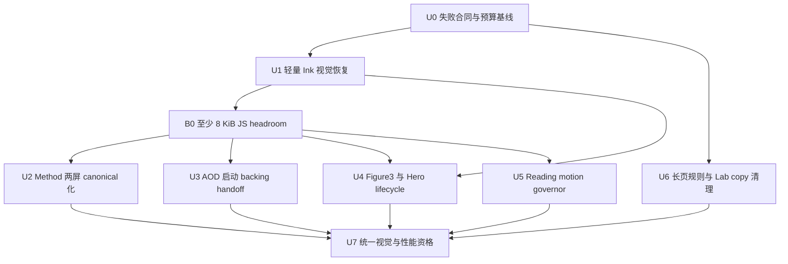

# fix: Close R5 ink, Method, AOD handoff, and reading parity

## Overview

这是对 007 与提交 `1d62d2e` 的复核后快速闭环计划，集中处理 Ink 视觉、Method 信息架构、AOD 启动闪帧、长阅读页滚动手感和版式清理，并收掉仍未关闭的 Figure3 与 Hero 生命周期问题。修复必须同时满足两条硬约束：

1. 恢复 Main 的径向墨滴、水平双层侵蚀和方块粒子语言；
2. 不恢复旧 procedural FBM/hash 热路径，不新增 DOM 粒子、额外 effect canvas 或每帧分配。

Figure2 Proof reverse 白闪已由 `1d62d2e` 的单一 Proof ownership surface、retained warm ground/arch 与原生 reverse media 闭环，且用户视觉复核通过；本计划删除该修复项，不再安排 `depthThresholdMask` 或 Figure2 ownership 重构。共享 Ink 的 Figure2 depth 性能仍作为防回退门禁，不代表白闪问题重新打开。

本计划继续更新 008，不回写 006/007 的实施记录。当前工作树最后一次已知 total JS raw 为 `581,600 / 581,632 bytes`，只有 32 bytes 余量；实施必须先获得可用 headroom，禁止提高预算后再补功能。

## Problem Frame

当前实现通过 noise atlas 和 field specialization 降低了 Ink 成本，但发生了三类合同漂移：

- Hero 首屏由不规则径向墨滴退化为 CSS `circle()`；开发态还可能因重复 cleanup 后 `loseContext()` 只剩硬圆 fallback。
- 水平 Ink 被收敛为单一 ownership contour，测试甚至明确禁止 secondary gate，墨体和波浪层消失。
- 方块/点状粒子仍存在于 shader 文本，却因 LINEAR atlas 插值后再走高阈值而近乎不可见。

同时还存在四类独立回归：

- Method 的 `method-upper` 与 `method-lower` 被错误合并为一屏；Figure3 terminal video 仍二值隐藏；Hero phase barrier 没有 abort/timeout。
- AOD→Method timeline 在构造时先采样 `p=0`：Method target 仍是 hidden，`renderAodExitProgress(0)` 却立即写入 `data-aod-exit-active=true` 与 alpha-composite 状态；对应 CSS 同帧把 AOD root/sticky/field/reveal backing 全部切为 transparent，因 receiver paper 尚未成为 backing owner，会短暂暴露 Stage 底色。这是确定的 ownership 顺序缺口，不是 AOD 视频 alpha 时长不足。
- 阅读场景不存在 native 与 synthetic 双滚动：`input-controller` 已 `preventDefault()`。真正问题是 `consumeReadingPixels()` 把 trackpad/wheel 的 normalized pixels 以 1:1 直接写入 `scrollTop`，物理手势的衰减尾流没有内容位移预算；edge latch 只管离场，不管页内速度，因此 Proof 一次轻划可吃完三屏，Lab/Services/Education 同样过快。
- Lab/Services/Education 的 wide/list/row 使用整宽水平 border 切分长页；Lab 还渲染无需求的 `FIELD CHECK / 06 SCENES` header 及其上下规则，造成滚动中的额外“分屏线”。

### 本轮复核结论

| 用户点位 | 结论 | 代码证据 | 计划处理 |
|---|---|---|---|
| AOD 动画启动闪一下 | **存在** | `sampleAodMethodTop(0)` 隐藏 target，随后 `renderAodExitProgress(0)` 激活透明 backing selector | U3 修正 `p=0` backing ownership |
| Figure2 Proof reverse 白闪 | **已关闭** | `1d62d2e` 引入单一 Proof ownership surface、retained ground/arch、native reverse media 与对应合同；用户视觉确认通过 | 从 requirements、implementation unit 与 completion gate 删除 |
| Proof/长页滚动过快 | **存在** | wheel/touch 已阻止 native default；`consumeReadingPixels()` 仍按 normalized pixels 1:1 写 `scrollTop`，无手势位移预算 | U5 增加 reading-only governor |
| Lab/Services/Education 分割线 | **存在** | 三组 wide/list/row selector 均声明 horizontal borders | U6 删除目标 rules，保留非目标边界 |
| Lab `FIELD CHECK / 06 SCENES` | **存在** | 两条 copy、screen-head JSX 与上下 border 都仍在 production | U6 从 DOM、copy authority 与 no-JS shell 一并删除 |

## Requirements Trace

- **R1 — Hero 径向 Ink：** Hero 首屏背景由不规则径向墨滴揭示；生产路径不得再用 `clip-path: circle(...)` 拥有 reveal。
- **R2 — 水平 Ink 层次：** 所有水平 Ink 至少具有主体墨层、主侵蚀前沿和相位错开的次级波浪；次级层不得创建第二 canvas 或第二 contour texture。
- **R3 — 轻量粒子：** 恢复 Main 的方块 spatter 与点状粒子密度/形态，但不恢复 procedural hash/FBM 循环，不增加网络资产或每帧 JS 粒子系统。
- **R4 — Method 两屏：** AOD 后先停留 Method 章节引导整屏，再以 fresh gesture 进入独立的 1–5 方法整屏，之后才进入 Figure2。
- **R5 — Endpoint 连续：** AOD→Method 在 `p=0` 已有 Method paper backing，AOD alpha source 在其上方启动且无白/黑闪；Figure3→Services 尾段无二值 video jump；Hero phase boundary 有界且可取消。
- **R6 — 阅读手感：** Proof、Lab、Services、Education 统一经过 reading-only motion governor；一次轻量 trackpad 手势不得跨越多屏，衰减尾流不得直接离场，持续输入仍能完整阅读长页。
- **R7 — 长页版式：** Lab/Services/Education 内部 horizontal rules 全部移除，以留白和字阶维持层级；Lab 不渲染、fallback 或预渲染 `FIELD CHECK` / `06 SCENES`，也不保留空 header 占位。
- **R8 — 性能与预算：** Ink 仍保持一次 draw call、DPR cap 1、256×256 单 atlas、active RAF 零 program/texture allocation；reading governor 不引入 smooth-scroll RAF 队列；total JS raw 不超过 581,632 bytes，最终至少保留 4 KiB headroom。
- **R9 — 验收真实性：** 性能样本只有在 shader active、粒子可见、双层边缘可见时才有效；AOD 首帧、reading 位移与长页规则必须有可观测 witness；renderer unavailable 或视觉降级不能产生假 green。

## Scope Boundaries

- 不修改或重新压缩任何 WebM/WebP；保留现有 Figure2 reverse 与 Crane flock 资产。
- 不改变已经确认的 Hero 900/1800ms、Pattern collapse+copy 同相、AOD alpha 36%、AOD reverse、Proof 三屏滚动和 Figure2/TTG/PH 1000ms dwell。
- 不添加 DOM 粒子、2D canvas 粒子循环、第二 Ink canvas、第二 noise atlas、WebCodecs bridge 或 poster fallback。
- 不把 Main 的完整重型 shader 原样搬回；Main 只作为视觉和粒子分布 authority。
- 不新增公开导航入口；`#method` 仍指向 Method 引导首屏，`method-bottom` 是 canonical 内部 hold。
- 不改写非 reading 场景的 charge/scrub 输入，不引入 Lenis、CSS smooth scrolling 或 scroll snap；键盘语义和 touch 直接跟手保持现有合同。
- 只移除 Lab/Services/Education 的内部水平规则；Proof、Method、导航、CTA、focus outline 与其他章节边界不在本轮清理范围。
- `FIELD CHECK` / `06 SCENES` 从 React、static fallback、copy baseline 与 no-JS shell 一并删除；immutable legacy tag/source 不回写。
- Figure2 白闪修复在 `1d62d2e` 已关闭；本轮不修改其 retained surface、reverse media 或 depth-mask ownership。若共享 Ink 改动造成回归，只回滚共享改动，不重新设计 Figure2。
- 不提高 JS、initial transfer、媒体、LCP、heap、GPU surface 或 memory budget。

## Context & Research

### Relevant Code and Patterns

- Main 径向/水平 Ink authority：`js/effects/ink-scene-transition.js`、`js/sections/hero.js`。
- 当前轻量 renderer：`app/src/vendor/ink-scene-transition.js`、`app/src/transitions/shared/sceneInk.ts`。
- 当前 ownership：`app/src/transitions/shared/inkField.ts`、`app/src/transitions/shared/horizontalInkContour.ts`、`app/src/transitions/shared/inkOwnership.ts`。
- Hero intro：`app/src/scenes/hero/index.tsx`、`app/src/transitions/shared/radialInkIntro.ts`。
- Method 与 canonical spine：`app/src/scenes/method-top/index.tsx`、`app/src/story/canonical-spine.ts`、`app/src/production/module-loaders.ts`。
- AOD backing handoff：`app/src/transitions/aod-method-top/index.ts`、`app/src/scenes/aod-animation/progress.ts`、`app/src/styles.css`。
- Reading ownership：`app/src/production/input-controller.ts`、`app/src/production/physical-gesture-tracker.ts`、`app/src/production/reading-handoff.ts`、`app/src/production/reading-edge-latch.ts`。
- 长页结构：`app/src/scenes/figure2-proof/index.tsx`、`app/src/scenes/lab/index.tsx`、`app/src/scenes/services/index.tsx`、`app/src/scenes/education/index.tsx`、`docs/react-refactor/inventory/copy-reference.json`。
- Endpoint lifecycle：`app/src/transitions/figure3-services/index.ts`、`app/src/scenes/figure3-animation/index.tsx`、`app/src/transitions/hero-pattern/index.ts`。
- Figure2 已关闭证据：提交 `1d62d2e` 中的 `app/src/stage/Stage.tsx`、`app/src/stage/Stage.retained-proof.test.tsx`、`app/src/transitions/figure2-distance-expand/index.ts` 与原生 reverse media 合同。
- 前序决策与性能门禁：`docs/plans/2026-07-15-007-fix-r5-ink-frame-pacing-choreography-media-plan.md`。

仓库没有匹配的 `docs/brainstorms/*-requirements.md` 或 `docs/solutions/` 记录。本计划以用户确认的视觉要求、2026-07-10 HTML 中 `method-upper/method-lower` 结构、Main 实现和本轮代码 review 为依据。代码库已有直接实现模式，不需要外部研究。

## Key Technical Decisions

| 范围 | 决策 | 性能保护 | 明确不采用 |
|---|---|---|---|
| Hero intro | 复用现有 Hero intro canvas，在 radial 专用 program 中一次上传已解码 Hero 背景并由 Ink threshold 直接合成；完成后无差异交给 DOM 背景 | 仅 Hero intro 多一个 target texture；prewarm 一次上传，其他 Ink program 不包含该 sampler | CSS circle、逐帧 DOM mask、第二 canvas |
| 连续噪声 | 保留 256×256 RGBA atlas 与 LINEAR 连续采样 | module singleton、每 generation 一次 upload | 恢复 4–5 octave procedural FBM |
| 离散粒子 | 同一 atlas 使用 texel-center 离散采样；一个 RGBA texel 同时提供 seed、jitter、radius | 圆点属性一次 packed lookup；方块 spatter 最多再一次 lookup；只在 edge/spray envelope 内参与合成 | 第二 NEAREST texture、CPU 粒子数组、提高阈值隐藏粒子 |
| 水平双层 | 同一 contour RGBA sample 同时推导 primary/secondary rank，secondary 使用相位偏移和 erosion channel | 不新增 sampler、texture、canvas 或 draw call | 第二 ownership polygon、第二 WebGL pass |
| Method | 新增 `method-bottom` canonical hold 与 600ms `method-top-method-bottom` snap continuation segment | 只用 opacity/translate3d，不引入 Ink/WebGL | 继续在 intro 内嵌套滚动 1–5 |
| AOD startup | Method paper backing 从 `p=0` 就在 AOD alpha source 下方 ready；Method copy 仍到 0.8 cue 才出现，AOD source 正反向均显式持有最高 transition z-order | 不增加 canvas、视频层或等待一帧的延迟；复用已挂载 target 与现有 alpha timeline | 先清空 AOD backing 再显示 target、缩短 alpha、用白色兜底层遮闪 |
| Reading pacing | 在 `consumeReadingPixels()` 前增加 reading-only、physical-gesture-aware motion governor；只把有效 pixels 交给既有 handoff/latch | 不创建平滑滚动动画；预算耗尽后吸收同一衰减尾流，不产生 residual/离场 charge | 全局缩放 input、CSS smooth/scroll snap、修改 transition charge threshold |
| Long-page rules | Lab/Services/Education 的 wide/list/row 横线整体移除，以 padding/gap、编号和字阶维持层级；Lab header 节点与两条 copy 从 authority 一并删除 | 删除 CSS/markup/copy 可回收体积；不增加装饰元素 | `display:none` 留死文案、只删桌面规则、误删 Proof/Method/focus 边界 |
| Endpoint | transition 持有 source layer；Figure3 terminal 只平滑改变 layer alpha；Hero phase barrier 有 timeout/abort | endpoint 只改变标量，不重复 seek 或重建 surface | endpoint 二值 hide、无限等待 |
| Figure2 | `1d62d2e` 的 Proof ownership wrapper + retained ground/arch + native reverse media 视为已验收冻结合同 | 不再增加本轮实现量；共享 Ink 只做性能防回退 | 继续在 008 重写 mask lease 或重复修复白闪 |

### 粒子轻量化冻结合同

- atlas 仍为单个 256×256 RGBA、约 256 KiB GPU 数据，不增加网络资源。
- 连续噪声可 LINEAR；方块和粒子 seed 必须采样 texel center，禁止让插值后的平均值进入 `0.975/0.985` 离散阈值。
- 方块 spatter 保留 Main 的离散阈值/密度语言；若性能不足，只能收窄 effect 的 edge/spray 计算窗口或减少重复 lookup，不能再次提高阈值把粒子隐藏掉。
- 点状粒子的 seed、二维 jitter、radius 从同一 RGBA lookup 解包；同一 fragment 的粒子属性不允许四次独立 atlas lookup。
- active progress 不生成粒子对象、不上传 atlas、不编译 shader、不读取 layout；保持一次 draw call。
- 粒子只在 ink edge 与向外 spray band 可见；shader 先计算 cheap envelope，再守卫 particle-specific atlas lookup，已完成区域和远离边界区域不得执行这组专用 lookup。
- DPR 上限保持 1；不以提高 DPR 恢复细节，也不以降低到模糊静态图制造性能 green。

## High-Level Technical Design

> 下图是用于评审的方向性说明，不是实现代码；执行者应以 Requirements 和各 Unit 的验收合同为准。

## Implementation Units

- [ ] **U0 — Characterization、错误合同替换与预算基线**

**Goal:** 在改变 production 行为前，把当前 Ink、Method、AOD、reading、长页版式与未关闭 lifecycle 问题变成会失败的可观测合同，并冻结 fresh build 预算。

**Requirements:** R1–R9

**Dependencies:** none

**Files:**

- Modify: `app/src/vendor/ink-scene-transition.test.ts`
- Modify: `app/src/vendor/ink-scene-transition.lifecycle.test.ts`
- Modify: `app/src/transitions/shared/radialInkIntro.test.ts`
- Modify: `app/src/transitions/shared/horizontalInkContour.test.ts`
- Modify: `app/src/transitions/shared/inkField.test.ts`
- Modify: `app/src/scenes/method-top/copy.test.ts`
- Modify: `app/src/story/manifest.test.ts`
- Modify: `app/src/transitions/aod-method-top/index.test.ts`
- Modify: `app/src/scenes/aod-animation/progress.test.ts`
- Modify: `app/src/production/input-controller.test.ts`
- Modify: `app/src/production/reading-handoff.test.ts`
- Modify: `app/src/scenes/group4-scenes.test.ts`
- Modify: `app/src/scenes/group5-scenes.test.ts`
- Modify: `app/src/scenes/group6-scenes.test.ts`
- Modify: `app/e2e/r4-ink-occlusion.spec.ts`
- Modify: `app/e2e/r5-production.spec.ts`
- Modify: `app/e2e/r5-performance.spec.ts`
- Modify: `app/scripts/verify-performance-budgets.mjs`

**Approach:**

- 删除“没有 secondary horizontal gate”“Method 不存在 method-bottom”“粒子字符串存在即等于视觉存在”等错误测试合同。
- focused browser probe 在固定 progress 读取 canvas alpha/RGB：验证 renderer active、边界非空、离散 particle cells 非零；上述前置失败时，frame pacing 结果标记 invalid，而不是 pass。
- 将 Hero radial Ink、horizontal Ink、Figure2 depth 从整段采样拆成独立窗口；Figure3 保留 final 500ms 独立窗口。
- AOD forward timeline 的 `p=0` characterization 必须同时记录 source/target visibility、source/target z-order、`data-aod-exit-active`、alpha-composite 与四层 backing computed background；当前“target hidden + source transparent”的组合必须失败。
- Reading characterization 使用同一组可重复 wheel burst（起势、峰值、双衰减尾流）分别喂给 Proof、Lab、Services、Education，记录 raw pixels、effective content pixels、最终 `scrollTop` 与 scene cursor；当前 1:1 消费和多屏跳跃必须失败。
- 静态结构检查冻结需删除的 selector 与 copy：三类长页的 wide/list/row horizontal borders，以及 Lab header node、`FIELD CHECK`、`06 SCENES`；只改测试期望不得判绿。
- fresh build 记录 initial/total/largest-lazy JS raw；以 581,632 bytes 为固定硬上限，不沿用旧报告数值冒充当前基线。

**Execution note:** Characterization-first；本 Unit 只建立失败 witness 和预算事实，不通过修改期望值把当前实现判绿，也不运行 Playwright 矩阵。

**Test scenarios:**

- Current Hero intro 使用 `circle()` 或 canvas unavailable 时，radial visual contract 失败。
- Current horizontal mid-progress 只有一个 alpha front 时，double-wave contract 失败。
- Current LINEAR 离散采样在高阈值下几乎没有 square cells 时，particle occupancy contract 失败。
- Current canonical spine 缺少 `method-bottom` 与 `method-top-method-bottom` 时，story contract 失败。
- Current AOD forward `p=0` 在 receiver hidden 时清空 source backing，首帧 ownership contract 失败；reverse endpoint 合同仍保持 green。
- Current Proof 的一组 decaying wheel burst 能跨过两个以上 100svh panels，或 Lab/Services/Education 同一手势直接到 edge 时，reading pacing contract 失败。
- Current Lab/Services/Education 任一目标 horizontal rule 仍存在，或 static/no-JS copy 仍包含 `FIELD CHECK` / `06 SCENES` 时，版式合同失败。
- Current Figure3 progress 0.96 触发 video 1→0、Hero barrier 无 timeout 时，对应 lifecycle contract 失败。

**Verification:** 当前错误必须能被 deterministic unit/static witness 捕获；性能报告必须拒绝 renderer unavailable 的假样本。

- [ ] **U1 — 恢复轻量径向、水平双层和方块粒子**

**Goal:** 在单 atlas、单 canvas、单 draw call 架构内恢复 Ink 视觉语言，同时修复 Hero dev/StrictMode context 生命周期，并净回收 JS headroom。

**Requirements:** R1, R2, R3, R8, R9

**Dependencies:** U0

**Files:**

- Modify: `app/src/vendor/ink-scene-transition.js`
- Modify: `app/src/vendor/ink-scene-transition.d.ts`
- Modify: `app/src/vendor/ink-scene-transition.test.ts`
- Modify: `app/src/vendor/ink-scene-transition.lifecycle.test.ts`
- Modify: `app/src/transitions/shared/sceneInk.ts`
- Modify: `app/src/transitions/shared/sceneInk.lifecycle.test.ts`
- Modify: `app/src/transitions/shared/radialInkIntro.ts`
- Modify: `app/src/transitions/shared/radialInkIntro.test.ts`
- Modify: `app/src/transitions/shared/inkField.ts`
- Modify: `app/src/transitions/shared/inkField.test.ts`
- Modify: `app/src/transitions/shared/horizontalInkContour.ts`
- Modify: `app/src/transitions/shared/horizontalInkContour.test.ts`
- Modify: `app/src/transitions/shared/ink.ts`
- Modify: `app/src/transitions/shared/ink.test.ts`
- Modify: `app/src/scenes/hero/index.tsx`
- Modify: `app/src/styles.css`
- Test: `app/e2e/r4-g1.spec.ts`
- Test: `app/e2e/r4-ink-occlusion.spec.ts`
- Test: `app/e2e/r5-performance.spec.ts`

**Approach:**

- Hero intro radial program只在 prewarm 读取现有已解码背景 image，上传一个 target texture；canvas 直接输出被 Ink threshold 揭示的背景和墨边。DOM back 在 terminal presented frame 后接管，移除 `circle()` ownership。
- 普通 radial/horizontal/depth program 继续 field-specialized；Hero target sampler 不进入其他 program。
- normal destroy 删除 owned buffer/program/shader/texture，但不对可复用 canvas 无条件 `loseContext()`；重复 mount/cleanup/mount 必须重新获得 active renderer。永久 canvas removal 仍依赖 generation-safe resource cleanup。
- 同一 atlas 提供 LINEAR continuous noise 与 texel-center discrete cells。粒子 dot 使用一个 packed RGBA lookup；square spatter 使用独立 cell scale 的一个离散 lookup。
- horizontal primary/secondary 从同一个 contour RGBA sample 得出；默认 horizontal wave grade 恢复非零墨体，Star Map→AOD 以 Main 的约 0.64 body 强度为起点，其他水平 handoff 采用较轻统一 grade。最终常量可在不突破视觉/性能门禁的范围内微调。
- 把 roots、ownership surfaces 和 diagnostics identity 缓存到 run；active RAF 不创建新 Set，不重复写未变化 attributes。
- 通过压缩重复 shader helpers、合并 contour samples、删除 production 中不再被测试消费的双重 diagnostics 回收体积；禁止删视觉分支换 headroom。
- headroom 回收顺序冻结为：先删除 sceneInk/vendor 重复 diagnostics 与 dataset writes；再合并重复 contour/noise/particle sampling helper；再依据 fresh bundle report 消除跨 lazy chunk 的重复 Method copy/compatibility runtime。每一步都必须保留对应 unit witness，不从视觉分支、URL alias 或错误恢复路径取体积。

**Patterns to follow:**

- `js/effects/ink-scene-transition.js` 的方块 spatter、粒子窗口和水平墨体层次。
- `app/src/production/loader-ink-reveal.ts` 的 decoded image → WebGL texture readiness/cleanup 模式。
- `app/src/transitions/shared/sceneInk.ts` 的 generation ownership 与 fail-closed recovery。

**Test scenarios:**

- Happy path — Hero p=0.25/0.50/0.75 的 reveal edge 有噪声半径变化，computed clip 不含 `circle()`；p=1 canvas→DOM handoff 视觉无变化。
- Happy path — 水平 Ink 中段在多数采样列出现主前沿和错相次级 alpha peak，墨体不是单线；forward/reverse 形态镜像且 ownership 不泄露目标场景。
- Happy path — 方块 spatter 与圆点粒子在 edge/spray band 内均有非零可见样本，离散 cell 分布与 Main 阈值相符，远离边界区域接近零。
- Performance — prewarm 后 120 active frames 的 shader compile、texture allocation/upload、Set allocation 和 geometry read 增量为零；每帧 draw call 为 1。
- Lifecycle — 同一 Hero canvas 经 StrictMode 式 setup→cleanup→setup 后第二个 renderer active，canvas 非 0×0，不出现 shader compile warning。
- Error path — target texture或 shader 准备失败时进入既有 recovery/静态 Hero endpoint，不展示硬圆 fallback，也不把该样本计入性能 pass。
- Edge case — resize 只在 invalidation 后更新一次 viewport/texture mapping，不在每帧上传 target/noise texture。

**Verification:** 视觉 probe 和 isolated frame pacing 必须同时通过；任何通过删除粒子、关掉 renderer、降级成 circle/polygon 单线所得的性能结果均无效。

### B0 — JS headroom 硬门禁

U1 后 fresh production build 的 total JS raw 必须 `≤573,440 bytes`，即在固定 581,632-byte 上限下至少保留 8 KiB。未达到时停止进入新增 runtime 的 U2–U5，继续从重复 diagnostics、shader helper 和已废弃兼容 runtime 回收；净删除代码的 U6 可先落地并计入 headroom。禁止提高预算、删粒子、取消 Method 两屏或跳过 reading/AOD 修复。

- [ ] **U2 — Method 引导与 1–5 拆成两个 canonical holds**

**Goal:** 恢复 `method-upper` / `method-lower` 两屏信息架构，并保持正反向、阅读滚动和导航一致。

**Requirements:** R4, R8

**Dependencies:** B0

**Files:**

- Create: `app/src/scenes/method-bottom/index.tsx`
- Create: `app/src/scenes/method-bottom/copy.test.ts`
- Create: `app/src/transitions/method-top-method-bottom/index.ts`
- Create: `app/src/transitions/method-top-method-bottom/index.test.ts`
- Modify: `app/src/scenes/method-top/index.tsx`
- Modify: `app/src/scenes/method-top/copy.test.ts`
- Modify: `app/src/story/types.ts`
- Modify: `app/src/story/canonical-spine.ts`
- Modify: `app/src/story/manifest.ts`
- Modify: `app/src/story/manifest.test.ts`
- Modify: `app/src/story/inventory-schema.ts`
- Modify: `app/src/story/inventory-schema.test.ts`
- Modify: `app/src/production/module-loaders.ts`
- Modify: `app/src/production/module-loaders.test.ts`
- Modify: `app/src/production/navigation.ts`
- Modify: `app/src/production/navigation.test.ts`
- Modify: `app/src/production/reading-edge-latch.test.ts`
- Modify: `app/src/transitions/method-bottom-figure2/index.ts`
- Modify: `app/src/transitions/method-bottom-figure2/index.test.ts`
- Modify: `app/src/transitions/scene-identity.test.ts`
- Modify: `app/src/harness/r4/group2Manifest.ts`
- Modify: `app/src/harness/r4/Group2Harness.tsx`
- Modify: `app/src/styles.css`
- Test: `app/src/runtime/director.actor.test.ts`
- Test: `app/src/production/input-controller.test.ts`
- Test: `app/e2e/r4-g2.spec.ts`
- Test: `app/e2e/r5-matrix.spec.ts`

**Approach:**

- `method-top` 只保留标题、正文与“现场/章法”，成为无内部 list scroll 的独立 hold。
- `method-bottom` 单独承载 1–5，拥有一个 scene reading scrollport；桌面和移动端都由该 scrollport 处理内容溢出。
- 新增 `method-top-method-bottom` snap continuation segment，固定 600ms，使用轻量 opacity/translate3d 交接，不运行 Ink/WebGL；forward/reverse 都需要 fresh gesture，不能被上一手势尾流穿透。
- canonical spine 改为 `aod-animation → method-top → method-bottom → figure2-animation`；现有 `method-bottom-figure2` 的 from 改为真实 `method-bottom`。
- `#method` 继续导航到 `method-top`；`method-bottom` 不新增公共 hash，内部导航状态回写仍归属 `#method`。
- copy 常量只保留一个 authority，拆模块不得复制正文进两个 production chunks。
- forward 进入 `method-bottom` 时 scrollTop 归零；从 Figure2 reverse 进入时定位到 bottom edge；只有到达相应阅读边缘后的 fresh gesture 才能离开该 hold。
- `method-bottom` 保留语义化 `<ol>`、明确 aria label 和可聚焦 reading scrollport；wheel、touch、PageUp/PageDown、方向键和 Space 继续走既有 input/reading ownership，不另造键盘处理器。

**Test scenarios:**

- Happy path — AOD settle 后只看到 Method intro；下一次 fresh gesture 才进入 1–5；到 method-bottom 底部后的下一次 fresh gesture才开始 Figure2 handoff。
- Reverse — Figure2→method-bottom 落在 1–5 terminal reading position；下一次 reverse gesture 回到 Method intro，不跳过任一 hold。
- Reading — 窄屏时 1–5 可连续滚动，内部未到边缘时输入不触发 segment；到 top/bottom 后遵循 reading edge latch。
- Accessibility — 键盘可聚焦 1–5 reading scrollport，PageUp/PageDown、方向键与 Space 不跳过内容；scene handoff 后焦点仍由既有 Stage 管理，screen reader 只读一份有序列表。
- Navigation — `#method` 始终落到 intro；menu/hash 不直接落到 method-bottom，也不产生未知 hash。
- Reduced motion — 两屏仍分别成为 semantic hold，只缩短视觉交接，不合并输入边界。
- Static fallback — 无 JS 输出仍保持 Method intro 和 1–5 的正确文本顺序且无重复 copy。

**Verification:** forward/reverse 都必须完整经过两个 hold；r4-g2 不再依赖错误的 `method-top` 内嵌 list scrollport。

- [ ] **U3 — AOD→Method 启动 backing handoff 零闪帧**

**Goal:** 关闭 AOD 动画启动时的单帧 backing 空窗，同时保留 36% alpha 时长、正反向媒体映射与 0.8 Method copy cue。

**Requirements:** R5, R8, R9

**Dependencies:** B0

**Files:**

- Modify: `app/src/transitions/aod-method-top/index.ts`
- Modify: `app/src/transitions/aod-method-top/index.test.ts`
- Modify: `app/src/scenes/aod-animation/progress.test.ts`
- Test: `app/e2e/r3-pilot.spec.ts`
- Test: `app/e2e/r5-production.spec.ts`

**Approach:**

- 把 AOD alpha source 与 Method backing/copy 拆成三个独立 ownership channel：Method paper 在 timeline `p=0` 已 visible 但 inert；Method layout/copy 仍由现有 0.8 cue 控制；AOD source 在两种方向均由 transition elevation 显式置顶。
- 复用 `PilotProgressTimeline` 先 apply from/to visibility、后 render 的顺序：receiver backing ready 后，才允许 `data-aod-exit-active + data-aod-alpha-composite` 把 AOD backing 切透明。不得用额外 RAF、setTimeout 或一帧白色 overlay 掩盖顺序错误。
- `targetReady` 与 AOD presented frame preparation 仍是 build gate；冷启动、顺序进入与 reverse 都不得在缺 target paper 或 frame 的情况下进入 playing。
- Alpha source mapping、`AOD_TIMELINE_ALPHA_END = 0.36`、paper wash 与 video drive 不变；本 Unit 只修 backing ownership 和 z-order。

**Patterns to follow:**

- `app/src/transitions/shared/layerElevation.ts` 的 generation-safe elevation/restore。
- `app/src/transitions/figure3-services/index.ts` 的 target backing 与 copy channel 分离方式。

**Test scenarios:**

- Happy path — forward build 完成后的 `p=0`：AOD 与 Method layer 均 visible/inert，AOD z-order 高于 Method，Method entrance copy 为 0，四个 AOD backing 切透明后下方仍是 Method paper。
- Boundary — `p=0`、最小 epsilon、`p=0.36`、`p=0.8` 与 settle：不存在 source transparent + receiver hidden 的组合；copy 只在 0.8 激活，alpha 时长没有缩短。
- Reverse — Method→AOD 从 prepared terminal frame 开始，AOD elevation 恢复一次；完成、dispose、hold 三个状态无 z-index 或 transparent backing 残留。
- Reduced motion — 仍先建立 receiver paper，再原子落 endpoint；不会因 duration=0 重现空窗。
- Integration — 从 AOD hold 发出首个 forward 输入后，首批 presented frames 不出现 Stage `#151815`、browser white 或整屏 luminance spike；AOD alpha pixels 下始终可采样到 Method paper。

**Verification:** AOD 启动闪帧由 deterministic ownership contract 与 focused pixel witness 同时关闭，且 alpha/reverse 既有测试保持不变。

- [ ] **U4 — Figure3 terminal handoff 与 Hero 有界 phase barrier**

**Goal:** 删除 Figure3 尾段二值 video opacity，并让 Hero motion/Ink phase boundary 在 WebKit、后台和 abort 场景下不会无限等待。

**Requirements:** R5, R8, R9

**Dependencies:** U1, B0

**Files:**

- Modify: `app/src/transitions/figure3-services/index.ts`
- Modify: `app/src/scenes/figure3-animation/index.tsx`
- Modify: `app/src/scenes/figure3-animation/progress.test.ts`
- Modify: `app/src/transitions/group4-transitions.test.ts`
- Modify: `app/src/transitions/hero-pattern/index.ts`
- Modify: `app/src/transitions/hero-pattern/index.test.ts`
- Modify: `app/src/transitions/shared/ink.ts`
- Modify: `app/src/transitions/shared/ink.test.ts`
- Test: `app/e2e/r4-g1.spec.ts`
- Test: `app/e2e/r4-g4.spec.ts`
- Test: `app/e2e/r5-performance.spec.ts`

**Approach:**

- Figure3 video 在 transition 全程保持 opacity 1 并持有 terminal presented frame；只有 source stage layer 在 0.90→0.98 平滑淡出。
- Services paper/copy 在 0.96 前达到最终视觉；0.98→1 只更新 ownership bookkeeping，不 seek、不改变可见 opacity。reverse 在 source layer 淡入前先准备 Figure3 terminal frame。
- Hero phase boundary 接收 run AbortSignal，并复用 media preparation timeout/recovery；active video 等待有界 rVFC，paused-ready video 使用有界 RAF confirmation。
- timeout/abort 不允许合并 motion 与 Ink 同帧继续；应停在已呈现 owner并进入既有 recovery。

**Test scenarios:**

- Figure3 progress 0.96、0.98、1 与 settled hold 的 video/source/target computed channels 连续，video 不发生 1→0 二值跳变。
- Figure3 terminal frame ready 后 progress 继续到 1 不增加 seek count；reverse frame 未 ready 时仍由 Services 持有画面。
- Hero boundary 在正常 rVFC、paused-ready、timeout、abort 四条路径都终止；timeout 不启动下一 phase，abort 无残留 RAF/rVFC。
- Reverse Hero 先完成 Ink retract 并呈现 terminal frame，再开始 900ms motion；两相没有同一 rendered sample 的同步推进。
- Figure3 final 500ms isolated sample 无连续两个 >50ms frame，且视觉 probe 在采样期间保持有效。

**Verification:** Figure3 endpoint/settle 与 reverse 首帧无闪断；Hero phase boundary 有明确最大等待时间与 recovery 结果。

- [ ] **U5 — Reading-only motion governor 与边缘交接**

**Goal:** 降低 Proof、Lab、Services、Education 的页内滚动位移，阻止一个 trackpad 衰减尾流跨多屏或直接离场，同时保持持续输入、touch、键盘和 reverse reading entry 可用。

**Requirements:** R6, R8, R9

**Dependencies:** B0

**Files:**

- Create: `app/src/production/reading-motion-governor.ts`
- Create: `app/src/production/reading-motion-governor.test.ts`
- Modify: `app/src/production/input-controller.ts`
- Modify: `app/src/production/input-controller.test.ts`
- Test: `app/src/production/reading-handoff.test.ts`
- Modify: `app/src/production/physical-gesture-tracker.test.ts`
- Modify: `app/src/production/reading-edge-latch.test.ts`
- Test: `app/e2e/r4-g3.spec.ts`
- Test: `app/e2e/r4-g5.spec.ts`
- Test: `app/e2e/r4-g6.spec.ts`
- Test: `app/e2e/r5-production.spec.ts`
- Test: `app/e2e/r5-matrix.spec.ts`

**Approach:**

- Governor 只在 Director 处于当前 reading hold 且已找到 `readingScrollport()` 时介入；非 reading 的 snap/scrub/charge 继续消费原始 normalized delta。
- 复用 `physical-gesture-tracker` 的 new-gesture、方向反转、touch lifecycle 与 scope reset。Wheel/trackpad pixels 先经过非线性阻尼与单手势内容位移预算，再交给 stateless `consumeReadingPixels()`；touch 保持手指位移直接跟随，key 保持现有 0.1 viewport semantic step。
- 验收预算冻结为：代表性轻划 burst 的有效位移在 0.35–0.65 viewport；任一只衰减、不再加力的 wheel burst 总位移 `<0.95 viewport`，不得从 Proof opening 越过 cards 直达 closing。持续加力/新手势必须继续推进，不得形成永久“黏住”。
- 当 reading 位移预算耗尽时，吸收该物理手势剩余 tail：不得把被裁掉的 raw pixels 当成 `residualPixels`，不得 arm/fire edge latch，也不得送入 Director charge。下一次明确 new gesture 才恢复预算。
- 到达真实 top/bottom 后继续沿用现有 edge latch：到边的那次手势被吸收，下一次 fresh outward gesture 才离场。禁止 CSS smooth、scroll snap 或跨帧动画队列。

**Patterns to follow:**

- `app/src/production/gesture-intent-gate.ts` 的 scope/direction/reset 合同。
- `app/src/production/reading-edge-latch.ts` 的 arrival-tail 与 fresh-gesture 语义。

**Test scenarios:**

- Happy path — 900px viewport 的 Proof opening 输入代表性轻划 burst，`scrollTop` 单调增加但小于 585px；同一衰减 tail 结束时小于 855px且仍未进入 closing。
- Continuation — 第二个 fresh wheel gesture 或明确 reacceleration 继续滚动；三屏可完整到达，但至少需要分离的有效输入，不丢事件也不反向抖动。
- Long pages — Lab、Services、Education 使用同一 burst 都只前进受控距离；无显式 nested scrollport 的 Services 仍由 Stage reading root 正确接管。
- Edge case — 手势中途到达 bottom 时只定位到 edge并吸收余量；同一 momentum tail 不进入下一 scene，下一次 fresh outward gesture只触发一次 `CHARGE_FIRED`。
- Reverse — 从下一 scene reverse 进入 reading bottom 后，arrival tail 被吸收；fresh upward gesture先滚内容，不跳过整个长页。
- Input parity — touchmove 与手指距离保持 1:1，touchend 清预算；Arrow/Page/Space 保持 0.1 viewport，editable target 和 modifier key仍不接管。
- Lifecycle — seek、scope change、viewport resize、direction reversal、dispose 都清除旧预算；旧 scene 的 tail 不能污染新 scene。

**Verification:** Proof 不再“一划三屏”，三类长页手感一致；reading edge 与 non-reading transition 输入合同不回退。

- [ ] **U6 — Lab/Services/Education horizontal rules 与 Lab header 清理**

**Goal:** 删除三类长阅读页内部的屏幕/条目分割线，并从所有生产 copy surfaces 删除 Lab 的 `FIELD CHECK / 06 SCENES` 块。

**Requirements:** R7, R8, R9

**Dependencies:** U0

**Files:**

- Modify: `app/src/scenes/lab/index.tsx`
- Modify: `app/src/styles.css`
- Modify: `docs/react-refactor/inventory/copy-reference.json`
- Modify: `app/src/scenes/group4-scenes.test.ts`
- Modify: `app/src/scenes/group5-scenes.test.ts`
- Modify: `app/src/scenes/group6-scenes.test.ts`
- Modify: `app/src/story/copy-baseline.test.ts`
- Modify: `app/src/production/static-shell.test.ts`
- Test: `app/e2e/r4-g4.spec.ts`
- Test: `app/e2e/r4-g5.spec.ts`
- Test: `app/e2e/r4-g6.spec.ts`

**Approach:**

- 删除 Lab `.r4-lab__wide`、`.r4-lab__screen`、`.r4-lab__row` 的水平 border；删除 Services list top/row bottom；删除 Education wide top/bottom、program top/row bottom。只用既有 padding、gap、编号、字重和色阶维持可扫读层级。
- 从 Lab JSX 删除整个 screen-head 节点，不保留 `display:none`、空壳高度或 aria-hidden 文案；同步删除相关 CSS。
- 从 `LAB_COPY` 与 static fallback 移除两条 copy并重建 row 索引映射，避免错位；`copy-reference.json` 记录用户批准的 R5 copy delta，no-JS shell 不再输出这两条文本。immutable legacy source/hash 仅保留历史 provenance，不回写旧页面。
- 不删除 Proof、Method、nav/CTA/focus outline 或其他章节的 rule；窄屏 media queries 不得重新引入被删 border。

**Test scenarios:**

- Structure — Lab render markup 中没有 `.r4-lab__screen-head`、`FIELD CHECK` 或 `06 SCENES`，六个业务 row 的 index/title/body仍一一对应。
- Copy parity — Lab React static fallback、inventory normalized text 与 no-JS shell 都不含两条删除文案，其余 Lab copy 顺序逐字一致。
- CSS — 目标 long-page selectors 在 desktop/mobile computed style 的 border-top/bottom width 均为 0；Proof、Method focus outline 与非目标章节规则保持原值。
- Layout — 删除规则/header 后没有遗留 14px header padding、空白占位或内容重叠；三页首屏、列表中段、末屏仍由 spacing 与字阶清晰分组。
- Integration — desktop、mobile Chromium 与 WebKit 滚过每个 major boundary 时不出现横向分割线，也不因 border removal 改变 reading maxScrollTop 到错误 edge。

**Verification:** 三类长页内部无水平分割线；Lab 两条无需求文案在 DOM、fallback、build shell 与可访问树中均不存在。

- [ ] **U7 — 统一视觉、交互、性能与 release qualification**

**Goal:** 一次性证明“视觉恢复、AOD 无闪、reading 降速、长页清理”和“性能不回退”同时成立，避免分段反复跑浏览器矩阵。

**Requirements:** R1–R9

**Dependencies:** U2, U3, U4, U5, U6

**Files:**

- Modify: `app/e2e/r3-pilot.spec.ts`
- Modify: `app/e2e/r4-g1.spec.ts`
- Modify: `app/e2e/r4-g2.spec.ts`
- Modify: `app/e2e/r4-g3.spec.ts`
- Modify: `app/e2e/r4-g4.spec.ts`
- Modify: `app/e2e/r4-g5.spec.ts`
- Modify: `app/e2e/r4-g6.spec.ts`
- Modify: `app/e2e/r4-ink-occlusion.spec.ts`
- Modify: `app/e2e/r5-production.spec.ts`
- Modify: `app/e2e/r5-performance.spec.ts`
- Modify: `app/e2e/r5-matrix.spec.ts`
- Create: `docs/react-refactor/reports/r5-transition-frame-pacing.md`
- Modify: `docs/plans/2026-07-15-008-fix-r5-ink-visual-method-closure-plan.md`

**Approach:**

- 实施期只运行对应 unit/static checks；所有 production 修改完成后统一执行 lint、typecheck、full unit、production build、预算、legacy/media verification 和 diff integrity。
- 最后只执行一次 focused visual/interaction/performance browser run，再执行一次 default/release matrix；Playwright 仅因本轮关键视觉、AOD 首帧、reading 手感和性能验收使用。
- focused run 必须在 desktop Chromium、mobile Chromium 和 WebKit 上验证功能；GPU frame pacing 的 release 结论只接受记录了真实 hardware renderer 的 Chromium，软件 renderer 仅作诊断。
- macOS 触控板 HITL 使用与自动化相同的 burst/位移记录，确认轻划不跨屏、持续手势不黏滞；视觉 HITL 对比 Main，确认径向边界、水平墨体/双层波浪与粒子密度。

**Test scenarios:**

- Hero cold boot、StrictMode remount、reduced motion、WebGL failure recovery。
- Hero→Pattern、Pattern→Star Map、Figure2 depth 与水平 handoffs 的 forward/reverse pixel witness及 isolated pacing。
- AOD→Method cold/warm/reduced-motion 的首批 presented frames、36% alpha、reverse 和 settle。
- Method intro→1–5→Figure2 的 desktop/mobile/WebKit fresh-input 与 reading edge flow。
- Proof、Lab、Services、Education 的 light burst、decaying tail、fresh continuation、reverse entry 与 boundary rule/copy absence。
- Figure3 final 500ms、Hero phase timeout/abort；重复 transition runs 后 shader/context/texture/RAF/rVFC 与 reading governor state 回到基线。

**Verification:**

- Hero、Pattern radial 与 Figure2 depth isolated p95：desktop hardware Chromium ≤20ms；mobile Chromium ≤34ms；每条路径 >50ms frame ratio <1%，不得连续两个 >50ms。
- horizontal Ink 使用同一门限；视觉 probe 先通过后才统计性能。
- active Ink RAF：1 draw call、0 compile、0 texture create/upload、0 per-frame Set/particle object allocation；reading hold 不新增持续 RAF。
- AOD first-frame backing witness、reading gesture displacement witness 与 long-page border/copy witness全部有效，不能以跳过、reduced-only 或 synthetic endpoint 冒充。
- final total JS raw `≤577,536 bytes`，至少保留 4 KiB headroom；硬上限仍为 581,632 bytes。
- runtime media、initial transfer、LCP、heap、GPU surface 与既有 budget 不上升；本轮不新增生产媒体。
- default/release matrix、关键 HITL、immutable candidate、memory qualification 与 rollback manifest 指向同一 clean source commit后，008 才能标记 complete。

## System-Wide Impact

- **Interaction graph:** Hero scene/image readiness → radial renderer → shared ownership；AOD alpha source → Method paper backing → copy cue；physical gesture tracker → reading governor → reading handoff → edge latch → Director；Method scene split → canonical spine/loader/Director；Figure3/Hero → endpoint lifecycle；long-page copy baseline → React fallback/no-JS shell。
- **Error propagation:** shader/target texture/phase preparation失败进入已有 recovery；AOD target backing未 ready 不得进入 playing；reading governor预算耗尽只吸收当前 tail，不伪造 residual 或 error；copy baseline偏差由 static/build contract直接失败。
- **State lifecycle risks:** StrictMode 重复 setup、旧 generation dispose、AOD elevation restore、reading budget跨 scene 泄漏、edge惯性尾流和 viewport变化是主要风险。
- **API surface parity:** `SceneId` 已含 `method-bottom`，需要补齐 production loader、manifest、harness、navigation 与 transition contract；`SegmentId` 需新增 `method-top-method-bottom`。Reading governor 是 production 内部状态，不进入 story public types。
- **Integration coverage:** unit tests不能证明 Ink像素形态、真实 GPU pacing、AOD presented first frame、macOS触控板物理包络或 WebKit computed border，必须由 focused browser/HITL补齐。
- **Unchanged invariants:** one run/one effect canvas/one renderer generation；scene持有媒体，transition持有handoff；Proof仍是一个canonical scene且既有白闪修复冻结；非reading输入、现有媒体资产和预算不变。

## Risks & Mitigations

| Risk | Mitigation |
|---|---|
| 粒子恢复后重新卡顿 | 单 atlas texel-center采样、packed RGBA 属性、edge-band gate、一次 draw；禁止 procedural loops/DOM particles；视觉 probe和 isolated pacing必须同一 run 通过 |
| 为双层水平 Ink 增加 sampler/pass | primary/secondary 复用同一个 contour RGBA sample，不新增 texture、canvas、uniform gate或 draw pass |
| Hero target texture造成重复下载或首帧 upload hitch | 只消费现有 decoded Hero image，prewarm 一次上传；不增加 URL/asset；intro开始前必须 ready |
| StrictMode 修复变成 WebGL 泄漏 | reusable canvas normal dispose删除全部 owned resources但不 lose context；generation/lifecycle test覆盖重复 mount与最终释放 |
| Method 新 hold 被惯性输入穿透 | top/bottom 都是 semantic hold并启用 fresh-input；method-bottom 内部滚动未到边缘时不触发 Director |
| AOD 修闪导致 Method 文案提前露出 | backing 与 copy cue 分通道；`p=0` receiver paper visible但 layout hidden/inert，0.8 前 copy witness必须为零 |
| Reading governor过度阻尼或“卡住” | 只限制reading wheel衰减尾流；touch/key合同不变；new gesture/reacceleration重置预算；自动位移范围加macOS触控板HITL |
| 被裁掉的wheel tail变成离场charge | budget耗尽路径直接吸收，不进入residual、edge latch或gesture-intent gate；到边仍要求fresh outward gesture |
| 删除分割线后信息层级变弱 | 保留编号、字阶、色彩、padding/gap；三种viewport做中段与边界视觉确认，不新增替代装饰 |
| Lab copy与immutable R-1 provenance冲突 | 只更新current normalizedText并记录user-approved R5 delta；保留legacy sourcePath/hash，不回写旧tag/source；React/fallback/no-JS同一authority |
| 共享 Ink 改动回归已关闭的Figure2白闪 | Figure2 ownership与reverse media不在修改范围；既有Stage/transition合同保持green，出现回归先回滚共享变更 |
| 测试在 shader unavailable 时因帧率很好而假绿 | performance sample强制依赖 renderer active、非零 ink pixels、粒子与双层 visual witness |
| JS 再次触顶 | U1 后先过 8 KiB B0；最终至少保留 4 KiB；失败就停止，不提高 581,632-byte 上限 |

## Open Questions

### Resolved During Planning

- **粒子是否恢复旧 procedural hash？** 不恢复。使用同一 atlas 的离散 texel-center采样恢复分布，保持轻量。
- **水平双层是否需要第二 canvas/texture？** 不需要。两层从同一 contour sample派生。
- **Method 是否继续同屏内部滚动？** 不继续。intro和1–5成为两个 canonical holds。
- **Hero WebGL不可用时是否保留圆形 fallback？** 不保留。进入静态 endpoint/recovery，不能展示从未确认的圆形语言。
- **AOD 启动闪帧是否来自视频 alpha不够？** 不是。代码证据是 `p=0` receiver hidden 与 source backing transparent同帧成立；修复receiver backing顺序，不缩短或重排36% alpha。
- **Reading 过快是否由native+synthetic双滚动造成？** 不是。wheel/touch已preventDefault；根因是reading content对normalized pixels 1:1消费且没有physical-gesture位移预算。
- **Figure2 Proof reverse白闪是否仍属008？** 不属于。`1d62d2e`已建立单一Proof ownership surface、retained ground/arch和native reverse media，代码合同与用户视觉复核均闭环；本计划已移除对应实现任务。
- **Lab header是否仅视觉隐藏？** 不是。节点、两条copy、fallback与no-JS输出全部删除，并记录approved copy delta。

### Deferred to Implementation

- horizontal secondary phase offset、soft-band宽度与 body alpha 的最终常量：以 Main 中段 witness为起点，在固定视觉/性能门禁内微调，不得通过隐藏粒子或退回单线解决性能。
- 粒子像素 occupancy 的最终容差：U0 先从 Main authority和当前 viewport采样冻结测试范围；必须同时设最小可见值和最大过量值。
- Hero phase preparation 的精确 timeout值：复用现有 media preparing timeout量级，并由 WebKit/HITL 验证；不得无限等待或低到正常首帧误恢复。
- Wheel/trackpad 的最终阻尼曲线与per-event clamp：实施时在已冻结的0.35–0.65 viewport轻划范围和`<0.95 viewport`衰减上限内，用macOS触控板trace微调；不得改变这些结果边界或全局charge阈值。

## Rollback Boundaries

- U1 Ink、U2 Method、U3 AOD、U4 Figure3/Hero、U5 reading与U6长页清理分开提交和回滚。
- 回滚不得恢复 CSS circle、单线 horizontal、LINEAR高阈值粒子消失、Method合屏、AOD backing空窗或Figure3 binary opacity。
- 如果新 Ink未通过性能门禁，保留 U0 失败合同并回到 U1 优化 lookup/edge window；不得删除视觉断言、提高预算或将失败项目标为 skipped。
- AOD回滚不得缩短36% alpha或删除reverse；reading回滚只撤governor，不改edge latch/charge；长页回滚不得把Lab header copy重新加入current baseline。
- Method回滚不影响 AOD alpha/reverse、Proof compound scene、Figure2已验收ownership/reverse媒体或三段terminal dwell。

## Completion Definition

008 只有在以下条件全部成立时才能标记 complete：

- Hero 首屏无 `circle()` ownership，径向 Ink与DOM handoff连续；StrictMode/dev renderer可用。
- 所有水平 Ink具有可见墨体、主侵蚀前沿和错相次级波浪。
- Main风格方块spatter与点状粒子可见，且三条 Ink isolated frame pacing不回退。
- Method完整经过 intro与1–5两个canonical holds，正反向和移动端reading均不连跳。
- AOD动画启动无backing闪帧，36% alpha、0.8 copy cue与reverse不回退。
- Proof轻划不再跨三屏；Lab/Services/Education使用同一受控reading手感，同一衰减tail不能直接离场。
- Lab/Services/Education内部无horizontal rules；Lab header节点、两条copy、fallback与no-JS输出全部不存在。
- Figure3 terminal和Hero phase boundary通过endpoint/lifecycle门禁。
- total JS raw ≤577,536 bytes，其他预算不提高，也不新增生产媒体。
- 自动化、真实硬件Chromium性能、WebKit功能、macOS触控板和关键视觉HITL全部通过。
- immutable candidate、memory qualification、rollback manifest完成且引用同一clean source commit。

## Sources & References

- `docs/plans/2026-07-15-007-fix-r5-ink-frame-pacing-choreography-media-plan.md`
- `js/effects/ink-scene-transition.js`
- `js/sections/hero.js`
- `app/src/vendor/ink-scene-transition.js`
- `app/src/transitions/shared/inkField.ts`
- `app/src/transitions/shared/horizontalInkContour.ts`
- `app/src/scenes/method-top/index.tsx`
- `app/src/story/canonical-spine.ts`
- `app/src/transitions/aod-method-top/index.ts`
- `app/src/scenes/aod-animation/progress.ts`
- `app/src/production/input-controller.ts`
- `app/src/production/reading-handoff.ts`
- `app/src/production/reading-edge-latch.ts`
- `app/src/scenes/lab/index.tsx`
- `app/src/scenes/services/index.tsx`
- `app/src/scenes/education/index.tsx`
- `docs/react-refactor/inventory/copy-reference.json`
- `app/src/transitions/figure3-services/index.ts`
- `app/src/transitions/hero-pattern/index.ts`
- Commit `1d62d2e` (`fix(r5): stabilize transition pacing and media handoffs`)
