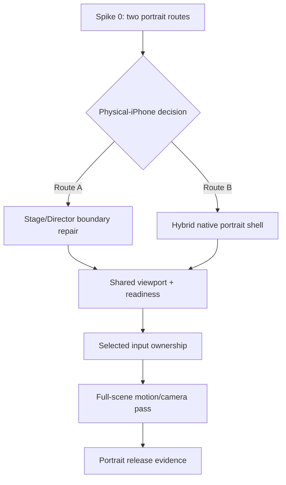
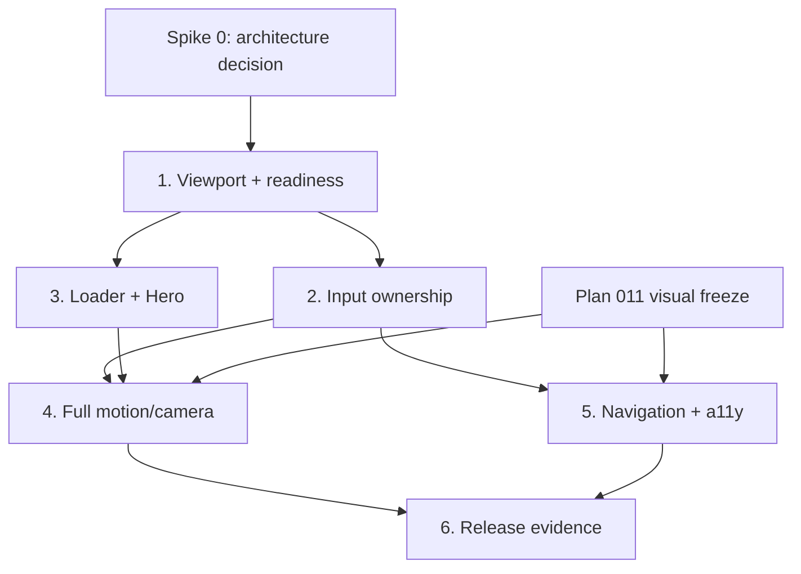

# R5 Portrait Interaction and Motion Closure Plan

## Outcome

Keep the portrait UI established by `1942f6a`, then make the complete phone journey responsive, understandable, and conversion-capable.

The product priority is:

1. understand the value and reach a consultation path quickly;
2. read every public chapter with native-feeling touch behavior;
3. use signature motion to strengthen the story without turning motion into a toll gate.

The finished experience must:

- open portrait edge to edge without a forced-landscape gate;
- give every valid swipe visible feedback within two animation frames;
- retain native momentum in reading content;
- trigger cinematic motion reliably for both a short flick and a deliberate drag;
- remove the current loader/Hero input-dead period;
- survive Safari toolbar and orientation changes without blank edges or story resets;
- keep all five public chapters and the consultation CTA reachable;
- provide a safe portrait composition or static/dissolve fallback for every cinematic scene;
- preserve desktop as the strict regression baseline.

Phone landscape is a compatibility baseline, not a behavior-parity baseline: scene order, content, navigation, media recovery, and stability must remain intact, but its known viewport-gap and short-gesture defects may be improved by shared fixes.

“Edge to edge” means covering the browser's current visual viewport with correct safe-area treatment. This plan does not promise that Safari chrome can be hidden or that the page can enter browser fullscreen without a user gesture.

## Problem Frame

Commit `1942f6a` materially improves typography and responsive reading layouts. It does not prove that the current Stage/Director interaction model is the right portrait architecture, and it does not close portrait camera/crop defects in the cinematic scenes.

| Surface | Current behavior | Required behavior |
| --- | --- | --- |
| Entry | Gate disabled, but readiness still follows the old loader/intro chain | Portrait is visible and input-ready as one coordinated milestone |
| Reading | Global non-passive touch interception prevents native momentum and writes `scrollTop` | Exactly one native scroll owner; no canceled reading gesture |
| Cinematic motion | Existing `snap`/`stagedSnap` transitions wait for hidden charge, then autoplay | Immediate intent feedback followed by a reliable authored transition, or a validated native-scroll presentation route |
| Loader + Hero | About `5.38s` loader + `0.42s` exit + `2.7s` input-blocking intro | Short brand beat, honest asset wait, first visible Hero never silently ignores input |
| Viewport | `100svh` Stage plus resets on every `visualViewport.resize` | Live edge-to-edge layout; gesture math remains stable during toolbar movement |
| Camera/media | Several 16:9 scenes use desktop crops or fixed geometry; Star Map can be non-uniformly stretched | Portrait focal/crop contract or explicit static/dissolve fallback |
| Navigation | 31–34px controls, hidden Education link below 520px, global story input remains active | 44px targets, all chapters, explicit focus/input ownership |
| Evidence | Stable portrait screenshots exist, but no portrait release project or repeatable motion trace | Architecture spike, portrait Chromium/WebKit matrix, motion evidence, physical-iPhone acceptance |

## Requirements Trace

| ID | Requirement | Source | Planned units |
| --- | --- | --- | --- |
| R0 | Prove the portrait presentation route on a physical iPhone before building shared abstractions | Multi-review architecture finding | Spike 0 |
| R1 | Keep portrait entry unblocked and fill the live viewport without gaps | Product decision after Plan 010 | 1, 6 |
| R2 | Reading movement must retain native momentum and never be silently canceled | User swipe feedback | Spike 0, 2, 6 |
| R3 | Short flick and long drag must both trigger understandable cinematic feedback | User animation feedback | Spike 0, 2, 4, 6 |
| R4 | The first visible Hero must not be input-dead | Loader/runtime review | Spike 0, 3, 6 |
| R5 | Preserve `1942f6a` typography/layout while closing remaining camera/crop defects | Plan 011 + screenshot review | 1, 4, 6 |
| R6 | Menu, safe areas, keyboard, screen reader, and reduced-motion paths remain usable | Interaction/accessibility review | 1, 5, 6 |
| R7 | Desktop remains unchanged; phone landscape retains compatibility while allowing shared defect fixes | Existing R5 contract + user feedback | 1–6 |
| R8 | Acceptance includes deterministic stable and motion evidence plus a physical iPhone | Current evidence gap | Spike 0, 6 |

## Scope Boundaries

### In scope

- one-day physical-device architecture spike;
- comparison of existing Stage/Director and a hybrid native portrait presentation shell;
- one shared viewport classifier and live geometry contract;
- one explicit input owner at a time;
- native reading scroll or one native document scroll, depending on Spike 0;
- loader/Hero readiness and first-gesture behavior;
- portrait motion/camera treatment for the signature sequences;
- safe portrait camera or static/dissolve fallback for the other cinematic bridges;
- mobile navigation and accessibility ownership;
- portrait release projects, stable screenshots, motion traces, and physical-iPhone review.

### Out of scope

- re-enabling the blocking landscape gate, browser orientation lock, or forced fullscreen;
- duplicating canonical copy, navigation aliases, scene order, or media ownership;
- copy rewrites, new marketing sections, or a new visual system;
- broad typography changes beyond the residual acceptance work in Plan 011;
- custom portrait animation for every secondary bridge when a verified static/dissolve endpoint is sufficient;
- new portrait media assets without a separate asset decision;
- raising JS, CSS, memory, canvas, or video budgets.

If an existing semantic foreground cannot retain its subject through focal cropping, use its current poster/endpoint for this plan and open a separate asset decision. Do not ship a distorted or meaningless crop merely to remain “animated.”

## Current Architecture Findings

- `app/src/production/input-controller.ts` installs one global non-passive `touchmove` listener and calls `preventDefault()` before resolving reading ownership.
- The controller then writes reading `scrollTop` and sends charge/scrub input to the Director.
- Production cinematic segments are predominantly `snap` or `stagedSnap`; they do not expose pre-charge transition progress.
- `app/src/production/StoryApp.tsx` attaches the input controller only after `presentationReady`.
- `app/src/production/StoryLoader.tsx` defines two `2.52s` phrase cycles, a `160ms` gap, and a `420ms` exit.
- `app/src/styles.css` fixes the story root to `100svh`; the input controller resets on resize/orientation/visual-viewport changes.
- `app/src/scenes/star-map/starFieldReveal.ts` uses a fixed 16:9 backing geometry while CSS stretches the canvas to the stage.
- Figure3, TTG, PH, Crane, and parts of AOD still depend on desktop-oriented crops or fixed motion geometry.
- `app/playwright.release.config.ts` has desktop and landscape-phone projects but no portrait projects.

## Spike 0 — Select the Portrait Presentation Route

**Timebox:** 6–8h  
**Device gate:** one physical iPhone; record model, iOS/Safari version, display settings, and the evidence path  
**Production rule:** do not introduce shared production abstractions before this gate is decided

### Routes to compare

#### Route A — Existing Stage/Director, corrected at its boundaries

- retain the canonical Stage, LayerWindow, Director, and existing scene-owned reading scrollports;
- reading scenes receive native touch ownership;
- cinematic `snap`/`stagedSnap` policies remain authored autoplay;
- before commit, the active hold shows a small scene-owned intent preview; this is not canonical transition progress;
- reaching a reading boundary must produce an immediate, understandable edge response.

#### Route B — Hybrid native portrait presentation shell

- keep canonical spine data, copy arrays, scene components, media modules, hashes, and public navigation;
- use one portrait native scroll owner and a portrait presentation shell;
- use a sticky Stage only for signature motion sections;
- derive the canonical chapter/segment position from scroll progress;
- keep only one accessible copy tree and one active media owner.

Route B is not permission to fork the product into two separately maintained stories.

### Vertical slice

Both routes must demonstrate the same slice:

1. cold portrait entry and first gesture during Hero intro;
2. Hero → Pattern;
3. Pattern contraction checkpoint → Star Map;
4. one native reading scene and its handoff into a cinematic scene;
5. Safari toolbar collapse/expand during touch;
6. reverse movement;
7. reduced-motion fallback.

### Evidence and kill criteria

Record a short flick, long drag, reverse, and incomplete release for each route.

Continue with a route only if:

- every valid gesture produces visible movement within two animation frames;
- at least 9 of 10 repeated short flicks and 9 of 10 long drags reach the intended next state;
- reading content retains native inertia;
- the reading path has no global non-passive `touchmove` listener;
- a boundary does not create an unexplained “swipe again because nothing happened” state;
- Safari toolbar motion creates no visible edge gap or scene reset;
- Hero intro and Hero → Pattern never write the same visual properties concurrently;
- the route does not duplicate copy, accessibility trees, or media preload.

Reject Route A if native reading, edge handoff, or snap intent preview requires competing input/DOM owners. Reject Route B if it cannot share canonical content/media ownership or requires two accessible story trees.

Record the decision and rejected-route evidence in this plan before Unit 1 begins. If neither route passes, stop and create a revised architecture plan; do not continue into implementation units.

### Spike 0 decision — Route B selected

**Decision date:** 2026-07-19

**Validated preview:** `?v=16` on the `codex/r5-portrait-spike` branch

**Decision:** continue with Route B: one native phone scroll owner, a fixed visual
stage for cinematic chapters, and document-flow reading sections.

Route A was rejected because repairing Stage/Director boundaries did not produce
acceptable phone hand feel: valid swipes could appear inert, media could collapse
to endpoints, and reading momentum still competed with cinematic ownership. Route
B produced continuous touch response and made the Hero, Pattern, Star Map, AOD,
and Method vertical slice observable on the physical iPhone.

The selected route remains conditional on one final physical-device acceptance of
the current visual corrections. That acceptance gates bulk scene implementation,
but it no longer reopens the Route A/Route B architecture decision.

The spike also proved that Route B must not be expanded in place.
`app/src/production/portrait-spike/PortraitScrollSpike.tsx` is already over 1,500
lines and mixes shell orchestration, scene markup, media control, transitions,
navigation, viewport behavior, and evidence state. Production migration therefore
starts with the extraction plan in
`docs/plans/2026-07-19-013-refactor-r5-responsive-story-architecture-plan.md`.

The production target is:

- one canonical product core for spine, copy, navigation aliases, media contracts,
  progress semantics, and fallbacks;
- a desktop presentation shell that preserves Stage/Director;
- a phone presentation shell that preserves native scroll and the fixed-stage
  Route B behavior;
- presentation adapters per scene/transition, loaded on demand;
- exactly one mounted accessible story and one active media owner.

### Route B extraction status — 2026-07-19

The deterministic Route B characterization has been recorded in
`app/src/production/portrait-spike/portrait-checkpoints.ts` and its tests. It
covers the named front-half checkpoints, forward/reverse progression, normal
refresh, and lock-recovery behavior. The former spike entry is now a thin
compatibility wrapper around the formal
`app/src/production/phone/PhoneStoryShell.tsx`; `?v=16` therefore exercises the
production phone shell rather than retaining a second scene implementation.

The active formal shell now publishes those shared semantic checkpoints and the
`?v=18` browser characterization exercises its full forward/reverse rail plus
the AOD media-clock handoff. `?v=16` and `?v=17` remain short aliases to the
current shell, not immutable archived implementations.

The user reported the latest `?v=17` device presentation was "差不多可行了" and
authorized Plan 013 to proceed. Current-build physical-iPhone acceptance is
still **pending as the Unit 4 gate** because this workspace has no recorded
device model, iOS/Safari version, toolbar/orientation trace, or captured motion
evidence for the formal shell. Unit 0–3 contract/extraction work may continue;
Unit 4 and every later scene batch remain frozen until that evidence is
recorded and explicitly accepted.

## Confirmed Product and Interaction Contracts

### 1. Mobile browsing efficiency outranks authored waiting

- The five public chapters remain the user's mental model; technical animation scenes are not navigation items.
- Signature motion may require a deliberate checkpoint.
- Secondary bridge scenes must not require an extra gesture merely to reach the next public chapter; they auto-land on the destination content or use a short dissolve/static endpoint.
- Target at most ten deliberate story-advance gestures from Hero to Contact, excluding native reading movement.
- Menu/direct hash paths remain first-class and never replay preceding chapters.

### 2. Use one viewport fact source

Generalize the existing `mobile-landscape-entry.ts` implementation rather than building a parallel viewport system.

Only three tested behaviors exist in this plan, resolved in this order:

```text
phone-portrait:
  pointer: coarse
  hover: none
  visualViewport width <= 600
  height > width

phone-landscape:
  pointer: coarse
  hover: none
  visualViewport height <= 500
  width > height

desktop-default:
  every other capability/geometry combination
```

Tablets, foldables, and touch laptops use `desktop-default` until they have their own requirements and release samples.

Live layout geometry and gesture geometry are separate:

- Stage height follows the live visual viewport to avoid blank edges.
- Gesture normalization, intent direction, and camera reference dimensions use an immutable touch-start snapshot.
- Toolbar-only resize updates layout but does not reset the gesture.
- `touchend` and `touchcancel` close the gesture snapshot.
- Orientation change cancels the active gesture, preserves the current semantic hold/checkpoint, then resolves the new profile.

### 3. Separate readiness milestones with no visible dead window

- `visualReady`: target handles exist and the critical visual set has resolved or fallen back.
- `inputControllerAttached`: lazy input loading succeeded and listeners for the selected route are active.
- `inputReady`: loader is no longer intercepting input, `visualReady=true`, `inputControllerAttached=true`, and no menu/error mode owns interaction.
- `sceneStable`: runtime is at a hold, loader is hidden, active input owner is `none`, native scroll has been idle for at least `120ms`, no viewport update is pending, and the active scene's stability predicate passes for two animation frames.

The Hero remains covered by the loader until the input controller is attached. Therefore `visualReady=true && inputReady=false` is never presented as an apparently usable Hero.

If the input module fails to load, remove the interactive shell and reveal the crawlable/static story; do not publish `inputReady`.

Scene stability uses an optional `SceneModule` predicate with explicit unstable reasons. Hero, reading scrollports, Star Map, and media-backed holds provide specific predicates; ordinary static holds use the default runtime predicate.

### 4. Define route-specific motion semantics

#### Route A

- Existing `snap`/`stagedSnap` policies and authored durations remain canonical.
- The intent preview belongs to the active scene and touches only preview-specific CSS variables.
- A commit occurs when either:
  - vertical travel reaches `clamp(48px, 8% of the gesture-start height, 72px)`; or
  - release velocity reaches `0.55px/ms` with at least `24px` vertical travel.
- Direction locks after `12px`; preview appears within two animation frames.
- A sub-threshold release settles the preview back within `160ms`.
- One committed gesture advances at most one semantic checkpoint.
- The preview remains until the transition's first rendered frame, then clears without a flash.

#### Route B

- Native portrait scroll is the only vertical owner.
- Signature sticky sections map their local scroll range to the existing transition timeline's `progress()` contract.
- The presentation shell may derive chapter/checkpoint state, but the canonical spine, copy, media modules, and navigation aliases remain shared.
- Reading sections are not nested scrollports.

The selected route replaces the other branch; do not implement both production paths.

### 5. Define reading-boundary behavior

For Route A:

- while content can scroll, the browser owns the gesture;
- no non-passive window-level `touchmove` listener is active in a reading hold;
- if the finger remains down when the real edge is reached, an outward pull shows the cinematic intent preview and may commit on release;
- if inertia reaches the edge after release, the edge arms only after `scrollend` or a `120ms` scroll-idle fallback; the next gesture shows preview immediately;
- programmatic forward/reverse/hash entry positions the scrollport and arms the corresponding edge after layout;
- content that does not overflow is immediately edge-capable in either gesture direction;
- reversing, navigation, menu ownership, orientation change, or leaving the edge cancels the arm;
- when another gesture is required, show a quiet `继续上滑` or `向下滑返回` label above the safe area using the existing label/accent type role;
- outward drag moves that cue by at most `12px` and changes only preview-specific variables, so the first pixels are visibly acknowledged.

If Spike 0 proves that same-sequence outward pull cannot coexist with true native inertia, Route A fails instead of silently falling back to an uncommunicated double swipe.

For Route B, document scroll continuity replaces scene-edge handoff.

### 6. Define loader and preparation feedback

The critical Hero visual set is:

- registered Hero target handles;
- decoded `hero-back.webp`, `hero-middle.webp`, `middle1_depth.webp`, and `hero-figure-poster.webp`;
- the local title font ready or its system fallback explicitly accepted.

The full Hero figure video is not critical to first paint because the poster is the hold fallback.

| State | Visible behavior |
| --- | --- |
| Brand beat (`0–900ms`) | Existing brand phrase treatment; no fake percentage |
| Asset wait after brand beat | Stable brand mark plus `正在准备画面…`; loader remains honest and non-looping |
| Ready | Input controller attaches under the loader, then loader exits |
| Segment preparing over `300ms` | Current hold remains visible with `正在准备下一幕…` in visible status and polite live region |
| Segment fallback | Land on the safe endpoint and announce `动效未能加载，已显示下一幕` |
| Boot/input failure | Reveal static story and announce `动效加载失败，已切换静态浏览` |

Once the critical set is ready, decorative loader time may not extend beyond `1.8s`. A `4s` critical-readiness deadline exits to the safe Hero/static fallback instead of preserving an 8-second decorative safety timer.

The first gesture during a running Hero intro has one meaning: settle Hero to its readable endpoint within `250ms`. It does not also start Hero → Pattern. A later gesture starts the transition. This prevents concurrent scene-intro and transition writers.

### 7. Grade cinematic scenes explicitly

#### Grade A — custom portrait motion required

- Hero → Pattern;
- Pattern contraction → Star Map;
- Method → Figure2 → Proof.

#### Grade B — safe bridge required, custom motion optional

- Star Map → AOD → Method;
- Brand → Figure3 → Services;
- Services → TTG → Lab;
- Lab → PH → Education;
- Education → Crane → Contact.

Each Grade B chain must choose one reviewed result:

1. a verified portrait camera and short auto-landing bridge; or
2. its current poster/terminal frame plus a short dissolve.

No Grade B scene may retain an unreviewed desktop crop, create a separate required hold, or disappear from release evidence.

## High-Level Architecture Gate



The prose contracts are authoritative if the diagram and implementation detail diverge.

## Implementation Units

### Unit 1 — Generalize viewport geometry and readiness

**Goal:** establish one tested profile/geometry/readiness source after Spike 0 chooses a route.

**Move/generalize**

- `app/src/production/mobile-landscape-entry.ts` → `app/src/production/viewport-profile.ts`
- `app/src/production/mobile-landscape-entry.test.ts` → `app/src/production/viewport-profile.test.ts`

**Delete after migration**

- `app/src/production/MobileLandscapeGate.tsx`
- its focused gate component test, if present
- obsolete `MOBILE_LANDSCAPE_GATE_ENABLED` and gate-state exports once all references are removed

**Modify**

- `app/index.html`
- `app/src/production/StoryApp.tsx`
- `app/src/stage/Stage.tsx`
- `app/src/stage/SceneLayer.tsx`
- `app/src/story/types.ts`
- `app/src/story/registry.ts`
- `app/src/styles.css`
- `app/src/production/editorial-layout.css`

**Contracts**

- Add `viewport-fit=cover` and apply safe areas to UI chrome, not full-bleed artwork.
- Publish profile, live usable geometry, gesture-start geometry, and input owner on the story root/snapshot.
- Use live Stage size while keeping gesture normalization immutable until `touchend`/`touchcancel`.
- Preserve reading position on toolbar-only resize without writing a new ratio; on orientation change preserve the semantic panel/checkpoint and clamp only if its layout no longer exists.
- Add the optional scene-stability predicate and unstable-reason diagnostics.
- Publish `visualReady`, `inputControllerAttached`, `inputReady`, and `sceneStable`.

**Done when**

- all gate code is retired rather than duplicated;
- supported phone viewports have no Stage edge gaps;
- toolbar movement does not reset input or reading position;
- evidence can explain why a scene is not stable.

### Unit 2 — Establish one input owner and native reading behavior

**Goal:** implement the selected route's input ownership without adding a single-consumer “portrait policy” wrapper.

**Modify**

- `app/src/production/input-controller.ts`
- `app/src/production/input-controller.test.ts`
- `app/src/production/input-controller-loader.ts`
- `app/src/production/physical-gesture-tracker.ts`
- `app/src/production/gesture-intent-gate.ts`
- `app/src/production/reading-edge-latch.ts`
- `app/src/production/reading-handoff.ts`
- `app/src/stage/reading.ts`
- their focused tests
- `app/src/styles.css`

**Route A contracts**

- `StoryInputControllerOptions` receives the resolved profile and menu/input-suspension state.
- Reuse the existing gesture tracker, intent gate, and edge latch.
- Restrict `consumeReadingPixels` to existing desktop/landscape wheel behavior; portrait touch reading remains browser-owned.
- Attach a passive reading observer to the active scrollport and a non-passive cinematic listener only to the active cinematic layer; do not keep one global cancelable portrait listener.
- Implement the distance-or-velocity commit contract and edge behavior above.

**Route B contracts**

- Replace portrait Stage touch routing with one passive document/primary-scroll observer.
- Feed local sticky-section progress to the selected presentation shell.
- Keep desktop input-controller behavior intact.

**Shared scenarios**

- short flick, long drag, incomplete release, reverse;
- reading inertia and same-finger edge arrival;
- momentum-only edge arrival;
- short/non-overflowing content;
- forward, reverse, menu, and hash entry;
- toolbar resize and `touchcancel`;
- menu opening during residual momentum.

**Done when**

- one diagnostic input owner is active at a time: `native-reading`, `cinematic`, `menu`, or `none`;
- valid gestures never disappear without movement or explicit state feedback;
- reading retains native inertia;
- one gesture cannot skip more than one semantic checkpoint.

### Unit 3 — Coordinate loader, Hero, and input readiness

**Goal:** remove the first-screen dead zone while preserving an intentional brand beat.

**Modify**

- `app/src/production/StoryLoader.tsx`
- `app/src/production/StoryLoader.test.tsx`
- `app/src/production/StoryApp.tsx`
- `app/src/production/runtime-assembly.test.ts`
- `app/src/scenes/hero/index.tsx`
- `app/src/scenes/hero/motion.ts`
- Hero-focused tests
- `app/e2e/r5-production.spec.ts`
- `app/e2e/r5-performance.spec.ts`

**Contracts**

- Decode/report the critical Hero visual set.
- Load and attach the selected input route under the loader.
- Publish `inputReady` only after listener attachment succeeds.
- Use the exact user-visible loader/preparing/fallback states above.
- A first gesture during Hero intro only settles the intro; it never concurrently starts Hero → Pattern.
- Stable Hero requires intro endpoint, clear title state, no active intro writer, and two stable frames.
- The earliest admitted touchstart still invokes `unlockStoryMedia()` for later iOS media playback.

**Measurable acceptance**

- brand beat at least `900ms`;
- decorative wait no longer than `1.8s` after critical readiness;
- safe fallback by the `4s` critical-readiness deadline;
- first visible admitted gesture responds within two frames;
- Hero settle no longer than `250ms`;
- no visible Hero while `inputReady=false`.

### Unit 4 — Complete portrait motion, camera, and bridge fallbacks

**Goal:** deliver the selected route across the entire story, not only two sample transitions.

**Shared modify**

- `app/src/styles.css`
- `app/src/runtime/input-normalizer.ts`
- `app/src/scenes/hero/index.tsx`
- `app/src/scenes/pattern/index.tsx`
- `app/src/scenes/star-map/index.tsx`
- `app/src/scenes/star-map/starFieldReveal.ts`
- `app/src/scenes/aod-animation/index.tsx`
- `app/src/scenes/figure2-animation/index.tsx`
- `app/src/scenes/figure3-animation/index.tsx`
- `app/src/scenes/ttg-animation/index.tsx`
- `app/src/scenes/ph-animation/index.tsx`
- `app/src/scenes/crane-animation/index.tsx`
- `app/src/scenes/aod-animation/progress.test.ts`
- `app/src/scenes/figure2-animation/progress.test.ts`
- `app/src/scenes/figure3-animation/progress.test.ts`
- `app/src/scenes/ph-animation/progress.test.ts`
- `app/src/scenes/crane-animation/progress.test.tsx`
- `app/src/scenes/star-map/progress.test.ts`
- `app/src/scenes/star-map/starFieldReveal.test.ts`
- `app/src/transitions/hero-pattern/index.test.ts`
- `app/src/transitions/pattern-star-map/index.test.ts`
- `app/src/transitions/aod-method-top/index.test.ts`
- `app/src/transitions/method-bottom-figure2/index.test.ts`
- `app/src/transitions/figure2-proof-chain.test.ts`
- `app/src/transitions/group4-transitions.test.ts`
- `app/src/transitions/group5-transitions.test.ts`
- `app/src/transitions/group6-transitions.test.ts`
- `app/src/transitions/group7-transitions.test.ts`
- the Grade A and Grade B transition modules listed in `app/src/story/canonical-spine.ts`

**Route A only**

- extend existing gesture/intention modules; do not create a parallel `motion-profile.ts`;
- keep `snap`/`stagedSnap` authored autoplay and add scene-owned preview hooks only where the spike proved them;
- auto-land Grade B bridges without adding a required intermediate gesture;
- change manifest/types only if the chosen auto-landing behavior cannot be expressed by current staged boundary contracts.

**Route B only**

- create `app/src/production/PortraitPresentation.tsx`;
- create `app/src/production/portrait-scroll-spine.ts` and focused tests;
- reuse existing transition timeline `progress()` where the spike proved it safe;
- keep one mounted accessible content tree and bounded active media surfaces.

**Required visual contracts**

- Star Map backing canvas matches display pixels and uses one proportional cover/focal transform; CSS must never stretch its 16:9 geometry non-uniformly.
- Every semantic 16:9 foreground declares a portrait focal point or uses its endpoint/poster fallback.
- Copy-safe zones derive from accepted Plan 011 geometry and do not fork copy.
- Grade A sequences have 0/25/50/75/100% reviewed frames.
- Grade B chains land on readable destination content after one committed gesture.
- Reduced motion uses static endpoints and short crossfades.

**Done when**

- all cinematic scenes have a reviewed portrait result;
- no desktop crop, distorted canvas, or invisible copy cue remains;
- the Hero-to-Contact gesture count meets the product contract;
- Plan 011 residual visual corrections are frozen before final camera tuning.

### Unit 5 — Give navigation and assistive technology explicit ownership

**Goal:** keep every chapter reachable without story input competing with UI or assistive technology.

**Modify**

- `app/src/production/StoryNav.tsx`
- `app/src/production/StoryNav.css`
- `app/src/production/StoryNav.test.tsx`
- `app/src/production/StoryApp.tsx`
- `app/src/production/input-controller.ts`
- `app/src/production/navigation.test.ts`
- `app/src/stage/SceneLayer.tsx`
- `app/src/stage/Stage.reading.test.ts`

**Contracts**

- Remove the below-520px Education hide rule.
- Give brand, menu, CTA, and menu links at least `44 × 44px` effective targets.
- Opening the menu stops/suspends story input and residual scroll ownership without changing the current scene position.
- Close on Escape, navigation, history change, and explicit toggle; Escape returns focus to the toggle.
- Exclude buttons, links, and other native controls from global key handling.
- Put `tabIndex`, label, and keyboard scroll semantics on the actual reading scrollport.

**Assistive-technology state matrix**

| Trigger/state | Focus and announcement |
| --- | --- |
| Menu or keyboard navigation | Move focus to the committed scene heading |
| Touch/scroll scene transition | Do not steal focus; announce the new public chapter through the polite live region |
| Inactive SceneLayer | `inert` and `aria-hidden`; no duplicate accessible copy |
| Decorative canvas/video | `aria-hidden`; same scene retains text equivalence |
| Preparing/hold/fallback | Announce the exact visible state copy once, without repeated chatter |

Plan 011 owns final navigation color/contrast. That visual baseline must be frozen before this unit's final evidence, but it does not block Spike 0 or Units 1–3.

### Unit 6 — Promote portrait behavior to release evidence

**Goal:** test motion process as well as stable endpoints.

**Modify**

- `app/playwright.release.config.ts`
- `app/e2e/r5-helpers.ts`
- `app/e2e/r5-matrix.spec.ts`
- `app/e2e/r5-production.spec.ts`
- `app/e2e/r5-performance.spec.ts`
- `app/scripts/capture-r5-visual-evidence.mjs`
- existing R5 release inventory/report only where supported viewports are recorded

**Automated projects**

| Project | Contract |
| --- | --- |
| `desktop-chromium` | Strict existing desktop baseline |
| `desktop-webkit` | Strict existing WebKit baseline |
| `phone-landscape-chromium` | Content/order/navigation/media/stability compatibility; known gesture/viewport defects may improve |
| `phone-landscape-webkit` | Same compatibility contract under WebKit |
| `phone-portrait-chromium` | Selected input route, readiness, menu, camera, stable and motion evidence |
| `phone-portrait-webkit` | Same contract under WebKit, plus safe-area and direct-entry coverage |

**Stable evidence**

- replace fixed screenshot delays with `sceneStable`;
- capture every hold and Grade B bridge, not only Grade A scenes;
- record profile, live/gesture geometry, readiness, unstable reasons, input owner, scene/checkpoint, and scroll metrics.

**Motion evidence**

- store short flick, long drag, reverse, and incomplete-release traces;
- trace timestamp, touch Y, velocity, preview/progress, input owner, checkpoint, and settle state;
- capture 0/25/50/75/100% frames or a short clip for each Grade A sequence;
- assert initial visible response within two frames, incomplete release convergence within `160ms` for Route A, and no multi-checkpoint skip;
- record deliberate story-advance gesture count for the complete journey;
- use an opt-in rAF-gap recorder on the physical device and flag representative gaps over `50ms`.

**Physical iPhone checklist**

- record device/OS/Safari/evidence metadata;
- toolbar expanded and collapsed;
- cold Hero, first-intro gesture, direct hash;
- all four gesture samples;
- reading inertia, boundary handoff, reverse;
- every public navigation item;
- portrait → landscape → portrait without chapter loss;
- reduced motion, segment fallback, boot/static fallback;
- no gaps, safe-area clipping, distorted media, or unintended rubber-banding.

**Done when**

- all six projects pass their scoped contracts;
- physical-device motion and stable evidence are archived;
- the user accepts the selected route before the full camera pass and again at final closure.

## Delivery Gates and Dependencies



- Spike 0 is a hard architecture gate.
- Units 2 and 3 may proceed in parallel after Unit 1 with explicit file ownership; their StoryApp/input integration happens once before Unit 4.
- Plan 011 does not block Spike 0 or Units 1–3. Its residual visual work must be frozen before Unit 4 camera tuning and Unit 5 final styling.
- After Unit 3 plus one Grade A transition, run an intermediate physical-iPhone feel review. Do not build the remaining scene matrix until that slice is accepted.
- Unit 6 is the final merge gate.

## System-Wide Impact

### State and event flow

- The generalized viewport module is the only profile/geometry source.
- Live layout geometry and immutable gesture geometry are distinct.
- One input owner handles each touch sequence.
- Route A keeps the Director authoritative for canonical transition progress.
- Route B keeps canonical data/media authority shared while its portrait shell derives presentation progress.
- Stable evidence queries runtime state, scroll idle, viewport pending state, and the active scene predicate.

### Failure and recovery

- `touchcancel` closes gesture state without committing a checkpoint.
- A viewport/profile change preserves the semantic chapter/checkpoint, not necessarily a sub-frame pixel position.
- Input-module failure reveals static content.
- Media preparation shows visible state, then lands on the existing safe endpoint.
- If the selected route violates Spike 0 kill criteria during the intermediate slice, stop and reopen the route decision before scene-wide work.

### Accessibility

- Only one scene/content tree is exposed to assistive technology.
- Touch transitions do not steal focus.
- Explicit menu/keyboard navigation moves focus to the committed heading.
- Reduced motion preserves content, chapter order, navigation, and fallback.

### Performance and budgets

- No duplicate media preload or second accessible story tree.
- Avoid per-frame React state; use existing runtime/scene handles and CSS variables.
- Keep current code-size, memory, canvas, and video budgets.
- Physical evidence records rAF gaps; the plan does not claim desktop emulation can reproduce Safari toolbar or inertia.

### Observability

Extend the existing development/evidence snapshot with:

- selected presentation route;
- viewport profile plus live/gesture dimensions;
- `visualReady`, `inputControllerAttached`, `inputReady`, `sceneStable`;
- scene unstable reasons;
- input owner;
- semantic checkpoint;
- scroll idle/edge state.

Do not retain interaction traces as production analytics or include user data.

## Risks and Mitigations

| Risk | Impact | Probability | Mitigation |
| --- | --- | --- | --- |
| Layout success is mistaken for interaction proof | High | High | Spike 0 compares two routes before shared implementation |
| Native scroll and cinematic input both own a gesture | High | High | One owner diagnostic, route kill criteria, physical trace |
| Snap preview conflicts with authored transition | High | Medium | Route A preview uses preview-only variables and clears on first transition frame |
| Hybrid shell duplicates content/media | High | Medium | Route B kill criteria require one canonical/accessibility/media owner |
| Toolbar movement changes layout during touch | High | High | Live layout update; gesture math frozen at touch start |
| First Hero gesture skips two semantic states | High | Medium | First intro gesture only settles Hero |
| Secondary bridge scenes retain bad desktop crops | High | High | Every Grade B bridge must pass camera review or use endpoint/dissolve |
| Scope expands through custom motion everywhere | Medium | High | Custom Grade A only; Grade B accepts safe fallback |
| Final screenshots miss bad movement | High | High | Motion traces and progress frames are required |
| Plan 011 changes camera-safe geometry mid-work | Medium | Medium | Visual freeze before Unit 4/5 final work |

## Effort

| Work | Route A | Route B |
| --- | ---: | ---: |
| Spike 0 | 6–8h | 6–8h |
| 1. Viewport + readiness | 7–10h | 7–10h |
| 2. Input ownership | 10–15h | 12–18h |
| 3. Loader + Hero | 8–12h | 8–12h |
| 4. Motion/camera/fallbacks | 20–30h | 26–40h |
| 5. Navigation + accessibility | 5–8h | 5–8h |
| 6. Release evidence | 10–15h | 10–15h |
| **Expected total** | **66–98h** | **74–111h** |

Plan 011's remaining visual acceptance work is estimated separately.

## Definition of Done

This plan is complete when:

- Spike 0 records and validates one presentation route on a physical iPhone;
- portrait entry remains unblocked and fills the live viewport;
- every valid gesture produces immediate visible feedback;
- short flick and long drag both work reliably;
- reading retains native inertia and no unexplained boundary gesture is required;
- the first Hero gesture only settles the intro and never conflicts with Hero → Pattern;
- loader, preparation, fallback, and static paths show the specified user-visible state;
- Star Map is proportional and every cinematic scene has a reviewed portrait camera or safe fallback;
- Grade B bridges do not add required gesture stops;
- all five public chapters and consultation CTA are reachable with 44px targets;
- touch, menu, keyboard, screen reader, and reduced-motion ownership are explicit;
- desktop passes strict regression; phone landscape passes compatibility checks;
- portrait Chromium/WebKit plus physical-iPhone stable and motion evidence pass;
- the user accepts the vertical slice before full scene work and the complete journey at closure;
- no copy fork, duplicate accessible tree, duplicate media ownership, budget increase, or forced-landscape workaround is introduced.
