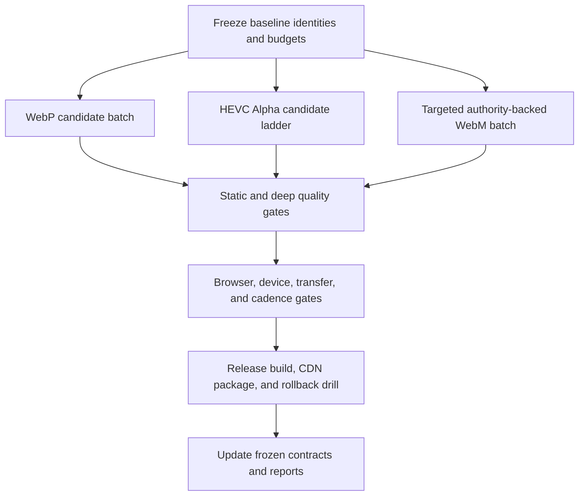
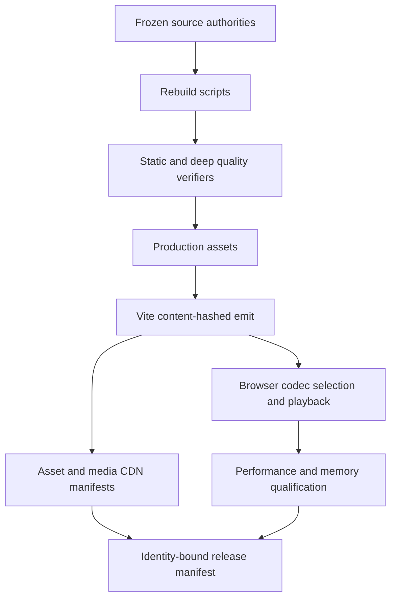

# refactor: Tighten R5 homepage media compression

## Overview

This plan reduces the R5 homepage production media payload without removing
animation, changing scene composition, weakening Alpha behavior, or raising an
existing performance budget.

The work is deliberately split into three qualification batches:

1. convert presentation-oriented lossless WebP files to high-quality lossy
   WebP while preserving Alpha exactly;
2. retune the iOS HEVC-with-Alpha encodes, which currently use one maximally
   conservative profile for every clip;
3. test only high-yield WebM authorities and retain the current bytes when the
   candidate cannot meet both the existing quality floors and a 10% saving.

The plan also replaces the current single aggregate media budget with
reader-facing totals for the emitted release, the desktop/Android codec path,
the iOS codec path, image families, codec families, initial Hero media, and the
largest individual file.

**Target branch:** `codex/react-refactor-r5-parity-cutover`

**Planning baseline:** `f3da79b5d788772bab53def8a0164c6b121ae3a3`

**Baseline asset tree:** `6921f3431bb76da89faf4df145e2b7b9eb275aa3`

The remote R5 branch is one documentation commit behind this baseline, but its
`assets/` tree is byte-identical.

## Execution Decision — 2026-07-19

The approved production cutover is intentionally narrower than the original
three-batch proposal:

- Replace the 15 presentation WebPs with the visually accepted Q95,
  Alpha-quality-100 outputs.
- Keep all eight VP9 Alpha WebMs byte-identical. The Figure2 dual-person
  animation observation belongs to the unchanged video/runtime path and is not
  addressed by the WebP replacement.
- Keep all eight iOS HEVC Alpha MP4s byte-identical. Mobile-video optimization
  is deferred to a separate dedicated workstream and is not a blocker for this
  WebP cutover.
- The temporary `/compression-preview` route was used only for human
  comparison. It is removed after approval; the canonical `/` route now uses
  the selected WebPs without any runtime source-remapping code.
- The exact pre-replacement WebPs are archived under
  `archive/assets/homepage-media/2026-07-19/pre-compression-r5/assets/**`.
  A post-replacement isolated restore drill recovered 15/15 files,
  15,081,218 bytes, with SHA-256 identities matching the frozen baseline
  commit.

Accordingly, the WebP cutover and WebM-retention units can close independently.
The HEVC targets and real-device checks below remain useful design input for
the later mobile-video workstream, but they are no longer acceptance gates for
this change.

## Problem Frame

R5 currently passes its 80 MiB homepage runtime-media ceiling, but the pass is
not a healthy performance margin:

| Asset family | Files | Bytes | MiB | Assessment |
| --- | ---: | ---: | ---: | --- |
| Existing lossy WebP | 11 | 5,441,292 | 5.19 | Generally reasonable |
| Presentation lossless WebP | 15 | 15,081,218 | 14.38 | Over-conservative |
| Semantic lossless WebP | 4 | 1,230,350 | 1.17 | Must remain lossless |
| All WebP | 30 | 21,752,860 | 20.75 | Compressible |
| VP9 Alpha WebM | 8 | 22,849,072 | 21.79 | Mixed; several outliers |
| iOS HEVC Alpha MP4 | 8 | 33,478,827 | 31.93 | Over-conservative |
| Homepage runtime media | 46 | 78,080,759 | 74.46 | 93.08% of 80 MiB |

The remaining aggregate headroom is only 5,805,321 bytes (5.54 MiB).
Furthermore, the 80 MiB number combines both codec families even though a
normal browser selects only one:

| Reader path | Current bytes | Current MiB |
| --- | ---: | ---: |
| Desktop/Android: WebP + WebM | 44,601,932 | 42.54 |
| iOS: WebP + HEVC Alpha | 55,231,687 | 52.67 |
| Hero pre-scroll image/poster media | 1,604,092 | 1.53 |

The current image policy is the primary WebP cause. Batch C required the
replacement WebP to decode to the exact original PNG RGBA bytes. That was a
valid migration safety constraint, but it is not an appropriate permanent
production constraint for paper textures, clouds, decorative layers, and
posters.

The current iOS profile is similarly conservative: every HEVC Alpha output uses
`q:v 65`, `alpha_quality 1`, and GOP 8. The deep verifier checks codec identity,
Alpha metadata, dimensions, timing, frame count, and GOP, but it does not yet
compare decoded HEVC pixels with the VP9 source or the accepted HEVC baseline.

Read-only qualification probes establish both the safe opportunity and the
current stopping points:

| Probe | Current | Candidate | Saving | Result |
| --- | ---: | ---: | ---: | --- |
| 15 presentation lossless WebPs, Q95/Alpha 100 | 15,081,218 B | 4,021,138 B | 73.34% | Selected for production; every Alpha byte is exact |
| Same WebPs, Q98/Alpha 100 | 15,081,218 B | 4,937,550 B | 67.26% | Only a modest metric gain for 916,412 more bytes |
| All HEVC Alpha, Q65/Alpha 0.9 | 33,478,827 B | 28,724,340 B | 14.20% | Qualified for temporary preview only; not selected |
| All HEVC Alpha, Q62/63 VideoToolbox bucket | 33,478,827 B | 27,730,752 B | 17.17% | Rejected as a blanket profile; TTG, AOD, and Figure3 regress materially |
| All HEVC Alpha, Q60/Alpha 0.9 | 33,478,827 B | 26,789,100 B | 19.98% | Too aggressive as the default |
| Crane flock WebM, CRF 20 | 4,429,224 B | — | 7.2% | Quality passes, but saving misses the 10% adoption floor |
| Crane flock WebM, CRF 22 | 4,429,224 B | — | 11.15% | Alpha mean falls below the existing 0.993 floor |
| Crane figure WebM, CRF 28 | 3,218,940 B | — | 7.61% | Misses both the 10% saving and existing 0.9955 Alpha floor |

For the Q95 WebP probe, every Alpha plane remained byte-identical and
warm-paper composite RGB MAE ranged from 0.153 to 1.825 out of 255. The normal
and amplified contact sheets showed no meaningful structural difference.

For Q65/Alpha 0.9 HEVC, all eight outputs retain `hvc1`, AVFoundation Alpha,
the accepted frame count, and GOP at or below 8. Candidate-versus-current warm
SSIM means range from 0.9999368 to 0.9999975; reference-source Alpha means range
from 0.9991807 to 0.9998470. Real iPhone/iPad scene review is still required.

The historical combined preview used Q95 WebP, Q65/Alpha 0.9 HEVC, and the
current WebM bytes. The production decision selects only the Q95 WebPs. With
both video families unchanged, the emitted inventory becomes 63.92 MiB, the
desktop/Android static path becomes 31.99 MiB, and the iOS static path becomes
42.13 MiB.

## Requirements Trace

- **R1. Preserve the authored experience.** Scene structure, timing, motion,
  direction changes, composition, copy, and media activation windows remain
  unchanged.
- **R2. Preserve codec coverage.** Desktop and Android retain VP9 Alpha WebM;
  iPhone and iPad retain HEVC-with-Alpha MP4 with WebM fallback.
- **R3. Preserve semantic images exactly.** Depth fields and control masks
  remain lossless and pixel-identical.
- **R4. Preserve presentation Alpha exactly for WebP.** Lossy RGB must not
  change the decoded Alpha plane.
- **R5. Make visual loss measurable.** Image and video candidates require
  decoded Alpha, warm-paper composite, black-background composite, endpoint,
  and critical-edge evidence.
- **R6. Encode from authorities.** WebM candidates must be rebuilt from the
  immutable authorities recorded in the existing slimming report, never by
  transcoding the current production WebM.
- **R7. Keep rebuilds reproducible.** Tools, profiles, authority identities,
  selected output bytes, and SHA-256 values must be frozen.
- **R8. Improve meaningful budgets.** The release must report emitted total,
  WebP total, WebM total, HEVC total, per-browser path totals, Hero pre-scroll
  total, and largest-file total.
- **R9. Do not increase budgets.** Existing JS, CSS, initial transfer, frame
  pacing, memory, and whole-asset caps may not be raised.
- **R10. Preserve playback quality.** Forward/reverse presentation, direct
  entry, reduced motion, fallback behavior, and presented-frame cadence must
  remain qualified.
- **R11. Preserve CDN release behavior.** Content-addressed names, MIME types,
  immutable caching, range support, release manifests, and rollback remain
  valid.
- **R12. Keep rollback exact.** Before any production byte is replaced, move
  the exact current file into a dated `archive/assets/homepage-media/**`
  baseline archive that preserves its production-relative path, bytes, and
  SHA-256. Every replaced file must also have an immutable Git recovery ref and
  a successful SHA-verified restore drill.

## Scope Boundaries

- No animation, scene, transition, copy, or layout removal.
- No change to the canonical media keys or the `AlphaVideoSources` selection
  model.
- No replacement of WebP/VP9/HEVC with AVIF, animated WebP, AV1, canvas frame
  atlases, sprite sheets, or a new media framework.
- No responsive or device-specific resolution variants in this pass. They can
  reduce per-device transfer but would expand the emitted asset inventory and
  change delivery architecture.
- No blanket resolution, frame-rate, or duration reduction.
- No weakening of existing WebM quality, cadence, timing, or edge-spill gates.
- No increase to the 80 MiB media cap or the 156 MiB total asset-tree cap.
- No Git history rewrite, Git LFS migration, or relocation of
  `archive/`, `downloads/`, `tmp/`, or `artifacts/`; repository hygiene is a
  separate effort.
- No production asset deletion before all automated and human gates for that
  batch pass.
- Candidate encodes stay outside the repository until one output is selected;
  the repository must not accumulate `v2`, `final-final`, or unowned variants.

## Context & Research

### Relevant Code and Patterns

- `app/scripts/homepage-media-contract.mjs` is the current source identity,
  byte, category, timing, and codec-pair contract.
- `app/scripts/verify-homepage-media-inventory.mjs` owns source-to-emit identity,
  inventory counts, format bans, and the current aggregate 80 MiB/4 MiB gates.
- `app/scripts/verify-homepage-media-deep.mjs` already demonstrates the correct
  authority-backed approach for VP9 Alpha, SSIM, Alpha extraction, warm-paper
  composites, edge witnesses, frame identity, timing, and GOP verification.
- `app/scripts/rebuild-hevc-alpha-media.mjs` rebuilds all eight HEVC Alpha files
  from the accepted WebM sources on the frozen macOS/FFmpeg/VideoToolbox
  toolchain.
- `app/scripts/rebuild-crane-figure-media.mjs` and
  `app/scripts/rebuild-crane-flock-media.mjs` are authority-specific,
  deterministic WebM rebuild patterns.
- `app/e2e/r5-homepage-media.spec.ts` covers source selection, deferred Hero
  loading, direct entries, browser decode, WebP decode, and iOS Alpha.
- `app/e2e/r5-crane-media.spec.ts` measures reverse presented-frame cadence.
- `app/e2e/r5-performance.spec.ts` covers transfer, LCP, runtime readiness, and
  frame pacing.
- `app/scripts/create-cdn-publish-manifest.mjs`,
  `app/scripts/package-cdn-release.mjs`, and
  `app/scripts/verify-cdn-release.mjs` preserve content type, immutable cache,
  source identity, and release packaging.
- `docs/assets/homepage-asset-slimming-report.md` records the existing source
  lineage, commands, quality evidence, and restore drills.
- `docs/superpowers/plans/2026-07-13-homepage-asset-slimming-media-cdn.md`
  defines the original 80 MiB/4 MiB boundaries and the rule against budget
  increases.

### Local Research Decision

The repository has direct, recent patterns for all three codecs, Alpha
verification, authority-backed rebuilds, browser cadence, CDN packaging, and
rollback. External research is not required for this plan. Implementation
should use the frozen local FFmpeg 8.1, libvpx-vp9, libwebp, VideoToolbox, and
browser contracts rather than introduce a new toolchain.

## Key Technical Decisions

| Decision | Selected approach | Rationale |
| --- | --- | --- |
| WebP policy | Q95 presentation candidates with Alpha quality 100; four semantic files remain lossless | Captures the measured 72.7% opportunity without changing silhouettes or control fields |
| WebP adoption | Per-file fail closed | A visually sensitive file may keep its current bytes without blocking safe wins elsewhere |
| HEVC policy | Retain all current production MP4 bytes; carry Q65/Alpha 0.9 and lower-bucket probe evidence into a separate mobile-video workstream | The current cutover has no real-device approval, and lower VideoToolbox buckets caused material regressions in TTG, AOD, and Figure3 |
| HEVC comparison | Compare with both current HEVC and source WebM | Current iOS appearance is the user-visible baseline; WebM is the accepted source |
| WebM policy | Retain the current eight files after authority-backed Crane probes | The first candidates either saved less than 10% or crossed the existing Alpha floor |
| WebM adoption | Require at least 10% per-file saving and unchanged quality gates if a future authority-specific probe is attempted | Avoids visual risk for negligible byte wins |
| Budget model | Split emitted and per-codec-path budgets | The current 74.46 MiB aggregate is not a per-reader transfer number |
| Candidate storage | Temporary isolated directory until selection | Prevents unowned variants and accidental release emission |
| Runtime behavior | Preserve filenames/imports and source ordering | Compression should remain an asset-only/runtime-contract change |
| Rollback | Dated physical baseline archive plus immutable Git ref and SHA-verified restore drill | Satisfies the repository's existing replacement archive convention and makes the exact pre-compression bytes directly recoverable |

## Success Metrics

### Approved WebP-cutover gates

| Metric | Pre-cutover | Required | Selected |
| --- | ---: | ---: | ---: |
| Presentation WebP | 14.38 MiB | ≤4 MiB | 3.83 MiB |
| All WebP | 20.75 MiB | ≤11 MiB | 10.20 MiB |
| Desktop/Android static media path | 42.54 MiB | ≤32 MiB | 31.99 MiB |
| Hero pre-scroll image/poster media | 1.53 MiB | ≤1.30 MiB | 1.20 MiB |
| Homepage media, both codec families | 74.46 MiB | Existing ≤80 MiB invariant | 63.92 MiB |
| WebM production family | 21.79 MiB | Exact baseline identity | 21.79 MiB |
| HEVC production family | 31.93 MiB | Exact baseline identity | 31.93 MiB |
| PNG/JPG production emit | 0 | 0 | 0 |
| WebM/HEVC/WebP inventory | 8/8/30 | 8/8/30 | 8/8/30 |

These are fail-closed gates for the approved WebP-only cutover. The previous
≤27 MiB HEVC, ≤38 MiB iOS-path, and ≤8.50 MiB largest-video targets are
deferred targets for the mobile-video workstream. They must not be presented
as achieved here, and they are not reasons to change WebM or HEVC bytes in
this cutover.

### Historical combined-preview feasibility check

The tested safe preview path passes the reader-path and emitted-total gates
without changing WebM:

| Forecast input | Bytes | MiB |
| --- | ---: | ---: |
| Existing lossy + semantic WebP + Q95 presentation candidates | 10,692,780 | 10.20 |
| Q65/Alpha 0.9 HEVC candidates | 28,724,340 | 27.39 |
| Current WebM retained unchanged | 22,849,072 | 21.79 |
| Forecast emitted total | 62,266,192 | 59.38 |
| Forecast desktop/Android path | 33,541,852 | 31.99 |
| Forecast iOS path | 39,417,120 | 37.59 |
| Largest candidate file, Q65 Figure2 HEVC | 9,101,212 | 8.68 |

This research forecast passes the emitted, WebP, desktop, and iOS targets. It remains
0.39 MiB above the provisional 27 MiB HEVC-family gate and 0.18 MiB above the
8.50 MiB largest-file gate. The Q62 Figure2 output is 8,910,777 bytes—just
inside the largest-file gate—and is therefore the first per-file lower bucket
to review in the dedicated mobile-video workstream. WebM retuning is not
required for the approved desktop path. These figures are retained as research
evidence only: none of the HEVC candidates is selected by this change.

### WebM batch stopping rule

- The current 21.79 MiB WebM set remains selected for this pass.
- A candidate file is adopted only when it saves at least 10% and passes every
  existing authority, Alpha, timing, cadence, endpoint, and visual gate.
- If a WebM cannot satisfy those two conditions, retain the current production
  file. The tested Crane candidates did not satisfy both conditions.

### Quality floors

#### Presentation WebP

- Width, height, orientation, and decoded Alpha dimensions are unchanged.
- Every Alpha byte is identical to the accepted lossless source.
- Warm-paper and black-background composite SSIM are each at least 0.995.
- Warm-paper composite RGB MAE is at most 2.0/255.
- No new halo, color band, paper-texture pumping, seam, clipped fringe, or
  opaque-pixel leak appears in full-size and actual-viewport review.
- Semantic WebP files remain byte-identical to the baseline.

#### HEVC Alpha

- `hvc1`, AVFoundation Alpha characteristic, dimensions, sample aspect ratio,
  fps, frames, duration, and GOP remain valid.
- Candidate-versus-current-HEVC Alpha SSIM is at least 0.997.
- Candidate-versus-current-HEVC warm-paper composite SSIM is at least 0.995.
- Candidate-versus-current-HEVC color SSIM is at least 0.990.
- Candidate-versus-WebM Alpha and composite scores may not regress more than
  0.001 from the current-HEVC-versus-WebM baseline.
- Figure2 seam frames, Hero figure edges, TTG terminal pose, PH green-fringe
  witnesses, Crane flock frame zero, and all clip endpoints pass explicit
  checks.

#### WebM

- Existing thresholds in `app/scripts/verify-homepage-media-deep.mjs` remain
  unchanged or become stricter.
- No candidate is generated from the current lossy production WebM.
- Frame count, PTS, duration, fps, Alpha extrema, first/last state, seam
  identity, and GOP remain unchanged.

### Measurement and comparison protocol

- Byte counts are authoritative; MiB display values use 1 MiB = 1,048,576
  bytes and are rounded only for prose.
- “Emitted total” counts every production media source once, including both
  codec variants. “Desktop/Android path” is the static WebP + WebM inventory;
  “iOS path” is the static WebP + HEVC inventory. These are worst-case
  available-byte budgets, not claims that one browsing session downloads every
  byte.
- Observed browser transfer is measured separately from a clean profile.
  Encoded response bytes are grouped by content-hashed URL, and overlapping
  byte-range responses are counted by their byte union so retries, cache hits,
  and overlapping ranges do not inflate or hide the result.
- Image comparison decodes the full-resolution reference and candidate to the
  same straight-RGBA representation. Alpha is compared byte-for-byte; RGB is
  scored after compositing against the frozen warm-paper color and black.
- Video comparison normalizes color space, sample aspect ratio, visible bounds,
  and straight-RGBA representation, then aligns frames by frozen PTS and
  compares every decoded frame, not only a mean or a thumbnail sample. Color
  scores use visible Alpha support; composites capture edge contribution.
  Acceptance uses the worst frame as well as whole-clip summaries. Named seam,
  endpoint, face, fringe, and frame-zero witnesses remain separate gates.
- The verifier writes a compact evidence bundle outside `assets/`: candidate
  profile, toolchain identity, bytes/SHA, per-frame metric summary, worst-frame
  index/PTS, and reference/candidate/difference contact sheets. Only evidence
  for the selected output is copied into the durable report.
- Human review uses the exact candidate asset-tree identity at full resolution
  and at the shipped viewport on warm-paper and dark backgrounds. Reviewers
  inspect named witness frames plus the worst metric frames, then traverse the
  live scene forward and backward. Approval is recorded against the release
  manifest digest, not an unfrozen local filename.

## Open Questions

### Resolved During Planning

- **Should all current lossless WebPs become lossy?** No. Only the 15
  presentation assets are eligible; the four semantic depth/mask assets remain
  lossless.
- **Should WebM and HEVC be consolidated into one format?** No. Both are needed
  for current browser coverage.
- **Should one aggressive encoding profile be applied globally?** No. WebP has
  a high-quality default with per-file rejection; HEVC uses a ladder; WebM is
  authority- and scene-specific.
- **Should the plan force a WebM replacement to meet a total?** No. Unsafe
  WebM candidates are skipped.
- **Should the existing budgets be raised?** No. The media budget is tightened
  and split into more meaningful sub-budgets.

### Deferred to Implementation

- All HEVC selection and real iPhone/iPad review is deferred to the dedicated
  mobile-video workstream. Q65/0.9 is only a measured candidate profile;
  Q62/63 and Q60/0.9 remain unapproved per-file experiments.
- The final WebM CRF for each eligible clip depends on authority-backed ladder
  results. The plan does not assume that every clip can move from CRF 26 to the
  same new value.
- Whether a presentation WebP that fails Q95 should try a higher-quality
  lossy setting or retain its current lossless file is decided from the first
  candidate evidence. The gate may not be relaxed.
- Availability of a real iPhone and iPad is an execution-environment detail
  for the deferred mobile-video workstream. Real-device Alpha/seek approval is
  required before that later workstream may replace any HEVC file.

## High-Level Technical Design

> *This illustrates the intended approach and is directional guidance for
> review, not implementation specification. The implementing agent should
> treat it as context, not code to reproduce.*

Each batch must produce the same evidence shape:

1. immutable authority and baseline identity;
2. candidate profile and bytes;
3. decoded technical and visual metrics;
4. browser evidence where applicable;
5. one selected output or an explicit “retain baseline” result;
6. updated frozen source/output SHA values;
7. successful restore drill.

## Implementation Units

- [x] **Unit 1: Split the media contract and freeze the baseline**

**Goal:** Make the current asset families, authority classes, codec paths, and
new acceptance budgets machine-readable before replacing any file.

**Requirements:** R2, R3, R7, R8, R9, R12

**Dependencies:** None

**Files:**

- Modify: `app/scripts/homepage-media-contract.mjs`
- Modify: `app/scripts/verify-homepage-media-inventory.mjs`
- Modify: `docs/assets/homepage-asset-slimming-report.md`

**Approach:**

- Replace the single `lossless-webp` presentation bucket with explicit
  `presentation-webp`, `semantic-lossless-webp`, and existing adopted/lossy
  categories.
- Record both codec-path totals without double-counting WebP:
  desktop/Android = WebP + WebM; iOS = WebP + HEVC.
- Add family totals, largest media file, and per-browser totals to
  `homepage-media-inventory.json`.
- Freeze the baseline commit, asset-tree SHA, every current source SHA/byte
  value, and the six new required release gates before encoding begins.
- Freeze the archive destination convention before replacement:
  `archive/assets/homepage-media/<replacement-date>/pre-compression-r5/assets/**`.
  The archive preserves each selected file's path below `assets/` and includes
  a README table with baseline commit, bytes, and SHA-256.
- Keep the existing 80 MiB and 156 MiB ceilings as outer safety invariants
  while adding the tighter R5 acceptance caps.

**Execution note:** Characterization-first. The first change must reproduce all
current totals exactly before introducing any replacement bytes.

**Execution result:** The contract now separates presentation and semantic
WebPs and reports WebP, WebM, HEVC, desktop-path, iOS-path, Hero, and
largest-file totals. The original 80 MiB outer invariant remains unchanged;
the approved cutover additionally enforces presentation WebP ≤4 MiB, all WebP
≤11 MiB, and desktop static media ≤32 MiB.

**Patterns to follow:**

- Frozen identity entries in `app/scripts/homepage-media-contract.mjs`
- Fail-closed assertions in
  `app/scripts/verify-homepage-media-inventory.mjs`
- Release script inclusion checks in
  `app/src/production/release-manifest.test.ts`

**Test scenarios:**

- **Happy path:** The baseline 46-file inventory produces exact current WebP,
  WebM, HEVC, emitted, desktop-path, iOS-path, Hero, and largest-file totals.
- **Edge case:** A source appears in two category buckets; verification fails
  with the duplicate source name.
- **Error path:** A semantic lossless WebP is categorized as presentation
  media; the contract test fails before build.
- **Error path:** Either codec family is missing one member of an Alpha source
  pair; inventory generation fails.
- **Integration:** A production build emits one file for every frozen source,
  and the generated inventory reports the same hashes and category totals.
- **Integration:** The release manifest test proves the inventory verifier is
  still part of the required build pipeline.

**Verification:**

- Baseline totals match this plan byte-for-byte.
- No production asset SHA changes in Unit 1.
- New reports expose enough data to detect regression in one codec path even
  when the combined 80 MiB cap still passes.

- [x] **Unit 2: Rebuild and qualify presentation WebP assets**

**Goal:** Replace eligible lossless presentation images with high-quality lossy
WebP while retaining semantic images and all Alpha bytes exactly.

**Requirements:** R1, R3, R4, R5, R7, R8, R12

**Dependencies:** Unit 1

**Files:**

- Modify: `app/scripts/homepage-media-contract.mjs`
- Modify: `app/scripts/verify-homepage-media-inventory.mjs`
- Modify: `app/e2e/r5-homepage-media.spec.ts`
- Modify: `docs/assets/homepage-asset-slimming-report.md`
- Replace: the selected presentation files under `assets/**/*.webp`
- Create:
  `archive/assets/homepage-media/2026-07-19/pre-compression-r5/assets/**`
- Test: `app/e2e/r5-homepage-media.spec.ts`

**Approach:**

- Use the immutable lossless production WebP as the accepted pixel authority
  for presentation images; record its SHA before replacement.
- Generate Q95 candidates with Alpha quality 100 in a unique temporary
  directory. Do not write candidates into `assets/`.
- After a file is selected but before its production path is overwritten, move
  the exact current file into the dated pre-compression R5 archive, verify its
  archived SHA, and only then place the selected candidate at the canonical
  path.
- Keep the four semantic images byte-identical:
  `assets/middle1_depth.webp`,
  `assets/figure2-middle-depth.webp`,
  `assets/figure2-depth-mask-atlas.webp`, and
  `assets/figure2-middle-window-mask.webp`.
- The complete eligible presentation set is:
  `assets/hero-figure-poster.webp`,
  `assets/back2.webp`,
  `assets/ph_background.webp`,
  `assets/ph_front-alpha.webp`,
  `assets/aod_cloud-alpha.webp`,
  `assets/aod_sun-alpha.webp`,
  `assets/crane1_arch-alpha.webp`,
  `assets/crane1_cloud-front2-alpha.webp`,
  `assets/crane1_cloud1-alpha.webp`,
  `assets/crane1_cloud2-alpha.webp`,
  `assets/patterns/alpha-layers/pattern-layer-alpha-02.webp`,
  `assets/patterns/alpha-layers/pattern-layer-alpha-03.webp`,
  `assets/patterns/alpha-layers/pattern-layer-alpha-04.webp`,
  `assets/patterns/alpha-layers/pattern-layer-alpha-05.webp`, and
  `assets/patterns/alpha-layers/pattern-layer-alpha-06.webp`.
- Measure decoded dimensions, Alpha byte equality, Alpha extrema,
  warm-paper/black composites, SSIM, RGB MAE, and file bytes.
- Adopt each file independently. A failed image retains its current lossless
  output; no gate is relaxed to force the aggregate target.
- Run full-size and actual-viewport visual review for Hero, Pattern, AOD, PH,
  Crane, and Star Map before updating frozen SHA values.

**Execution note:** Evidence-first. Generate and review candidates before
changing any frozen source identity.

**Patterns to follow:**

- Batch C source/output identity and restore reporting in
  `docs/assets/homepage-asset-slimming-report.md`
- Warm-paper composite logic in
  `app/scripts/verify-homepage-media-deep.mjs`
- Browser image decode and mask checks in
  `app/e2e/r5-homepage-media.spec.ts`

**Test scenarios:**

- **Happy path:** A presentation image encodes below its baseline size, retains
  every Alpha byte, passes both composite gates, and is selected.
- **Happy path:** An opaque image passes the same RGB composite gates without
  introducing an Alpha channel.
- **Edge case:** Fully transparent pixels contain arbitrary RGB; the decoded
  Alpha remains exact and composite comparison ignores invisible RGB.
- **Edge case:** A tiny semantic mask would become larger or numerically lossy
  under lossy encoding; the rebuild excludes it and its SHA remains unchanged.
- **Error path:** Width, height, Alpha byte, SSIM, MAE, or size gate fails; the
  candidate is rejected and the baseline file remains selected.
- **Error path:** An unowned candidate filename remains in `assets/`; inventory
  verification fails.
- **Integration:** Every selected image emits once with the selected SHA, all
  30 WebPs decode in Chromium/WebKit, and CSS masks retain their expected
  dimensions and mode.
- **Integration:** Hero remains deferred before idle warmup and its pre-scroll
  media total stays at or below 1.30 MiB.

**Verification:**

- WebP total is at most 11 MiB.
- All semantic images retain their baseline SHA values.
- Selected presentation Alpha planes are byte-identical.
- No accepted viewport or full-size comparison shows a new visible artifact.

**Execution result:** All 15 Q95 candidates were selected after exact-Alpha,
warm-paper composite, contact-sheet, and live-route review. The selected set is
4,021,138 bytes, down 11,060,080 bytes (73.34%) from the archived baseline.

- [ ] **Unit 3: Retune and qualify the iOS HEVC Alpha family — deferred**

**Goal:** Reduce iOS media bytes with per-file quality profiles while preserving
the current source selection, Alpha, seeking, and scene appearance.

**Requirements:** R1, R2, R5, R7, R8, R10, R11, R12

**Dependencies:** Unit 1

**Scope decision:** Do not execute this unit in the current cutover. All eight
production HEVC files remain byte-identical; the candidate research and every
real-device gate move to a separately approved mobile-video workstream.

**Files:**

- Modify: `app/scripts/rebuild-hevc-alpha-media.mjs`
- Modify: `app/scripts/verify-homepage-media-deep.mjs`
- Modify: `app/scripts/homepage-media-contract.mjs`
- Modify: `app/scripts/verify-homepage-media-inventory.mjs`
- Modify: `app/src/media/alpha-video-sources.test.ts`
- Modify: `app/e2e/r5-homepage-media.spec.ts`
- Modify: `app/e2e/r5-ttg-alpha.spec.ts`
- Modify: `app/package.json`
- Modify: `docs/assets/homepage-asset-slimming-report.md`
- Replace: `assets/*-hevc-alpha.mp4`
- Test: `app/src/media/alpha-video-sources.test.ts`
- Test: `app/e2e/r5-homepage-media.spec.ts`
- Test: `app/e2e/r5-ttg-alpha.spec.ts`

**Approach:**

- Characterize current HEVC-versus-WebM color, Alpha, warm-paper composite,
  black composite, and key-frame witnesses before encoding candidates.
- After a file is selected but before its production path is overwritten, move
  the exact current MP4 into the same dated pre-compression R5 archive, verify
  its archived SHA, and only then place the selected candidate at the canonical
  path.
- Generate Q65/Alpha 0.9 as the default candidate for all files.
- Try the Q62/63 VideoToolbox bucket only per file when Q65 misses a size gate
  and the lower bucket still passes every frozen floor. Figure2 is the first
  review target because its Q62 output is 8,910,777 bytes.
- Do not use Q60 or lower Alpha quality as a blanket fallback. Such a profile
  requires separately recorded per-file evidence and live-device approval.
- Keep GOP at or below 8 unless an explicit seek/cadence experiment proves an
  alternative and the plan is revised; GOP relaxation is not implicit
  compression authority.
- Add decoded quality comparison to the deep verifier. Container metadata and
  `AVFoundation.containsAlphaChannel` alone are not visual proof.
- Pay special attention to Figure2, which accounts for most of the
  HEVC-versus-WebM gap.
- Rebuild twice on the frozen macOS/FFmpeg 8.1/VideoToolbox host and record
  toolchain identity, selected profile, bytes, SHA, timing, GOP, and decoded
  scores.

**Patterns to follow:**

- Current HEVC source-pair and AVFoundation checks in
  `app/scripts/verify-homepage-media-deep.mjs`
- Scene-specific witnesses for PH, Hero, Figure2, and Crane in the same script
- Source ordering tests in `app/src/media/alpha-video-sources.test.ts`

**Test scenarios:**

- **Happy path:** iPhone/iPad-family navigation orders HEVC first, the browser
  selects the new MP4, and WebM remains the fallback source.
- **Happy path:** Every candidate retains `hvc1`, AVFoundation Alpha, timing,
  frame count, dimensions, and GOP while passing all decoded comparison floors.
- **Edge case:** Odd WebM dimensions require transparent even-dimension pad;
  visible bounds and sample aspect ratio remain unchanged.
- **Edge case:** Figure2 frame 77/78 seam and both direction endpoints remain
  visually continuous after compression.
- **Error path:** A candidate is smaller but misses an Alpha/composite floor;
  it is rejected in favor of the current HEVC.
- **Error path:** A candidate has Alpha metadata but decodes as opaque in the
  browser; the iOS Alpha test fails.
- **Error path:** A primary HEVC request fails; the existing WebM fallback
  remains selectable without a black rectangle.
- **Integration:** Hero, Figure2, TTG, PH, AOD, Figure3, and both Crane videos
  select HEVC on WebKit, expose partial and opaque Alpha pixels, and preserve
  direct entry plus forward/reverse transitions.
- **Integration:** Real iPhone and iPad review confirms Alpha edges, first
  decode, forward playback, reverse seek, and terminal holds.

**Verification:**

- HEVC total is at most 27 MiB.
- Figure2 HEVC is at most 8.50 MiB.
- No selected candidate regresses the frozen decoded-quality floors.
- A supported iOS browser downloads HEVC media bodies without also downloading
  WebM bodies during the successful path.

- [x] **Unit 4: Freeze WebM retention after authority-backed probes**

**Goal:** Record why the current eight VP9 Alpha files remain selected and
prevent a low-yield or quality-regressing re-encode from entering production.

**Requirements:** R1, R2, R5, R6, R7, R8, R10, R12

**Dependencies:** Unit 1; may be developed independently of Units 2 and 3, but
final selection waits for their shared quality tooling.

**Files:**

- Modify: `app/scripts/homepage-media-contract.mjs`
- Modify: `docs/assets/homepage-asset-slimming-report.md`
- Test: `app/scripts/verify-homepage-media-deep.mjs`

**Approach:**

- Record the Crane flock CRF 20/22 and Crane figure CRF 28/30 ladder outcomes
  against their immutable authorities.
- Freeze the decision that no WebM changes in this pass: the quality-passing
  candidates save less than 10%, while candidates exceeding 10% cross the
  existing Alpha floor.
- Keep all eight current WebM SHA values and bytes unchanged.
- Retain the 10% plus unchanged-quality rule as the gate for any separately
  approved future authority-specific probe.

**Execution note:** Evidence-only and fail-closed. This unit does not replace
production WebM bytes.

**Patterns to follow:**

- Deterministic rebuild and UID normalization in the existing Crane scripts
- Per-authority SSIM, Alpha, edge, and frame witnesses in
  `app/scripts/verify-homepage-media-deep.mjs`

**Test scenarios:**

- **Happy path:** The current eight WebM files retain all frozen SHA, authority,
  Alpha, timing, endpoint, and cadence checks.
- **Edge case:** A candidate passes quality but saves less than 10%; the
  baseline remains selected.
- **Error path:** A candidate saves at least 10% but misses an existing Alpha
  floor; it is rejected.
- **Integration:** Desktop and Android still select the current WebM family and
  complete direct entry, forward, reverse, reduced-motion, and fallback paths.

**Verification:**

- Selected WebM total remains exactly 22,849,072 bytes.
- All eight baseline-retention decisions are explicit.
- Existing deep thresholds and browser cadence remain unchanged.

**Execution result:** No `.webm` production path changed. The current eight-file
family remains selected at exactly 22,849,072 bytes; the Figure2 observation is
recorded for later video/runtime work rather than folded into this image
replacement.

- [x] **Unit 5: Qualify the canonical WebP cutover**

**Goal:** Prove the approved WebPs work on the canonical application route,
improve the static reader path, and do not alter video source selection,
runtime behavior, or existing budgets.

**Requirements:** R1, R2, R8, R9, R10, R11, R12

**Dependencies:** Units 1, 2, and the Unit 4 retention record. Deferred Unit 3
is explicitly not a dependency of the WebP-only cutover.

**Files:**

- Modify: `app/scripts/verify-homepage-media-inventory.mjs`
- Modify: `app/e2e/r5-homepage-media.spec.ts`
- Test: `app/e2e/r5-homepage-media.spec.ts`

**Approach:**

- Use the temporary `/compression-preview` route only as pre-cutover human
  evidence. Remove its route, middleware, notice, remapping helper, and scene
  wiring after approval.
- Keep canonical asset imports and video `<source>` ordering unchanged. Only
  the bytes behind the 15 canonical WebP paths change.
- Enforce presentation WebP ≤4 MiB, all WebP ≤11 MiB, and desktop static media
  ≤32 MiB from the generated inventory while retaining every existing outer
  build/performance budget.
- Run type checking, lint, unit tests, the complete production build, frozen
  media-identity checks, and browser inspection on `/`.
- Confirm the final diff contains exactly the approved WebP replacements and no
  `.webm` or `.mp4` production changes.

**Patterns to follow:**

- Existing browser decode checks in `app/e2e/r5-homepage-media.spec.ts`
- Existing generated media inventory and production-build gates

**Test scenarios:**

- **Happy path:** `/` resolves the selected Q95 WebPs at their canonical paths
  and contains no preview indicator or candidate-path remapping.
- **Happy path:** The static desktop/Android inventory is at most 32 MiB and
  desktop continues to select the unchanged WebM family.
- **Edge case:** Figure2 retains its existing WebM/HEVC URLs and behavior; its
  known animation observation neither changes nor blocks this image cutover.
- **Error path:** A selected WebP SHA/byte count, family total, or decoded
  dimensions differ from the frozen contract; the production build fails.
- **Integration:** The canonical Hero, Pattern, AOD, PH, Crane, and Star Map
  compositions render without a new visible artifact or console error.

**Verification:**

- The exact production build passes all approved WebP and desktop-path caps.
- Canonical `/` uses the selected content-hashed WebPs.
- Temporary preview code and candidate-path strings are absent.
- All WebM and HEVC source bytes and frozen identities remain unchanged.
- No existing JS/CSS/performance/memory budget is raised.

**Execution result:** Type checking, lint, 662 unit tests, and the complete
production build passed. The generated inventory reports 4,021,138 bytes of
presentation WebP, 10,692,780 bytes of all WebP, and a 33,541,852-byte desktop
path. Canonical Browser review passed for Hero, Pattern, AOD/Method, and Crane;
all inspected media decoded, desktop selected the unchanged WebMs, and the
console contained no warnings or errors.

- [x] **Unit 6: Freeze WebP evidence and perform the rollback drill**

**Goal:** Make the approved WebP replacement durable and exactly reversible
without claiming completion of the deferred mobile-video workstream.

**Requirements:** R5, R7, R8, R12

**Dependencies:** Unit 5

**Files:**

- Modify: `docs/assets/homepage-asset-slimming-report.md`
- Modify: `docs/plans/2026-07-19-001-refactor-r5-media-compression-plan.md`
- Create:
  `archive/assets/homepage-media/2026-07-19/README.md`
- Create:
  `archive/assets/homepage-media/2026-07-19/pre-compression-r5/assets/**`

**Approach:**

- Record every replaced path with baseline SHA/bytes, selected SHA/bytes,
  profile, decoded evidence, selected totals, and restore location.
- Confirm every baseline exists under
  `pre-compression-r5/assets/**` with its production-relative path and README
  manifest entry.
- Copy all 15 archived files into an isolated temporary directory and compare
  each restored SHA with the immutable baseline commit without writing old
  bytes back into production `assets/`.
- Record that WebM and HEVC files were not archived by this change because they
  were not replaced.

**Patterns to follow:**

- Existing restore tables and immutable archive refs in
  `docs/assets/homepage-asset-slimming-report.md`
- Existing R5 local qualification and fail-closed archive policy

**Test scenarios:**

- **Happy path:** Every replaced file restores from the dated physical archive
  with the SHA and total bytes of the immutable Git baseline.
- **Edge case:** A file is retained rather than replaced; the report records
  retention without inventing a new output identity.
- **Error path:** A restore SHA, source commit, path, count, or byte total
  differs; finalization fails closed.
- **Error path:** Documentation reports a total that differs from the generated
  inventory; build verification fails.
- **Integration:** Frozen source identity, media inventory, rollback archive,
  and visual approval refer to the same selected WebP tree.

**Verification:**

- Isolated restore drill passes 15/15 for 15,081,218 archived bytes.
- The dated archive contains the exact pre-compression R5 bytes for every
  replaced canonical path.
- Generated evidence and reader-facing reports contain identical final totals.
- Deferred video work is stated explicitly and is not presented as completed.

**Execution result:** The physical archive passed both the pre-replacement
15/15 byte comparison and the post-replacement isolated 15/15 SHA restore
drill. A second decoded check confirmed all 15 selected production WebPs retain
the exact archived Alpha plane. Unit 3 remains the only intentionally open
unit and is owned by the separate mobile-video workstream.

## Validation Matrix

| Layer | Method | Required evidence |
| --- | --- | --- |
| Source identity | SHA-256 and bytes for authority, baseline, and selected output | Frozen contract entry for every file |
| Reproducibility | Two isolated rebuilds on the frozen toolchain | Stable bytes/SHA or explicitly documented deterministic decoded identity |
| WebP Alpha | Decode RGBA and compare Alpha byte-for-byte | Zero changed Alpha pixels |
| WebP visual | Warm paper + black composite SSIM/MAE; full-size and viewport review | Metric floors plus HITL pass |
| Semantic WebP | Byte identity | Baseline SHA unchanged |
| WebM container | FFprobe frame count, fps, PTS, duration, keyframes, GOP, Alpha tag | Exact contract match |
| WebM visual | Authority color/Alpha SSIM, composite MAE, scene witnesses | Existing thresholds unchanged |
| HEVC container | FFprobe plus AVFoundation Alpha characteristic | `hvc1`, Alpha, timing, GOP ≤8 |
| HEVC visual | Current HEVC and WebM comparisons; scene witnesses | New HEVC floors pass |
| Browser source selection | Chromium/Android and WebKit/iOS source/response capture | One selected codec body per successful path |
| Browser decode | Canvas Alpha samples and scene visibility | Transparent, partial, and opaque pixels present |
| Lifecycle | Direct entry, forward, reverse, interruption, reduced motion, decode failure | No blank/black frame or stale surface |
| Cadence | `requestVideoFrameCallback` samples | ≥20 presented fps on existing slow target |
| Page performance | LCP, runtime ready, presentation ready, p95 frame interval, long frames | Existing budgets unchanged |
| Memory/disposal | Exact full traversal and reverse profile | Existing RSS/heap/layer/video/WebGL caps |
| Static reader path | Inventory sum by codec path | Desktop ≤32 MiB; iOS reported at 42.13 MiB and deferred |
| Observed transfer | Clean-profile encoded bytes; URL/range-union accounting | Existing initial/traversal budgets unchanged; no duplicate codec body |
| Build | Frozen inventory and performance-budget reports | All new family/path caps pass |
| CDN | MIME, immutable cache, 206 range, hashes, object keys | CDN verification pass |
| Rollback | Restore to isolated directory and SHA comparison | 100% restored identities pass |
| Human visual | Desktop, iPhone, iPad; key/worst frames and full traversal | Explicit approval tied to exact release-manifest digest |

## Phased Delivery

### Phase A: Contract before bytes

- Complete Unit 1.
- Freeze exact baseline totals and new acceptance caps.
- No asset file changes.

### Phase B: High-confidence independent wins

- Complete Unit 2 and select the 15 WebPs only after metric and visual evidence.
- Defer Unit 3, including every HEVC replacement and real-device gate, to the
  mobile-video workstream.
- Complete a production build to confirm the exact 63.92 MiB combined result
  with both video families retained.

### Phase C: WebM retention freeze

- Complete Unit 4 by recording the authority-backed Crane probe failures.
- Keep all eight current WebM files byte-identical.

### Phase D: Cross-surface qualification

- Complete Unit 5.
- Run exact-build static verification and canonical desktop-browser review
  after the selected WebPs are frozen. Mobile device/video qualification
  remains deferred with Unit 3.

### Phase E: Handoff and candidate eligibility

- Complete Unit 6.
- Perform the restore drill and update generated plus human-readable evidence.
- Keep the later mobile-video candidate independent of this WebP archive and
  approval record.

## System-Wide Impact

- **Interaction graph:** Asset bytes flow through frozen contracts, Vite
  content hashing, CDN channel selection, `<source>` ordering, timeline media
  preparation, browser decode, and release manifests.
- **Error propagation:** Any identity, decode, quality, timing, transfer, or CDN
  failure must reject the candidate. Runtime decode failure continues to use
  the existing static-media/Director recovery path.
- **State lifecycle risks:** Compression must not alter video duration,
  keyframe seek behavior, presented-frame readiness, parked decoder disposal,
  or adjacent preload ownership.
- **API surface parity:** All eight WebM/HEVC source pairs retain their current
  keys and call sites. The only intended runtime-visible change is content
  hash and transferred bytes.
- **Integration coverage:** Static metrics alone cannot prove Safari Alpha,
  reverse seek, actual transfer selection, or CDN range behavior; those remain
  explicit cross-layer gates.
- **Unchanged invariants:** Canonical spine, scene/segment IDs, timing,
  copy/SEO shell, source-order contract, reduced-motion fallback, release
  identity, memory limits, and rollback policy remain unchanged.

## Risks & Dependencies

| Risk | Likelihood | Impact | Mitigation |
| --- | --- | --- | --- |
| Paper texture or watercolor banding survives metrics but is visible | Medium | High | Full-size and actual-viewport HITL; per-file rejection |
| Alpha halos appear on dark or warm backgrounds | Medium | High | Alpha byte equality for WebP; dual-background composites and edge witnesses |
| HEVC Alpha metadata passes while decoded Alpha degrades | Medium | High | Add decoded HEVC parity; real iPhone/iPad canvas and scene review |
| A longer GOP improves size but harms reverse seek | Medium | High | Keep GOP ≤8 in this plan unless separately proven |
| WebM double-transcode compounds loss | High if uncontrolled | High | Enforce immutable authority provenance and reject production-WebM inputs |
| Aggregate SSIM hides a local face/edge/seam defect | Medium | High | Scene-specific frame and region witnesses plus HITL |
| Hardware HEVC output varies by host/toolchain | Medium | Medium | Freeze host/toolchain; rebuild twice; record identity and decoded evidence |
| Both codec variants transfer on one reader path | Low | High | Browser response-body capture and explicit fallback test |
| New reports disagree with release manifests | Medium | Medium | Generate totals from one inventory and test cross-document identity |
| Size target tempts threshold relaxation | Medium | High | Per-file fail-closed retention; budgets may not override visual gates |
| Real iOS hardware is unavailable | Medium | High | Do not replace HEVC in this cutover; require hardware review in the deferred mobile-video workstream |
| Current worktree contains unrelated changes | High | Medium | Implement on the target R5 branch/worktree and preserve unrelated edits |

## Alternative Approaches Considered

- **Keep every WebP lossless:** Rejected for presentation images because the
  measured Q95 opportunity is about 10.46 MiB with exact Alpha.
- **Convert everything to AVIF:** Rejected because it changes format coverage,
  build contracts, and image delivery rather than tightening the established
  WebP pipeline.
- **Drop one video codec family:** Rejected because it would remove current
  iOS or desktop/Android Alpha coverage.
- **Apply one aggressive HEVC setting globally:** Rejected because scene
  complexity and Alpha edges differ; per-file evidence is safer.
- **Re-encode every WebM:** Rejected because several files are already
  efficient and double-transcode risk outweighs small savings.
- **Add mobile/desktop resolution variants:** Deferred because it changes
  runtime delivery and can increase emitted storage even when per-reader
  transfer improves.
- **Raise the 80 MiB cap:** Rejected because the current issue is insufficient
  headroom and poor budget semantics, not an overly strict cap.

## Documentation / Operational Notes

- `docs/assets/homepage-asset-slimming-report.md` must become the complete
  source lineage and per-file evidence record, not retain a stale WebM-only
  headline.
- `docs/react-refactor/reports/r5-performance-budget.md` must distinguish
  historical candidate figures from the exact selected media tree.
- The later mobile-video workstream must state the required
  macOS/FFmpeg/VideoToolbox rebuild host and real iOS review requirement before
  replacing HEVC.
- Generated inventory and release manifests are authoritative for totals;
  prose documents copy those values only after exact-build verification.
- No production CDN object is overwritten. New content hashes publish under
  the next immutable release ID, and rollback retains the previous release.

## Sources & References

- `docs/assets/homepage-asset-slimming-report.md`
- `docs/superpowers/plans/2026-07-13-homepage-asset-slimming-media-cdn.md`
- `docs/react-refactor/reports/r5-performance-budget.md`
- `docs/react-refactor/reports/r5-parity-repair-candidate.md`
- `docs/react-refactor/runbooks/r5-aliyun-tencent-release.md`
- `app/scripts/homepage-media-contract.mjs`
- `app/scripts/verify-homepage-media-inventory.mjs`
- `app/scripts/verify-homepage-media-deep.mjs`
- `app/scripts/rebuild-hevc-alpha-media.mjs`
- `app/scripts/rebuild-crane-figure-media.mjs`
- `app/scripts/rebuild-crane-flock-media.mjs`
- `app/scripts/create-cdn-publish-manifest.mjs`
- `app/scripts/verify-cdn-release.mjs`
- `app/e2e/r5-homepage-media.spec.ts`
- `app/e2e/r5-crane-media.spec.ts`
- `app/e2e/r5-performance.spec.ts`
- `app/e2e/r5-ttg-alpha.spec.ts`
- `app/src/media/alpha-video-sources.tsx`
- `app/src/media/alpha-video-sources.test.ts`
