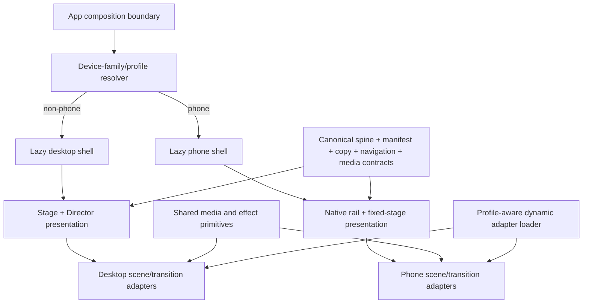
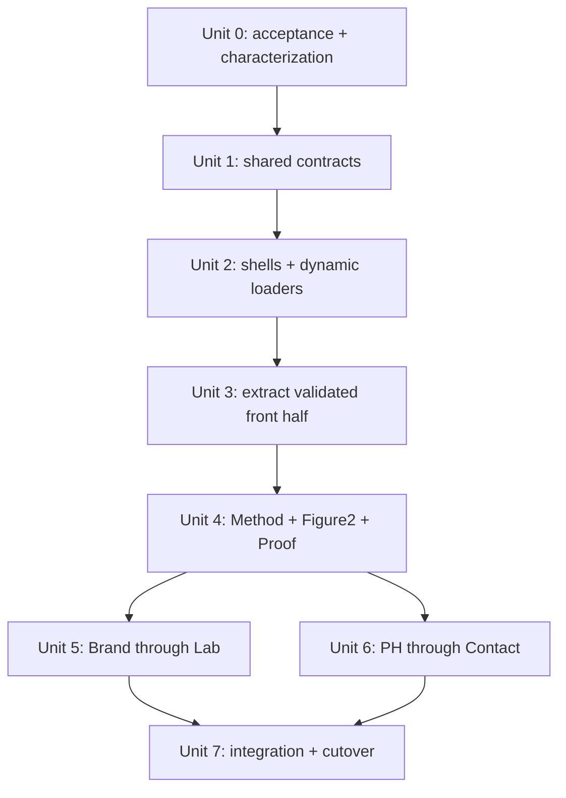
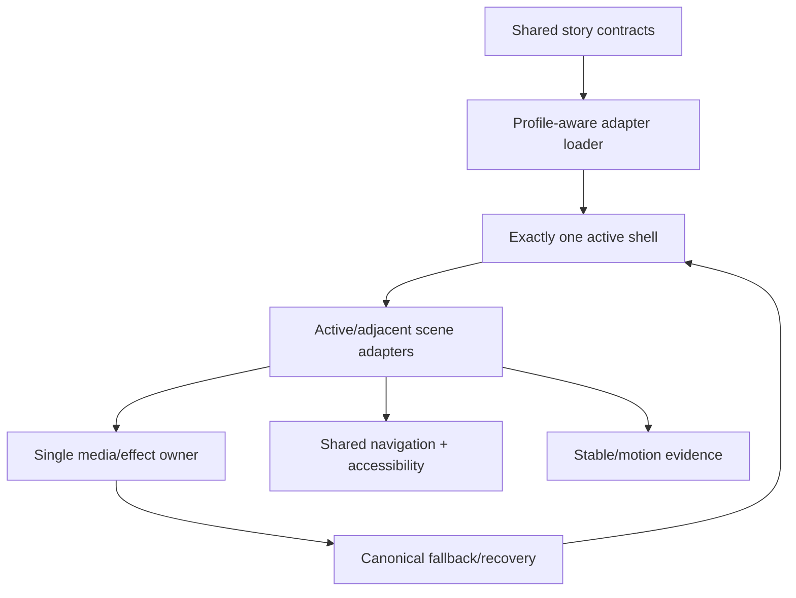

# R5 Responsive Story Split and Migration Plan

## Overview

Turn the validated `v=16` Route B spike into the production phone
presentation without creating either a second product implementation or one
responsive mega-component.

The target architecture is:

> One product core, separate desktop and phone presentation shells,
> scene-sized presentation adapters, and on-demand loading.

The desktop shell keeps the existing Stage/Director behavior. The phone shell
keeps native document scrolling, a viewport-fixed cinematic stage, and
time-owned media where the `v=16` spike proved those behaviors. Both shells
consume the same canonical spine, copy inventory, navigation aliases, media
contracts, fallbacks, and semantic checkpoints.

This is a production extraction and full-story migration plan, not permission
to keep extending the spike. The current spike has already crossed the
boundary this plan is intended to prevent:

| File | Current size | Mixed responsibilities |
| --- | ---: | --- |
| `app/src/production/portrait-spike/PortraitScrollSpike.tsx` | 1,552 lines | shell, scene JSX, timeline, media, input, navigation, evidence |
| `app/src/production/portrait-spike/PortraitScrollSpike.css` | 706 lines | shell geometry plus four scene compositions |
| `app/src/production/StoryApp.tsx` | 759 lines | desktop assembly, readiness, navigation, runtime, recovery |

## Execution Status — 2026-07-22

This section records the implemented migration state; the file-size table above
is the pre-extraction baseline.

The frozen visual source is commit `95d519b` (`?v=17`), which contains the
accepted Safari edge stabilization and the phone-only AOD alpha extension from
timeline progress `0.48` to `0.55`. The current short verification route is
`?v=37`; `?v=16` through `?v=36` remain aliases to the same formal phone shell,
not immutable historical deployments.

| Unit | Status | Implemented evidence |
| --- | --- | --- |
| Unit 0 | Complete; physical acceptance recorded | Shared Loader → Method checkpoints and exact progress stops are frozen in tests. The v23 production route publishes the complete trace through rail-owned and AOD-media-owned time; the critical E2E verifies forward and reverse traversal, the 0.55 alpha endpoint, all three ink handoffs, adjacent endpoint ownership, Pattern edge ownership, terminal AOD backdrop exit, and single scene/media instances. The user confirmed the physical-phone result on 2026-07-21. |
| Unit 1 | Complete | Canonical copy, media IDs, navigation, semantic checkpoints, and renderer-neutral lifecycle contracts remain shared. The boundary verifier rejects shared-to-presentation imports, cross-shell imports, phone-to-spike imports, new shell scene roots, media keys, asset URLs, and scene renderer imports. |
| Unit 2 | Complete; physical fixed-stage acceptance recorded | `App.tsx` freezes one selected desktop/phone family. `DesktopStoryShell` and `PhoneStoryShell` are lazy and mutually exclusive. The phone shell uses `PhoneStageRail`, the exact native fixed-stage geometry, stable visual-viewport width gating, safe-area CSS, and the complete dynamically loaded front-half adapter group. Desktop startup does not request phone presentation chunks. |
| Unit 3 | Complete; physical visual acceptance recorded | Loader, Hero, Pattern, Star Map, AOD, and Method top each have an independent adapter. Hero → Pattern, Pattern → Star Map, Star Map → AOD, and AOD → Method each have a named transition adapter. The shell contains zero scene roots, zero media keys, zero Method content roots, and no scene renderer imports. |
| Unit 4 | v37 viewport-bottom coverage candidate; physical Safari acceptance pending | v36 removed the invalid compositor clips, but physical Safari still exposed one common scene-edge strip. v37 separates the frozen layout clock from an `offsetTop + height` paint-coverage plane that expands before the next frame. |
| Units 5–7 | Not started | No Brand, Figure 3, Services, or later batch starts before Unit 4 receives its own physical-iPhone acceptance. |

### Unit 0–3 cutover record

`PhoneStoryShell.tsx` is now a 322-line coordination shell and
`PhoneStoryShell.css` is a 75-line document/chrome stylesheet. Persistent
stage geometry, viewport sampling, and edge publication are isolated in
`PhoneStageRail`, `usePhoneViewportGeometry`, and `usePhoneEdgeSurface`. Scene DOM,
scene CSS, canvas/video construction, local motion, and transition fields live
under `app/src/production/phone/scenes/` and
`app/src/production/phone/transitions/`. The exact Route B coordinator moved to
`usePhoneStageRuntime`; rail markup moved to `PhoneStageRail`.

The full phone front-half group is loaded only after the phone presentation
family is selected. Loader keeps the accepted two-phrase sequence and the same
Hero/Hero → Pattern/Pattern visual readiness gates. The other adapters prepare
behind that sequence, matching the former monolithic shell's ownership timing.
No media asset was replaced, re-encoded, or added.

The v23 repair also freezes adjacent ink ownership order: inactive transitions
publish their terminal canvas state before scene ownership is committed, and
only the active transition may write a shared endpoint boundary afterward.
This prevents Pattern → Star Map at progress zero from clearing the live
Hero → Pattern reveal boundary.

The current v30 production build reports:

- `totalJsHeadroomBytes: 7,498` (required minimum: 4,096);
- `phoneShellBudgetBytes: 563,227`;
- `largestLazyJsRawBytes: 55,259` (cap: 65,536);
- zero shell-owned scene roots and media keys.

Validation completed for the v21 cutover and rerun successfully for v22 after
the physical-review corrections. The v23 endpoint-order repair adds a focused
unit contract and a live Hero → Pattern receiver-ownership assertion:

- `pnpm -C app typecheck`;
- `pnpm -C app lint`;
- `pnpm -C app test` — 127 files, 749 tests;
- `pnpm -C app build` — module-boundary, media, release, and performance gates pass;
- `PLAYWRIGHT_PORT=4174 pnpm -C app exec playwright test --config playwright.release.config.ts e2e/r5-phone-story.spec.ts --project=desktop-chromium` — forward/reverse chain, Hero → Pattern receiver ownership, Pattern edge ownership, and terminal AOD backdrop exit pass.

The complete desktop production E2E run passes 19 of 23 checks. The four
Reading/Figure2 input-throttle checks also fail identically on the untouched
pre-migration commit `051e495` (including the same `652 → 814` wheel result and
Method witness timeout), so they are recorded as pre-existing test debt rather
than a phone-migration regression. No desktop runtime, scene, transition, or
CSS source changed in this cutover.

### Unit 0–3 physical review record

The user confirmed the v23 physical-phone result on 2026-07-21. The device,
iOS version, and Safari build were not supplied, so those fields remain
unrecorded. The accepted review covered:

- Loading shows only the two accepted four-character phrases;
- Hero title/subtitle entrance and transparent Figure 1 remain unchanged;
- vertical drag has no horizontal sway;
- Pattern's Safari edge replica remains below bloom/wash with no added feather,
  and Pattern/AOD surfaces show no white or dark strip during toolbar collapse;
- Pattern → Star Map → AOD retains all three accepted handoffs;
- AOD uses the `0.48`–`0.55` alpha interval, autoplay owns time, reverse drag
  reverses the media, its sun/cloud backdrop is fully gone at Method, and Method
  enters as one continuous reading section;
- top navigation blur covers the complete safe-area inset;
- orientation and lock/unlock do not remount the shell or replay Loader.

**Gate result:** Unit 4 is open. Units 5–7 remain frozen until the complete
Method → Figure 2 → Proof chain passes its own physical-iPhone review.

### Unit 4 physical-correction candidate

The v24 route first mounted the Grade A batch only when Method approached the
viewport or a Figure2/Proof hash is requested. Method remains one native
document reading section. The batch then contributes one fixed shared stage,
one canonical Figure2 media/camera root, one canonical three-panel Proof
article, and the existing authored Method → Figure2 Ink and Figure2 depth/Ink
timeline. Proof does not create a nested scrollport.

Direct `#figure2-animation` and `#figure2-proof-*` entry settles the upstream
AOD at its accepted terminal state before positioning the requested scene. The
Proof alias offset is derived from the available document track range, so the
requested opening/cards/closing panel remains exact in portrait and the shorter
landscape track.

The first physical v24 review was rejected: the two Figure2 people and part of
the cold scene could be missing, Proof cards sat too far left, and Pattern/AOD
could still reveal a second scrolling surface while Safari collapsed its
toolbar. v25 corrects those three failures without opening Unit 5:

- scenes mount first, Figure2 presents and verifies its opening video frame,
  then the two transition adapters mount; only after all four readiness gates
  pass may the fixed Grade A surface become active;
- the eager Figure2 terminal-frame preparation that could invalidate the cold
  opening-frame run is removed, video preload is `auto`, and adjacent prewarm
  begins around Pattern rather than near the end of Method;
- Proof content uses a 24px portrait inset before its internal text column;
- Pattern/AOD rails are transparent, leaving the fixed root canvas as the only
  browser-toolbar fallback; Pattern uses a stable `100lvh` cover matrix and
  AOD's toolbar band feathers into the same solid paper root.

The second physical v25 review found one additional media-path defect: on
iPhone Safari the direct HEVC-alpha Figure2 pair showed a conspicuous light
fringe compared with the canonical WebM. v26 does not retouch, mask, shrink, or
reposition the pair. It keeps the single canonical Figure2 video owner, swaps
only the phone source to a side-by-side RGB/alpha H.264 stream, and composites
that frame through the same premultiplied-alpha WebGL path already used by the
accepted Figure1 and AOD adapters. Desktop continues to select the untouched
WebM/HEVC sources.

The v26 packed source is deterministically rebuilt from the frozen WebM by
`app/scripts/rebuild-figure2-packed-alpha-media.mjs`. FFmpeg 8.1 qualification
records 156 frames at 30 fps, six keyframes with a 30-frame maximum GOP,
alpha SSIM `0.986634`, color SSIM `0.982710`, and an exact frozen SHA-256.

The v25 controlled-browser evidence completed on 2026-07-21:

- 390×844 forward and reverse traversal publishes `method-to-figure2`,
  `figure2-stage`, `figure2-to-proof`, and all three Proof checkpoints in both
  directions;
- Figure2 deterministic seeking reaches `1.8047s` forward at the midpoint,
  `2.6s` at the terminal frame, and `3.3892s` while reversing through the same
  midpoint;
- direct Proof cards entry lands at progress `0.5001`, with exactly one
  Figure2 root, one Proof root, and one `r2-stage` host;
- direct Figure2 entry settles the rail at `top: 0`, reports all readiness
  gates `true`, presents the pair at video time `0`, and keeps video opacity at
  `1` before the Grade A stage becomes active;
- Proof cards now occupy `x=24..366` at 390px width, while their internal copy
  begins at the intended second column;
- Pattern and AOD publish transparent moving rails; Pattern's root background
  resolves to stable `390×844` gradient planes plus a `1500.44×844` cover
  image, and AOD resolves to the same `#ede4d2` root as its solid toolbar band;
- reduced-motion direct Proof entry preserves the canonical opening and all
  copy with `overflow-y: visible` and nested `scrollTop: 0`;
- cold 390×667 portrait keeps the complete Figure2 focal pair and all Proof
  cards inside the safe frame;
- cold 844×390 landscape keeps the complete focal pair visible and positions
  Proof cards at exact progress `0.5000`.

Focused v26 browser qualification at 390×844 confirms that the phone adapter
requests the emitted packed H.264 source, decodes it at `1584×660`, composites
to the canonical `792×660` Canvas, hides the source video, and presents only
the verified Canvas. At forward midpoint the media and Canvas clocks both read
`1.8053s`; after crossing the terminal leg and reversing to the midpoint both
read `3.3886s`. The root remains `verified`, Canvas opacity is `1`, source-video
opacity is `0`, and no console error is emitted.

Automated verification for the v26 candidate:

- `pnpm -C app typecheck`;
- `pnpm -C app lint`;
- `pnpm -C app test` — 131 files, 766 tests;
- `pnpm -w run build` — module-boundary, media, release, and performance gates
  pass with the headroom recorded above.

The physical v26 review remained rejected. The packed-alpha pair fixed the
Figure2 decoder path, but Safari toolbar collapse could still separate
Pattern's bottom wash from a second background surface and AOD could still
expose content below the fixed stage. The supplied portrait arch was also not
yet part of the phone composition. Those findings are preserved rather than
reclassifying v26 as accepted.

v27 corrects the remaining review items without changing scene timing:

- `PhoneStageRail` owns one fixed, inert backplate at z=9 behind the authored
  stage at z=10. Its overscan is stable CSS geometry based on the large/small
  viewport difference and safe area; it never follows `visualViewport` and
  cannot oscillate against native scrolling.
- Pattern removes paint containment only for its own scene. The accepted
  background image and wash mirror their exact top/bottom edge pixels into the
  same transformed stage plane, while the existing bloom Canvas renders across
  the complete overscan with its authored `50%, 28%` visible center preserved.
  The document/root fallback remains behind this surface rather than becoming
  a competing visible layer.
- AOD uses the same flat `#ede4d2` surface for its scene, root, rail fallback,
  and backplate. Content below the stage is therefore occluded during toolbar
  movement without extending or moving Method markup.
- The user-supplied `Image 1 (1).png` is adopted as
  `assets/figure2-phone-foreground-arch.webp`. The final 1512×2688 alpha WebP
  preserves the supplied pixels and removes only the connected central black
  aperture; it is one phone-only retained foreground surface across Figure2
  and Proof. An image-generation redraw was rejected because it altered the
  arch geometry.
- Figure2 continues to use the v26 packed H.264 + premultiplied-alpha WebGL
  Canvas. Rebuilding from the frozen WebM still produces the exact
  `d472ec0767f1d113ae8020ed232c763ba53c5821deb725660601172954bc63ef`
  SHA-256 and passes the recorded alpha/color SSIM gates.

Controlled 390×844 verification forces the fixed stage upward by 128px to
model a delayed Safari compositor resize. Pattern's scene now has
`overflow: visible` and `contain: layout`; its bloom Canvas spans y=-320..908
while the shifted stage ends at y=716, and the mirrored image/wash remain
continuous through the exposed bottom area. The true AOD opening frame with
sun, cloud, and figure uses the same uninterrupted paper surface under the
same displacement. Figure2 presents only the verified 792×660 packed-alpha
Canvas, keeps its source video hidden, and retains the new foreground arch.

Automated verification for the v27 candidate:

- `pnpm -C app lint`;
- `pnpm -C app test` — 131 files, 766 tests;
- `pnpm -w run build` — 51 media files, 31 WebP, runtime media
  `81,369,432 B`, desktop static path `33,541,852 B`, and all module-boundary,
  release, media, and performance gates pass;
- focused desktop Chromium phone E2E — 3/3 pass, covering the complete v23
  checkpoint trace, the forced Pattern/AOD compositor gap, and the v27
  Method ↔ Figure2 ↔ Proof chain with one retained arch and one packed-alpha
  Canvas owner.

**Gate result:** v27 was sent to physical-iPhone review at `?v=27` and was
rejected. Unit 4 remained open, no commit/push was made, and Units 5–7 stayed
frozen.

### Unit 4 v28 Safari edge and Figure2 readiness correction

The physical v27 review found two blocking failures: upward Safari toolbar
collapse still exposed a second surface below Pattern and AOD, and Figure2's
entire 660lvh chapter could remain hidden. The previous Chromium check that
artificially translated the stage by 128px did not model WebKit's page-edge
color-extension selection and is retired as acceptance evidence.

Official WebKit implementation evidence shows that edge-color candidates are
sampled from fixed/sticky viewport-sized containers and rejects candidates
larger than roughly 1.05× the viewport. The v27 oversized backplate could
therefore be ignored while the real fixed stage still advertised a hardcoded
dark background. v28 establishes one edge surface instead:

- the oversized fixed backplate, Pattern mirror planes, and Pattern/AOD toolbar
  edge replicas are removed;
- the existing fixed stage remains within WebKit's viewport candidate range
  and publishes `--portrait-edge-surface` for the active scene;
- Pattern keeps one fixed document-root image behind its transparent rail and
  AOD uses one flat `#ede4d2` scene/root/rail surface;
- fixed stage height retains `100lvh` coverage, while visual-viewport height
  changes during toolbar collapse do not move or resize the rail mid-gesture.

The missing Figure2 chapter was a separate readiness deadlock. The Grade A
surface previously waited for the first packed-video WebGL frame before it
could become visible; an iOS decode/upload stall therefore hid both the media
and the complete chapter. v28 keeps the packed H.264 + premultiplied-alpha
Canvas as the preferred path but changes the gate:

- every physical `touchstart` and `touchmove` directly unlocks currently
  mounted lazy videos with passive listeners;
- an exact transparent opening frame from the frozen WebM is immediately
  present in the canonical media stack and independently satisfies visual
  readiness;
- packed-media readiness is diagnostic rather than a scene-visibility gate;
  after three seconds without a verified frame the same stack remains visible
  in `poster-fallback`, and a later decoded frame upgrades it to `verified`;
- the poster is rebuilt deterministically at 792×660 with cwebp 1.6.0,
  quality 90 and lossless alpha (`137,782 B`, SHA-256
  `3875fe03a65e46003a35e9267877dd8716df83c74248be229acbe3104714e118`).

Controlled 390×844 verification covers both paths. With normal media, the
Figure2 checkpoint is active and visible with one verified Canvas owner. With
the packed MP4 blocked, the same chapter remains active and complete in
`poster-fallback`; no console warning/error is emitted and no second Figure2
root or video owner appears.

Automated verification for the v28 candidate:

- `pnpm -C app typecheck`;
- `pnpm -C app lint`;
- `pnpm -C app test` — 131 files, 767 tests;
- `pnpm -w run build` — 52 media files, 32 WebP, runtime media
  `81,507,214 B`, desktop static path `33,541,852 B`, WebP total
  `11,527,608 B`, and all module-boundary, release, media, and performance
  gates pass;
- deterministic Figure2 rebuild — 156 frames, six keyframes, alpha SSIM
  `0.986634`, color SSIM `0.982710`, and unchanged packed-video SHA-256.

**Gate result:** v28 is ready for physical-iPhone review at the short `?v=28`
route. Pattern/AOD edge behavior is not accepted until that real Safari review
passes. Figure2 has both normal and decoder-stall evidence, but Unit 4 remains
open; no commit/push is made and Units 5–7 remain frozen.

### Unit 4 v29 persistent viewport and Grade A ownership correction

The physical v28 review rejected four remaining behaviors: Proof's three detail
rows sat too far left; Figure2 → Proof z-depth ink transformed and covered the
foreground arch; Method → Figure2 exposed Figure2 while Method copy was still
in the viewport; and Safari toolbar collapse still revealed a mismatched lower
surface in Pattern, AOD, and Figure2.

The shared root cause of the last failure was ownership, not another missing
`dvh` declaration. The front half used one oversized fixed stage while Grade A
created a second fixed stage, and only the front-half runtime published the
document edge color. v29 replaces that arrangement with:

- one exact-viewport persistent host from Hero through Proof, retained in the
  DOM and used as WebKit's single page-edge color candidate;
- one inner `100lvh` scene canvas, so toolbar height changes reveal a stable
  visual canvas without resizing or translating the authored composition;
- a single edge coordinator that updates `html`, `body`, `#root`, the host,
  and `theme-color` from the active scene, including Figure2's own `#e2dac9`
  edge rather than AOD's paper token;
- Pattern, AOD, and Figure2 terminal backgrounds converging inside the stable
  canvas over `100lvh - 100svh + safe-area`, with no second fixed backplate;
- Grade A surfaces portalled into the persistent host as an absolute layer,
  while Method document copy stays above the host until it fully exits;
- a new one-viewport Method → Figure2 handoff segment before the canonical
  360lvh Figure2 timeline, so the receiver cannot enter while Method remains;
- a fixed phone arch (`z-index: 90`) above z-depth ink (`z-index: 81`) that no
  longer receives the shared depth scale/blur variables;
- a 16px inward shift of the Proof cards' left boundary without moving the
  opening or closing panels.

Automated verification for the v29 candidate:

- `pnpm -C app lint`;
- `pnpm -C app test` — 131 files, 769 tests;
- `pnpm -w run build` — 52 media files, 32 WebP, runtime media
  `81,507,214 B`, phone shell budget `562,795 B`, total JS headroom `7,646 B`,
  and all module-boundary, release, media, and performance gates pass;
- browser rendering confirms one persistent host, Grade A portal ownership,
  Method above the inactive host, Pattern/AOD/Figure2/Proof edge-token changes,
  a zero-area Figure2 reveal at the Method boundary, fixed arch variables and
  z-order, shifted Proof detail rows, and no console warnings/errors.

**Physical result:** v29 was rejected. On the actual Safari,
`100lvh - 100svh` produced a much taller solid terminal band than the browser
edge that it was intended to protect: Pattern lost more of its image and AOD
was covered across roughly half the viewport. The additional handoff viewport
also removed Method copy before Figure2 entered, while the fixed arch inherited
its default `3.6px` blur without the authored enlargement.

### Unit 4 v30 physical-device correction

v30 retains the part of v29 that solved the ownership problem—one persistent
fixed host and one stable `100lvh` inner canvas—but removes the three incorrect
visual/timeline assumptions:

- Pattern, AOD, and Figure2 no longer paint a terminal overlay derived from
  `100lvh - 100svh`; the authored scene once again fills the complete stable
  canvas. Pattern additionally restores its same-image fixed document backdrop,
  so any browser-owned edge exposure samples the scene rather than a flat band.
- Method → Figure2 again uses the entering viewport for the ink handoff. The
  Method document remains at z=11 above the persistent host at z=10, so Method
  copy owns the upper viewport while Figure2 can only appear below its moving
  document boundary; no duplicate full-screen Figure2 surface is introduced.
- Grade A returns to 660lvh total / 360lvh Figure2 / 300lvh Proof (600/320/280
  in compact landscape), with Figure2 deep links positioned at the canonical
  rail start instead of one viewport later.
- The phone arch remains above Figure2 → Proof ink and excluded from the shared
  z-depth mutation. Its phone-owned entrance now scales from 1.025 to 1.135 and
  resolves from 3.6px blur to 0px over the Figure2 intro, ending as a clear
  close foreground.
- The Proof closing sequence renders “先进现场，”“再定章法，”“陪你跑到账上有数。”
  as three non-wrapping phone lines without changing the canonical sentence.

Automated verification for v30 covers the restored handoff/rail maps,
independent arch frame, exact closing copy, edge fallback contract, and short
route:

- `pnpm -C app typecheck` and `pnpm -C app lint` pass;
- `pnpm -C app test` passes 131 files / 770 tests;
- `pnpm -w run build` passes all module, media, release, and performance gates
  with 52 media files, 32 WebP, `81,507,214 B` runtime media,
  `563,227 B` phone-shell budget, and `7,498 B` total JS headroom.

**Physical result:** v30 was rejected. The Method reading stacking context and
its paper reservation crossed above the persistent AOD host, the document's
rectangular background hid the Method → Figure2 ink contour, and the phone arch
became clearer while enlarging instead of becoming and remaining blurred.

### Unit 4 v31 ownership and motion correction

v31 changes the ownership at the two exact boundaries instead of adding another
viewport patch:

- Method receives `z-index: 11` only after the front fixed stage releases
  ownership. While AOD is active, the Method reading and its reserved paper sit
  below the persistent host; only the fixed Method bridge can rise above it.
- During Method → Figure2, the document paper becomes transparent and a fixed
  Method paper surface is passed as the ink adapter's `from` owner. The adapter
  now clips complementary Method and Figure2 surfaces with the same ink field,
  so the lower boundary is the authored ink contour rather than the document
  rectangle. Method copy remains in the real document above that surface.
- The foreground arch begins clear at scale `1.025`, then enlarges to `1.135`
  while blur rises from `0px` to `3.6px`. It stays fixed above the later
  Figure2 → Proof z-depth ink and retains the enlarged blurred endpoint.

Automated verification for v31 covers the conditional Method stacking owner,
the complementary Method ink surface, the independent arch frame, and the short
route:

- `pnpm -C app typecheck` and `pnpm -C app lint` pass;
- `pnpm -C app test` passes 131 files / 770 tests;
- `pnpm -w run build` passes all module, media, release, and performance gates
  with 52 media files, 32 WebP, `81,507,214 B` runtime media,
  `563,522 B` phone-shell budget, and `7,488 B` total JS headroom.

**Physical result:** v31 closed Method → Figure2 and the Figure2 foreground.
Physical Safari still exposed the Method reading's viewport-height paper
reservation over AOD, so AOD → Method remained open.

### Unit 4 v32 AOD → Method paper-reservation correction

v32 keeps the Method reservation height that prevents the five Method steps
from entering the AOD viewport early, but makes the reservation and its parent
reading background transparent whenever `data-portrait-stage-active="true"`.
The AOD host is therefore the only opaque full-viewport owner during autoplay;
the fixed Method bridge can still fade its copy above AOD. Once the stage
releases ownership, Method restores its paper background and z=11 document
ownership. The already accepted Method → Figure2 contour and arch motion are
unchanged.

Automated verification for v32 covers the transparent active-stage Method
reservation and parent, the restored inactive-stage Method owner, and the short
route:

- `pnpm -C app typecheck` and `pnpm -C app lint` pass;
- `pnpm -C app test` passes 131 files / 770 tests;
- `pnpm -w run build` passes all module, media, release, and performance gates
  with 52 media files, 32 WebP, `81,507,214 B` runtime media,
  `563,532 B` phone-shell budget, and `7,478 B` total JS headroom.

**Physical result:** v32 did not close AOD → Method. Its Method reservation was
transparent, but the later Grade A portal was already mounted in the persistent
stage; descendants with explicit visible state could still paint its opaque
Method paper through the portal's inherited `visibility: hidden`.

### Unit 4 v33 AOD ownership and Pattern edge correction

v33 closes the two actual ownership gaps without changing any accepted
timeline, ink contour, Method → Figure2 handoff, or foreground-arch motion:

- inactive `.phone-grade-a__surfaces` now owns `opacity: 0`; its descendants
  cannot override that parent composite, so the z=95 Method paper no longer
  covers AOD. When Grade A becomes active, the same owner switches to opacity
  one;
- the fixed `.portrait-scroll-spike__stage` now carries Pattern's calibrated
  image plate whenever `data-portrait-edge-scene="pattern"`. Its three
  background layers use the stable `--portrait-stage-height`, so Safari's
  dynamic-toolbar repaint cannot reveal a separately coloured band;
- AOD's canonical `0.48 → 0.55` phone alpha mapping, paper/mist tracks, and
  forward/reverse packed-alpha media remain unchanged.

Browser verification at 390×844 confirms the AOD figure, sun, and cloud remain
visible before autoplay, during forward autoplay, and after reverse completion;
the inactive Grade A portal remains at opacity zero throughout AOD ownership.
The Pattern edge publishes its actual image on both the document surface and
the fixed viewport host with stable-lvh sizing.

Automated verification for v33:

- `pnpm -C app typecheck` and `pnpm -C app lint` pass;
- `pnpm -C app test` passes 131 files / 770 tests;
- `pnpm -w run build` passes all module, media, release, and performance gates
  with 52 media files, 32 WebP, `81,507,214 B` runtime media,
  `563,542 B` phone-shell budget, and `7,468 B` total JS headroom.

**Gate result:** the physical-iPhone pass accepted the AOD ownership correction
but rejected Pattern continuity. The host image was a terminal `0.94` wash while
the live scene was still between `0.54` and `0.94`; the document carried a
third, differently sized copy. v33 is therefore superseded by v34.

### Unit 4 v34 single Pattern plate and rejected host merge

v34 correctly removed the mirrored Pattern backgrounds: `PhonePattern` became
the only owner of its image, bloom, and live `0.54 → 0.94` wash, while the
document, rail, host, and `theme-color` retained only solid emergency colors.
It also correctly delayed the Method → Figure2 fallback color until the ink
field crossed its `0.001` edge threshold.

The shared viewport change in the same revision was rejected on physical
Safari. It merged the current-viewport fixed host and stable-lvh canvas into
one oversized fixed compositing chain. Figure2 then exposed the host's
`#e2dac9` fallback during toolbar collapse. In addition, height-only
`visualViewport.resize` events wrote a new stage-coverage CSS value before the
early return, allowing Pattern and Figure2 visual geometry to resize even
though the scroll clock stayed frozen. The desktop assertion that host and
canvas heights were equal encoded this regression and provided no coverage of
the real `724 → 844` Safari toolbar path.

Automated verification for v34 passed 131 files / 771 tests and all build
gates, but the physical-iPhone result supersedes those structural checks.

### Unit 4 v35 split viewport geometry

v35 keeps the valid v34 ownership changes and restores the two-layer viewport
contract:

- the fixed host again uses `inset: 0; height: auto; min-height: 0`, so its
  clipping surface follows Safari's current visible viewport;
- the child canvas independently uses `height:
  var(--portrait-stage-height)`, whose floor remains `100lvh`, so scene
  geometry stays on one stable maximum-height visual plane;
- height-only toolbar resizes update diagnostic data attributes only. They
  return before any stage-coverage CSS write or scroll-stage refresh; width or
  orientation changes still rebuild geometry normally;
- Pattern keeps exactly one scene-owned image/bloom/wash plate. Its unused
  `will-change: transform, opacity` hint is removed so the full-screen wrapper
  does not create an unnecessary Safari compositing layer;
- the v34 Method → Figure2 ink-edge fallback timing remains unchanged.

The automated contract now checks the split host/canvas geometry and verifies
that the height-only early return precedes every stage-coverage CSS write. The
desktop structural check no longer requires host and canvas heights to match
and does not claim to simulate Safari toolbar compositing.

Automated verification for v35:

- `pnpm -C app typecheck` and `pnpm -C app lint` pass;
- `pnpm -C app test` passes 131 files / 771 tests;
- `pnpm -w run build` passes all module, media, release, and performance gates
  with 52 media files, 32 WebP, `81,507,214 B` runtime media,
  `564,018 B` phone-shell budget, and `7,448 B` total JS headroom.

**Gate result:** iOS 26.3 measured the current viewport and fixed host at
`714px`, while `100lvh`, the stage canvas, Pattern, and Figure2 were all
`754px`. The split geometry is therefore correct. The remaining strip is the
host fallback exposed while WebKit expands the host's `overflow: clip` region
before repainting the transformed child compositing layers. v35 is superseded
by v36 without further viewport formula changes.

### Unit 4 v36 compositor topology

v36 changes paint ownership rather than geometry:

- the dynamic-height fixed host keeps positioning and the emergency edge
  color, but uses `overflow: visible` and no `transform`,
  `backface-visibility`, or `isolation`;
- the stable-lvh stage canvas retains `overflow: clip` as the one outer scene
  boundary, without a forced transform/backface compositing layer;
- phone scene roots paint visibly into that stable canvas and retain layout
  containment only; `contain: paint` and the redundant scene isolation are
  removed;
- the portaled Grade A surface no longer clips or forces a translated backing
  layer;
- the phone Figure2 root overrides the shared desktop root's outer
  `overflow: hidden` and `isolation: isolate`, and removes its extra
  `translateZ(0)`/backface layer. Figure2's intentional internal masks and
  animated transforms remain unchanged;
- Pattern's single plate, the AOD alpha timing, Method → Figure2 edge timing,
  and all viewport-height calculations remain unchanged.

The structural contract rejects any reintroduction of a clip or forced GPU
layer on the dynamic host, stage canvas, Grade A surface, or Figure2 root.

Automated verification for v36:

- `pnpm -C app typecheck` and `pnpm -C app lint` pass;
- `pnpm -C app test` passes 131 files / 771 tests;
- `pnpm -w run build` passes all module, media, release, and performance gates
  with 52 media files, 32 WebP, `81,507,214 B` runtime media,
  `564,028 B` phone-shell budget, and `7,438 B` total JS headroom.

**Physical acceptance for `?v=36`:** with Safari's address bar fully expanded,
make one upward swipe through Pattern, AOD, and the beginning of Figure2 until
the bar collapses. The previously hidden bottom `40px` of the stable canvas
must already be painted, with no `#d9c08f`, paper-color, or moving gradient
strip. Cross AOD → Method and Method → Figure2 slowly in both directions to
confirm the existing masks and ink contour remain unchanged. Visual acceptance
belongs to the physical-device pass; Units 5–7 remain frozen until it succeeds.

**Gate result:** physical iOS screenshots rejected v36. Hero/Method, Pattern,
AOD, and Figure2 all exposed the same approximately `10 CSS px` solid strip at
the bottom, and each strip matched that scene's published emergency edge
surface. The common canvas was already at the `100lvh` floor, so this was not a
second per-scene wash or asset regression. The missing coordinate was the
visual viewport's layout-relative lower edge: `offsetTop + height`.

### Unit 4 v37 split layout clock and paint coverage

v37 keeps the accepted v36 compositor topology and changes only the common
viewport coverage contract:

- the layout plane remains `max(--portrait-live-height, 100lvh)` and continues
  to own scroll distance, progress checkpoints, scene cameras, and transition
  timing;
- a separate canvas plane uses the greater of that stable layout height and
  `ceil(visualViewport.offsetTop + visualViewport.height)`;
- `visualViewport.resize` and `visualViewport.scroll` schedule coverage in the
  next animation frame, without the layout pipeline's `180ms` debounce;
- coverage is monotonic while width is stable. Width/orientation/fullscreen
  changes reset it to the new coordinate space;
- height-only toolbar events still cannot rewrite `--portrait-live-height`,
  the rail distance, or the ScrollTrigger clock;
- the stage runtime reads its frozen configured scroll distance instead of
  subtracting the now-expandable canvas height from the rail;
- the portaled Figure2 outer surface inherits the coverage canvas height, while
  its camera and authored depth motion remain bound to the stable layout
  height. Hero, Pattern, AOD, Method, ink fields, and their timelines are not
  changed.

The structural contract now rejects re-coupling canvas coverage to the layout
height, verifies the visual-viewport scroll listener, and verifies that the
layout sync contains no stage-coverage write. The viewport unit test covers
fractional and negative offsets plus monotonic/reset behavior.

Automated verification for v37:

- `pnpm -C app typecheck` and `pnpm -C app lint` pass;
- `pnpm -C app test` passes 131 files / 773 tests;
- `pnpm -w run build` passes all module, media, release, and performance gates
  with 52 media files, 32 WebP, `81,507,214 B` runtime media,
  `564,993 B` phone-shell budget, and `7,428 B` total JS headroom.

No desktop browser preview or Playwright visual run is claimed for this Safari
defect. Physical acceptance belongs to `?v=37`: enter with the address bar
expanded, make one upward swipe through Pattern, AOD, and Figure2, and confirm
that the bottom edge remains continuous while the bar collapses. Units 5–7
remain frozen until the user accepts that pass.

## Problem Frame

Plan 012 selected Route B after the native-scroll/fixed-stage vertical slice
produced materially better phone hand feel than the repaired Stage/Director
route. The spike now demonstrates the critical front half—Loader, Hero,
Pattern, Star Map, AOD, and the continuous Method reading entrance—but it
does so inside one experiment component.

Bulk migration directly inside that component would:

- duplicate presentation and product decisions;
- make desktop and phone regressions inseparable;
- load unrelated scene code and media too early;
- turn every new scene into another conditional branch;
- make cleanup, reverse playback, direct navigation, and accessibility
  ownership increasingly fragile.

The split must happen before the remaining scenes are migrated.

## Requirements Trace

- **R1 — One product authority:** canonical scene order, copy, hashes, media
  contracts, semantic checkpoints, and fallbacks remain shared.
- **R2 — Separate render ownership:** desktop retains Stage/Director; phone
  retains native scroll plus a fixed cinematic stage.
- **R3 — Scene module boundaries:** shell files contain no scene-specific JSX,
  asset URLs, or motion constants; each adapter owns one scene or one named
  transition.
- **R4 — On-demand loading:** only the selected shell and the active/adjacent
  scene adapters are loaded or prewarmed.
- **R5 — One accessible story:** only one shell is mounted, with one copy tree
  and one active media owner.
- **R6 — Behavioral parity:** the accepted `v=16` front-half motion, reverse
  behavior, viewport handling, and reading continuity survive extraction.
- **R7 — Full migration:** every canonical scene and transition has a reviewed
  phone adapter or an explicit endpoint/dissolve fallback.
- **R8 — Budget safety:** the migration restores JavaScript headroom before
  adding the back half and does not raise existing media, canvas, memory, CSS,
  or release budgets.
- **R9 — Release evidence:** Chromium, WebKit, portrait/landscape phone,
  desktop regression, reduced motion, direct navigation, and physical-iPhone
  motion evidence pass before cutover.

## Scope Boundaries

### In scope

- record the Route B decision in Plan 012;
- extract shared product contracts from presentation-specific modules;
- split desktop and phone shells at the application composition boundary;
- split `PortraitScrollSpike` into shell, runtime, scene, transition, and
  media-owned modules;
- load shells and presentation adapters through dynamic imports;
- migrate the complete canonical story in dependency-ordered batches;
- preserve phone portrait state through toolbar and orientation changes;
- remove the experimental route after production cutover;
- add architecture, bundle, lifecycle, and release gates.

### Out of scope

- two independently maintained manifests, copy inventories, navigation maps,
  or media registries;
- mounting desktop and phone shells simultaneously and hiding one with CSS;
- rewriting the desktop presentation to use native scroll;
- forcing the phone presentation back through the desktop Director;
- new copy, a new visual system, or unapproved replacement media;
- raising budgets to accommodate migration growth;
- custom Grade B animation where a reviewed endpoint/dissolve is sufficient.

## Context and Local Research

### Existing authorities to preserve

- `app/src/story/canonical-spine.ts` owns canonical scene and segment order.
- `app/src/story/manifest.ts` derives policies, copy, media playback, and
  fallback contracts from the migration inventory.
- `docs/react-refactor/inventory/copy-reference.json` is the copy authority
  already consumed by both production and the portrait spike.
- `app/src/production/navigation.ts` owns public hashes and aliases.
- `app/src/media/packed-alpha-video.ts` is already presentation-neutral and can
  serve scene adapters in either shell.

### Existing loading and lifecycle patterns

- `app/src/production/module-loaders.ts` dynamically imports scene and
  transition modules by canonical ID and caches successful loads.
- `app/src/production/adjacent-prewarm.ts` provides the existing look-ahead
  pattern.
- `app/src/story/registry.ts` owns handle readiness and guarded media/build
  gates.
- `app/src/story/types.ts` currently combines product definitions with
  presentation component/lifecycle contracts; that seam must be made explicit
  instead of duplicated.

### Findings that shape the split

- `StorySpine`, `HandleRegistry`, and `SegmentPlayer` are central shared
  abstractions; neither shell should fork them casually.
- `StarFieldReveal` is already a highly connected effect engine. Its camera and
  rendering configuration should be injected by a scene adapter rather than
  expanded with shell detection.
- `PortraitScrollSpike` proves the phone presentation route, but its current
  size and responsibility mix make it an executable specification, not a
  production module template.
- The release build currently has only 509 bytes of JavaScript headroom against
  the required 4,096-byte margin. Shell and scene chunking is therefore a
  prerequisite for bulk migration, not end-of-project cleanup.

External research was intentionally omitted for the original architecture
split because the repository already contained the relevant Stage/Director,
native-scroll, loader, registry, media, transition, and release-budget
patterns. The later v28–v29 Safari corrections additionally use WebKit's official
[page-edge color-extension implementation](https://github.com/WebKit/WebKit/pull/49187)
and its linked [fixed-element sampling bug](https://bugs.webkit.org/show_bug.cgi?id=297182)
to constrain the single-surface design.

## Key Technical Decisions

| Decision | Selected approach | Rationale |
| --- | --- | --- |
| Product ownership | Shared canonical core | Prevents copy, navigation, media, and fallback drift |
| Presentation ownership | Desktop shell + phone shell | The two input and layout models are intentionally different |
| Phone orientation | One phone shell handles portrait and landscape compatibility | Avoids remounting the story and losing chapter/media state on rotation |
| Scene variance | Per-scene presentation adapters | Keeps responsive differences local and testable |
| Transition variance | Per-transition adapters with shared effect primitives | Preserves named visual contracts without shell conditionals |
| Loading | Dynamic shell and adapter imports with adjacent prewarm | Restores bundle headroom and limits active media |
| Spike lifecycle | Characterization source, then deletion | Prevents a permanent third implementation |

### Alternatives rejected

| Alternative | Why it is rejected |
| --- | --- |
| Two complete desktop/mobile applications | Duplicates product logic and guarantees long-term parity drift |
| One `StoryApp` with device branches throughout | Converts every scene, transition, and lifecycle into a mega/god component |
| Keep adding scenes to `PortraitScrollSpike` | The spike already mixes too many owners and is over 1,500 lines |
| Force both surfaces through Stage/Director | Reintroduces the phone interaction failure that Route B was created to solve |
| Mount both shells and hide one | Duplicates accessibility trees, media preload, memory, and side effects |

## Open Questions

### Resolved during planning

- **One application or two:** one deployable application with a shared product
  core and two lazy presentation shells.
- **Phone orientation ownership:** one phone shell remains mounted across phone
  portrait/landscape changes so semantic and media state are preserved.
- **Where responsive branching belongs:** shell selection happens once at the
  composition boundary; scene/camera differences belong to adapters rather
  than shared effect engines.
- **What happens to `v=16`:** it remains a characterization harness during
  migration and is deleted after production phone evidence passes.
- **How parallel migration avoids merge conflicts:** each batch owns separate
  scene/transition directories and a separate adapter-group registration
  module; the shared loader is changed once by the integration owner.

### Deferred to implementation

- **Grade B presentation choice:** select reviewed phone camera versus
  endpoint/dissolve per bridge during physical-device visual review.
- **Prewarm distance:** choose the adjacent media look-ahead from measured
  decode cost and memory traces without changing the one-active-owner rule.
- **Large cohesive renderer exception:** decide whether an effect engine
  warrants a documented size exception only after responsibilities have been
  separated and its focused tests are in place.

## High-Level Technical Design

> This illustrates the intended approach and is directional guidance for
> review, not implementation specification. The implementing agent should
> treat it as context, not code to reproduce.

The prose contracts are authoritative if the diagram and implementation
details diverge.

## Module Boundary Contract

### Shared product core

`app/src/story/`, the copy inventory, shared navigation, and shared media
contracts may describe what exists, its semantic order, readiness, fallback,
and public identity. They must not inspect viewport classes or import
presentation CSS.

### Presentation shells

- `app/src/production/desktop/` owns Stage/Director assembly and desktop input.
- `app/src/production/phone/` owns native document scroll, fixed-stage
  geometry, viewport/safe-area handling, and phone evidence state.
- A shell may load adapters and shared chrome. It must not contain scene DOM,
  scene asset URLs, or scene-specific progress math.

### Scene and transition adapters

- A scene adapter owns one scene's markup, local refs, composition, and hold
  rendering for one presentation family.
- A transition adapter owns one named `from → to` handoff.
- Shared effect engines accept explicit camera/timing/configuration inputs and
  do not branch on user agent or shell.
- CSS follows the same boundary: shell geometry, scene composition, and
  transition effects are separate files.

### Anti-god-file gates

- Composition/orchestrator files target at most 300 lines and may not contain
  scene markup.
- A presentation adapter targets at most 400 lines; larger cohesive render
  engines require a documented exception and focused tests.
- No module owns JSX for multiple canonical scenes.
- No shell imports files directly from `assets/`.
- Architecture tests enforce import direction and forbidden responsibility
  combinations; line limits are a warning backed by responsibility checks,
  not the sole quality measure.

## Implementation Units

### Unit 0 — Freeze the Route B executable contract

**Goal:** establish the accepted `v=16` behavior as characterization evidence
before moving responsibilities.

**Requirements:** R6, R8, R9

**Dependencies:** final physical-iPhone approval of the current front-half
visual corrections.

**Files:**

- Modify: `docs/plans/2026-07-17-012-fix-r5-portrait-interaction-motion-plan.md`
- Modify: `app/src/production/portrait-spike/PortraitScrollSpike.contract.test.ts`
- Modify: `app/e2e/r5-production.spec.ts`
- Modify: `app/e2e/r5-performance.spec.ts`
- Create: `app/src/production/portrait-spike/portrait-checkpoints.ts`
- Test: `app/src/production/portrait-spike/portrait-checkpoints.test.ts`

**Approach:**

- Record the Route B decision and Route A rejection in Plan 012.
- Name semantic checkpoints for Loader, Hero, Pattern, Star Map, AOD, and
  Method instead of relying on incidental scroll percentages in later tests.
- Characterize forward, reverse, incomplete release, AOD time ownership,
  Method continuity, toolbar movement, and reduced motion.
- Archive the accepted physical-device metadata and visual/motion evidence.

**Execution note:** characterization-first; no extraction begins until these
tests describe the accepted behavior.

**Patterns to follow:**

- `app/src/story/verifySegmentTimeline.test.ts`
- `app/src/production/portrait-spike/PortraitScrollSpike.contract.test.ts`

**Test scenarios:**

- Happy path: a cold phone entry reaches Hero, then each named checkpoint in
  order without an extra hidden hold.
- Reverse: AOD reverses to its transparent start and restores the Star Map
  handoff without exposing Method.
- Edge case: Safari toolbar-only height changes preserve the active semantic
  checkpoint and do not restart Loader.
- Reduced motion: the same copy and chapter order remain reachable through
  static endpoints.
- Integration: the accepted physical-iPhone run matches the named checkpoint
  trace and shows no duplicate background or accessible tree.

**Verification:**

- The spike can be refactored while tests identify any change to accepted
  behavior.

### Unit 1 — Separate product definitions from presentation adapters

**Goal:** make the shared/product boundary explicit before creating two
loadable presentation families.

**Requirements:** R1, R3, R5

**Dependencies:** Unit 0

**Files:**

- Modify: `app/src/story/types.ts`
- Modify: `app/src/story/canonical-spine.ts`
- Modify: `app/src/story/manifest.ts`
- Modify: `app/src/story/registry.ts`
- Modify: `app/src/production/navigation.ts`
- Create: `app/src/story/presentation.ts`
- Create: `app/src/story/presentation.test.ts`
- Create: `app/scripts/verify-homepage-module-boundaries.mjs`
- Test: `app/src/story/registry.test.ts`
- Test: `app/src/story/manifest.test.ts`
- Test: `app/src/production/navigation.test.ts`

**Approach:**

- Keep scene/segment identity, copy references, media/fallback contracts, and
  semantic checkpoints independent of React components and shell geometry.
- Define presentation adapter contracts for scene rendering, transition
  rendering, readiness handles, and lifecycle cleanup.
- Keep `HandleRegistry` guard semantics shared while allowing each shell to
  register its selected adapters.
- Add a boundary verifier for shell asset imports, cross-scene JSX ownership,
  and direct phone-to-desktop implementation imports.

**Patterns to follow:**

- `app/src/story/canonical-spine.ts`
- `app/src/story/registry.ts`
- `app/src/production/module-loaders.ts`

**Test scenarios:**

- Happy path: both presentation families resolve adapters for the same
  canonical scene and segment IDs.
- Edge case: a missing adapter fails with the canonical ID and the selected
  presentation family in the diagnostic.
- Failure path: stale readiness reports remain rejected after an adapter is
  replaced or disposed.
- Integration: copy, hash, fallback, and media playback contracts are byte-for-
  byte shared between desktop and phone assemblies.

**Verification:**

- No new phone manifest, copy map, navigation map, or media registry exists.
- Boundary verification fails when a shell imports a scene asset or embeds
  scene JSX.

### Unit 2 — Introduce separate lazy desktop and phone shells

**Goal:** make the top-level split without mounting or bundling both
presentations.

**Requirements:** R2, R4, R5, R8

**Dependencies:** Unit 1

**Files:**

- Modify: `app/src/App.tsx`
- Modify: `app/src/production/StoryApp.tsx`
- Modify: `app/src/production/module-loaders.ts`
- Create: `app/src/production/presentation-profile.ts`
- Create: `app/src/production/presentation-profile.test.ts`
- Create: `app/src/production/desktop/DesktopStoryShell.tsx`
- Create: `app/src/production/desktop/DesktopStoryShell.css`
- Create: `app/src/production/phone/PhoneStoryShell.tsx`
- Create: `app/src/production/phone/PhoneStoryShell.css`
- Create: `app/src/production/phone/PhoneStageRail.tsx`
- Create: `app/src/production/phone/phone-viewport.ts`
- Create: `app/src/production/phone/phone-viewport.test.ts`
- Create: `app/src/production/desktop/module-loaders.ts`
- Create: `app/src/production/phone/module-loaders.ts`
- Create: `app/src/production/phone/adapter-groups/front-half.ts`
- Create: `app/src/production/phone/adapter-groups/grade-a.ts`
- Create: `app/src/production/phone/adapter-groups/group4-5.ts`
- Create: `app/src/production/phone/adapter-groups/group6-7.ts`
- Test: `app/src/production/module-loaders.test.ts`
- Test: `app/src/production/runtime-assembly.test.ts`

**Approach:**

- Resolve a phone device family before lazy-loading the shell. The phone shell
  stays mounted across portrait/landscape rotation and changes only its layout
  profile, preserving semantic position and media state.
- Move the current Stage/Director assembly behind `DesktopStoryShell` without
  changing desktop behavior.
- Create a small phone orchestration shell around one document rail, one fixed
  stage, shared navigation/Loader chrome, and adapter slots.
- Generalize existing dynamic loader caching so the selected profile imports
  only its shell and adapter family.
- Reserve deterministic canonical rail geometry before an adapter resolves.
  Reading content remains mounted after first reveal; heavy visual/media
  surfaces may retire independently. Adapter CSS readiness is part of target
  readiness so a late chunk cannot create a flash or change scroll range after
  publication.
- Give each later migration batch its own adapter-group registration module so
  parallel scene work does not contend on the shared loader.
- Restore the required JavaScript headroom before Unit 3 is considered
  complete.

**Execution note:** preserve desktop behavior through characterization while
moving files; do not combine this unit with scene visual changes.

**Patterns to follow:**

- `app/src/production/module-loaders.ts`
- `app/src/production/adjacent-prewarm.ts`
- `app/src/runtime/browser-guard.ts`

**Test scenarios:**

- Happy path: a phone loads only the phone shell; a desktop loads only the
  desktop shell.
- Edge case: portrait → landscape → portrait keeps the current semantic
  checkpoint and does not remount Loader.
- Edge case: toolbar-only resize updates live stage geometry without changing
  scroll normalization.
- Edge case: resolving or retiring an adjacent adapter does not move the
  current checkpoint or change the visible reading offset.
- Failure path: shell import failure reveals the existing static story rather
  than an empty loading route.
- Direct entry: an unloaded hash target resolves its adapter and stable rail
  geometry before positioning the document.
- Integration: no duplicate scene roots, global input listeners, or active
  media owners exist after shell selection.

**Verification:**

- `App.tsx` is a composition boundary rather than a scene/runtime owner.
- Desktop visual and interaction baselines are unchanged.
- The production budget verifier reports at least the required 4,096-byte
  JavaScript headroom.

### Unit 3 — Extract the validated front-half phone modules

**Goal:** replace the `PortraitScrollSpike` front half with production phone
scene/transition adapters while preserving the accepted frames and hand feel.

**Requirements:** R3, R4, R6, R8

**Dependencies:** Unit 2

**Files:**

- Create: `app/src/scenes/hero/phone/PhoneHero.tsx`
- Create: `app/src/scenes/hero/phone/PhoneHero.css`
- Create: `app/src/scenes/hero/phone/motion.ts`
- Test: `app/src/scenes/hero/phone/PhoneHero.test.tsx`
- Test: `app/src/scenes/hero/phone/motion.test.ts`
- Create: `app/src/scenes/pattern/phone/PhonePattern.tsx`
- Create: `app/src/scenes/pattern/phone/PhonePattern.css`
- Test: `app/src/scenes/pattern/phone/PhonePattern.test.tsx`
- Create: `app/src/scenes/star-map/phone/PhoneStarMap.tsx`
- Create: `app/src/scenes/star-map/phone/PhoneStarMap.css`
- Test: `app/src/scenes/star-map/phone/PhoneStarMap.test.tsx`
- Create: `app/src/scenes/aod-animation/phone/PhoneAod.tsx`
- Create: `app/src/scenes/aod-animation/phone/PhoneAod.css`
- Create: `app/src/scenes/aod-animation/phone/autoplay.ts`
- Test: `app/src/scenes/aod-animation/phone/PhoneAod.test.tsx`
- Test: `app/src/scenes/aod-animation/phone/autoplay.test.ts`
- Create: `app/src/scenes/method-top/phone/PhoneMethodTop.tsx`
- Create: `app/src/scenes/method-top/phone/PhoneMethodTop.css`
- Test: `app/src/scenes/method-top/phone/PhoneMethodTop.test.tsx`
- Create: `app/src/transitions/hero-pattern/phone.ts`
- Test: `app/src/transitions/hero-pattern/phone.test.ts`
- Create: `app/src/transitions/pattern-star-map/phone.ts`
- Test: `app/src/transitions/pattern-star-map/phone.test.ts`
- Create: `app/src/transitions/star-map-aod/phone.ts`
- Test: `app/src/transitions/star-map-aod/phone.test.ts`
- Create: `app/src/transitions/aod-method-top/phone.ts`
- Test: `app/src/transitions/aod-method-top/phone.test.ts`
- Create: `app/src/production/phone/phone-stage-timeline.ts`
- Create: `app/src/production/phone/phone-stage-timeline.test.ts`
- Modify: `app/src/production/phone/adapter-groups/front-half.ts`
- Modify: `app/src/production/portrait-spike/PortraitScrollSpike.tsx`
- Modify: `app/src/production/portrait-spike/PortraitScrollSpike.css`

**Approach:**

- Move scene markup, refs, local progress sampling, and CSS into the scene that
  owns them.
- Move each two-surface handoff into its named transition adapter.
- Keep packed-alpha compositing, Perlin rendering, ink primitives, and
  canonical AOD progress math shared; inject phone camera/timing profiles.
- Keep the AOD cloud and sun differential motion as a phone presentation
  profile that begins with AOD native playback and reverses from the same
  timeline.
- Make `phone-stage-timeline` coordinate semantic checkpoints only; it may not
  render scene DOM or own scene-specific constants.
- Convert the spike route to use production adapters during extraction, then
  reduce it to a thin compatibility harness.

**Patterns to follow:**

- `app/src/scenes/aod-animation/progress.ts`
- `app/src/media/packed-alpha-video.ts`
- `app/src/transitions/shared/sceneInk.ts`
- `app/src/production/portrait-spike/portrait-aod-autoplay.ts`

**Test scenarios:**

- Happy path: Hero → Pattern → Star Map → AOD → Method reproduces all named
  checkpoints and copy timing.
- Motion: AOD cloud and sun start moving on the first positive AOD media
  progress; cloud exits faster than the sun; reverse playback restores both.
- Media: Hero and AOD packed-alpha canvases remain transparent through scrub,
  autoplay, suspension, resume, and reverse.
- Edge case: Perlin, Star Map, and the rotated source share one camera matrix
  after resize.
- Failure path: media or WebGL failure lands on the canonical poster/endpoint
  without exposing the outgoing scene.
- Integration: extracting each adapter does not change the physical-device
  checkpoint trace or create an additional scroll owner.

**Verification:**

- The production phone shell renders the accepted front half without importing
  `PortraitScrollSpike`.
- No front-half scene markup remains in a shell/orchestrator.

### Unit 4 — Migrate the Grade A Method, Figure2, and Proof chain

**Goal:** complete the main custom-motion chain using the new phone adapter
contract.

**Requirements:** R3, R6, R7, R9

**Dependencies:** Unit 3

**Files:**

- Modify: `app/src/production/phone/scenes/PhoneMethodTop.tsx`
- Modify: `app/src/production/phone/scenes/PhoneMethodTop.css`
- Create: `app/src/production/phone/PhoneGradeAStory.tsx`
- Create: `app/src/production/phone/PhoneGradeAStory.css`
- Test: `app/src/production/phone/PhoneGradeAStory.test.ts`
- Create: `app/src/production/phone/scenes/PhoneFigure2.tsx`
- Create: `app/src/production/phone/scenes/PhoneFigure2.css`
- Test: `app/src/production/phone/scenes/PhoneFigure2.test.tsx`
- Create: `app/src/production/phone/scenes/PhoneFigure2Proof.tsx`
- Create: `app/src/production/phone/scenes/PhoneFigure2Proof.css`
- Test: `app/src/production/phone/scenes/PhoneFigure2Proof.test.tsx`
- Create: `app/src/production/phone/transitions/method-bottom-figure2.ts`
- Create: `app/src/production/phone/transitions/figure2-distance-expand.tsx`
- Create: `app/src/production/phone/transitions/figure2-proof-brand.ts`
- Test: `app/src/production/phone/transitions/grade-a-transitions.test.ts`
- Modify: `app/src/production/phone/adapter-groups/grade-a.ts`
- Modify: `app/src/production/module-loaders.ts`
- Modify: `app/src/story/semantic-checkpoints.ts`
- Modify: `app/src/scenes/figure2-animation/index.tsx`
- Test: `app/src/transitions/figure2-proof-chain.test.ts`
- Test: `app/src/production/portrait-spike/PortraitScrollSpike.contract.test.ts`
- Test: `app/e2e/r5-phone-story.spec.ts`

**Approach:**

- Preserve Method as one continuous reading flow; scene boundaries must not
  introduce a blank viewport or a required extra swipe.
- Adapt the Grade A camera and progress tracks rather than scaling the desktop
  layer stack as one canvas.
- Keep one semantic Figure2/Proof chain even where phone composition divides
  rendering responsibilities.
- Review 0/25/50/75/100% frames and reverse behavior before proceeding to the
  back-half batches.

**Test scenarios:**

- Happy path: Method content flows directly into the Figure2 checkpoint and
  lands on readable Proof content.
- Reverse: Proof returns through Figure2 to the exact Method boundary without
  skipping or duplicating copy.
- Edge case: short phone heights keep the focal subject and text safe zones
  visible.
- Reduced motion: the chain uses canonical endpoints and preserves all copy.
- Integration: direct hash entry into Proof loads only required/adjacent
  adapters and positions the correct reading content.

**Verification:**

- The full Grade A chain passes physical-iPhone mid-migration acceptance.

### Unit 5 — Migrate Brand, Figure3, Services, TTG, and Lab

**Goal:** migrate the first independent Grade B batch with safe camera or
endpoint/dissolve decisions.

**Requirements:** R4, R7, R8

**Dependencies:** Unit 4

**Files:**

- Create: `app/src/scenes/brand/phone/PhoneBrand.tsx`
- Test: `app/src/scenes/brand/phone/PhoneBrand.test.tsx`
- Create: `app/src/scenes/figure3-animation/phone/PhoneFigure3.tsx`
- Create: `app/src/scenes/figure3-animation/phone/PhoneFigure3.css`
- Test: `app/src/scenes/figure3-animation/phone/PhoneFigure3.test.tsx`
- Create: `app/src/scenes/services/phone/PhoneServices.tsx`
- Test: `app/src/scenes/services/phone/PhoneServices.test.tsx`
- Create: `app/src/scenes/ttg-animation/phone/PhoneTtg.tsx`
- Create: `app/src/scenes/ttg-animation/phone/PhoneTtg.css`
- Test: `app/src/scenes/ttg-animation/phone/PhoneTtg.test.tsx`
- Create: `app/src/scenes/lab/phone/PhoneLab.tsx`
- Test: `app/src/scenes/lab/phone/PhoneLab.test.tsx`
- Create: `app/src/transitions/brand-figure3/phone.ts`
- Test: `app/src/transitions/brand-figure3/phone.test.ts`
- Create: `app/src/transitions/figure3-services/phone.ts`
- Test: `app/src/transitions/figure3-services/phone.test.ts`
- Create: `app/src/transitions/services-ttg/phone.ts`
- Test: `app/src/transitions/services-ttg/phone.test.ts`
- Create: `app/src/transitions/ttg-lab/phone.ts`
- Test: `app/src/transitions/ttg-lab/phone.test.ts`
- Modify: `app/src/production/phone/adapter-groups/group4-5.ts`
- Test: `app/src/scenes/group4-scenes.test.ts`
- Test: `app/src/scenes/group5-scenes.test.ts`
- Test: `app/src/transitions/group4-transitions.test.ts`
- Test: `app/src/transitions/group5-transitions.test.ts`

**Approach:**

- Decide per Grade B transition between a reviewed phone camera and an
  endpoint/dissolve; record the decision beside the adapter.
- Preserve reading sections as native document flow and keep cinematic bridges
  from creating additional holds.
- Preload only the next transition's required media and dispose the retired
  media owner.

**Test scenarios:**

- Happy path: Brand reaches Lab with one continuous public-chapter journey.
- Reverse: every bridge returns to its previous readable checkpoint.
- Failure path: each media failure lands on its declared terminal fallback.
- Direct entry: Services and Lab hashes load their content without replaying
  earlier media.
- Integration: the batch does not increase active video/canvas counts beyond
  existing release limits.

**Verification:**

- Every scene in the batch has reviewed stable and motion evidence and no
  unreviewed desktop crop.

### Unit 6 — Migrate PH, Education, Crane, and Contact

**Goal:** migrate the second independent Grade B batch through the conversion
endpoint.

**Requirements:** R4, R7, R8

**Dependencies:** Unit 4

**Files:**

- Create: `app/src/scenes/ph-animation/phone/PhonePh.tsx`
- Create: `app/src/scenes/ph-animation/phone/PhonePh.css`
- Test: `app/src/scenes/ph-animation/phone/PhonePh.test.tsx`
- Create: `app/src/scenes/education/phone/PhoneEducation.tsx`
- Test: `app/src/scenes/education/phone/PhoneEducation.test.tsx`
- Create: `app/src/scenes/crane-animation/phone/PhoneCrane.tsx`
- Create: `app/src/scenes/crane-animation/phone/PhoneCrane.css`
- Test: `app/src/scenes/crane-animation/phone/PhoneCrane.test.tsx`
- Create: `app/src/scenes/contact/phone/PhoneContact.tsx`
- Test: `app/src/scenes/contact/phone/PhoneContact.test.tsx`
- Create: `app/src/transitions/lab-ph/phone.ts`
- Test: `app/src/transitions/lab-ph/phone.test.ts`
- Create: `app/src/transitions/ph-education/phone.ts`
- Test: `app/src/transitions/ph-education/phone.test.ts`
- Create: `app/src/transitions/education-crane/phone.ts`
- Test: `app/src/transitions/education-crane/phone.test.ts`
- Create: `app/src/transitions/crane-contact/phone.ts`
- Test: `app/src/transitions/crane-contact/phone.test.ts`
- Modify: `app/src/production/phone/adapter-groups/group6-7.ts`
- Test: `app/src/scenes/group6-scenes.test.ts`
- Test: `app/src/scenes/group7-scenes.test.ts`
- Test: `app/src/transitions/group6-transitions.test.ts`
- Test: `app/src/transitions/group7-transitions.test.ts`

**Approach:**

- Apply the same Grade B camera-or-fallback decision gate as Unit 5.
- Keep Education native-scroll content and the Contact CTA reachable without a
  cinematic input owner intercepting controls.
- Preserve Crane media cleanup and Contact's stable terminal state.

**Test scenarios:**

- Happy path: Lab reaches Contact without a hidden intermediate hold.
- Reverse: Contact returns through Crane and Education without replay races.
- Accessibility: links and CTA controls retain focus and are excluded from
  story gesture/key ownership.
- Failure path: PH and Crane fallbacks preserve the destination copy and
  navigation state.
- Integration: direct Contact entry does not preload the complete visual story.

**Verification:**

- Contact is reachable through scrolling, menu navigation, keyboard, and
  direct hash with one accessible story tree.

Units 5 and 6 may run in parallel after Unit 4. They must have disjoint scene
and transition file ownership plus separate adapter-group registration files;
only one integration owner updates the shared phone loader and release
inventory.

### Unit 7 — Integrate, enforce budgets, and cut over production

**Goal:** make the phone shell production-default, remove the spike, and close
all cross-surface release gates.

**Requirements:** R4, R5, R8, R9

**Dependencies:** Units 5 and 6

**Files:**

- Modify: `app/src/App.tsx`
- Modify: `app/src/production/StoryNav.tsx`
- Modify: `app/src/production/StoryNav.css`
- Modify: `app/src/production/StoryLoader.tsx`
- Modify: `app/src/production/navigation.ts`
- Modify: `app/src/production/phone/module-loaders.ts`
- Modify: `app/scripts/verify-performance-budgets.mjs`
- Modify: `app/scripts/verify-release-build.mjs`
- Modify: `app/scripts/capture-r5-visual-evidence.mjs`
- Modify: `app/playwright.release.config.ts`
- Modify: `app/e2e/r5-matrix.spec.ts`
- Modify: `app/e2e/r5-production.spec.ts`
- Modify: `app/e2e/r5-performance.spec.ts`
- Delete: `app/src/production/portrait-spike/`
- Test: `app/src/production/runtime-assembly.test.ts`
- Test: `app/src/production/static-shell.test.ts`
- Test: `app/src/production/navigation.test.ts`

**Approach:**

- Switch supported phones to the phone shell without a query parameter.
- Keep the desktop shell as the strict regression baseline.
- Verify only the selected shell and active/adjacent adapters appear in the
  initial and navigation-driven chunk graph.
- Finish shared Loader, navigation, reduced-motion, live-region, focus, and
  static-fallback integration.
- Remove `?v=16`, Route A/B spike routing, compatibility imports, and spike
  CSS only after equivalent production evidence passes.
- Enforce module boundaries and performance/media budgets in release
  verification.

**Test scenarios:**

- Matrix: desktop Chromium/WebKit, phone portrait Chromium/WebKit, and phone
  landscape compatibility all select the intended shell.
- Lifecycle: repeated direct navigation, forward/reverse travel, backgrounding,
  and orientation changes leave one input owner and no leaked media/canvas.
- Accessibility: menu, keyboard, reduced motion, static fallback, and direct
  hash expose one copy tree and correct focus/announcement behavior.
- Performance: initial phone load excludes desktop shell chunks and non-
  adjacent scene media; initial desktop load excludes phone adapters.
- Recovery: adapter import, media decode, and WebGL failures land on canonical
  static endpoints.
- Physical device: the full Hero-to-Contact journey passes stable frames,
  motion traces, toolbar movement, orientation, and lock/unlock recovery.

**Verification:**

- All release projects pass without budget increases.
- The physical iPhone journey is accepted.
- No production path imports the spike directory and the experimental route is
  gone.

## System-Wide Impact

- **Interaction graph:** `App` resolves one shell; the shell maps local
  position to canonical checkpoints; the adapter loader supplies current and
  adjacent scene/transition adapters; shared navigation addresses canonical
  IDs rather than shell internals.
- **Error propagation:** shell or adapter import failures reveal the static
  story; scene media/effect failures land on manifest-declared endpoints.
- **State lifecycle:** phone orientation changes update layout profile in
  place; they do not mount the desktop shell or restart Loader. Adapter
  disposal releases listeners, ScrollTriggers, canvases, videos, and guarded
  readiness reports.
- **API parity:** desktop and phone adapters implement the same presentation
  lifecycle contract but may use different camera, progress, and input
  strategies.
- **Integration coverage:** unit tests prove local math/lifecycle; release
  tests prove shell selection, chunk loading, navigation, recovery, and one
  accessible/media owner.
- **Unchanged invariants:** canonical order, public copy, hashes, fallbacks,
  desktop appearance, and media inventory remain authoritative and shared.

## Phased Delivery

### Phase A — Freeze and split

- Unit 0 records final front-half physical-device acceptance.
- Units 1–2 establish product boundaries, shells, and budget-safe loaders.
- Stop if shell splitting cannot restore required JavaScript headroom.

### Phase B — Extract the proven vertical slice

- Unit 3 moves the accepted spike behavior into production modules.
- Unit 4 completes the Grade A middle chain.
- Run the required physical-iPhone mid-migration review.

### Phase C — Bulk migration

- Units 5 and 6 migrate independent Grade B batches in parallel with explicit
  file ownership.
- Each batch lands only after stable, motion, fallback, reverse, and direct-
  entry evidence passes.

### Phase D — Cutover

- Unit 7 integrates shared chrome and release gates.
- Remove the spike only after production phone evidence is equivalent or
  better.

## Success Metrics

- `PortraitScrollSpike.tsx` and its CSS are deleted after production cutover.
- No shell contains scene-specific JSX, asset imports, or progress constants.
- Every canonical scene/segment resolves one desktop adapter and one reviewed
  phone adapter or declared phone fallback.
- Desktop and phone consume the same canonical product/copy/navigation/media
  authorities.
- Exactly one shell, accessible tree, input owner, and active media owner
  exist at runtime.
- Initial shell and current/adjacent adapters are code-split; the other shell
  is absent from the initial chunk graph.
- Existing performance and media budgets pass with at least the required
  JavaScript headroom.
- The complete physical-iPhone journey is accepted before the experimental
  route is removed.

## Risks and Mitigations

| Risk | Impact | Mitigation |
| --- | --- | --- |
| Shared contract refactor changes desktop | High | Characterize desktop first; move assembly without visual changes |
| Shell split becomes a new abstraction mega-layer | High | Keep shared core semantic; keep geometry/input in shells; enforce import boundaries |
| Phone adapters duplicate copy or media policy | High | Load those only from canonical inventory/manifest contracts |
| Dynamic chunks cause late blank frames | High | Adjacent prewarm, stable placeholders, explicit readiness/fallback |
| Orientation remount loses story state | High | Keep one phone shell mounted and change its layout profile in place |
| Scene engines gain user-agent branches | Medium | Inject camera/timing profiles from adapters |
| Parallel batches conflict in shared loaders | Medium | Disjoint scene ownership and one loader/integration owner |
| Spike behavior changes during extraction | High | Named checkpoint characterization and physical-device comparison |
| Bundle growth consumes remaining headroom | High | Restore headroom in Unit 2 and enforce it at every later unit |
| Grade B scope expands into custom animation | Medium | Require explicit camera-or-endpoint decision before implementation |

## Documentation and Rollout Notes

- Plan 012 remains the interaction and physical-device acceptance authority.
- This plan owns production module boundaries, migration sequencing, and
  cutover.
- The asset slimming report remains authoritative for canonical WebP
  replacement and rollback; this architecture plan does not change media
  provenance.
- Keep `?v=16` available through Units 0–6 as a comparison harness. Remove it
  only in Unit 7.

## Sources and References

- Origin: `docs/plans/2026-07-17-012-fix-r5-portrait-interaction-motion-plan.md`
- Visual baseline: `docs/plans/2026-07-17-011-refine-r5-typography-responsive-layout-plan.md`
- Shared story contract: `app/src/story/canonical-spine.ts`
- Product manifest: `app/src/story/manifest.ts`
- Presentation types: `app/src/story/types.ts`
- Existing dynamic loading: `app/src/production/module-loaders.ts`
- Desktop assembly: `app/src/production/StoryApp.tsx`
- Route B executable specification:
  `app/src/production/portrait-spike/PortraitScrollSpike.tsx`
- Performance gate: `app/scripts/verify-performance-budgets.mjs`
