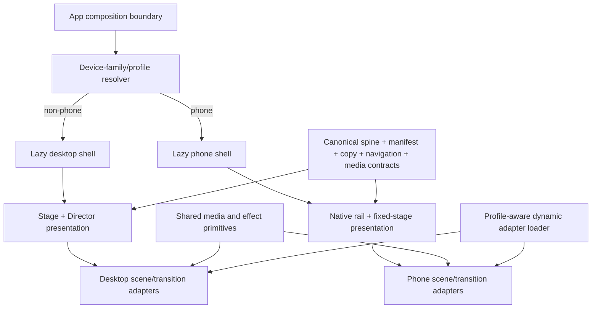
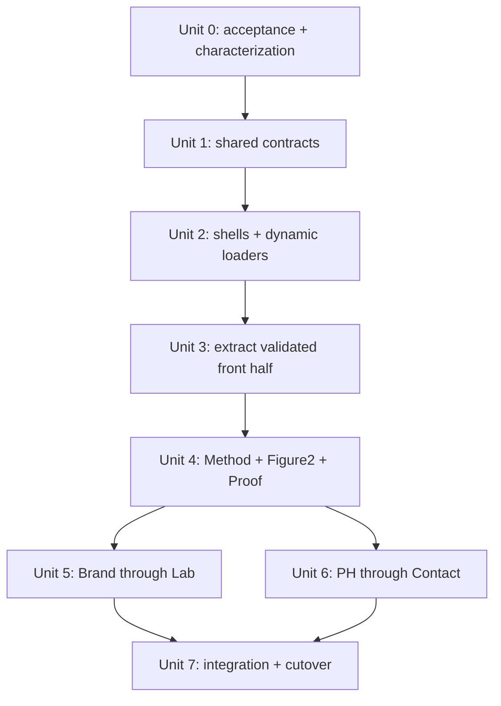
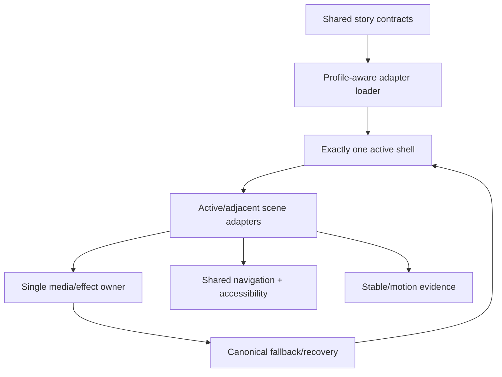

# R5 Responsive Story Split and Migration Plan

## Overview

Turn the validated `v=16` Route B spike into the production phone
presentation without creating either a second product implementation or one
responsive mega-component.

The target architecture is:

> One product core, separate desktop and phone presentation shells,
> scene-sized presentation adapters, and on-demand loading.

The desktop shell keeps the existing Stage/Director behavior. The phone shell
keeps native document scrolling, a viewport-fixed cinematic stage, and
time-owned media where the `v=16` spike proved those behaviors. Both shells
consume the same canonical spine, copy inventory, navigation aliases, media
contracts, fallbacks, and semantic checkpoints.

This is a production extraction and full-story migration plan, not permission
to keep extending the spike. The current spike has already crossed the
boundary this plan is intended to prevent:

| File | Current size | Mixed responsibilities |
| --- | ---: | --- |
| `app/src/production/portrait-spike/PortraitScrollSpike.tsx` | 1,552 lines | shell, scene JSX, timeline, media, input, navigation, evidence |
| `app/src/production/portrait-spike/PortraitScrollSpike.css` | 706 lines | shell geometry plus four scene compositions |
| `app/src/production/StoryApp.tsx` | 759 lines | desktop assembly, readiness, navigation, runtime, recovery |

## Execution Status — 2026-07-19

This section records the implemented migration state; the file-size table above
is the pre-extraction baseline.

| Unit | Status | Implemented evidence |
| --- | --- | --- |
| Unit 0 | Active-route characterization connected; physical evidence incomplete | The formal phone shell now publishes the shared Loader → Method checkpoint trace, including the AOD media clock, and `r5-phone-story.spec.ts` verifies the live `?v=19` route forward and backward. Real Safari toolbar/orientation/lock evidence and device metadata still gate Unit 4. |
| Unit 1 | Complete in code; Unit 3 debt ratcheted | Shared presentation contracts, semantic checkpoints, copy, media ownership, and renderer-neutral adapter lifecycles live in `app/src/story/`. Phone adapters alias the shared lifecycle instead of redeclaring it. The module-boundary verifier rejects new shell-owned scene imports/roots, media keys, progress constants, or line growth while the explicit Unit 3 debt list shrinks with each extraction. |
| Unit 2 | Initial phone adapter loading connected; remaining slots pending | `App.tsx` loads exactly one frozen desktop/phone family and preloads only the phone Hero adapter beside the selected phone shell. Loader release now waits for the Hero module/CSS lifecycle, failures reveal the static document, and v19 network characterization rejects desktop or unselected phone adapter chunks. Pattern → Method still use the restored shell path until their reviewed slices land. |
| Unit 3 | Hero adapter connected; remaining front half pending | The formal phone route still owns the proven Loader → Hero → Pattern → Star Map → AOD → Method behavior. Hero markup, packed-alpha Figure 1 media, entrance, parallax, and local progress now live in `PhoneHero`; the shell debt dropped to three scene roots and three direct media keys. Pattern → Method and the named transition adapters remain to be connected one reviewed slice at a time. |
| Units 4–7 | Not started | The current-build physical-iPhone checkpoint is not accepted, so no back-half migration or cutover work begins. |

On 2026-07-20, the user correctly required the already-working spike chain to
be treated as the executable migration baseline rather than a loose source of
checkpoint names. Its full front-half behavior now lives in
`app/src/production/phone/PhoneStoryShell.tsx` and
`PhoneStoryShell.css`; `PortraitScrollSpike.tsx` remains the thin `?v=16`
entry. The shell imports canonical copy/media contracts and production phone
helpers, so there is no second product implementation; however, restoring the
behavioral baseline did not complete the required scene/transition adapter
extraction.

`?v=19` is the current short physical-device route. `?v=16`, `?v=17`, and
`?v=18` remain accepted aliases, but all four resolve the current formal phone shell and are
not immutable historical builds. Regular phone activation remains guarded by
`VITE_ENABLE_PHONE_STORY=1` until Unit 7 cutover, so rotation cannot swap an
already selected presentation family.

The production budget verifier now measures each mutually exclusive selected
presentation shell, while retaining all emitted assets in its audit report and
enforcing the loader-ink cap separately. No budget threshold was increased.
The latest production build reports 10,340 bytes of JavaScript headroom (above
the required 4,096 bytes). No media asset was replaced, re-encoded, or added.
The presentation CSS moved with the complete production phone shell; the thin
spike wrapper owns no scene markup, media, or scroll state.

### Current physical review record — 2026-07-20

This review is a Unit 0–3 acceptance record, not authorization to start Unit 4.
It is **not accepted** until the items below have true-device evidence and the
user confirms the checkpoint.

The user subsequently reported that the current `?v=17` presentation was
"差不多可行了" and authorized Plan 013 to continue. That is sufficient to resume
the non-visual Unit 0–3 extraction work from this baseline, but it is not
recorded as an unconditional Unit 4 gate pass because device model, iOS/Safari
version, toolbar/orientation trace, and captured motion evidence are still
missing. New Plan 013 verification builds use the short `?v=19` route.

- **Unit 2 fixed-stage contract — real-device confirmation still required:**
  the modular adapter-shell experiment caused horizontal sway and dark-underlay
  exposure. It is no longer the active formal route. The restored spike
  baseline retains its native fixed-stage geometry and `touch-action: pan-y`;
  a real iPhone must still confirm the original no-sway hand feel.
- **Unit 3 transition lifecycle — complete chain restored and verified in
  Chromium:** the production shell again executes all three original handoffs
  as one chain. At a 390×844 viewport, Pattern → Star Map has an active
  `pattern-star` ink canvas at scroll progress 0.5554, Star Map → AOD has an
  active `star-aod` canvas at 0.7529, and AOD completion exposes the fixed
  Method bridge. This is browser evidence only; a real-device motion re-run is
  still required.
- **Unit 3 Figure 1 alpha presentation — failed on device:** the real-device
  report says Figure 1 has reverted to a white background. Chromium's iPhone
  viewport reports the packed-alpha canvas ready and visible without console
  errors, so that result is only a non-reproduction; it cannot replace a
  Safari capture or clear the device failure.

The current scoped evidence is green: the complete test suite passes, typecheck
and lint pass, the homepage module-boundary verifier passes, and the production
build retains 11,223 bytes of JavaScript headroom. Chromium phone-viewport
inspection confirms the restored Hero, Pattern → Star Map, Star Map → AOD, and
AOD → Method sequence without console errors. This is still insufficient for
acceptance because it does not exercise iOS horizontal rubber-banding or
establish Figure 1's actual Safari alpha presentation.

**Gate:** keep Units 4–7 frozen. The next acceptance item is a renewed
real-iPhone review with device, iOS/Safari, toolbar state, and visual/motion
evidence recorded.

Validation completed for the active checkpoint instrumentation:

- `pnpm -C app typecheck`
- `pnpm -C app test` — 124 files, 740 tests
- `pnpm -C app lint`
- `pnpm -C app build` — module-boundary, media, release, and performance gates pass
- `PLAYWRIGHT_PORT=4174 pnpm -C app exec playwright test e2e/r5-phone-story.spec.ts --config playwright.release.config.ts --project desktop-chromium`

Follow-up architecture audit on 2026-07-20 tightened three Route B contracts:

- desktop Hero, Pattern, and Method now derive their front-half copy from the
  same canonical inventory consumed by phone adapters;
- AOD's media-owned interval now publishes `aod-to-method` and
  `method-intro` checkpoints instead of leaving the rail at `aod-autoplay`;
- the temporary AOD input lock is scoped to the phone shell and attaches only
  while media owns time, so native reading has no global non-passive
  `touchmove` listener.
- phone scene and transition handles now consume the shared presentation
  lifecycle contract, and the build records a one-way Unit 3 debt ratchet for
  the still-monolithic formal phone shell.
- the v19 Hero slice preserves the accepted Route B selectors while moving
  Hero markup, CSS, packed-alpha playback, parallax, entrance, and progress
  rendering into `PhoneHero`; the shell ratchet is now 1,416 TSX lines and 613
  CSS lines.
- the profile-aware shell loader now starts the Hero adapter beside the phone
  shell, waits for its lifecycle before Loader release, and keeps the desktop
  shell plus Pattern/AOD/Method adapter chunks off the v19 request path.

The remaining Unit 0–3 work is the physical iPhone Safari evidence plus the
active-route adapter cutover. The device run must capture the named checkpoint
trace, reverse behavior, toolbar/orientation recovery, and single
media/input-owner state. The code cutover must remove scene JSX, media ownership,
and scene progress math from `PhoneStoryShell` without changing that trace.
Both remain mandatory before Unit 4 starts.

## Problem Frame

Plan 012 selected Route B after the native-scroll/fixed-stage vertical slice
produced materially better phone hand feel than the repaired Stage/Director
route. The spike now demonstrates the critical front half—Loader, Hero,
Pattern, Star Map, AOD, and the continuous Method reading entrance—but it
does so inside one experiment component.

Bulk migration directly inside that component would:

- duplicate presentation and product decisions;
- make desktop and phone regressions inseparable;
- load unrelated scene code and media too early;
- turn every new scene into another conditional branch;
- make cleanup, reverse playback, direct navigation, and accessibility
  ownership increasingly fragile.

The split must happen before the remaining scenes are migrated.

## Requirements Trace

- **R1 — One product authority:** canonical scene order, copy, hashes, media
  contracts, semantic checkpoints, and fallbacks remain shared.
- **R2 — Separate render ownership:** desktop retains Stage/Director; phone
  retains native scroll plus a fixed cinematic stage.
- **R3 — Scene module boundaries:** shell files contain no scene-specific JSX,
  asset URLs, or motion constants; each adapter owns one scene or one named
  transition.
- **R4 — On-demand loading:** only the selected shell and the active/adjacent
  scene adapters are loaded or prewarmed.
- **R5 — One accessible story:** only one shell is mounted, with one copy tree
  and one active media owner.
- **R6 — Behavioral parity:** the accepted `v=16` front-half motion, reverse
  behavior, viewport handling, and reading continuity survive extraction.
- **R7 — Full migration:** every canonical scene and transition has a reviewed
  phone adapter or an explicit endpoint/dissolve fallback.
- **R8 — Budget safety:** the migration restores JavaScript headroom before
  adding the back half and does not raise existing media, canvas, memory, CSS,
  or release budgets.
- **R9 — Release evidence:** Chromium, WebKit, portrait/landscape phone,
  desktop regression, reduced motion, direct navigation, and physical-iPhone
  motion evidence pass before cutover.

## Scope Boundaries

### In scope

- record the Route B decision in Plan 012;
- extract shared product contracts from presentation-specific modules;
- split desktop and phone shells at the application composition boundary;
- split `PortraitScrollSpike` into shell, runtime, scene, transition, and
  media-owned modules;
- load shells and presentation adapters through dynamic imports;
- migrate the complete canonical story in dependency-ordered batches;
- preserve phone portrait state through toolbar and orientation changes;
- remove the experimental route after production cutover;
- add architecture, bundle, lifecycle, and release gates.

### Out of scope

- two independently maintained manifests, copy inventories, navigation maps,
  or media registries;
- mounting desktop and phone shells simultaneously and hiding one with CSS;
- rewriting the desktop presentation to use native scroll;
- forcing the phone presentation back through the desktop Director;
- new copy, a new visual system, or unapproved replacement media;
- raising budgets to accommodate migration growth;
- custom Grade B animation where a reviewed endpoint/dissolve is sufficient.

## Context and Local Research

### Existing authorities to preserve

- `app/src/story/canonical-spine.ts` owns canonical scene and segment order.
- `app/src/story/manifest.ts` derives policies, copy, media playback, and
  fallback contracts from the migration inventory.
- `docs/react-refactor/inventory/copy-reference.json` is the copy authority
  already consumed by both production and the portrait spike.
- `app/src/production/navigation.ts` owns public hashes and aliases.
- `app/src/media/packed-alpha-video.ts` is already presentation-neutral and can
  serve scene adapters in either shell.

### Existing loading and lifecycle patterns

- `app/src/production/module-loaders.ts` dynamically imports scene and
  transition modules by canonical ID and caches successful loads.
- `app/src/production/adjacent-prewarm.ts` provides the existing look-ahead
  pattern.
- `app/src/story/registry.ts` owns handle readiness and guarded media/build
  gates.
- `app/src/story/types.ts` currently combines product definitions with
  presentation component/lifecycle contracts; that seam must be made explicit
  instead of duplicated.

### Findings that shape the split

- `StorySpine`, `HandleRegistry`, and `SegmentPlayer` are central shared
  abstractions; neither shell should fork them casually.
- `StarFieldReveal` is already a highly connected effect engine. Its camera and
  rendering configuration should be injected by a scene adapter rather than
  expanded with shell detection.
- `PortraitScrollSpike` proves the phone presentation route, but its current
  size and responsibility mix make it an executable specification, not a
  production module template.
- The release build currently has only 509 bytes of JavaScript headroom against
  the required 4,096-byte margin. Shell and scene chunking is therefore a
  prerequisite for bulk migration, not end-of-project cleanup.

External research is intentionally omitted: the repository already contains
the relevant Stage/Director, native-scroll spike, dynamic loader, registry,
media, transition, and release-budget patterns.

## Key Technical Decisions

| Decision | Selected approach | Rationale |
| --- | --- | --- |
| Product ownership | Shared canonical core | Prevents copy, navigation, media, and fallback drift |
| Presentation ownership | Desktop shell + phone shell | The two input and layout models are intentionally different |
| Phone orientation | One phone shell handles portrait and landscape compatibility | Avoids remounting the story and losing chapter/media state on rotation |
| Scene variance | Per-scene presentation adapters | Keeps responsive differences local and testable |
| Transition variance | Per-transition adapters with shared effect primitives | Preserves named visual contracts without shell conditionals |
| Loading | Dynamic shell and adapter imports with adjacent prewarm | Restores bundle headroom and limits active media |
| Spike lifecycle | Characterization source, then deletion | Prevents a permanent third implementation |

### Alternatives rejected

| Alternative | Why it is rejected |
| --- | --- |
| Two complete desktop/mobile applications | Duplicates product logic and guarantees long-term parity drift |
| One `StoryApp` with device branches throughout | Converts every scene, transition, and lifecycle into a mega/god component |
| Keep adding scenes to `PortraitScrollSpike` | The spike already mixes too many owners and is over 1,500 lines |
| Force both surfaces through Stage/Director | Reintroduces the phone interaction failure that Route B was created to solve |
| Mount both shells and hide one | Duplicates accessibility trees, media preload, memory, and side effects |

## Open Questions

### Resolved during planning

- **One application or two:** one deployable application with a shared product
  core and two lazy presentation shells.
- **Phone orientation ownership:** one phone shell remains mounted across phone
  portrait/landscape changes so semantic and media state are preserved.
- **Where responsive branching belongs:** shell selection happens once at the
  composition boundary; scene/camera differences belong to adapters rather
  than shared effect engines.
- **What happens to `v=16`:** it remains a characterization harness during
  migration and is deleted after production phone evidence passes.
- **How parallel migration avoids merge conflicts:** each batch owns separate
  scene/transition directories and a separate adapter-group registration
  module; the shared loader is changed once by the integration owner.

### Deferred to implementation

- **Grade B presentation choice:** select reviewed phone camera versus
  endpoint/dissolve per bridge during physical-device visual review.
- **Prewarm distance:** choose the adjacent media look-ahead from measured
  decode cost and memory traces without changing the one-active-owner rule.
- **Large cohesive renderer exception:** decide whether an effect engine
  warrants a documented size exception only after responsibilities have been
  separated and its focused tests are in place.

## High-Level Technical Design

> This illustrates the intended approach and is directional guidance for
> review, not implementation specification. The implementing agent should
> treat it as context, not code to reproduce.

The prose contracts are authoritative if the diagram and implementation
details diverge.

## Module Boundary Contract

### Shared product core

`app/src/story/`, the copy inventory, shared navigation, and shared media
contracts may describe what exists, its semantic order, readiness, fallback,
and public identity. They must not inspect viewport classes or import
presentation CSS.

### Presentation shells

- `app/src/production/desktop/` owns Stage/Director assembly and desktop input.
- `app/src/production/phone/` owns native document scroll, fixed-stage
  geometry, viewport/safe-area handling, and phone evidence state.
- A shell may load adapters and shared chrome. It must not contain scene DOM,
  scene asset URLs, or scene-specific progress math.

### Scene and transition adapters

- A scene adapter owns one scene's markup, local refs, composition, and hold
  rendering for one presentation family.
- A transition adapter owns one named `from → to` handoff.
- Shared effect engines accept explicit camera/timing/configuration inputs and
  do not branch on user agent or shell.
- CSS follows the same boundary: shell geometry, scene composition, and
  transition effects are separate files.

### Anti-god-file gates

- Composition/orchestrator files target at most 300 lines and may not contain
  scene markup.
- A presentation adapter targets at most 400 lines; larger cohesive render
  engines require a documented exception and focused tests.
- No module owns JSX for multiple canonical scenes.
- No shell imports files directly from `assets/`.
- Architecture tests enforce import direction and forbidden responsibility
  combinations; line limits are a warning backed by responsibility checks,
  not the sole quality measure.

## Implementation Units

### Unit 0 — Freeze the Route B executable contract

**Goal:** establish the accepted `v=16` behavior as characterization evidence
before moving responsibilities.

**Requirements:** R6, R8, R9

**Dependencies:** final physical-iPhone approval of the current front-half
visual corrections.

**Files:**

- Modify: `docs/plans/2026-07-17-012-fix-r5-portrait-interaction-motion-plan.md`
- Modify: `app/src/production/portrait-spike/PortraitScrollSpike.contract.test.ts`
- Modify: `app/e2e/r5-production.spec.ts`
- Modify: `app/e2e/r5-performance.spec.ts`
- Create: `app/src/production/portrait-spike/portrait-checkpoints.ts`
- Test: `app/src/production/portrait-spike/portrait-checkpoints.test.ts`

**Approach:**

- Record the Route B decision and Route A rejection in Plan 012.
- Name semantic checkpoints for Loader, Hero, Pattern, Star Map, AOD, and
  Method instead of relying on incidental scroll percentages in later tests.
- Characterize forward, reverse, incomplete release, AOD time ownership,
  Method continuity, toolbar movement, and reduced motion.
- Archive the accepted physical-device metadata and visual/motion evidence.

**Execution note:** characterization-first; no extraction begins until these
tests describe the accepted behavior.

**Patterns to follow:**

- `app/src/story/verifySegmentTimeline.test.ts`
- `app/src/production/portrait-spike/PortraitScrollSpike.contract.test.ts`

**Test scenarios:**

- Happy path: a cold phone entry reaches Hero, then each named checkpoint in
  order without an extra hidden hold.
- Reverse: AOD reverses to its transparent start and restores the Star Map
  handoff without exposing Method.
- Edge case: Safari toolbar-only height changes preserve the active semantic
  checkpoint and do not restart Loader.
- Reduced motion: the same copy and chapter order remain reachable through
  static endpoints.
- Integration: the accepted physical-iPhone run matches the named checkpoint
  trace and shows no duplicate background or accessible tree.

**Verification:**

- The spike can be refactored while tests identify any change to accepted
  behavior.

### Unit 1 — Separate product definitions from presentation adapters

**Goal:** make the shared/product boundary explicit before creating two
loadable presentation families.

**Requirements:** R1, R3, R5

**Dependencies:** Unit 0

**Files:**

- Modify: `app/src/story/types.ts`
- Modify: `app/src/story/canonical-spine.ts`
- Modify: `app/src/story/manifest.ts`
- Modify: `app/src/story/registry.ts`
- Modify: `app/src/production/navigation.ts`
- Create: `app/src/story/presentation.ts`
- Create: `app/src/story/presentation.test.ts`
- Create: `app/scripts/verify-homepage-module-boundaries.mjs`
- Test: `app/src/story/registry.test.ts`
- Test: `app/src/story/manifest.test.ts`
- Test: `app/src/production/navigation.test.ts`

**Approach:**

- Keep scene/segment identity, copy references, media/fallback contracts, and
  semantic checkpoints independent of React components and shell geometry.
- Define presentation adapter contracts for scene rendering, transition
  rendering, readiness handles, and lifecycle cleanup.
- Keep `HandleRegistry` guard semantics shared while allowing each shell to
  register its selected adapters.
- Add a boundary verifier for shell asset imports, cross-scene JSX ownership,
  and direct phone-to-desktop implementation imports.

**Patterns to follow:**

- `app/src/story/canonical-spine.ts`
- `app/src/story/registry.ts`
- `app/src/production/module-loaders.ts`

**Test scenarios:**

- Happy path: both presentation families resolve adapters for the same
  canonical scene and segment IDs.
- Edge case: a missing adapter fails with the canonical ID and the selected
  presentation family in the diagnostic.
- Failure path: stale readiness reports remain rejected after an adapter is
  replaced or disposed.
- Integration: copy, hash, fallback, and media playback contracts are byte-for-
  byte shared between desktop and phone assemblies.

**Verification:**

- No new phone manifest, copy map, navigation map, or media registry exists.
- Boundary verification fails when a shell imports a scene asset or embeds
  scene JSX.

### Unit 2 — Introduce separate lazy desktop and phone shells

**Goal:** make the top-level split without mounting or bundling both
presentations.

**Requirements:** R2, R4, R5, R8

**Dependencies:** Unit 1

**Files:**

- Modify: `app/src/App.tsx`
- Modify: `app/src/production/StoryApp.tsx`
- Modify: `app/src/production/module-loaders.ts`
- Create: `app/src/production/presentation-profile.ts`
- Create: `app/src/production/presentation-profile.test.ts`
- Create: `app/src/production/desktop/DesktopStoryShell.tsx`
- Create: `app/src/production/desktop/DesktopStoryShell.css`
- Create: `app/src/production/phone/PhoneStoryShell.tsx`
- Create: `app/src/production/phone/PhoneStoryShell.css`
- Create: `app/src/production/phone/PhoneStageRail.tsx`
- Create: `app/src/production/phone/phone-viewport.ts`
- Create: `app/src/production/phone/phone-viewport.test.ts`
- Create: `app/src/production/desktop/module-loaders.ts`
- Create: `app/src/production/phone/module-loaders.ts`
- Create: `app/src/production/phone/adapter-groups/front-half.ts`
- Create: `app/src/production/phone/adapter-groups/grade-a.ts`
- Create: `app/src/production/phone/adapter-groups/group4-5.ts`
- Create: `app/src/production/phone/adapter-groups/group6-7.ts`
- Test: `app/src/production/module-loaders.test.ts`
- Test: `app/src/production/runtime-assembly.test.ts`

**Approach:**

- Resolve a phone device family before lazy-loading the shell. The phone shell
  stays mounted across portrait/landscape rotation and changes only its layout
  profile, preserving semantic position and media state.
- Move the current Stage/Director assembly behind `DesktopStoryShell` without
  changing desktop behavior.
- Create a small phone orchestration shell around one document rail, one fixed
  stage, shared navigation/Loader chrome, and adapter slots.
- Generalize existing dynamic loader caching so the selected profile imports
  only its shell and adapter family.
- Reserve deterministic canonical rail geometry before an adapter resolves.
  Reading content remains mounted after first reveal; heavy visual/media
  surfaces may retire independently. Adapter CSS readiness is part of target
  readiness so a late chunk cannot create a flash or change scroll range after
  publication.
- Give each later migration batch its own adapter-group registration module so
  parallel scene work does not contend on the shared loader.
- Restore the required JavaScript headroom before Unit 3 is considered
  complete.

**Execution note:** preserve desktop behavior through characterization while
moving files; do not combine this unit with scene visual changes.

**Patterns to follow:**

- `app/src/production/module-loaders.ts`
- `app/src/production/adjacent-prewarm.ts`
- `app/src/runtime/browser-guard.ts`

**Test scenarios:**

- Happy path: a phone loads only the phone shell; a desktop loads only the
  desktop shell.
- Edge case: portrait → landscape → portrait keeps the current semantic
  checkpoint and does not remount Loader.
- Edge case: toolbar-only resize updates live stage geometry without changing
  scroll normalization.
- Edge case: resolving or retiring an adjacent adapter does not move the
  current checkpoint or change the visible reading offset.
- Failure path: shell import failure reveals the existing static story rather
  than an empty loading route.
- Direct entry: an unloaded hash target resolves its adapter and stable rail
  geometry before positioning the document.
- Integration: no duplicate scene roots, global input listeners, or active
  media owners exist after shell selection.

**Verification:**

- `App.tsx` is a composition boundary rather than a scene/runtime owner.
- Desktop visual and interaction baselines are unchanged.
- The production budget verifier reports at least the required 4,096-byte
  JavaScript headroom.

### Unit 3 — Extract the validated front-half phone modules

**Goal:** replace the `PortraitScrollSpike` front half with production phone
scene/transition adapters while preserving the accepted frames and hand feel.

**Requirements:** R3, R4, R6, R8

**Dependencies:** Unit 2

**Files:**

- Create: `app/src/scenes/hero/phone/PhoneHero.tsx`
- Create: `app/src/scenes/hero/phone/PhoneHero.css`
- Create: `app/src/scenes/hero/phone/motion.ts`
- Test: `app/src/scenes/hero/phone/PhoneHero.test.tsx`
- Test: `app/src/scenes/hero/phone/motion.test.ts`
- Create: `app/src/scenes/pattern/phone/PhonePattern.tsx`
- Create: `app/src/scenes/pattern/phone/PhonePattern.css`
- Test: `app/src/scenes/pattern/phone/PhonePattern.test.tsx`
- Create: `app/src/scenes/star-map/phone/PhoneStarMap.tsx`
- Create: `app/src/scenes/star-map/phone/PhoneStarMap.css`
- Test: `app/src/scenes/star-map/phone/PhoneStarMap.test.tsx`
- Create: `app/src/scenes/aod-animation/phone/PhoneAod.tsx`
- Create: `app/src/scenes/aod-animation/phone/PhoneAod.css`
- Create: `app/src/scenes/aod-animation/phone/autoplay.ts`
- Test: `app/src/scenes/aod-animation/phone/PhoneAod.test.tsx`
- Test: `app/src/scenes/aod-animation/phone/autoplay.test.ts`
- Create: `app/src/scenes/method-top/phone/PhoneMethodTop.tsx`
- Create: `app/src/scenes/method-top/phone/PhoneMethodTop.css`
- Test: `app/src/scenes/method-top/phone/PhoneMethodTop.test.tsx`
- Create: `app/src/transitions/hero-pattern/phone.ts`
- Test: `app/src/transitions/hero-pattern/phone.test.ts`
- Create: `app/src/transitions/pattern-star-map/phone.ts`
- Test: `app/src/transitions/pattern-star-map/phone.test.ts`
- Create: `app/src/transitions/star-map-aod/phone.ts`
- Test: `app/src/transitions/star-map-aod/phone.test.ts`
- Create: `app/src/transitions/aod-method-top/phone.ts`
- Test: `app/src/transitions/aod-method-top/phone.test.ts`
- Create: `app/src/production/phone/phone-stage-timeline.ts`
- Create: `app/src/production/phone/phone-stage-timeline.test.ts`
- Modify: `app/src/production/phone/adapter-groups/front-half.ts`
- Modify: `app/src/production/portrait-spike/PortraitScrollSpike.tsx`
- Modify: `app/src/production/portrait-spike/PortraitScrollSpike.css`

**Approach:**

- Move scene markup, refs, local progress sampling, and CSS into the scene that
  owns them.
- Move each two-surface handoff into its named transition adapter.
- Keep packed-alpha compositing, Perlin rendering, ink primitives, and
  canonical AOD progress math shared; inject phone camera/timing profiles.
- Keep the AOD cloud and sun differential motion as a phone presentation
  profile that begins with AOD native playback and reverses from the same
  timeline.
- Make `phone-stage-timeline` coordinate semantic checkpoints only; it may not
  render scene DOM or own scene-specific constants.
- Convert the spike route to use production adapters during extraction, then
  reduce it to a thin compatibility harness.

**Patterns to follow:**

- `app/src/scenes/aod-animation/progress.ts`
- `app/src/media/packed-alpha-video.ts`
- `app/src/transitions/shared/sceneInk.ts`
- `app/src/production/portrait-spike/portrait-aod-autoplay.ts`

**Test scenarios:**

- Happy path: Hero → Pattern → Star Map → AOD → Method reproduces all named
  checkpoints and copy timing.
- Motion: AOD cloud and sun start moving on the first positive AOD media
  progress; cloud exits faster than the sun; reverse playback restores both.
- Media: Hero and AOD packed-alpha canvases remain transparent through scrub,
  autoplay, suspension, resume, and reverse.
- Edge case: Perlin, Star Map, and the rotated source share one camera matrix
  after resize.
- Failure path: media or WebGL failure lands on the canonical poster/endpoint
  without exposing the outgoing scene.
- Integration: extracting each adapter does not change the physical-device
  checkpoint trace or create an additional scroll owner.

**Verification:**

- The production phone shell renders the accepted front half without importing
  `PortraitScrollSpike`.
- No front-half scene markup remains in a shell/orchestrator.

### Unit 4 — Migrate the Grade A Method, Figure2, and Proof chain

**Goal:** complete the main custom-motion chain using the new phone adapter
contract.

**Requirements:** R3, R6, R7, R9

**Dependencies:** Unit 3

**Files:**

- Modify: `app/src/scenes/method-top/phone/PhoneMethodTop.tsx`
- Modify: `app/src/scenes/method-top/phone/PhoneMethodTop.css`
- Test: `app/src/scenes/method-top/phone/PhoneMethodTop.test.tsx`
- Create: `app/src/scenes/figure2-animation/phone/PhoneFigure2.tsx`
- Create: `app/src/scenes/figure2-animation/phone/PhoneFigure2.css`
- Test: `app/src/scenes/figure2-animation/phone/PhoneFigure2.test.tsx`
- Create: `app/src/scenes/figure2-proof/phone/PhoneFigure2Proof.tsx`
- Create: `app/src/scenes/figure2-proof/phone/PhoneFigure2Proof.css`
- Test: `app/src/scenes/figure2-proof/phone/PhoneFigure2Proof.test.tsx`
- Create: `app/src/transitions/method-bottom-figure2/phone.ts`
- Test: `app/src/transitions/method-bottom-figure2/phone.test.ts`
- Create: `app/src/transitions/figure2-distance-expand/phone.ts`
- Test: `app/src/transitions/figure2-distance-expand/phone.test.ts`
- Create: `app/src/transitions/figure2-proof-brand/phone.ts`
- Test: `app/src/transitions/figure2-proof-brand/phone.test.ts`
- Modify: `app/src/production/phone/adapter-groups/grade-a.ts`
- Test: `app/src/transitions/figure2-proof-chain.test.ts`
- Test: `app/e2e/r5-production.spec.ts`

**Approach:**

- Preserve Method as one continuous reading flow; scene boundaries must not
  introduce a blank viewport or a required extra swipe.
- Adapt the Grade A camera and progress tracks rather than scaling the desktop
  layer stack as one canvas.
- Keep one semantic Figure2/Proof chain even where phone composition divides
  rendering responsibilities.
- Review 0/25/50/75/100% frames and reverse behavior before proceeding to the
  back-half batches.

**Test scenarios:**

- Happy path: Method content flows directly into the Figure2 checkpoint and
  lands on readable Proof content.
- Reverse: Proof returns through Figure2 to the exact Method boundary without
  skipping or duplicating copy.
- Edge case: short phone heights keep the focal subject and text safe zones
  visible.
- Reduced motion: the chain uses canonical endpoints and preserves all copy.
- Integration: direct hash entry into Proof loads only required/adjacent
  adapters and positions the correct reading content.

**Verification:**

- The full Grade A chain passes physical-iPhone mid-migration acceptance.

### Unit 5 — Migrate Brand, Figure3, Services, TTG, and Lab

**Goal:** migrate the first independent Grade B batch with safe camera or
endpoint/dissolve decisions.

**Requirements:** R4, R7, R8

**Dependencies:** Unit 4

**Files:**

- Create: `app/src/scenes/brand/phone/PhoneBrand.tsx`
- Test: `app/src/scenes/brand/phone/PhoneBrand.test.tsx`
- Create: `app/src/scenes/figure3-animation/phone/PhoneFigure3.tsx`
- Create: `app/src/scenes/figure3-animation/phone/PhoneFigure3.css`
- Test: `app/src/scenes/figure3-animation/phone/PhoneFigure3.test.tsx`
- Create: `app/src/scenes/services/phone/PhoneServices.tsx`
- Test: `app/src/scenes/services/phone/PhoneServices.test.tsx`
- Create: `app/src/scenes/ttg-animation/phone/PhoneTtg.tsx`
- Create: `app/src/scenes/ttg-animation/phone/PhoneTtg.css`
- Test: `app/src/scenes/ttg-animation/phone/PhoneTtg.test.tsx`
- Create: `app/src/scenes/lab/phone/PhoneLab.tsx`
- Test: `app/src/scenes/lab/phone/PhoneLab.test.tsx`
- Create: `app/src/transitions/brand-figure3/phone.ts`
- Test: `app/src/transitions/brand-figure3/phone.test.ts`
- Create: `app/src/transitions/figure3-services/phone.ts`
- Test: `app/src/transitions/figure3-services/phone.test.ts`
- Create: `app/src/transitions/services-ttg/phone.ts`
- Test: `app/src/transitions/services-ttg/phone.test.ts`
- Create: `app/src/transitions/ttg-lab/phone.ts`
- Test: `app/src/transitions/ttg-lab/phone.test.ts`
- Modify: `app/src/production/phone/adapter-groups/group4-5.ts`
- Test: `app/src/scenes/group4-scenes.test.ts`
- Test: `app/src/scenes/group5-scenes.test.ts`
- Test: `app/src/transitions/group4-transitions.test.ts`
- Test: `app/src/transitions/group5-transitions.test.ts`

**Approach:**

- Decide per Grade B transition between a reviewed phone camera and an
  endpoint/dissolve; record the decision beside the adapter.
- Preserve reading sections as native document flow and keep cinematic bridges
  from creating additional holds.
- Preload only the next transition's required media and dispose the retired
  media owner.

**Test scenarios:**

- Happy path: Brand reaches Lab with one continuous public-chapter journey.
- Reverse: every bridge returns to its previous readable checkpoint.
- Failure path: each media failure lands on its declared terminal fallback.
- Direct entry: Services and Lab hashes load their content without replaying
  earlier media.
- Integration: the batch does not increase active video/canvas counts beyond
  existing release limits.

**Verification:**

- Every scene in the batch has reviewed stable and motion evidence and no
  unreviewed desktop crop.

### Unit 6 — Migrate PH, Education, Crane, and Contact

**Goal:** migrate the second independent Grade B batch through the conversion
endpoint.

**Requirements:** R4, R7, R8

**Dependencies:** Unit 4

**Files:**

- Create: `app/src/scenes/ph-animation/phone/PhonePh.tsx`
- Create: `app/src/scenes/ph-animation/phone/PhonePh.css`
- Test: `app/src/scenes/ph-animation/phone/PhonePh.test.tsx`
- Create: `app/src/scenes/education/phone/PhoneEducation.tsx`
- Test: `app/src/scenes/education/phone/PhoneEducation.test.tsx`
- Create: `app/src/scenes/crane-animation/phone/PhoneCrane.tsx`
- Create: `app/src/scenes/crane-animation/phone/PhoneCrane.css`
- Test: `app/src/scenes/crane-animation/phone/PhoneCrane.test.tsx`
- Create: `app/src/scenes/contact/phone/PhoneContact.tsx`
- Test: `app/src/scenes/contact/phone/PhoneContact.test.tsx`
- Create: `app/src/transitions/lab-ph/phone.ts`
- Test: `app/src/transitions/lab-ph/phone.test.ts`
- Create: `app/src/transitions/ph-education/phone.ts`
- Test: `app/src/transitions/ph-education/phone.test.ts`
- Create: `app/src/transitions/education-crane/phone.ts`
- Test: `app/src/transitions/education-crane/phone.test.ts`
- Create: `app/src/transitions/crane-contact/phone.ts`
- Test: `app/src/transitions/crane-contact/phone.test.ts`
- Modify: `app/src/production/phone/adapter-groups/group6-7.ts`
- Test: `app/src/scenes/group6-scenes.test.ts`
- Test: `app/src/scenes/group7-scenes.test.ts`
- Test: `app/src/transitions/group6-transitions.test.ts`
- Test: `app/src/transitions/group7-transitions.test.ts`

**Approach:**

- Apply the same Grade B camera-or-fallback decision gate as Unit 5.
- Keep Education native-scroll content and the Contact CTA reachable without a
  cinematic input owner intercepting controls.
- Preserve Crane media cleanup and Contact's stable terminal state.

**Test scenarios:**

- Happy path: Lab reaches Contact without a hidden intermediate hold.
- Reverse: Contact returns through Crane and Education without replay races.
- Accessibility: links and CTA controls retain focus and are excluded from
  story gesture/key ownership.
- Failure path: PH and Crane fallbacks preserve the destination copy and
  navigation state.
- Integration: direct Contact entry does not preload the complete visual story.

**Verification:**

- Contact is reachable through scrolling, menu navigation, keyboard, and
  direct hash with one accessible story tree.

Units 5 and 6 may run in parallel after Unit 4. They must have disjoint scene
and transition file ownership plus separate adapter-group registration files;
only one integration owner updates the shared phone loader and release
inventory.

### Unit 7 — Integrate, enforce budgets, and cut over production

**Goal:** make the phone shell production-default, remove the spike, and close
all cross-surface release gates.

**Requirements:** R4, R5, R8, R9

**Dependencies:** Units 5 and 6

**Files:**

- Modify: `app/src/App.tsx`
- Modify: `app/src/production/StoryNav.tsx`
- Modify: `app/src/production/StoryNav.css`
- Modify: `app/src/production/StoryLoader.tsx`
- Modify: `app/src/production/navigation.ts`
- Modify: `app/src/production/phone/module-loaders.ts`
- Modify: `app/scripts/verify-performance-budgets.mjs`
- Modify: `app/scripts/verify-release-build.mjs`
- Modify: `app/scripts/capture-r5-visual-evidence.mjs`
- Modify: `app/playwright.release.config.ts`
- Modify: `app/e2e/r5-matrix.spec.ts`
- Modify: `app/e2e/r5-production.spec.ts`
- Modify: `app/e2e/r5-performance.spec.ts`
- Delete: `app/src/production/portrait-spike/`
- Test: `app/src/production/runtime-assembly.test.ts`
- Test: `app/src/production/static-shell.test.ts`
- Test: `app/src/production/navigation.test.ts`

**Approach:**

- Switch supported phones to the phone shell without a query parameter.
- Keep the desktop shell as the strict regression baseline.
- Verify only the selected shell and active/adjacent adapters appear in the
  initial and navigation-driven chunk graph.
- Finish shared Loader, navigation, reduced-motion, live-region, focus, and
  static-fallback integration.
- Remove `?v=16`, Route A/B spike routing, compatibility imports, and spike
  CSS only after equivalent production evidence passes.
- Enforce module boundaries and performance/media budgets in release
  verification.

**Test scenarios:**

- Matrix: desktop Chromium/WebKit, phone portrait Chromium/WebKit, and phone
  landscape compatibility all select the intended shell.
- Lifecycle: repeated direct navigation, forward/reverse travel, backgrounding,
  and orientation changes leave one input owner and no leaked media/canvas.
- Accessibility: menu, keyboard, reduced motion, static fallback, and direct
  hash expose one copy tree and correct focus/announcement behavior.
- Performance: initial phone load excludes desktop shell chunks and non-
  adjacent scene media; initial desktop load excludes phone adapters.
- Recovery: adapter import, media decode, and WebGL failures land on canonical
  static endpoints.
- Physical device: the full Hero-to-Contact journey passes stable frames,
  motion traces, toolbar movement, orientation, and lock/unlock recovery.

**Verification:**

- All release projects pass without budget increases.
- The physical iPhone journey is accepted.
- No production path imports the spike directory and the experimental route is
  gone.

## System-Wide Impact

- **Interaction graph:** `App` resolves one shell; the shell maps local
  position to canonical checkpoints; the adapter loader supplies current and
  adjacent scene/transition adapters; shared navigation addresses canonical
  IDs rather than shell internals.
- **Error propagation:** shell or adapter import failures reveal the static
  story; scene media/effect failures land on manifest-declared endpoints.
- **State lifecycle:** phone orientation changes update layout profile in
  place; they do not mount the desktop shell or restart Loader. Adapter
  disposal releases listeners, ScrollTriggers, canvases, videos, and guarded
  readiness reports.
- **API parity:** desktop and phone adapters implement the same presentation
  lifecycle contract but may use different camera, progress, and input
  strategies.
- **Integration coverage:** unit tests prove local math/lifecycle; release
  tests prove shell selection, chunk loading, navigation, recovery, and one
  accessible/media owner.
- **Unchanged invariants:** canonical order, public copy, hashes, fallbacks,
  desktop appearance, and media inventory remain authoritative and shared.

## Phased Delivery

### Phase A — Freeze and split

- Unit 0 records final front-half physical-device acceptance.
- Units 1–2 establish product boundaries, shells, and budget-safe loaders.
- Stop if shell splitting cannot restore required JavaScript headroom.

### Phase B — Extract the proven vertical slice

- Unit 3 moves the accepted spike behavior into production modules.
- Unit 4 completes the Grade A middle chain.
- Run the required physical-iPhone mid-migration review.

### Phase C — Bulk migration

- Units 5 and 6 migrate independent Grade B batches in parallel with explicit
  file ownership.
- Each batch lands only after stable, motion, fallback, reverse, and direct-
  entry evidence passes.

### Phase D — Cutover

- Unit 7 integrates shared chrome and release gates.
- Remove the spike only after production phone evidence is equivalent or
  better.

## Success Metrics

- `PortraitScrollSpike.tsx` and its CSS are deleted after production cutover.
- No shell contains scene-specific JSX, asset imports, or progress constants.
- Every canonical scene/segment resolves one desktop adapter and one reviewed
  phone adapter or declared phone fallback.
- Desktop and phone consume the same canonical product/copy/navigation/media
  authorities.
- Exactly one shell, accessible tree, input owner, and active media owner
  exist at runtime.
- Initial shell and current/adjacent adapters are code-split; the other shell
  is absent from the initial chunk graph.
- Existing performance and media budgets pass with at least the required
  JavaScript headroom.
- The complete physical-iPhone journey is accepted before the experimental
  route is removed.

## Risks and Mitigations

| Risk | Impact | Mitigation |
| --- | --- | --- |
| Shared contract refactor changes desktop | High | Characterize desktop first; move assembly without visual changes |
| Shell split becomes a new abstraction mega-layer | High | Keep shared core semantic; keep geometry/input in shells; enforce import boundaries |
| Phone adapters duplicate copy or media policy | High | Load those only from canonical inventory/manifest contracts |
| Dynamic chunks cause late blank frames | High | Adjacent prewarm, stable placeholders, explicit readiness/fallback |
| Orientation remount loses story state | High | Keep one phone shell mounted and change its layout profile in place |
| Scene engines gain user-agent branches | Medium | Inject camera/timing profiles from adapters |
| Parallel batches conflict in shared loaders | Medium | Disjoint scene ownership and one loader/integration owner |
| Spike behavior changes during extraction | High | Named checkpoint characterization and physical-device comparison |
| Bundle growth consumes remaining headroom | High | Restore headroom in Unit 2 and enforce it at every later unit |
| Grade B scope expands into custom animation | Medium | Require explicit camera-or-endpoint decision before implementation |

## Documentation and Rollout Notes

- Plan 012 remains the interaction and physical-device acceptance authority.
- This plan owns production module boundaries, migration sequencing, and
  cutover.
- The asset slimming report remains authoritative for canonical WebP
  replacement and rollback; this architecture plan does not change media
  provenance.
- Keep `?v=16` available through Units 0–6 as a comparison harness. Remove it
  only in Unit 7.

## Sources and References

- Origin: `docs/plans/2026-07-17-012-fix-r5-portrait-interaction-motion-plan.md`
- Visual baseline: `docs/plans/2026-07-17-011-refine-r5-typography-responsive-layout-plan.md`
- Shared story contract: `app/src/story/canonical-spine.ts`
- Product manifest: `app/src/story/manifest.ts`
- Presentation types: `app/src/story/types.ts`
- Existing dynamic loading: `app/src/production/module-loaders.ts`
- Desktop assembly: `app/src/production/StoryApp.tsx`
- Route B executable specification:
  `app/src/production/portrait-spike/PortraitScrollSpike.tsx`
- Performance gate: `app/scripts/verify-performance-budgets.mjs`
