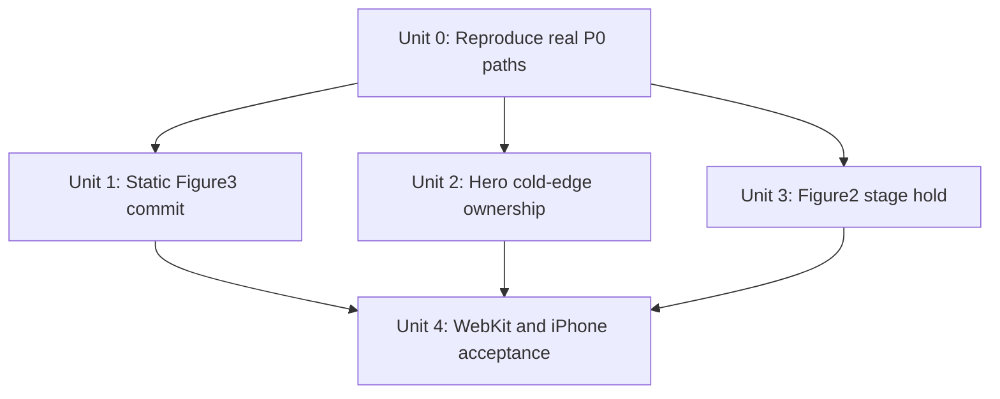
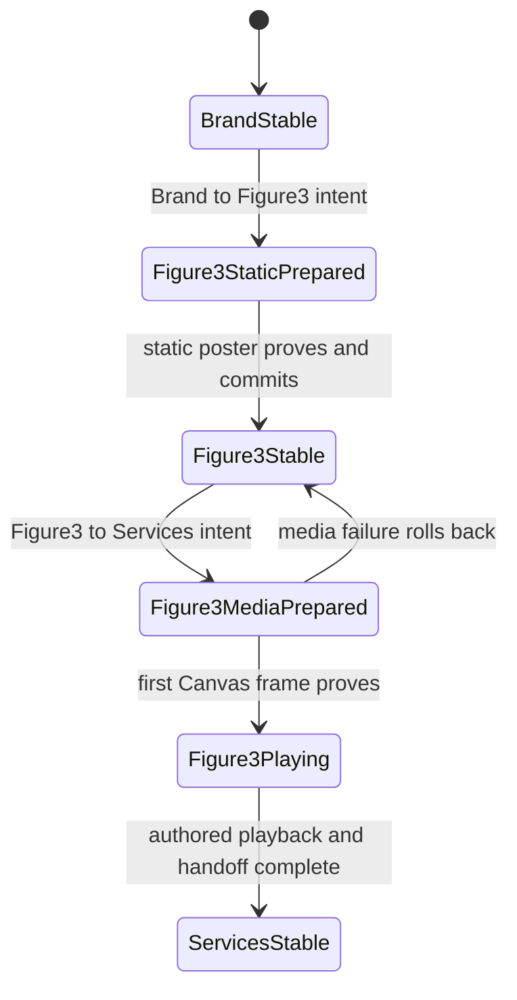

# fix: Close phone P0 story continuity failures

## Overview

This plan closes three user-visible P0 failures in the production phone story:

1. Brand cannot commit Figure3 and repeatedly rolls back to Brand.
2. Cold Hero entry exposes a bottom band that is not part of the authored dark treatment.
3. Figure2 keeps playing during the second, z-depth-only stage instead of holding its terminal frame.

The work is deliberately narrow. It does not add another recovery framework or redesign the phone runtime. It first establishes faithful WebKit/device oracles, then fixes the three actual presentation paths, and only then runs the broad regression suite.

## Problem Frame

The current green test count is not a reliable signal for these failures. The last review series mostly strengthened transaction rollback, module failure, alias landing, and mocked topology contracts. Those changes can be correct while producing little or no visible difference on an iPhone.

The current code contains three concrete mismatches between the intended behavior and the presentation path:

| User-visible failure | Current code path | Why prior verification missed it |
| --- | --- | --- |
| Brand always returns after attempting Figure3 | `brand-figure3` declares a static target and no media clock, but Figure3's stable proof still requires `figure3-paper-canvas`, which is painted from a decoded video frame. A decode/seek/paint miss enters the bounded rollback path and preserves Brand as the stable commit. | `choreography.test.ts` proves only `targetProgress: 0` and `mediaClockOwner: none`. Runtime tests register fake surfaces and report proof directly; Shell tests replace the real Figure3 leaf with a stub. |
| Hero cold entry has an untreated bottom band | Stable Hero coverage uses `#040807`, while `index.html`, the preboot root, and the theme color still publish `#07110e`. The existing Hero vignette remains inside the scene plane. | The previous fix changed only the manifest edge color. Its browser assertion checks opacity and a broad luma bound, not cold-frame continuity between the preboot/document surface and the authored Hero bottom edge. |
| Figure2 plays during z-depth | `figure2-distance-expand` has two staged legs, but `mediaClockOwner: source` covers the complete segment. `PhoneFigure2.activate()` starts the 5.2-second packed source and does not pause it at the 2.6-second terminal boundary. | Current tests explicitly freeze whole-segment source ownership and never assert `video.paused` or `currentTime` during dwell and stage two. |

This is why the implementation can add hundreds of lines of tests and recovery handling while the P0 path remains visibly unchanged: the assertions describe intended metadata and synthetic proof, not the real leaf/media/viewport chain that failed on the device.

## Requirements Trace

- **R1 — Brand/Figure3 continuity:** One forward intent from a stable Brand must commit the static Figure3 initial hold exactly once. One reverse intent from stable Figure3 must commit Brand exactly once. Neither path may rebound to Brand because Figure3 video decoding was unavailable.
- **R2 — Figure3 media ownership:** Brand ↔ Figure3 must not start Figure3 playback. Figure3 playback begins only in Figure3 ↔ Services, after a presented media frame is ready, and the static endpoint-to-Canvas swap must not flash, blur, or expose an empty frame.
- **R3 — Recovery remains navigable:** A genuine Figure3 ↔ Services media failure may roll back to its proven source, but after rollback settles the next fresh forward or reverse intent must be accepted. A failure must not leave a visually stable Brand with disabled or self-looping navigation.
- **R4 — Hero cold-edge continuity:** A genuinely cold Hero entry, including the interval before React commits and the first toolbar-sized viewport change, must have one continuous dark bottom treatment with no `#07110e` band below the authored Hero edge.
- **R5 — Figure2 staged behavior:** Forward stage one plays frames `0s → 2.6s`; dwell and z-depth stage two hold the decoded `2.6s` frame. In reverse, the z-depth stage holds `2.6s`, then the media leg plays the authored reverse half `2.6s → 5.2s`.
- **R6 — Evidence quality:** Focused tests must exercise the production shell with real scene leaves in phone WebKit. Physical iPhone acceptance is required before the work is described as release-complete.
- **R7 — Scope control:** Preserve the existing A/B plane transaction model, fail-closed rollback, native reading flow, Figure2 arch/depth composition, and Figure3 ↔ Services authored timing unless a focused P0 trace proves one of them is itself the cause.

## Scope Boundaries

- Do not perform more alias, BFCache, module-recovery, LOC, lint-baseline, or generalized state-machine work in this pass.
- Do not replace the A/B plane architecture or add a second presentation authority.
- Do not resize the global viewport canvas, add a global bottom gradient, or repeat the rejected shared-edge overlay experiments recorded in Plan 013.
- Do not change Figure2 arch geometry, blur, z-depth field, or Proof layout; only its stage-specific media behavior is in scope.
- Do not re-encode motion video. Endpoint poster assets may be regenerated from the canonical Figure3 source only when needed to make the static hold sharp and frame-identical.
- Do not merge, push, or claim release readiness as part of planning.

## Context & Research

### Relevant Code and Patterns

- `app/src/production/phone-story/manifest.ts` is the canonical phone scene, segment, stable-hold, and media-ownership ledger.
- `app/src/production/phone-story/machine.ts` already models bounded failure rollback to the previous stable commit. The observed return to Brand is consistent with this mechanism; it is not evidence that another recovery state is needed.
- `app/src/production/phone-story/runtime.ts` drives real leaf commands, activation, staged progress, presentation proof, and rollback. Changes here are conditional on a focused trace proving the runtime still mishandles input after the presentation fix.
- `app/src/scenes/figure3-animation/phone/PhoneFigure3.tsx` currently treats a video-derived Canvas as the stable frame proof even when the incoming segment declares a static hold.
- `app/src/scenes/figure3-animation/phone/PhoneFigure3.css` already has initial and terminal paper fallbacks, but they are visual fallbacks rather than first-class decoded proof surfaces.
- `assets/figure3-initial-paper.webp` and `assets/figure3-terminal-paper.webp` are only 640×360 and 480×270. They should not be enlarged into a portrait cover without checking sharpness and frame parity against the 1280×720 canonical motion source.
- `app/src/scenes/figure2-animation/phone/PhoneFigure2.tsx` receives transaction direction and `stageIndex` through its binding, so it can implement the two existing staged legs without a new runtime state machine.
- `app/src/story/figure2-distance-expand-contract.ts` freezes the existing 2600ms media leg, 1000ms dwell, 1500ms z-depth leg, and the 2.6-second midpoint of the 5.2-second packed source.
- `app/index.html`, `app/src/production/phone-preboot.test.ts`, and `app/src/production/StoryLoader.test.tsx` still freeze `#07110e` for cold phone ownership, while the Hero manifest edge is `#040807`.
- `app/e2e/r5-phone-clean-presentation.spec.ts` already contains Figure3 traversal and Hero pixel helpers. They should be tightened and run in the existing `phone-portrait-webkit` project rather than creating another E2E framework.

### Institutional Learnings

- `docs/plans/2026-07-19-013-refactor-r5-responsive-story-architecture-plan.md` records repeated physical Safari rejection of global canvas-height, overscan, fixed-anchor, and shared-gradient attempts. The plan also states that physical phone evidence, not a Chromium approximation, owns final visual acceptance.
- The same plan records that extending a shared canvas changed Hero/Pattern composition and that a common bottom pseudo-element produced visible seams. The Hero repair must therefore align cold ownership tokens or the Hero-owned surface, not add another global visual bridge.
- Earlier Figure2 work established one retained Canvas/media owner and a canonical 2.6-second endpoint. Stage-two holding should preserve that owner and decoded Canvas rather than dispose and rebuild it.

### External References

- None required. The failures and the relevant patterns are fully represented in the local production code, existing tests, and prior physical-device records.

## Key Technical Decisions

1. **Make Figure3's stable hold genuinely static.** A stable Figure3 initial hold and Brand ↔ Figure3 use a decoded static endpoint surface as their proof. They must not depend on video play, seek, frame callback, or Canvas paint. Figure3 ↔ Services remains the only segment that activates the Figure3 video/Canvas.
2. **Keep rollback; remove the false failure.** Returning to Brand is the correct fail-closed behavior when the target cannot prove a frame. The primary repair is to remove the unnecessary media dependency from the static target. Runtime rollback logic changes only if the focused trace still shows an ignored fresh reverse intent after rollback has fully settled.
3. **Use endpoint assets as real surfaces, not decorative CSS.** The initial Figure3 poster must participate in decode and visibility proof. If the existing low-resolution file is visibly soft, regenerate the initial endpoint at the canonical 1280×720 source resolution and update the frozen media identity. Do not hide a missing Canvas behind an unproved CSS background.
4. **Unify Hero cold-edge ownership without another overlay.** `index.html` preboot/document surface, theme color, and the stable Hero coverage token must agree on the authored bottom-edge dark value. This closes the confirmed cold `#07110e`/stable `#040807` split. Viewport size and global coverage geometry remain unchanged.
5. **Separate media resource ownership from stage playback.** Figure2 may retain one decoder/Canvas owner across the complete transition, while its playback mode is derived from the existing direction and `stageIndex`: play in the media leg, hold at 2.6 seconds in dwell/z-depth. This is a small stage policy, not another transaction state machine.
6. **Make the acceptance oracle precede broad cleanup.** The focused WebKit and device flows must fail before implementation and pass after it. Full Vitest/build results are regression gates, not evidence that the P0 behavior is fixed.

## Open Questions

### Resolved During Planning

- **Why does Brand keep returning?** Figure3's static incoming segment still requires a video-derived Canvas proof. Any frame preparation failure follows the existing rollback path to the stable Brand commit.
- **Why did the Hero fix remain visible?** Only the stable manifest edge changed. Cold preboot/document ownership still uses the lighter `#07110e` surface, and existing assertions do not compare the truly cold bottom band to the stable authored edge.
- **Why does Figure2 still play in stage two?** Playback is activated once for a whole segment whose ownership is frozen as `source`; no current stage-boundary action pauses at 2.6 seconds.
- **Does this require a new general runtime abstraction?** No. Figure3 needs a correct static proof surface; Figure2 already receives stage and direction; Hero already has a preboot ownership channel.

### Deferred to Implementation

- **Exact Figure3 rollback failure code on the user's iPhone:** Capture `data-phone-last-failure`, missing proof, Canvas status, and commit sequence in the focused reproduction. The code path predicts frame preparation/proof failure, but the exact device error must be recorded before deleting or changing any failure handling.
- **Whether the existing Figure3 initial poster is sufficiently sharp:** Compare the current endpoint asset with a canonical 1280×720 frame under the actual portrait cover. Replace it only if the real output confirms the currently reported softness.
- **Whether any untreated Hero pixels are browser-owned rather than DOM-owned:** Record the cold preboot, viewport, plane, vignette, and coverage rectangles on the physical device. The confirmed color-token split is fixed regardless; no geometry change is authorized without this evidence.

## High-Level Technical Design

> *This illustrates the intended approach and is directional guidance for review, not implementation specification. The implementing agent should treat it as context, not code to reproduce.*

The intended Brand/Figure3 lifecycle is:

## Implementation Units

- [x] **Unit 0: Establish faithful P0 characterization**

**Goal:** Turn the three reported behaviors into focused, observable failures using the production shell and real leaves before changing their implementation.

**Requirements:** R1, R3, R4, R5, R6

**Dependencies:** None

**Files:**

- Modify: `app/e2e/r5-phone-clean-presentation.spec.ts`
- Modify: `app/e2e/r5-phone-clean-assertions.ts`
- Test: `app/e2e/r5-phone-clean-presentation.spec.ts`

**Approach:**

- Reuse the existing production diagnostics and `phone-portrait-webkit` project; do not introduce a second harness.
- Record Brand/Figure3 commit sequence, phase, stable scene, last failure, missing proof, video readiness, Canvas endpoint, and activation CTA state from the first intent through rollback or commit.
- Sample Hero before the stable commit as well as after it. Record the actual bottom pixels and the rectangles/colors of the preboot document, fixed viewport, active plane, coverage surface, and Hero vignette.
- Sample Figure2 video time and paused state at the end of the 2600ms media leg, during the 1000ms dwell, and throughout the 1500ms z-depth leg.

**Execution note:** Characterization-first. Run only the three focused scenarios until their causes are recorded; do not use the full suite as the diagnostic loop.

**Patterns to follow:**

- Existing traversal helpers and failure snapshots in `app/e2e/r5-phone-clean-presentation.spec.ts`.
- Existing real-leaf media state assertions in the same file, not `commandFixture()` or Shell stubs.

**Test scenarios:**

- **Integration — Brand forward:** Cold-enter Brand, send one fresh forward intent, and expect the current build to either commit Figure3 or emit a complete rollback trace identifying the missing real surface.
- **Integration — Brand reverse recovery:** After any rollback is stable, send one fresh reverse intent and record whether Proof commits; an ignored or self-looping input is a separate runtime finding.
- **Visual — Hero cold:** Capture the first opaque bottom row before React/stable commit and compare it with the stable Hero bottom treatment after Loader handoff.
- **Media — Figure2 forward:** Verify the current build advances past 2.6 seconds during z-depth, establishing the reported failure with real media time.
- **Media — Figure2 reverse:** Record the current 2.6-second hold and reverse-half start so the repair does not break authored reverse playback.

**Verification:**

- Each failure has one reproducible trace that identifies the owning surface/state, and no proposed fix relies solely on a mocked proof.

- [x] **Unit 1: Make Brand ↔ Figure3 a true static handoff**

**Goal:** Commit Figure3 from Brand without requiring video decode or Canvas paint, while preserving Figure3 ↔ Services as the only playback owner.

**Requirements:** R1, R2, R3, R6, R7

**Dependencies:** Unit 0

**Files:**

- Modify: `app/src/production/phone-story/manifest.ts`
- Modify: `app/src/production/phone-story/manifest.test.ts`
- Modify: `app/src/production/phone-story/choreography.test.ts`
- Modify: `app/src/story/media.ts`
- Modify: `app/src/story/media.test.ts`
- Modify: `app/src/media/phone-media.ts`
- Modify: `app/src/media/phone-media.test.ts`
- Modify: `app/src/scenes/figure3-animation/phone/PhoneFigure3.tsx`
- Modify: `app/src/scenes/figure3-animation/phone/PhoneFigure3.css`
- Modify: `app/src/scenes/figure3-animation/phone/PhoneFigure3.clean.test.tsx`
- Modify: `app/src/scenes/figure3-animation/phone/PhoneFigure3.test.tsx`
- Modify if sharpness evidence requires it: `assets/figure3-initial-paper.webp`
- Modify if endpoint identity changes: `app/scripts/homepage-media-contract.mjs`
- Test: `app/e2e/r5-phone-clean-presentation.spec.ts`
- Test conditionally: `app/src/production/phone-story/runtime.test.ts`

**Approach:**

- Register the initial Figure3 paper as a decoded, visible proof surface and make it the stable Figure3 frame contract.
- Give that poster a canonical Figure3 media identity and resolve its URL through the existing phone media registry; do not introduce a scene-local asset URL exception.
- Keep poster visible and video/Canvas inactive for Brand → Figure3, stable Figure3, and Figure3 → Brand.
- On Figure3 → Services, activate and prepare the video/Canvas under the existing physical intent. Swap poster to Canvas only after the corresponding frame is painted; then run the existing 2600ms media choreography.
- On Services → Figure3, keep the current reverse media preparation/playback, and settle atomically back to the static initial poster at Figure3 stable.
- Regenerate the initial poster from the canonical first frame only if Unit 0 confirms the 640×360 asset is the source of visible softness. Preserve source provenance and frozen identity.
- Do not edit `runtime.ts` unless the Unit 0 trace proves that a fresh post-rollback reverse intent is still ignored after the static proof dependency is removed. If that occurs, add the smallest input/rollback correction with a dedicated test.

**Patterns to follow:**

- Hero and Figure2's decoded static fallback proof patterns.
- Existing Figure3 `prepareCurrentFrame()` and Canvas proof for the outgoing media segment.
- Existing A/B atomic plane commit; no poster/Canvas crossfade outside the leaf.

**Test scenarios:**

- **Happy path — Brand forward:** One intent commits Figure3 with the poster visible, commit sequence incremented once, video paused, and no activation fallback.
- **Happy path — Figure3 reverse:** One reverse intent commits Brand once with no Figure3 video activation.
- **Integration — outgoing playback:** The next forward intent from stable Figure3 prepares a Canvas frame, hides the poster atomically, plays the authored Figure3 motion, and commits Services.
- **Integration — Services reverse:** Reverse playback returns to Figure3 and settles on the same initial poster without a blank or soft intermediate frame.
- **Error path — outgoing media:** A real Figure3 media preparation failure during Figure3 → Services rolls back to the proven Figure3 static hold, not Brand.
- **Recovery — post-rollback input:** After rollback is stable, both valid next directions start their adjacent segments rather than returning to Brand.
- **Visual — endpoint parity:** Poster and first Canvas frame have matching crop, scale, paper color, and focal position at the atomic swap.

**Verification:**

- Brand ↔ Figure3 completes twice in both directions in phone WebKit with no rollback, CTA, frame-preparation dependency, resource growth, or visible endpoint change.

- [x] **Unit 2: Align Hero cold preboot and authored bottom edge**

**Goal:** Remove the initial untreated bottom band by making cold document ownership and the stable Hero edge use the same authored dark surface.

**Requirements:** R4, R6, R7

**Dependencies:** Unit 0

**Files:**

- Modify: `app/index.html`
- Modify: `app/src/production/phone-preboot.test.ts`
- Modify: `app/src/production/StoryLoader.test.tsx`
- Modify: `app/src/production/phone-story/manifest.test.ts`
- Modify: `app/src/production/phone-story/presentation.test.ts`
- Test: `app/e2e/r5-phone-clean-presentation.spec.ts`

**Approach:**

- Make the synchronous phone preboot surface, its CSS fallback, and the relevant theme-color value agree with the stable Hero edge value already published by the manifest.
- Keep both the static and React Loader on that same surface while the phone
  preboot owner is mounted. This rule is scoped by `data-phone-preboot`; the
  global Loader styling remains unchanged.
- Add a contract assertion that prevents preboot/document Hero ownership and stable Hero coverage from drifting again.
- Tighten the browser assertion to sample the genuinely cold frame before stable commit. Compare edge continuity, not only alpha and a permissive luma ceiling.
- Keep fixed viewport dimensions, the `-96px` coverage geometry, Hero camera/crop, and the global plane stack unchanged.
- If Unit 0 shows the remaining pixels are browser-owned, record that fact and validate the updated preboot/theme surface on the physical device. Do not add a DOM gradient or canvas-height workaround.

**Patterns to follow:**

- The synchronous, presentation-only preboot ownership in `app/index.html`.
- The no-overlay decision and stable visual/readable plane findings in Plan 013.

**Test scenarios:**

- **Happy path — cold portrait:** Before React mounts, the document/root bottom surface resolves to the Hero edge token, not `#07110e`.
- **Happy path — Loader handoff:** The bottom pixel band remains continuous before, during, and after Loader removal.
- **Viewport edge:** The first toolbar-sized visual viewport resize/scroll does not reveal a different root or coverage color.
- **Direct entry:** Non-Hero direct hashes remain opaquely covered during preboot and do not reveal static desktop content.
- **Regression:** Desktop and unsupported tablet entries remain unclaimed by phone preboot.

**Verification:**

- A cold new-tab Hero entry on phone WebKit and the physical iPhone has no visually distinct bottom band at any point from preboot through stable Hero.

- [x] **Unit 3: Hold Figure2 terminal frame during z-depth**

**Goal:** Keep one retained Figure2 media/Canvas owner while limiting playback to the authored media leg.

**Requirements:** R5, R6, R7

**Dependencies:** Unit 0

**Files:**

- Modify: `app/src/scenes/figure2-animation/phone/PhoneFigure2.tsx`
- Modify: `app/src/scenes/figure2-animation/phone/PhoneFigure2.test.tsx`
- Modify: `app/src/production/phone-story/choreography.test.ts`
- Test: `app/e2e/r5-phone-clean-presentation.spec.ts`

**Approach:**

- Derive the leaf's playback mode from the already-bound segment direction and `stageIndex`; do not add a new machine phase.
- Forward stage zero activates the packed surface at time zero and plays to 2.6 seconds. At the boundary, pause and pin the visible Canvas to the decoded 2.6-second frame. Dwell and forward stage one keep that frame while only depth/ink progresses.
- Reverse stage zero prepares and holds 2.6 seconds while z-depth reverses. Reverse stage one resumes the already-unlocked source from 2.6 seconds through the authored reverse half to 5.2 seconds.
- Pausing must not release the Canvas, clear its verified state, show the opening poster, or change the retained foreground arch.
- Reverse z-depth decoder warmup must not make a moving frame visible: clear
  any prior Canvas-ready proof before unlock, then expose the Canvas only after
  `play()` settles, playback is paused, media is pinned to 2.6 seconds, and a
  non-seeking endpoint repaint proves the current generation.
- Keep whole-segment resource ownership if needed for decoder/Canvas retention, but stop treating resource ownership as a promise that media plays in every stage.

**Patterns to follow:**

- The existing 2.6-second endpoint handling in `PhoneFigure2.tsx` and `phone-packed-alpha-surface.ts`.
- The canonical staged policy in `app/src/story/figure2-distance-expand-contract.ts`.

**Test scenarios:**

- **Happy path — forward media leg:** Video advances from zero and reaches the decoded 2.6-second endpoint at the first boundary.
- **Happy path — forward z-depth:** During dwell and stage one, `video.paused` remains true, `currentTime` remains within endpoint tolerance, and the Canvas remains visible while the depth effect progresses.
- **Happy path — reverse z-depth:** The opening reverse stage holds the same terminal frame without playing.
- **Edge case — reverse unlock latency:** While the physical `play()` promise
  is pending, no stale or newly moving Canvas frame is visible; after it
  settles, the paused 2.6-second repaint becomes the only visible proof.
- **Happy path — reverse media leg:** After the reverse boundary, media resumes from 2.6 seconds and reaches the authored reverse-half endpoint near 5.2 seconds.
- **Edge case — stage rebinding:** Rebinding at dwell/stage changes does not reactivate from zero, duplicate a decoder, or renew the Canvas.
- **Error path:** If the endpoint cannot be decoded, the existing bounded Figure2 failure path remains visible and does not silently show the opening poster as a terminal frame.

**Verification:**

- WebKit media samples show no time advance during the complete z-depth stage in either direction, while the depth/ink visual still completes and the Figure2/Proof commit remains unchanged.

- [ ] **Unit 4: Replace synthetic confidence with P0 acceptance gates**

The 2026-08-09 correctness review reopened this unit. The Vite preload,
StrictMode media lifetime, Figure2 reverse-play rejection, and Figure3 endpoint
race now have focused regression coverage. Figure2 reverse z-depth additionally
gates Canvas presentation until the decoder warmup is paused and the 2.6-second
endpoint is reproved; its focused three-case WebKit gate passed 9/9 across
three repeats, and the full phone WebKit suite passed 96/96. The unconfirmed
1920×1080 poster-only replacement was withdrawn; the existing 640×360 poster
and both 1280×720 motion encodes now remain frozen until they can all be rebuilt
from one genuine high-resolution master. This unit and the overall P0 status
remain unchecked until that master is supplied, automated visual preflight is
reviewed, and the physical-iPhone matrix passes.

The controlled visual preflight is now reviewed: six CFR 60fps WebKit paths,
7,865 frames in total, plus five-frame strips around every targeted stable
handoff. It found and closed one pre-freeze gap—the phone Loader still painted
pure black over the corrected `#040807` document surface. The scoped Loader
surface was corrected and recaptured at exact RGB `4,8,7`. The functional and
atomic-compositor paths pass this preflight. Figure3 clarity and the overall P0
gate remain blocked by the low-resolution derivative set and physical-iPhone
acceptance.

**Goal:** Prove the three fixes in the environment that exposed them, then run broad regression checks without overstating what they mean.

**Requirements:** R1–R7

**Dependencies:** Units 1, 2, and 3

**Files:**

- Modify: `app/e2e/r5-phone-clean-presentation.spec.ts`
- Modify: `docs/react-refactor/reports/r5-phone-clean-runtime-baseline.md`
- Test: `app/e2e/r5-phone-clean-presentation.spec.ts`
- Test: `app/src/production/phone-story/runtime.test.ts`
- Test: `app/src/production/phone-story/presentation.test.ts`
- Test: `app/src/scenes/figure3-animation/phone/PhoneFigure3.clean.test.tsx`
- Test: `app/src/scenes/figure2-animation/phone/PhoneFigure2.test.tsx`

**Approach:**

- Run the three focused phone-portrait WebKit scenarios first. A failure blocks broad validation and sends the work back to the owning unit.
- After focused success, run type, unit/integration, architecture/budget, lint-for-touched-files, diff, and production build gates.
- Perform a genuinely cold physical-iPhone pass with Safari's toolbar expanded. Record device/iOS/Safari identity, direction, visible result, commit sequence/failure snapshot when relevant, and Figure2 media times.
- Replace both Figure3 motion encodes from a genuine high-resolution master; do not upscale or re-encode the existing 1280×720 derivatives and call that a clarity fix.
- Update the baseline report with the P0 acceptance matrix. State separately what automated WebKit proves and what physical Safari proves.

**Patterns to follow:**

- The physical acceptance record structure in Plan 013.
- Existing release distinction between controlled browser evidence and physical device evidence.

**Test scenarios:**

- **End-to-end — Figure3 cycle:** Brand → Figure3 → Services → Figure3 → Brand completes twice without rollback, CTA, blur/blank endpoint, or resource growth.
- **End-to-end — failure containment:** A forced Figure3 outgoing-media failure rolls back to Figure3 and accepts the next fresh direction.
- **End-to-end — Hero cold:** A new Safari tab with expanded toolbar remains visually continuous from preboot through stable Hero and the first toolbar change.
- **End-to-end — Figure2 forward/reverse:** Both directions show the exact play/hold/play phase matrix and land on the existing checkpoints.
- **Regression — complete story:** The full phone story still advances past Brand into all later stages and reverses through Brand without becoming trapped.

**Verification:**

- Focused phone WebKit passes.
- Broad automated gates pass without weakening their assertions.
- The user accepts the physical iPhone P0 matrix.
- Only after all three outcomes may the branch be described as P0-complete; release-complete still depends on the remaining release matrix.

## System-Wide Impact

- **Interaction graph:** Physical input starts a phone transaction; the manifest selects static or media proof; real leaves report readiness; presentation atomically commits or the machine rolls back. Figure2 additionally derives a local play/hold action from the existing staged binding.
- **Error propagation:** Brand ↔ Figure3 loses its unnecessary media failure surface. Figure3 ↔ Services keeps bounded media failure and rolls back to Figure3. Figure2 endpoint failure remains a normal presentation failure rather than silently advancing.
- **State lifecycle risks:** Poster and Canvas must not be simultaneously treated as the visible proof; Figure2 stage rebinding must not dispose the retained Canvas; rollback must re-enable input only after source proof is stable.
- **API surface parity:** Desktop scene/media behavior remains unchanged. Shared canonical timing remains 2600ms + 1000ms + 1500ms for Figure2 and 2600ms for Figure3.
- **Integration coverage:** Real-leaf phone WebKit and physical Safari are required because jsdom cannot prove media decode, Canvas presentation, viewport edge ownership, or pixel continuity.
- **Unchanged invariants:** One phone shell, one A/B plane authority, one stable commit, bounded fail-closed rollback, one Figure2 media/Canvas owner, one Figure3 video/Canvas owner, native reading flow, and current resource budgets remain intact.

## Alternative Approaches Considered

| Alternative | Decision | Reason |
| --- | --- | --- |
| Keep Figure3 Canvas as stable proof and add more retries | Rejected | The incoming Brand segment is explicitly static. More retries preserve the unnecessary iPhone decode dependency and delay the same rollback. |
| Bypass rollback and force-commit Figure3 | Rejected | It would expose unproved/blank content and weaken the correct fail-closed transaction model. |
| Add a global Hero bottom gradient or enlarge the fixed canvas | Rejected | Prior physical tests recorded visible seams, altered crops, and cross-scene regressions. The confirmed cold color split can be fixed at ownership boundaries. |
| Stop/dispose Figure2 media at the first boundary | Rejected | Disposal risks losing the verified terminal Canvas and forces decoder/context recreation for reverse playback. Pause/hold preserves the one-owner contract. |
| Add a general staged-media state machine | Rejected | Direction and `stageIndex` already exist in the leaf binding; the required behavior is local and bounded. |

## Success Metrics

- Zero Brand → Figure3 rollback in two consecutive forward/reverse phone WebKit cycles and one physical-iPhone cycle.
- Zero distinct bottom band in cold Hero screenshots before and after stable commit and during the first toolbar change.
- Figure2 media-time delta remains within endpoint tolerance throughout dwell and z-depth, while the z-depth effect still reaches its terminal state.
- No new video, active decoder, Canvas, or WebGL context beyond the existing segment budgets.
- No claim of P0 completion based only on Vitest/build output.

## Risks & Dependencies

| Risk | Likelihood | Impact | Mitigation |
| --- | --- | --- | --- |
| Static Figure3 poster does not match the first Canvas frame | Medium | High | Compare crop/color/scale at the atomic swap and regenerate from the canonical frame only if needed. |
| Figure3 poster/motion resolution preserves softness and a clarity jump | Certain with the current 640×360 poster and 1280×720 motion encodes | High | Obtain one genuine high-resolution motion master and regenerate the first-frame poster plus both browser encodes; do not independently upscale a derivative. |
| Cold Hero band is partly browser-owned | Medium | High | Align preboot/theme/coverage tokens, then require a genuinely cold physical Safari pass; do not guess with DOM overlays. |
| Figure2 pause loses the verified Canvas | Medium | High | Separate pause/hold from release/dispose and assert Canvas identity/visibility across both stage boundaries. |
| Reverse Figure2 playback restarts at zero | Medium | High | Assert the exact 2.6s hold and 2.6s→5.2s reverse-half path with real media. |
| Existing dirty changes obscure causality | High | Medium | Keep focused diffs per unit, preserve unrelated user changes, and do not fold additional recovery/refactor work into the P0 pass. |
| Controlled WebKit differs from the user's iPhone | High | High | Physical iPhone acceptance is a mandatory P0 gate, not an optional follow-up. |

## Documentation / Operational Notes

- Record the focused failure code and device/browser identity in `docs/react-refactor/reports/r5-phone-clean-runtime-baseline.md`.
- Keep automated and physical evidence separate in the report.
- Do not mark the branch release-complete solely because the broad test/build suite passes.
- The current branch contains uncommitted work; execution must preserve it and must not reset or overwrite unrelated edits.

## Sources & References

- User P0 report dated 2026-08-09.
- Related plan: `docs/plans/2026-07-19-013-refactor-r5-responsive-story-architecture-plan.md`.
- Related implementation: `app/src/production/phone-story/manifest.ts`.
- Related runtime: `app/src/production/phone-story/runtime.ts` and `app/src/production/phone-story/machine.ts`.
- Related Figure3 leaf: `app/src/scenes/figure3-animation/phone/PhoneFigure3.tsx`.
- Related Figure2 leaf: `app/src/scenes/figure2-animation/phone/PhoneFigure2.tsx`.
- Related Hero ownership: `app/index.html`, `app/src/scenes/hero/phone/PhoneHero.css`, and `app/src/production/phone-story/styles.css`.
- Related acceptance suite: `app/e2e/r5-phone-clean-presentation.spec.ts`.
