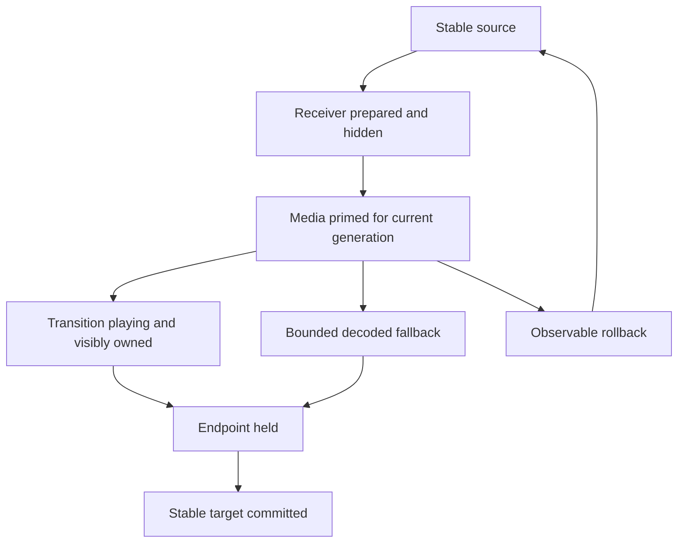
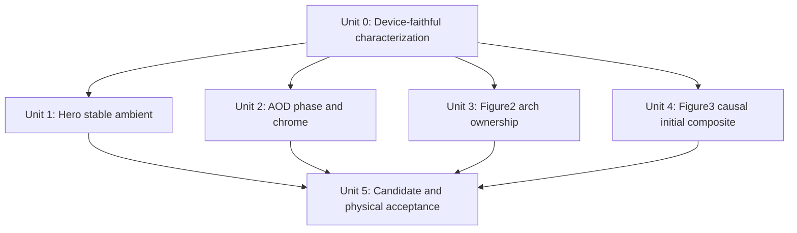
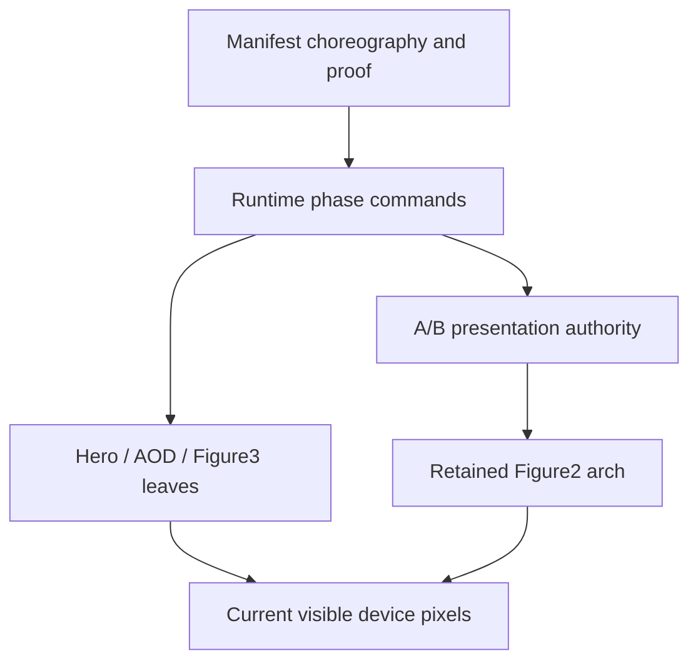

# fix: Close phone media and handoff root causes

## Overview

This plan closes four device-visible regressions in the production phone story:

1. Figure1 is static after the visible Hero entrance.
2. AOD disappears when formal playback begins, and a stray top-left text element is visible before playback.
3. The retained Figure2 foreground arch does not participate atomically in Method → Figure2.
4. Brand → Figure3 still cannot commit on the physical iPhone and rolls back to Brand.

These are not four unrelated styling defects. The current implementation repeatedly conflates three different contracts:

| Contract | What it should answer | Current failure |
| --- | --- | --- |
| Prepared surface | Which decoded pixels can safely close target proof? | Figure3 requires video-frame-zero but does not activate that video; its poster is visible but deliberately forbidden from proving the target. |
| Visibility ownership | Which surface is exposed before, during, and after the A/B handoff? | AOD hides its poster from a root-level ready latch even after the active Canvas becomes ineligible; the Figure2 arch sits outside both A/B planes without a pre-playing exposure gate. |
| Media clock | Who may advance the playhead in stable, primed, playing, and held phases? | Hero stable settle never starts its ambient loop; AOD enters playback while its packed surface is still validating only an initial paused frame. |

The implementation remains bounded to the existing A/B runtime, manifest choreography, leaf command boundary, and shared presentation authority. It does not introduce another state machine or recovery framework.

## Problem Frame

### Confirmed root causes

#### 1. Figure1 stable Hero has no clock owner

`app/src/scenes/hero/phone/PhoneHero.motion.ts` permits ambient playback only after `lastProgress >= PHONE_FIGURE_AUTOPLAY_START_PROGRESS`. A cold Hero starts with `lastProgress = 0`. The Loader handoff eventually invokes `settle(1)`, but `app/src/scenes/hero/phone/PhoneHero.tsx` runs the entrance animation without advancing the media playback object's `lastProgress`. The final `settle()` therefore cannot call `playAmbient()`.

The current Hero test asserts copy opacity after `settle(1)` but never asserts that the same video advances while Hero is stable. The runtime and leaf are both behaving as coded; the stable-idle media contract is missing.

#### 2. AOD invalidates its own visible Canvas when playback starts

`app/src/scenes/aod-animation/phone/PhoneAod.tsx` activates the packed surface in `initial` mode. In `app/src/media/phone-packed-alpha-surface.ts`, that mode accepts only a paused frame near time zero and deletes `data-packed-alpha-frame-ready` as soon as the video is playing. AOD's formal `setMediaPhase(playing)` calls `video.play()` but never changes the packed surface to `forward` mode.

At the same time, `app/src/scenes/aod-animation/phone/PhoneAod.css` hides the poster from the separate root latch `data-phone-aod-playback-frame="ready"`. The result is deterministic: the root still says ready, the poster stays hidden, and the Canvas loses the attribute that makes it visible. The AOD figure disappears.

The existing AOD unit tests mock the packed surface and therefore do not exercise its mode predicate. The browser test samples the root ready latch, not the current Canvas's computed visibility and frame-ready attribute.

The AOD leaf itself renders no visible text. The only production-owned top-left text visible during a stable AOD hold is most likely the fixed `StoryNav` brand mark (`同`), because `PhoneStoryShell` enables navigation for every stable scene except Hero and Pattern. This ownership must be confirmed by a DOM hit-test or screenshot before changing navigation policy; it must not be hidden with an AOD-local CSS patch.

#### 3. Figure2 arch is retained, but not atomically admitted to the transition

`PhoneStoryShell` renders the retained Figure2 arch in `phone-story__retained-figure2-arch-layer`, outside `phone-story__planes`. During Method → Figure2 it is tagged as target-owned, but its target clip and opacity apply only after `data-phone-transition-live` exists. While the target is still preparing, the decoded arch has no default target-hidden rule. It can therefore be exposed before the first Ink frame, then become clipped only after playback begins.

The tests prove that one arch node exists and that its owner is `target`; they do not prove pre-playing invisibility, first-frame clip ownership, or continuous visibility through the stable commit. DOM presence is not transition participation.

#### 4. Brand → Figure3 requires video proof but declares no activation owner

The earlier continuity plan made Brand → Figure3 a static poster-proved handoff. That path could commit, but the low-resolution poster was visibly soft. The current candidate changed Figure3's stable proof from `figure3-initial-poster` to `figure3-initial-composite`, and `PhoneFigure3` now reports that proof only after a decoded video frame is painted to Canvas.

However, `app/src/production/phone-story/manifest.ts` still declares `brand-figure3` with `activationOwner: none` and `mediaClockOwner: none`. `PhoneFigure3.rebind()` consequently tries to seek/decode/paint frame zero outside an activation path. On desktop/headless WebKit this often succeeds. On the physical iPhone it does not reliably produce a frame.

The apparent poster fallback does not close the transaction: `PhoneFigure3.exposePosterFallback()` explicitly leaves the internal state as `preparing` and never reports `figure3-initial-composite`. The first-frame deadline therefore fails and the correct fail-closed behavior rolls back to the last stable commit, Brand. This is why repeated rollback and lineage fixes did not solve the P0: the target proof remains causally impossible on the failing device.

The automated tests mask the contradiction by mocking `prepareTimelineVideoFrame()` as successful or by running in an engine where an unactivated seek decodes frame zero. They assert the expected `video-frame-zero` label after the mock succeeds; they do not test the physical iOS activation restriction.

### Why the previous rounds produced little visible improvement

Most previous changes hardened rollback generations, aliases, failure lineage, module recovery, and mocked proof contracts. Those changes can be internally correct while the device-visible surface never becomes eligible. The test suite currently validates state labels and synthetic callbacks more strongly than it validates the pixels that are actually exposed. This plan changes the acceptance oracle first, then repairs the four ownership contracts above.

## Requirements Trace

- **R1 — Hero ambient ownership:** After the Loader's visible Hero entrance completes, Figure1 must advance continuously on the same video/Canvas surface. Leaving Hero, hiding the page, or retiring the leaf must stop it; returning to stable Hero must resume it without replaying the entrance.
- **R2 — AOD surface continuity:** During AOD → Method forward playback, exactly one current-generation AOD figure surface must remain visible. The poster may be replaced only after the current Canvas is frame-ready, and a stale/renewed Canvas must restore the poster until its own frame is ready.
- **R3 — AOD chrome ownership:** No unexplained text may appear at the top-left before AOD playback. The owning DOM element must be identified first. If it is StoryNav, visibility must be changed through the shell's scene chrome policy, not AOD-local CSS.
- **R4 — Figure2 foreground transition:** The retained foreground arch must be hidden while the Figure2 receiver is only preparing, revealed by the same target ownership boundary as the Figure2 field during Method → Figure2, and remain continuous through the stable Figure2 commit with no preflash or one-frame gap.
- **R5 — Brand/Figure3 P0:** One fresh forward intent from stable Brand must commit Figure3 exactly once. The normal path must present a paused frame zero decoded from the existing Figure3 video. It must not start the Figure3 timeline; that clock remains owned by Figure3 → Services.
- **R6 — Figure3 bounded fallback:** If physical iOS cannot prime or paint frame zero, Brand → Figure3 must not wait indefinitely or silently self-loop. A decoded static cover may close only the initial composite as a bounded fallback, while genuine activation/decoder failure remains observable. Do not add a 1920×1080 poster or upscale the existing media.
- **R7 — Bidirectional and lifecycle safety:** Every repair must survive forward/reverse navigation, a second traversal, background/foreground, Canvas renewal, stale async completion, and rollback without accepting evidence from an old generation.
- **R8 — Evidence quality:** Focused tests must assert current element identity, computed visibility, media time, and commit sequence with real production leaves. Physical iPhone Safari remains the release gate for these four defects.

## Scope Boundaries

- Preserve the existing A/B plane architecture, fail-closed rollback, machine transaction phases, and one runtime authority.
- Do not add a general media coordinator, a second state machine, a new recovery layer, or scene-specific timers in the shell.
- Do not modify unrelated back-half scenes, alias/BFCache handling, native reading behavior, or global viewport coverage.
- Do not add or upscale a 1920×1080 Figure3 poster. The existing Figure3 video remains the preferred first-frame source. Any static surface is failure containment only.
- Do not redesign the navigation. Only change its AOD visibility if the top-left text is proven to be the existing StoryNav element.
- Do not claim the P0 closed from Vitest, build, Chromium, or Playwright WebKit alone.

## Context & Research

### Relevant Code and Patterns

- `app/src/production/phone-story/manifest.ts` is the canonical ledger for activation owner, media clock owner, foreground owner, stable proof, and deadlines.
- `app/src/production/phone-story/runtime.ts` already separates `primed`, `playing`, and `held` media commands and projects one choreography frame through the presentation authority.
- `app/src/media/phone-native-video-prime.ts` is the existing same-element play/pause prime pattern. Figure3 should follow this pattern rather than inventing another iOS unlock helper.
- `app/src/media/phone-packed-alpha-surface.ts` already exposes `initial`, `forward`, and `endpoint` eligibility modes. AOD must drive those modes consistently with its runtime media phase.
- `app/src/production/phone-story/presentation.ts` already owns A/B exposure, clip/mask variables, and atomic stable-plane commit. The shared Figure2 arch should consume that ownership rather than creating a second transition controller.
- `app/src/scenes/figure3-animation/phone/PhoneFigure3.tsx` already has one persistent video, Canvas, generation, and poster cover; the repair is a causal proof policy, not a topology rewrite.

### Institutional Learnings

- `docs/react-refactor/reports/r5-phone-clean-runtime-task13-defect-ledger.md` states that AOD direct entry is a static exception and its motion activates on the normal AOD → Method gesture. It also states that Loader exit is the sole owner of the visible Hero entrance.
- `docs/react-refactor/inventory/figure2-proof-sequence.md` preserves one shared Figure2 foreground/Proof visual instead of scene-local clones.
- `docs/plans/2026-08-09-001-fix-phone-p0-story-continuity-plan.md` correctly identified the original Brand → Figure3 false media dependency, but its static-only solution no longer matches the user's requirement that the normal first hold come from the video. This plan supersedes that one decision while preserving its rollback and physical-acceptance boundaries.

### External References

- None. The failures are fully explained by the local production contracts and physical-device report.

## Key Technical Decisions

1. **Repair ownership contracts, not transaction recovery.** Brand rollback is an effect of missing Figure3 proof. AOD disappearance and Figure1 stopping are leaf phase errors. Runtime/machine changes are out of scope unless the new real-leaf characterization proves a separate defect.
2. **Keep stable-idle distinct from segment playback.** Hero may run its authored ambient loop while stable, but Hero → Pattern still exclusively owns scroll-linked handoff progress. Starting stable ambient must not fake segment progress.
3. **Make AOD Canvas eligibility and poster visibility one generation-bound decision.** Formal forward playback changes the packed surface to `forward` before `video.play()`. The poster is hidden only when the current Canvas remains frame-ready; failure, renewal, or phase reset restores it.
4. **Let the presentation authority admit the Figure2 arch.** The shared arch remains one retained DOM surface, but target preparation, first transition frame, and stable commit must update its visibility/clip ownership atomically with the A/B receiver.
5. **Use a dual-path Figure3 initial composite.** Brand → Figure3 declares target activation with no media clock. `PhoneFigure3.activate()` performs a generation-bound same-element prime, prepares frame zero, pauses, paints, and proves the composite. A decoded poster can close the same composite only after a bounded prime/paint failure, so navigation remains functional. A contained prime/decode failure is recorded in the fallback proof detail rather than reported as a fatal transaction failure; only the absence of both proof surfaces may trigger rollback. The normal successful path must be `video-frame-zero`.
6. **Do not treat labels as visual proof.** A root `ready` dataset is diagnostic only. Acceptance requires the current element to be connected, current-generation, computed-visible, and backed by the expected media time or decoded static pixels.

## Open Questions

### Resolved During Planning

- **Why is Brand still stuck?** The candidate replaced static poster proof with video-frame proof but left Brand → Figure3 without activation; the poster fallback is intentionally non-proving, so physical decode failure must roll back to Brand.
- **Why does AOD disappear only when it starts?** Its packed surface stays in paused-initial mode while formal playback begins, invalidating the Canvas after the poster has been hidden.
- **Why is Figure1 stopped?** Hero stable settle never crosses the playback object's 0.62 segment threshold and there is no separate stable ambient start signal.
- **Why did green automation miss all three?** Tests mock frame success or assert root/state labels rather than the current visible surface and actual media clock.
- **Does this require a new framework?** No. The existing media phases, packed-surface modes, presentation ownership, and prime helper are sufficient.

### Deferred to Implementation

- **Exact top-left text owner:** The code strongly points to StoryNav's mobile brand mark, but the exact rendered string must be captured from the failing frame before changing chrome policy.
- **Whether the existing Figure3 poster is acceptable as a rare fallback:** Do not create a new asset in this pass. Record when fallback is actually exposed on the physical device and revisit its source only if that bounded failure path is visibly unacceptable.

## High-Level Technical Design

> *This illustrates the intended approach and is directional guidance for review, not implementation specification. The implementing agent should treat it as context, not code to reproduce.*

The scene-specific ownership matrix is:

| Path | Prepared proof | Activation owner | Media clock owner | Visible result |
| --- | --- | --- | --- | --- |
| Stable Hero | Existing poster/Canvas quorum | Stable leaf ambient start | Stable leaf ambient only | Figure1 loops after entrance |
| AOD → Method | Current-generation AOD Canvas | Source | Source | Poster → Canvas remains continuous while video advances |
| Method → Figure2 | Figure2 poster + shared arch | None | None | Field and arch enter through one target boundary |
| Brand → Figure3 | Video frame zero preferred; decoded poster bounded fallback | Target | None | Paused Figure3 opening commits once |
| Figure3 → Services | Current Figure3 Canvas | Source | Source | Timeline starts only on this segment |

## Implementation Units

- [x] **Unit 0: Establish device-faithful failing oracles**

**Goal:** Prove each reported symptom against the production shell and real leaves, and record the exact surface owner before implementation changes.

**Requirements:** R1, R2, R3, R4, R5, R8

**Dependencies:** None

**Files:**

- Modify: `app/e2e/r5-phone-clean-presentation.spec.ts`
- Modify: `app/e2e/r5-phone-clean-assertions.ts`
- Test: `app/e2e/r5-phone-clean-presentation.spec.ts`
- Update: `docs/react-refactor/reports/r5-phone-clean-runtime-baseline.md`

**Approach:**

- Add focused production-leaf probes for current video time/paused state, current Canvas identity and computed visibility, poster computed visibility, transition clip ownership, stable scene, commit sequence, failure code, and missing proof.
- Capture the top-left element with its tag, class, text, bounding box, and owning scene at the frame where it appears.
- Keep these probes focused on the four paths. Do not run the full story traversal as the diagnostic loop.

**Execution note:** Characterization-first. Each case must produce either the physical failing trace or a deterministic real-leaf fault-injection trace for the reported reason before production code is changed; headless WebKit is not required to reproduce a device-only decoder restriction spontaneously.

**Patterns to follow:**

- Existing production-shell diagnostic sampling in `app/e2e/r5-phone-clean-presentation.spec.ts`.
- Existing real-leaf current-time traces for Figure2 and Figure3 in the same file.

**Test scenarios:**

- **Integration — Hero stable:** Cold-enter Hero, wait until Loader is hidden and entrance is complete, then sample at least three distinct Figure1 media times; the current build should expose the stopped clock.
- **Integration — AOD playing:** Enter AOD, start AOD → Method, and sample root ready state, active Canvas identity, Canvas frame-ready state, poster visibility, and video time during formal playback.
- **Visual ownership — AOD text:** At the frame before AOD playback, identify every visible text-bearing element intersecting the top-left region and record its owner.
- **Visual ownership — Method → Figure2:** Sample the arch before `data-phone-transition-live`, at the first nonzero target clip, mid-transition, and immediately after commit.
- **Integration — Brand → Figure3:** From stable Brand, record target activation surfaces, Figure3 video ready state/time, initial-surface winner, missing proof, failure code, and commit sequence until commit or rollback.

**Verification:**

- Every issue has one focused trace tied to a concrete element and phase. The trace distinguishes “label says ready” from “current surface is visibly ready.”

- [x] **Unit 1: Restore Figure1 stable ambient playback**

**Goal:** Start and retain Figure1's authored ambient loop after the visible Hero entrance without stealing the Hero → Pattern segment clock.

**Requirements:** R1, R7, R8

**Dependencies:** Unit 0

**Files:**

- Modify: `app/src/scenes/hero/phone/PhoneHero.motion.ts`
- Modify: `app/src/scenes/hero/phone/PhoneHero.tsx`
- Modify: `app/src/scenes/hero/phone/PhoneHero.test.tsx`
- Test: `app/e2e/r5-phone-clean-presentation.spec.ts`

**Approach:**

- Give the existing Figure1 playback owner an explicit stable-idle start intent when Hero's visible entrance settles. Do not satisfy it by mutating segment progress to 0.62.
- Start stable idle only when the current binding is the stable/target Hero owner. A source Hero being settled for retirement during Hero → Pattern must never restart ambient playback.
- Retain the existing 0.62 threshold only for the scroll-linked Hero → Pattern handoff.
- Pause stable ambient on page hide, closure pause, and disposal. Resume from the retained presented frame when Hero becomes stable again; do not replay the Loader/Hero entrance.
- Bind late prime success/rejection to the current run and phase so it cannot pause a later ambient or segment run.

**Patterns to follow:**

- Existing `setActive`, `pause`, and same-element prime lifecycle in `PhoneHero.motion.ts`.
- Runtime's existing stable `settle()` signal and `setMediaPhase()` ownership; no runtime API expansion unless Unit 0 proves the signal is insufficient.

**Test scenarios:**

- **Happy path — cold Hero:** Loader hides, entrance completes, and Figure1 video time increases while the Hero scene remains stable.
- **Happy path — reverse arrival:** Pattern → Hero commits and ambient Figure1 resumes without starting the entrance again.
- **Integration — forward handoff:** Hero → Pattern reclaims the playhead at the existing threshold and produces a monotonic transition with no concurrent ambient owner.
- **Lifecycle — background:** Hiding pauses Figure1; foreground reproof resumes only the current stable generation.
- **Race — late prime:** A late prime resolution or rejection from a retired generation neither pauses nor faults the current ambient/segment run.

**Verification:**

- Stable Hero shows a moving Figure1, while Hero → Pattern still has exactly one segment media clock.

- [x] **Unit 2: Align AOD packed-surface phase and remove the proven stray chrome**

**Goal:** Keep the AOD figure continuously visible through playback and remove the top-left text only through its confirmed owner.

**Requirements:** R2, R3, R7, R8

**Dependencies:** Unit 0

**Files:**

- Modify: `app/src/scenes/aod-animation/phone/PhoneAod.tsx`
- Modify: `app/src/scenes/aod-animation/phone/PhoneAod.css`
- Modify: `app/src/scenes/aod-animation/phone/PhoneAod.test.tsx`
- Modify if Unit 0 confirms StoryNav ownership: `app/src/production/phone-story/PhoneStoryShell.tsx`
- Modify if Unit 0 confirms StoryNav ownership: `app/src/production/phone-story/PhoneStoryShell.test.tsx`
- Test: `app/src/media/phone-packed-alpha-surface.test.ts`
- Test: `app/e2e/r5-phone-clean-presentation.spec.ts`

**Approach:**

- Keep the packed surface in `initial` mode while primed. Before starting formal forward playback, switch the same generation to `forward`, then call `video.play()`.
- On held/reverse/reset paths, pause first and move the surface to the correct initial or endpoint eligibility before probing it.
- Replace the independent root-ready poster switch with a current-generation visible-surface rule: hide the poster only while the current Canvas is connected and frame-ready. Canvas renewal, context failure, stale generation, or reset restores the poster immediately.
- If Unit 0 proves the text is StoryNav, encode AOD's chrome visibility in the shell's scene policy and test it there. If another element owns it, fix that owner instead. Do not use a blanket top-left mask or AOD-local text selector.

**Patterns to follow:**

- `PhoneFigure2` and other packed-alpha leaves that call `surface.setMode('forward')` before native playback.
- Existing StoryNav hidden/inert semantics in `app/src/production/StoryNav.tsx`.

**Test scenarios:**

- **Happy path — forward playback:** The current Canvas remains frame-ready and computed-visible while AOD media time advances; poster and Canvas never become hidden simultaneously.
- **Edge — Canvas renewal:** A renewed Canvas starts hidden with poster visible, then atomically takes over after its own current-generation frame.
- **Error path — compositor failure:** Failure restores the poster and enters the existing recoverable failure path without leaving an empty figure surface.
- **Reverse/held:** Reverse arrival and endpoint hold never use the forward predicate and present the correct paused endpoint.
- **Visual ownership — chrome:** The confirmed top-left text owner is absent during the specified AOD hold/playback interval, while navigation behavior in unrelated stable scenes is unchanged.

**Verification:**

- AOD never has a frame where both its poster and current Canvas are visually absent, and no unexplained top-left text remains.

- [x] **Unit 3: Make the retained Figure2 arch part of atomic target projection**

**Goal:** Admit the shared foreground arch through the same Method → Figure2 target boundary as the Figure2 field.

**Requirements:** R4, R7, R8

**Dependencies:** Unit 0

**Files:**

- Modify: `app/src/production/phone-story/PhoneStoryShell.tsx`
- Modify: `app/src/production/phone-story/styles.css`
- Modify if projection authority needs an explicit retained-surface flag: `app/src/production/phone-story/presentation.ts`
- Modify: `app/src/production/phone-story/PhoneStoryShell.test.tsx`
- Modify: `app/src/production/phone-story/presentation.test.ts`
- Test: `app/e2e/r5-phone-clean-presentation.spec.ts`

**Approach:**

- Preserve one shell-owned retained arch; do not move it into either scene or create a duplicate transition arch.
- Add an explicit exposure contract for the retained layer. A target-owned arch is hidden during receiver preparation, becomes visible only with the first applied target clip/mask/opacity frame, and remains continuous when the target buffer commits stable.
- Source-owned and shared Figure2 ↔ Proof paths keep their existing semantics. Stable commit must clear transition geometry without briefly hiding the retained arch.
- Keep z-depth variables owned by the existing Figure2 renderer. This unit changes admission/visibility, not arch art direction.

**Patterns to follow:**

- `createPhonePresentation.applyTransitionFrame()` and `commitStablePlane()` as the one atomic projection authority.
- Existing `phoneFigure2ArchOwner()` semantic owner mapping and one retained DOM node.

**Test scenarios:**

- **Happy path — Method forward:** Before the first transition frame the target arch is hidden; at each sampled Ink frame its visible region matches the receiver reveal boundary; after commit it is fully visible with no gap.
- **Reverse — Figure2 to Method:** The arch follows source conceal ownership and is gone only when Method commits.
- **Shared path — Figure2 to Proof:** The one retained arch remains continuous and is neither remounted nor clipped as an unrelated target.
- **Error path — decode failure:** A current-attempt arch decode failure reports through the existing presentation failure channel; a stale attempt cannot fault the current transaction.
- **Atomicity — commit frame:** No sampled frame has the Figure2 field committed while the arch is hidden, or the arch visible while the Figure2 receiver is still hidden.

**Verification:**

- Method → Figure2 visually includes the foreground arch throughout the authored Ink handoff, not merely after the transition.

- [x] **Unit 4: Make Brand → Figure3 a causal, non-blocking initial composite**

**Goal:** Prefer the existing Figure3 video's decoded frame zero, while guaranteeing that one Brand forward intent reaches a usable Figure3 hold instead of hanging or silently rolling back.

**Requirements:** R5, R6, R7, R8

**Dependencies:** Unit 0

**Files:**

- Modify: `app/src/production/phone-story/manifest.ts`
- Modify: `app/src/production/phone-story/manifest.test.ts`
- Modify: `app/src/production/phone-story/choreography.test.ts`
- Modify: `app/src/scenes/figure3-animation/phone/PhoneFigure3.tsx`
- Modify: `app/src/scenes/figure3-animation/phone/PhoneFigure3.css`
- Modify: `app/src/scenes/figure3-animation/phone/PhoneFigure3.clean.test.tsx`
- Modify: `app/src/scenes/figure3-animation/phone/PhoneFigure3.test.tsx`
- Test: `app/src/media/phone-native-video-prime.test.ts`
- Test: `app/e2e/r5-phone-clean-presentation.spec.ts`
- Modify only if Unit 0 proves activation deferral itself is broken: `app/src/production/phone-story/runtime.ts`
- Test only if runtime changes: `app/src/production/phone-story/runtime.test.ts`

**Approach:**

- Declare Brand → Figure3 target activation while retaining `mediaClockOwner: none`. The receiver may prime/decode but may not advance the authored Figure3 timeline.
- In `PhoneFigure3.activate()`, prime the same video element under the current activation/run/generation, pause it, prepare exact frame zero, paint the existing paper Canvas, and report `figure3-initial-composite` only from the winner belonging to that attempt.
- Arm the existing bounded poster fallback correctly. If prime/seek/paint cannot win within the bounded initial-composite window, a decoded poster may report the same composite proof and allow Figure3 to commit. A later video frame may replace it only atomically and only while the same stable generation still owns the leaf.
- Resolve the activation settlement from the same winner race. Once the decoded poster wins, activation must no longer wait on the losing video preparation promise; otherwise the fallback proof cannot advance the transaction.
- Contain a prime/decode failure when the poster is already decoded: fulfill the activation batch, report the fallback winner/reason through `figure3-initial-composite`, and do not emit a fatal leaf failure that would race the fallback into rollback. If neither video nor poster can prove the frame, report the existing recoverable failure and let rollback proceed.
- Preserve the poster as a cover/fallback, not the normal winner. Do not create or upscale a new asset.
- Figure3 → Services remains the sole playback owner. Its first render must start from the already proved frame-zero surface, preventing a second prime, rewind, or return to Brand.
- Keep direct `#figure3-animation` entry on its intentional static/no-activation contract: the decoded poster closes the initial composite immediately, without waiting for the Brand segment's video prime or showing an activation CTA.
- Keep failure diagnostics explicit: record winner, prime rejection, preparation failure, and fallback reason. Do not swallow a failure into a permanent `preparing` label.

**Patterns to follow:**

- Existing target-activation choreography used by Services → TTG, Lab → PH, and Education → Crane.
- Existing generation-bound `primePhoneNativeVideo()` usage in Hero/AOD/PH/Crane.
- Existing Figure3 persistent video/Canvas topology and atomic poster/Canvas CSS ownership.

**Test scenarios:**

- **Happy path — Brand forward:** One fresh intent invokes target activation, proves `video-frame-zero`, keeps video paused at approximately zero, commits Figure3 once, and never returns to Brand.
- **Happy path — Figure3 forward:** The next intent starts the Figure3 → Services media clock from the proved opening surface and reaches Services without reprime or rewind.
- **Reverse — Figure3 to Brand:** One reverse intent commits Brand with no Figure3 playback and no intermediate unrelated scene.
- **Fallback — prime rejection:** A current-generation prime rejection exposes and proves the decoded poster within the bounded window, commits a navigable Figure3 hold, and records the fallback reason.
- **Fallback — late video frame:** A late frame from the same stable generation may atomically upgrade the poster; a late frame from an old generation is ignored.
- **Failure — no proof surface:** If neither video nor decoded poster is available, the existing rollback completes visibly and the next fresh input is accepted; there is no indefinite preparing state.
- **Lifecycle — repeat/background:** Two forward/reverse cycles and background/foreground preserve one decoder/Canvas owner and never reuse stale proof.
- **Direct entry:** Direct Figure3 entry resolves through its declared static/no-activation policy and does not accidentally wait for the Brand segment's activation contract.

**Verification:**

- Normal physical iPhone entry uses the Figure3 video frame itself; fallback cannot block navigation; playback begins only on Figure3 → Services.

**Execution result (2026-08-10):** The four implementation units and their real-leaf WebKit probes are complete. Hero stable-idle playback, AOD forward eligibility/chrome ownership, Figure2 retained-arch admission, and Figure3 target activation plus bounded initial-composite fallback are implemented. Automated candidate verification is complete; physical iPhone Safari acceptance remains the explicit release gate in Unit 5.

- [ ] **Unit 5: Freeze one candidate and complete physical acceptance**

**Goal:** Verify the four repairs together on one immutable candidate and prevent broad green automation from replacing device evidence.

**Requirements:** R1, R2, R3, R4, R5, R6, R7, R8

**Dependencies:** Units 1, 2, 3, and 4

**Files:**

- Modify: `app/e2e/r5-phone-clean-presentation.spec.ts`
- Modify: `app/e2e/r5-phone-clean-assertions.ts`
- Update: `docs/react-refactor/reports/r5-phone-clean-runtime-baseline.md`
- Update: `docs/plans/2026-08-10-001-fix-phone-media-handoff-root-causes-plan.md`

**Approach:**

- Run the four focused paths first in phone WebKit with real leaves, then run the existing full Vitest/build/architecture/media gates.
- Freeze a clean commit and candidate identity before physical testing. Do not continue modifying that candidate during acceptance.
- On physical iPhone Safari, test cold load, normal battery, two forward/reverse cycles, toolbar expand/collapse, and background/foreground. Run low-power mode as a separate fallback check because iOS may intentionally reject muted autoplay there.
- Treat any Figure3 rollback, simultaneous AOD poster/Canvas absence, Figure2 arch preflash/gap, or stopped Hero Figure1 as a release blocker even if all automated tests pass.

**Patterns to follow:**

- Candidate and physical-device qualification discipline in `docs/react-refactor/reports/r5-parity-repair-candidate.md`.
- Manual matrix format in `docs/react-refactor/reports/r5-phone-clean-runtime-baseline.md`.

**Test scenarios:**

- **Physical — Hero:** In normal mode, cold load and reverse return both show moving Figure1 after the visible entrance/commit; backgrounding pauses and foregrounding resumes safely. If low-power mode rejects autoplay, the proved static surface remains visible and no stale prime corrupts the next run.
- **Physical — AOD:** Star Map → AOD → Method keeps the AOD figure visible through playback, with no stray top-left text and no poster/Canvas blank frame.
- **Physical — Figure2:** Method → Figure2 forward and reverse show the retained arch inside the Ink boundary from first frame through commit.
- **Physical — Figure3:** Brand ↔ Figure3 twice, then Figure3 → Services, succeeds under normal mode; low-power behavior uses the bounded fallback rather than hanging.
- **Regression — combined spine:** Hero → Pattern → Star Map → AOD → Method → Figure2 → Proof → Brand → Figure3 → Services and back has monotonic commit sequences and no rollback unless an intentionally injected failure occurs.

**Verification:**

- The exact immutable candidate passes the focused automated gates and the recorded physical iPhone matrix. Only then may the four defects, especially Brand → Figure3 P0, be marked closed.

## System-Wide Impact

- **Interaction graph:** Manifest chooses activation/media/foreground ownership; runtime issues phase and projection commands; leaves validate the current media generation; presentation controls A/B and retained-arch exposure; physical pixels are the final proof.
- **Error propagation:** Current-generation media errors report through existing leaf reports into fail-closed rollback. Static fallback is permitted only for Figure3's initial composite and must remain diagnosable.
- **State lifecycle risks:** Late prime completion, stale Canvas frames, renewed Canvas identity, hidden-page pause, stable rebind, and reverse arrival can otherwise mutate the next run.
- **API surface parity:** No public API changes. The existing `PhoneLeafCommandHandle`, manifest choreography, and presentation authority remain the integration boundary.
- **Integration coverage:** Unit tests cannot prove iOS decode eligibility or compositor exposure. Real-leaf WebKit plus physical iPhone sampling is required.
- **Unchanged invariants:** One runtime authority, one stable commit, one retained Figure2 arch, one Figure3 decoder/Canvas pair, fail-closed rollback, and Figure3 → Services as the sole Figure3 playback segment remain unchanged.

## Risks & Dependencies

| Risk | Mitigation |
| --- | --- |
| Target muted prime is rejected on a physical iPhone or in low-power mode | Keep a decoded, bounded Figure3 initial-composite fallback that can commit; record the winner and rejection instead of remaining in `preparing`. |
| Hero ambient and Hero → Pattern both try to own the playhead | Keep stable-idle start separate from segment progress; segment phase explicitly pauses/reclaims ambient before scrubbing. |
| AOD root and Canvas readiness drift again | Derive poster takeover from the current Canvas generation and computed eligibility, not a sticky root label. |
| Figure2 arch develops a one-frame gap at stable commit | Make exposure cleanup part of the same presentation authority and add first/last-frame sampling around commit. |
| Hiding StoryNav on AOD breaks global navigation expectations | Change shell chrome only after Unit 0 proves the text owner, and limit the rule to the user-reported AOD interval. |
| Broad automation goes green while physical Safari still fails | Freeze one candidate and keep physical iPhone evidence as a non-substitutable release gate. |

## Alternative Approaches Considered

| Approach | Decision | Reason |
| --- | --- | --- |
| Restore poster-only Figure3 proof | Rejected as the normal path | It restores navigation but repeats the reported soft first frame and ignores the explicit request to use the video itself. |
| Require video-frame proof with no fallback | Rejected | This is the current P0: physical iOS decode failure makes the target impossible and forces Brand rollback. |
| Add a new 1920×1080 poster | Rejected | It invents resolution absent from the motion source and repeats the already withdrawn asset change. |
| Rewrite runtime recovery/rollback | Rejected unless newly proven | Rollback is correctly preserving Brand after missing target proof; changing it would hide the cause. |
| Move the Figure2 arch back into the scene | Rejected | It would duplicate or break the one retained arch required across Figure2 and Proof. |
| Add a global CSS overlay/mask for AOD text or empty media | Rejected | It would hide symptoms without identifying the owning surface and would risk unrelated scenes. |

## Documentation / Operational Notes

- Update the baseline report with root-cause traces, the final candidate identity, browser evidence, and the physical iPhone matrix.
- Mark the older 2026-08-09 continuity plan's static-only Figure3 decision as superseded by this dual-path initial-composite contract; do not erase its historical findings.
- Do not update release-ready language until the physical matrix is complete.

## Sources & References

- Related plan: `docs/plans/2026-08-09-001-fix-phone-p0-story-continuity-plan.md`
- Related design ledger: `docs/react-refactor/reports/r5-phone-clean-runtime-task13-defect-ledger.md`
- Related Figure2 contract: `docs/react-refactor/inventory/figure2-proof-sequence.md`
- Related candidate history: `docs/react-refactor/reports/r5-parity-repair-candidate.md`
- Relevant code: `app/src/production/phone-story/manifest.ts`
- Relevant code: `app/src/production/phone-story/runtime.ts`
- Relevant code: `app/src/production/phone-story/presentation.ts`
- Relevant code: `app/src/scenes/hero/phone/PhoneHero.tsx`
- Relevant code: `app/src/scenes/aod-animation/phone/PhoneAod.tsx`
- Relevant code: `app/src/scenes/figure3-animation/phone/PhoneFigure3.tsx`
