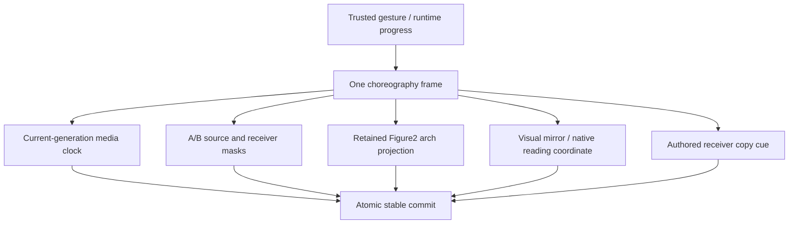
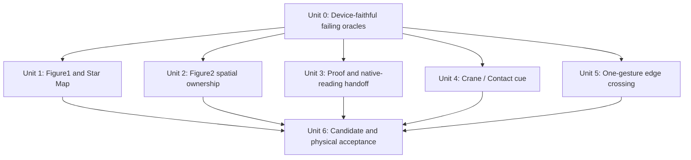
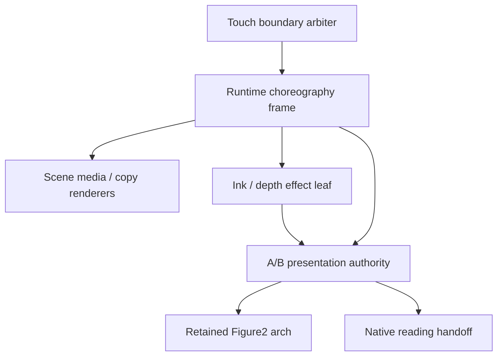

# fix: Close physical phone transition parity gaps

## Execution checkpoint — 2026-08-11

The implementation and automated regression pass are complete in the dirty
worktree; physical iPhone acceptance remains open, so this is not a replacement
candidate for v33.

- all nine focused Phone WebKit and Chromium contracts pass on the current source;
- full Vitest passes: 177 files / 1,363 tests;
- TypeScript, `git diff --check`, architecture, media, build, and unchanged
  performance budgets pass;
- the complete Phone WebKit run passes 76/77, with one Method → AOD rollback;
  the exact AOD case then passes once in isolation and 3/3 repeated, so the
  suite-level occurrence remains recorded rather than hidden by a runtime or
  retry change;
- current build identity is intentionally non-candidate and dirty:
  `candidate=null`, `sourceDirty=true`, qualification `pending-memory`;
- production size remains under the unchanged caps at 665,557 B Phone JS and
  76,790 B initial CSS.

The next authorized step is a physical iPhone pass against this fixed build.
Do not create a replacement tag or release candidate until that pass succeeds.

## Overview

This plan closes nine issues found on the physical iPhone after candidate v33. The
findings invalidate v33 as an acceptance candidate: its automated gates proved
transaction completion and broad surface coverage, but did not prove that the
correct pixels, copy endpoint, retained foreground, and media time stayed under
one owner across every handoff.

The nine symptoms reduce to five shared contract failures rather than nine local
CSS defects:

| Contract | Affected symptoms | Current mismatch |
| --- | --- | --- |
| One media clock per segment | Figure1 does not animate during Hero → Pattern | The phone leaf switches from timeline seeks to native looping at 62%, while the desktop path keeps one timeline-driven video clock for the whole segment. |
| One spatial ownership field | Method → Figure2 arch drift; Figure2 z-depth leaves the old scene behind | The retained arch is outside the A/B planes, and the phone depth field returns no reveal/conceal mask at all. |
| One visual-to-reading coordinate owner | Proof copy disappears early; PH/TTG receiver copy flashes | A visual mirror can be positioned by both scene progress and native scroll, while incoming native scenes can render different content geometry from their stable reading copy. |
| One authored copy cue | Contact copy arrives late | The Crane transition leaf computes the 80% cue, but clean-runtime choreography keeps Contact hidden until progress 1. |
| One boundary gesture decision | Small upward swipes rebound | The touch arbiter freezes `startedEdges` at `touchstart`; a gesture that reaches the edge is deliberately denied until a second gesture starts there. |

Star Map contrast and Proof line grouping are presentation defects, but they
should be corrected inside the same perceptual and text-layout acceptance pass,
not by unrelated global filters or width guesses.

## Problem Frame

### Confirmed root causes

#### 1. Figure1 has two clocks and no full-segment motion contract

`app/src/scenes/hero/phone/PhoneHero.motion.ts` timeline-drives Figure1 only
below `PHONE_FIGURE_AUTOPLAY_START_PROGRESS` (`0.62`). At that boundary it seeks
once, calls native `play()`, enables looping, and stops following runtime
progress. `app/src/scenes/hero/phone/PhoneHero.tsx` separately enables and holds
that playback object from media-phase commands.

This is different from the canonical desktop implementation in
`app/src/scenes/hero/index.tsx`, where `renderHeroPatternProgress()` passes the
whole segment progress through `driveTimelineVideo()`. The phone tests prove
that stable Hero is paused and that lifecycle recovery does not autoplay; they
do not prove monotonically changing current-generation Figure1 frames during
the complete outgoing segment. A delayed seek/pause can therefore contend with
the native loop, and a device can present a static Canvas even though the
transaction progresses.

#### 2. Star Map is brighter but perceptually flatter than desktop

`app/src/scenes/star-map/phone/PhoneStarMap.tsx` raises the ambient noise floor
from the desktop value of roughly `0.028` to a range that reaches about `0.275`,
while also using much broader wide/medium blur passes (`120/44` instead of the
default `72/26`). The Canvas is then globally reduced by opacity and brightness
in `PhoneStarMap.css`.

That combination lifts a large part of the frame continuously and spreads the
highlight into a broad wash. Raw strength and mean luminance still change, so
the current tests pass, but local peak-to-background contrast is lower and the
Perlin structure reads as weak. The repair should restore relative contrast
between core and background, not add a stronger global CSS contrast filter.

#### 3. Figure2 retained foreground is only loosely coupled to projection

The retained arch is mounted by `PhoneStoryShell.tsx` in
`.phone-story__retained-figure2-arch-layer`, outside both A/B planes. The shell
infers `source`, `target`, or `shared` ownership from scene ids. CSS applies the
source and target clip variables, but there is no live projection rule for
`shared`.

For Method → Figure2, the target rule nominally consumes the receiver clip, but
the contract and tests only prove that the arch becomes visible. They do not
prove that its first visible pixels use the same contour revision and threshold
as the Figure2 receiver, or that the arch and receiver survive the stable commit
without a one-frame ownership gap. The retained surface needs an explicit
segment projection policy, not scene-id inference plus visibility assertions.

#### 4. Phone z-depth renders Ink but never masks from/to ownership

`app/src/transitions/figure2-distance-expand/phone.tsx` uses the generic phone
Ink leaf with a `depth` field. In `app/src/transitions/shared/inkField.ts`, depth
frames deliberately return only an edge rank; they return neither
`revealClip`/`concealClip` nor `revealMask`/`concealMask`. Consequently,
`app/src/production/phone-story/presentation.ts` writes `none` to both plane
masks. The effect Canvas can sweep across the screen, but the Figure2 source is
never spatially removed and Proof is never spatially admitted.

The desktop implementation already solves this in
`app/src/transitions/figure2-distance-expand/index.ts` with the existing
`figure2-depth-mask-atlas.webp` and complementary threshold masks. The phone
path should reuse that authored depth field while keeping the clean presentation
layer as the sole endpoint owner.

#### 5. Proof typography and Proof → Brand use unstable coordinate/foreground ownership

`Figure2ProofClosingCopy` renders three inline tail spans after the lead line.
No CSS gives those spans authoritative line grouping, so a narrow viewport wraps
them by available width. The requested three-line composition is therefore not
encoded in the DOM contract.

At Proof → Brand, two additional problems combine:

- The blurred arch endpoint is enforced by a CSS selector that applies only
  while Proof is stable. Starting the transaction removes that selector, so the
  source arch falls back to mutable inline state left by an earlier Figure2
  owner.
- The native-reading handoff writes the bottom `scrollY` to the outer Proof
  mirror, while `PhoneFigure2Proof.render(1)` also translates the inner compound
  document by two viewport heights. The closing copy can therefore be shifted
  twice and disappear before the Ink contour owns it.

The Proof copy and arch must enter the transition from one frozen closing
endpoint and be concealed by the same Ink generation until Brand owns every
pixel.

#### 6. PH/TTG use separate receiver and reading copies without endpoint parity

Lab and Education each have a visual mirror in the A/B receiver and a second
native-reading tree enabled after commit. The stable handoff resets the native
document to the forward top edge, but the receiver is rendered independently.
Education explicitly hides its wide/top act in the visual mirror while the
native reading copy exposes it at scroll top. This guarantees a copy change at
commit. Lab has the same duplicated-root handoff even though its current CSS is
closer to parity.

The tests verify target content exists and the transaction commits; they do not
compare visible text identity and bounding rectangles on the last receiver
frame against the first native-reading frame. Both incoming native scenes need
one canonical top geometry and an atomic mirror-to-reading swap.

#### 7. Crane computes a copy cue that clean choreography discards

`app/src/transitions/crane-contact/phone.ts` computes Contact entrance from the
manifest's authored 80% copy cue and writes a transition progress variable.
However, `phoneSegmentChoreography` maps Contact progress, effect progress, and
opacity through `step(1)`. The clean runtime never applies the helper's Contact
entrance to the receiver. Contact therefore appears only at the terminal
commit, later than both desktop and the established Figure3/AOD handoff pattern.

#### 8. The rebound is boundary arbitration, not excessive global snapping

`createPhoneTouchArbiter()` records exact top/bottom edges at `touchstart` and
only publishes a story intent when that initial snapshot was already at the
required edge. The existing test explicitly requires a gesture that reaches the
bottom to remain native and a second gesture to start the transition. On iOS,
that first gesture naturally exposes rubber-band/snap-back behavior.

The repair should keep one owner per gesture and avoid stealing arbitrary
interior scrolling, while allowing a gesture that starts inside a bounded edge
corridor and crosses the boundary to become the story intent in that same
gesture. Removing global `scroll-snap` or weakening all stage thresholds would
not address the ownership bug.

## Requirements Trace

- **R1 — Figure1 segment motion:** Stable Hero remains static. The first trusted
  Hero → Pattern intent advances the current Figure1 video and Canvas
  monotonically for the authored segment, in both directions, with one clock and
  no late pause/seek from another generation.
- **R2 — Star Map perceptual contrast:** The full-resolution Perlin field remains
  animated, but its local peak-to-background contrast is visibly stronger and
  closer to desktop without crushing copy, adding banding, or increasing a
  full-frame wash.
- **R3 — Method/Figure2 foreground:** The retained arch is hidden during prepare,
  admitted by the exact same receiver contour on the first live frame, and
  remains continuous through stable Figure2.
- **R4 — Figure2 depth ownership:** During z-depth, every pixel behind the swept
  threshold belongs to Proof and every unswept pixel belongs to Figure2. Source
  and target masks are complementary in forward and reverse; no old Figure2
  region survives behind the completed sweep.
- **R5 — Proof final copy:** The closing composition is exactly three authored
  lines on supported phone widths, with “陪你跑到账上有数。” kept on one line.
- **R6 — Proof/Brand atomicity:** The closing text and blurred arch remain visible
  at their terminal Proof endpoint until the same Ink generation conceals them;
  neither may sharpen, disappear, or double-scroll before the contour passes.
- **R7 — TTG/PH native handoff parity:** The last receiver frame and first stable
  native-reading frame for Lab and Education expose the same opening copy,
  geometry, and scroll edge, with no intermediate later-act text.
- **R8 — Crane/Contact cue:** Contact copy begins at the authored 80% cue while
  Crane remains visibly owned through its required terminal frame; the stable
  Contact commit introduces no second entrance.
- **R9 — One-gesture boundary handoff:** A small outward swipe starting near a
  native document boundary can cross into the next story segment without a
  rubber-band round trip or second gesture. Inward, cancelled, and interior
  reading gestures remain native.
- **R10 — Regression and release evidence:** Forward/reverse, repeated traversal,
  background recovery, toolbar resize, reduced motion, and rollback preserve the
  same contracts. A new immutable candidate may be frozen only after focused
  physical iPhone acceptance; v33 must not be reused.

## Scope Boundaries

- Preserve the existing clean runtime, A/B planes, fail-closed rollback,
  transaction generations, and native-reading document architecture.
- Do not add another state machine, media coordinator, global transition layer,
  or scene-specific recovery timer.
- Do not globally remove `scroll-snap`, reduce all story thresholds, or convert
  native reading sections to cinematic fake scroll.
- Do not change media assets or resolutions in this pass.
- Do not solve Star Map by lowering Canvas resolution or applying a global
  contrast filter to the entire scene.
- Do not alter unrelated Brand/Figure3, AOD, module loading, alias, BFCache, or
  memory policies unless a focused failing oracle proves a direct regression.
- Automated WebKit/Chromium evidence is necessary regression coverage but does
  not replace the physical iPhone visual gate.

## Context & Research

### Relevant Code and Patterns

- `app/src/production/phone-story/manifest.ts` is the single choreography ledger
  for media, progress, opacity, and foreground ownership.
- `app/src/production/phone-story/runtime.ts` already projects one immutable
  choreography frame to all current-generation leaf commands.
- `app/src/production/phone-story/presentation.ts` is the sole A/B endpoint
  clip/mask and atomic commit authority.
- `app/src/scenes/hero/index.tsx` provides the canonical one-timeline Figure1
  behavior to match on phone.
- `app/src/transitions/figure2-distance-expand/index.ts` and
  `app/src/transitions/shared/depthThresholdMask.ts` provide the existing depth
  atlas, transform, and complementary mask pattern.
- `app/src/transitions/figure3-services/index.ts` and
  `app/src/transitions/aod-method-top/index.ts` provide accepted 80%-cue copy
  handoff patterns.
- `app/src/production/phone-story/PhoneStoryShell.tsx` owns native mirror
  capture, stable scroll landing, and touch arbitration; these responsibilities
  must stay in one place.

### Institutional Learnings

- `docs/plans/2026-08-09-001-fix-phone-p0-story-continuity-plan.md` established
  that state labels and mocked proof are insufficient when the physical pixels
  are wrong.
- `docs/plans/2026-08-10-001-fix-phone-media-handoff-root-causes-plan.md`
  established current-generation surface identity and one-owner handoff as the
  acceptance standard. This plan supersedes its v33 acceptance conclusion, not
  its generation and rollback invariants.
- `docs/react-refactor/inventory/figure2-proof-sequence.md` requires one retained
  Figure2 foreground across Figure2 and Proof rather than cloned arches.
- No relevant `docs/solutions/` record exists for this new physical-device batch.

### External References

- None. Desktop parity, the physical-device report, and the repository's own
  runtime/presentation contracts fully determine the required behavior.

## Key Technical Decisions

1. **Characterize visible ownership before changing constants.** Each defect gets
   a real-leaf oracle for pixel/copy/media/scroll ownership. Green commit and
   lifecycle labels are not the acceptance oracle.
2. **Use one timeline clock for Figure1.** Stable Hero is a paused endpoint;
   Hero → Pattern owns the Figure1 playhead for its complete duration. Remove
   the mid-segment native-loop handoff instead of adding another retry.
3. **Return real depth masks through the presentation contract.** The depth leaf
   may own SVG mask definitions and atlas progression, but it returns reveal and
   conceal mask references plus their sizing/repeat/alpha-mode metadata to
   `presentation.ts`; it does not mutate source or receiver DOM directly.
4. **Make the retained arch an explicit projection participant.** Segment policy
   determines whether it consumes source, target, or shared endpoint state.
   Scene-id inference remains diagnostic only.
5. **Choose one coordinate owner for native handoff.** While a native source
   mirror is active, document scroll positions the mirror and scene-level page
   translation is neutral. Incoming receiver geometry must equal its stable
   forward/reverse landing before the reading tree is enabled.
6. **Use authored copy cues from the canonical ledger.** Crane stays the media
   owner, while Contact entrance progress begins at the existing 80% cue. The
   transition leaf must not compute a cue that choreography ignores.
7. **Fix edge crossing, not snap density.** Touch ownership remains immutable once
   claimed, but the start snapshot records distance to the edge and can arm one
   bounded crossing. Global snap behavior remains unchanged.

## Open Questions

### Resolved During Planning

- **Is Figure2 z-depth a renderer problem?** No. The renderer draws the depth
  field, but the phone ownership frame contains no masks, so endpoint pixels
  cannot follow the sweep.
- **Is the rebound caused by too many story snaps?** Not primarily. A current
  unit test freezes the exact two-gesture behavior in the touch arbiter.
- **Should Figure1 autoplay while Hero is stable?** No. The reported product
  contract is static stable Hero and motion only after the outgoing gesture.
- **Should the Proof arch be cloned into Proof or Brand?** No. One retained arch
  stays mounted and receives explicit projection ownership.
- **Should Method → Figure2 also run the arch's z-depth transform?** No. Desktop
  parity keeps Figure2 at its authored opening geometry during this Ink reveal.
  The arch changes ownership with the receiver contour here; blur/scale depth
  motion belongs to the following Figure2 → Proof segment.
- **Does this require external research?** No. The desktop implementation and
  shared transition helpers are direct local patterns.

### Deferred to Implementation

- **Exact edge corridor size:** Begin with a viewport-bounded phone tolerance and
  tune only against physical iPhone traces. The invariant is more important than
  the number: interior scroll cannot be stolen, while a near-edge outward gesture
  can cross once.
- **Exact Star Map glow ratios:** Select them from percentile/occupancy evidence
  and physical comparison with desktop. Do not freeze new constants before the
  characterization test records the current contrast distribution.
- **Whether Lab has a second layout divergence beyond duplicated roots:** The
  parity oracle will compare its last receiver frame with first native frame.
  Modify Lab-specific layout only if that trace shows a mismatch.
- **Whether any rebound also occurs in a cinematic plane:** Unit 0 must record
  `data-phone-reading` for every rebound. The bounded edge-crossing repair applies
  to native reading only; a rebound while reading is disabled is a separate
  runtime-input finding and must not be hidden by widening the edge corridor.

## High-Level Technical Design

> *This illustrates the intended approach and is directional guidance for review, not implementation specification. The implementing agent should treat it as context, not code to reproduce.*

The invariant is that every visible surface is derived from the same immutable
attempt/generation and choreography frame. Stable commit changes ownership; it
does not change the presented text, scroll coordinate, media frame, or retained
foreground endpoint.

## Implementation Units

- [x] **Unit 0: Establish device-faithful failing oracles**

**Goal:** Turn all nine reports into assertions about the actual visible owner,
not only scene status, progress labels, or DOM presence.

**Requirements:** R1–R10

**Dependencies:** None

**Files:**

- Modify: `app/e2e/r5-phone-clean-presentation.spec.ts`
- Modify: `app/e2e/r5-phone-clean-assertions.ts`
- Modify: `app/src/production/phone-story/PhoneStoryShell.test.tsx`
- Modify: `app/src/production/phone-story/presentation.test.ts`
- Update during execution: `docs/react-refactor/reports/r5-phone-clean-runtime-acceptance.md`
- Test: `app/e2e/r5-phone-clean-presentation.spec.ts`

**Approach:**

- Record current element identity, computed visibility, video time, Canvas media
  time/revision, clip/mask value, visible text, bounding rectangle, native
  scroll, stable commit, and transaction generation at the relevant frame.
- Add focused paths only; do not use the full 60-leg traversal as the diagnostic
  loop.
- Mark v33 invalidated in the acceptance ledger before any replacement candidate
  is considered.

**Execution note:** Characterization-first. Production behavior changes begin
only after each current failure is either reproduced by a real-leaf browser test
or captured by a physical-device trace with the same observable fields.

**Patterns to follow:**

- Current video/Canvas sampling helpers in
  `app/e2e/r5-phone-clean-presentation.spec.ts`.
- Current viewport coverage and single-authority assertions in
  `app/e2e/r5-phone-clean-assertions.ts`.

**Test scenarios:**

- **Media — Hero:** Stable Hero remains at one media time; after one forward
  intent, Figure1 video and Canvas times advance monotonically before Pattern
  commits; reverse does the inverse without a native-loop jump.
- **Visual — Star Map:** Record luminance percentiles, highlight occupancy, and
  local peak-to-background delta at three ambient phases; the current test's
  mean-luminance range alone is not sufficient.
- **Projection — Method/Figure2:** At prepare, first live frame, midpoint, and
  commit, compare the arch's computed clip/mask with the receiver's exact
  contour revision and threshold.
- **Projection — z-depth:** Sample source, receiver, and depth threshold at
  multiple points; every sampled pixel must be owned by exactly one endpoint,
  including reverse.
- **Handoff — Proof/Brand:** On the first transaction frame, closing copy text
  and rectangle equal the stable closing frame; arch filter stays at the Proof
  endpoint until the conceal mask passes.
- **Handoff — TTG/PH:** Last receiver and first native-reading frames have equal
  opening text and near-equal bounding rectangles for Lab and Education.
- **Cue — Crane/Contact:** Contact is hidden before 80%, begins its authored
  entrance at the cue, and does not restart after stable commit.
- **Input — native edge:** A near-bottom outward gesture crosses once; an
  interior, inward, or cancelled gesture publishes no story intent.

**Verification:**

- Every reported symptom has one failing pre-fix oracle tied to a visible
  current-generation surface or boundary decision.

- [x] **Unit 1: Restore Figure1's single clock and Star Map's local contrast**

**Goal:** Make Figure1 visibly advance only during Hero → Pattern and make the
full-resolution Star Map Perlin structure more legible.

**Requirements:** R1, R2, R10

**Dependencies:** Unit 0

**Files:**

- Modify: `app/src/scenes/hero/phone/PhoneHero.motion.ts`
- Modify: `app/src/scenes/hero/phone/PhoneHero.tsx`
- Modify: `app/src/scenes/hero/phone/PhoneHero.test.tsx`
- Modify: `app/src/scenes/star-map/phone/PhoneStarMap.tsx`
- Modify: `app/src/scenes/star-map/phone/PhoneStarMap.css`
- Modify: `app/src/scenes/star-map/phone/PhoneStarMap.test.tsx`
- Test: `app/e2e/r5-phone-clean-presentation.spec.ts`

**Approach:**

- Remove the 62% timeline-to-native-loop handoff from the phone Figure1 owner.
  Drive the complete Hero → Pattern segment through the existing timeline video
  driver and current media run token, matching `app/src/scenes/hero/index.tsx`.
- Keep stable Hero, Loader entrance completion, held endpoints, and backgrounded
  states paused. A new current-generation `playing` phase is the only event that
  permits segment motion.
- Bind prime completion and frame callbacks to the current run/generation so a
  late result cannot pause or overwrite the active timeline.
- For Star Map, lower the persistent noise floor and reduce broad wash relative
  to medium/core passes. Keep current source resolution, camera transform, and
  ambient period. Use CSS only for final compositing, not as the primary contrast
  repair.

**Patterns to follow:**

- `renderHeroPatternProgress()` in `app/src/scenes/hero/index.tsx`.
- Default glow and desktop paint settings in
  `app/src/scenes/star-map/starFieldReveal.ts` and
  `app/src/scenes/star-map/index.tsx`.

**Test scenarios:**

- **Happy path — Hero forward:** One trusted forward intent yields monotonic
  video and Canvas media times across the complete segment and a static Pattern
  endpoint.
- **Reverse — Hero:** Pattern → Hero drives the same physical playhead backward
  and settles to the authored static Hero frame without autoplay.
- **Race — Hero:** A delayed prime or old timeline callback cannot pause, seek,
  or relabel the current playing generation.
- **Lifecycle — Hero:** Stable, hidden, BFCache-restored, and returned Hero remain
  paused until a fresh outgoing intent.
- **Visual — Star Map:** Peak-to-background delta increases from the recorded
  baseline, highlights occupy a bounded minority of pixels, and copy luminance
  remains within its current readable range.
- **Reduced motion — Star Map:** The deterministic reduced-motion field remains
  static and legible without an ambient breathing clock.

**Verification:**

- Figure1 visibly moves during the gesture-owned segment and nowhere else.
- Star Map gains structured contrast without resolution loss, clipping, or a
  globally crushed scene.

- [x] **Unit 2: Make Figure2 arch and depth sweep first-class spatial owners**

**Goal:** Admit the retained arch atomically and make the z-depth sweep actually
exchange Figure2 and Proof pixels.

**Requirements:** R3, R4, R6, R10

**Dependencies:** Unit 0

**Files:**

- Modify: `app/src/production/phone-story/manifest.ts`
- Modify: `app/src/production/phone-story/choreography.test.ts`
- Modify: `app/src/production/phone-story/presentation.ts`
- Modify: `app/src/production/phone-story/presentation.test.ts`
- Modify: `app/src/production/phone-story/PhoneStoryShell.tsx`
- Modify: `app/src/production/phone-story/styles.css`
- Modify: `app/src/transitions/shared/depthThresholdMask.ts`
- Modify: `app/src/transitions/shared/phoneInkLeaf.tsx`
- Modify: `app/src/transitions/shared/phoneInkLeaf.test.tsx`
- Modify: `app/src/transitions/figure2-distance-expand/phone.tsx`
- Modify: `app/src/transitions/figure2-distance-expand/phone.test.tsx`
- Modify: `app/src/transitions/method-bottom-figure2/phone.test.tsx`
- Modify: `app/src/transitions/figure2-proof-brand/phone.test.tsx`
- Test: `app/e2e/r5-phone-clean-presentation.spec.ts`

**Approach:**

- Extend the clean depth effect so the existing SVG/atlas threshold owner can
  expose current-generation reveal and conceal mask references without directly
  mutating either endpoint plane.
- Return those complementary mask references through the current effect render
  result; let `presentation.ts` apply and clear them atomically with source and
  receiver opacity. Apply the corresponding `100% 100%`, no-repeat, alpha-mode,
  and WebKit-prefixed mask properties through the same live-transition rule.
- Encode explicit retained-arch projection policy for the three relevant
  segments: receiver-owned on Method → Figure2, continuous/shared depth endpoint
  through Figure2 → Proof, and source-owned on Proof → Brand.
- Make arch preparation hidden by default and let the first live projection
  frame admit it. Its filter/scale endpoint must be driven by the same Figure2
  progress frame, never inferred from the last leaf that happened to touch its
  inline variables.
- Dispose mask definitions and retained-surface projection only after stable
  plane commit or rollback, rejecting old-generation cleanup.

**Patterns to follow:**

- Depth atlas and transform logic in
  `app/src/transitions/figure2-distance-expand/index.ts`.
- Existing presentation-owned radial/horizontal clip application in
  `app/src/production/phone-story/presentation.ts`.
- The single retained-arch topology documented in
  `docs/react-refactor/inventory/figure2-proof-sequence.md`.

**Test scenarios:**

- **Happy path — Method/Figure2:** Arch is hidden before live projection, then
  uses the receiver's exact contour and reaches stable Figure2 without flash.
- **Depth forward:** At 25%, 50%, and 75% reveal, source and receiver masks are
  complementary and the Figure2 pixels behind the threshold are absent.
- **Depth reverse:** Mask polarity swaps while the same atlas generation and
  camera transform are retained.
- **Foreground — depth:** Shared arch remains one DOM node, follows the authored
  scale/blur endpoint, and is not clipped away with either plane accidentally.
- **Cleanup:** Commit, rollback, BFCache reproject, and a newer generation remove
  only their own mask definitions and variables.
- **Failure path:** Missing/undecoded atlas cannot silently show both complete
  endpoints; it enters the existing recoverable failure path with the stable
  source preserved.

**Verification:**

- The depth sweep is a real spatial exchange, not a decorative Canvas over two
  fully visible scenes.
- The retained arch participates continuously in all three Figure2 boundaries.

- [x] **Unit 3: Unify Proof layout and native visual-reading handoffs**

**Goal:** Preserve the exact closing Proof endpoint through Ink and make Lab and
Education commit without a copy swap.

**Requirements:** R5, R6, R7, R10

**Dependencies:** Units 0 and 2

**Files:**

- Modify: `app/src/scenes/figure2-proof-closing/index.tsx`
- Modify: `app/src/scenes/figure2-proof/phone/PhoneFigure2Proof.css`
- Modify: `app/src/scenes/figure2-proof/phone/PhoneFigure2Proof.tsx`
- Modify: `app/src/scenes/figure2-proof/phone/PhoneFigure2Proof.test.tsx`
- Modify: `app/src/styles.css`
- Modify: `app/src/production/phone-story/PhoneStoryShell.tsx`
- Modify: `app/src/production/phone-story/PhoneStoryShell.test.tsx`
- Modify: `app/src/production/phone-story/styles.css`
- Modify: `app/src/scenes/education/phone/PhoneEducation.css`
- Modify if the parity trace requires it: `app/src/scenes/education/phone/PhoneEducation.tsx`
- Modify if the parity trace requires it: `app/src/scenes/lab/phone/PhoneLab.tsx`
- Modify if the parity trace requires it: `app/src/scenes/lab/phone/PhoneLab.css`
- Modify: `app/src/scenes/education/phone/PhoneEducation.test.tsx`
- Modify: `app/src/scenes/lab/phone/PhoneLab.test.tsx`
- Test: `app/e2e/r5-phone-clean-presentation.spec.ts`

**Approach:**

- Encode Proof's three lines as three line-level groups: lead, the combined
  “先进现场，再定章法，” line, and a no-wrap “陪你跑到账上有数。” line. Keep the
  accessible sentence continuous.
- During native source handoff, choose one coordinate owner. The outer mirror's
  captured native scroll positions the document; scene-level compound-page
  translation is neutral while that handoff is active. Do not add scroll and
  progress translations together.
- Freeze the closing Proof copy and blurred arch before publishing the
  transaction, then expose that visual endpoint and its Ink mask in the same
  layout frame that disables native reading.
- Make the current Proof owner write the arch's terminal blur/scale/brightness
  during rebind/render/settle; transaction state must not depend on mutable
  inline values left by a retired Figure2 leaf.
- Make Lab/Education receiver mirrors render the same landing act, typography,
  and coordinate that stable native reading will expose: top for a forward
  arrival and bottom for a reverse arrival. Remove Education's visual-only
  top-act suppression. Keep one visual tree and one reading tree, but require
  pixel/copy parity at their ownership swap.
- Clear handoff transforms and mirror diagnostics only after the stable native
  scroll has been written, so there is no uncovered frame between owners.

**Patterns to follow:**

- Existing `writePhoneNativeHandoff()` and `nativeReadingTarget()` ownership in
  `PhoneStoryShell.tsx`.
- Existing Figure3/Services mirror-to-reading continuity assertions.
- Proof panel anchors and aliases in `app/src/scenes/figure2-proof/index.tsx`.

**Test scenarios:**

- **Typography:** At supported narrow and wide phone widths, Proof closing has
  exactly three line boxes and the final phrase occupies one line.
- **Proof forward:** Starting Proof → Brand from the bottom keeps one closing
  copy at the same rectangle on the first transition frame; no double offset is
  present.
- **Proof foreground:** Arch stays at blur/scale/brightness Proof endpoint until
  source conceal reaches it; reverse restores the same endpoint.
- **Atomic reading handoff:** Native Proof hides only when the visual mirror is
  already visible at the identical scroll coordinate, and Brand commit exposes
  no intermediate scene.
- **TTG/Lab forward and reverse:** Receiver and reading text/rectangles match at
  the direction-appropriate top/bottom landing; repeat traversal introduces no
  opposite-act flash.
- **PH/Education forward and reverse:** The direction-appropriate wide/top or
  vertical/bottom act remains the same owner before and after commit.
- **Lifecycle:** Toolbar and BFCache reproject preserve the current alias and
  coordinate owner without reapplying a stale handoff transform.

**Verification:**

- Proof text and arch leave together under one Ink contour.
- Lab/Education stable commit changes input ownership only, not visible content.

- [x] **Unit 4: Restore the authored Crane → Contact copy cue**

**Goal:** Start Contact's copy entrance at the established 80% cue without
cutting off Crane media or replaying Contact after commit.

**Requirements:** R8, R10

**Dependencies:** Unit 0

**Files:**

- Modify: `app/src/production/phone-story/manifest.ts`
- Modify: `app/src/production/phone-story/choreography.test.ts`
- Modify: `app/src/transitions/crane-contact/phone.ts`
- Modify: `app/src/transitions/crane-contact/phone.test.ts`
- Modify: `app/src/scenes/contact/phone/PhoneContact.tsx`
- Modify: `app/src/scenes/contact/phone/PhoneContact.test.tsx`
- Test: `app/e2e/r5-phone-clean-presentation.spec.ts`

**Approach:**

- Project Contact entrance progress from the existing 80% cue through the clean
  choreography ledger, analogous to Figure3 → Services and AOD → Method.
- Keep Crane as source/media owner and fully visible through its required
  terminal-frame proof. Contact copy may enter over that source; full receiver
  input and stable reading ownership still begin only at commit.
- Ensure the final transition frame and stable Contact hold have identical copy
  geometry so `settle(1)` does not trigger a second entrance.
- Remove or consolidate helper-only progress that the runtime cannot consume;
  there should be one authored cue, not a transition variable and a contradictory
  manifest step.

**Patterns to follow:**

- `sampleFigure3ServicesChannels()` in
  `app/src/transitions/figure3-services/index.ts`.
- `CRANE_CONTACT_COPY_CUE` in
  `app/src/transitions/crane-contact/index.ts`.

**Test scenarios:**

- **Cue boundary:** Contact is absent immediately before 80%, begins entrance at
  80%, and reaches its stable geometry at 100%.
- **Media ownership:** Crane videos/Canvases complete their current-generation
  terminal frame while Contact copy begins; no source pause or early disposal
  occurs.
- **Commit:** First stable Contact frame equals the last transition frame and
  native input becomes enabled only once.
- **Reverse:** Contact returns to Crane without a copy flash or a stale Contact
  overlay.
- **Reduced motion/failure:** Reduced motion lands at the same endpoint; a Crane
  media failure continues to use existing fail-closed rollback rather than
  exposing an unproved Contact commit.

**Verification:**

- Contact timing matches the authored cue and Crane completion remains intact.

- [x] **Unit 5: Allow one-gesture crossing at native reading edges**

**Goal:** Eliminate the physical rubber-band round trip while preserving native
reading ownership away from scene boundaries.

**Requirements:** R9, R10

**Dependencies:** Unit 0

**Files:**

- Modify: `app/src/production/phone-story/PhoneStoryShell.tsx`
- Modify: `app/src/production/phone-story/PhoneStoryShell.test.tsx`
- Modify if edge sampling needs a shared value: `app/src/production/phone-story/runtime.ts`
- Modify if shared edge sampling changes: `app/src/production/phone-story/runtime.test.ts`
- Test: `app/e2e/r5-phone-clean-presentation.spec.ts`

**Approach:**

- At `touchstart`, record scroll position, maximum, distance to the relevant
  edge, touch id, and whether the gesture begins inside a bounded edge corridor.
- On the first directional move, allow an armed outward gesture whose projected
  delta crosses the edge to claim the story. Clamp the native owner to the exact
  edge, capture the visual mirror there, prevent further browser rubber-band,
  and publish one fresh intent.
- Keep the claim immutable after publication. Interior starts, inward motion,
  insufficient delta, multi-touch, native controls, and cancellation remain
  native and publish nothing.
- Replace the current regression test that requires a second gesture with
  explicit same-gesture crossing and non-stealing cases.

**Patterns to follow:**

- Current touch-id and one-publication handling in
  `createPhoneTouchArbiter()`.
- Current exact document scroll owner in `phoneReadingEdges()`.

**Test scenarios:**

- **Near-bottom forward:** Start inside the corridor, cross the bottom on one
  upward move, and receive one prevented move plus one story input.
- **Near-top reverse:** Symmetric downward crossing returns to the prior segment
  once.
- **Interior:** A large reading gesture starting outside the corridor remains
  native even if momentum later reaches the edge.
- **Direction change:** An inward first move does not arm a later outward story
  claim in the same gesture.
- **Cancellation/multi-touch/control:** No story input, scroll clamp, or mirror
  freeze is left behind.
- **Repeated boundary use:** Method/Figure2, Proof/Brand, Services/TTG,
  Lab/PH, Education/Crane, and Contact reverse use the same policy without
  duplicate intents.

**Verification:**

- A normal small boundary swipe transitions once without visible rebound, while
  ordinary document reading remains native.

- [ ] **Unit 6: Run broad regression, physical acceptance, and freeze a new candidate**

**Goal:** Prove the repaired ownership contracts as pixels and interactions on
the physical iPhone before creating a replacement candidate.

**Requirements:** R10

**Dependencies:** Units 1–5

**Files:**

- Modify: `app/e2e/r5-phone-clean-presentation.spec.ts`
- Modify: `docs/react-refactor/reports/r5-phone-clean-runtime-acceptance.md`
- Modify: `docs/react-refactor/reports/r5-phone-clean-runtime-baseline.md`
- Regenerate only after all gates pass: `dist/r5-release-manifest.json`
- Test: `app/e2e/r5-phone-clean-presentation.spec.ts`

**Approach:**

- Run focused real-leaf browser tests first, then the complete unit/build/media/
  budget gates and the broad phone WebKit traversal.
- Perform physical iPhone Safari validation on a fixed production artifact for
  the nine paths in both directions, twice, including toolbar movement,
  background/foreground, low-power mode, and interrupted gestures.
- Record screen/video evidence for Figure1 motion, Star Map contrast, all three
  Figure2 foreground boundaries, PH/TTG copy parity, Crane cue timing, and
  boundary rebound.
- Freeze a new tag/manifest only after physical results pass. Record v33 as
  invalidated history; do not overwrite its identity.

**Test scenarios:**

- **Complete traversal:** Full forward and reverse story twice with no flash,
  stale copy, unowned pixels, rebound, or resource growth.
- **Lifecycle:** Hide/show, BFCache, toolbar resize, orientation rejection, and
  low-power mode preserve the current stable source or complete the current
  bounded transition.
- **Failure recovery:** Media/transition rejection retains the last proven
  frame, exposes recovery once stable, and accepts the next fresh input.
- **Physical visual:** Compare the exact nine reported paths against the signed
  acceptance matrix; browser automation alone cannot mark them passed.

**Verification:**

- All automated gates pass on the exact clean source commit.
- Physical iPhone evidence passes all nine rows before the replacement candidate
  is declared GO for further qualification.

## System-Wide Impact

- **Interaction graph:** One runtime frame fans out to scene commands, effect
  ownership, A/B presentation, retained arch projection, and native-reading
  handoff. Touch arbitration is the only input-side change.
- **Error propagation:** Media and depth-mask failures continue through the
  existing current-generation report/fail-closed path. No visual fallback may
  silently expose both endpoints.
- **State lifecycle risks:** Late prime, mask cleanup, handoff transforms, or
  scroll callbacks must be rejected when their run/generation is stale.
- **API surface parity:** Desktop behavior is the reference for Figure1 clock,
  Figure2 depth mask, and Crane cue; phone keeps its clean runtime interface.
- **Integration coverage:** Unit tests cannot prove Canvas motion, complementary
  compositing, native mirror parity, Safari rubber-band behavior, or perceived
  contrast. Focused browser and physical-device evidence are required.
- **Unchanged invariants:** A/B buffers, immutable attempts, stable commit,
  fail-closed rollback, one retained arch node, native reading, and media budget
  remain unchanged.

## Alternative Approaches Considered

| Approach | Decision | Reason |
| --- | --- | --- |
| Increase global Star Map CSS contrast | Rejected | It crushes source/copy together and does not restore local Perlin structure. |
| Hide leftover Figure2 with an opacity fade | Rejected | It cannot match a spatial depth sweep and still leaves overlapping ownership. |
| Clone the arch into Figure2 and Proof planes | Rejected | It reintroduces ghosting and violates the single retained foreground contract. |
| Patch Proof text with a narrower font/width | Rejected | Browser wrapping remains nondeterministic; authored line groups must be explicit. |
| Delay native reading visibility with a timeout | Rejected | It hides the race instead of making receiver and reading geometry identical. |
| Reveal full Contact only at commit | Rejected | It is the current late behavior and discards the authored 80% cue. |
| Remove all scroll snapping | Rejected | The rebound comes from exact-edge gesture arbitration and two-gesture policy, not global snap count. |

## Risks & Dependencies

| Risk | Likelihood | Impact | Mitigation |
| --- | --- | --- | --- |
| SVG depth masks behave differently in iOS compositing | Medium | High | Keep presentation as sole mask owner, test `-webkit-mask-*`, and require physical forward/reverse evidence. |
| Edge corridor steals document scrolling | Medium | High | Arm only bounded starts, require outward first motion and predicted crossing, and test inward/interior/cancel paths. |
| Figure1 timeline seeks are too expensive on iPhone | Medium | High | Reuse the existing driver/current Canvas, sample actual frame cadence, and avoid dual native/timeline clocks. |
| Receiver/reading parity changes native document height | Low | High | Compare scrollHeight, first/last anchors, and stable landing before accepting Lab/Education CSS changes. |
| Star Map improvement becomes a full-frame wash | Medium | Medium | Gate percentile delta and highlight occupancy, then validate physically against desktop. |
| JS budget has little remaining headroom | High | Medium | Reuse existing depth/clock/handoff helpers, remove dead duplicate cue logic, and run budget checks before candidate freeze. |

## Documentation / Operational Notes

- Update the acceptance report immediately when implementation begins to mark
  v33 invalidated by physical findings.
- Preserve all old candidate tags and artifact identities as historical evidence.
- Do not push, merge, deploy, or freeze a new candidate as part of planning.
- Physical iPhone evidence remains the final gate; `pending-memory` qualification
  remains a separate release requirement after visual acceptance.

## Sources & References

- Physical iPhone findings supplied on 2026-08-11.
- `docs/plans/2026-08-09-001-fix-phone-p0-story-continuity-plan.md`
- `docs/plans/2026-08-10-001-fix-phone-media-handoff-root-causes-plan.md`
- `docs/react-refactor/inventory/figure2-proof-sequence.md`
- `app/src/production/phone-story/manifest.ts`
- `app/src/production/phone-story/PhoneStoryShell.tsx`
- `app/src/production/phone-story/presentation.ts`
- `app/src/scenes/hero/phone/PhoneHero.motion.ts`
- `app/src/scenes/star-map/phone/PhoneStarMap.tsx`
- `app/src/transitions/figure2-distance-expand/phone.tsx`
- `app/src/transitions/figure2-distance-expand/index.ts`
- `app/src/transitions/crane-contact/phone.ts`
