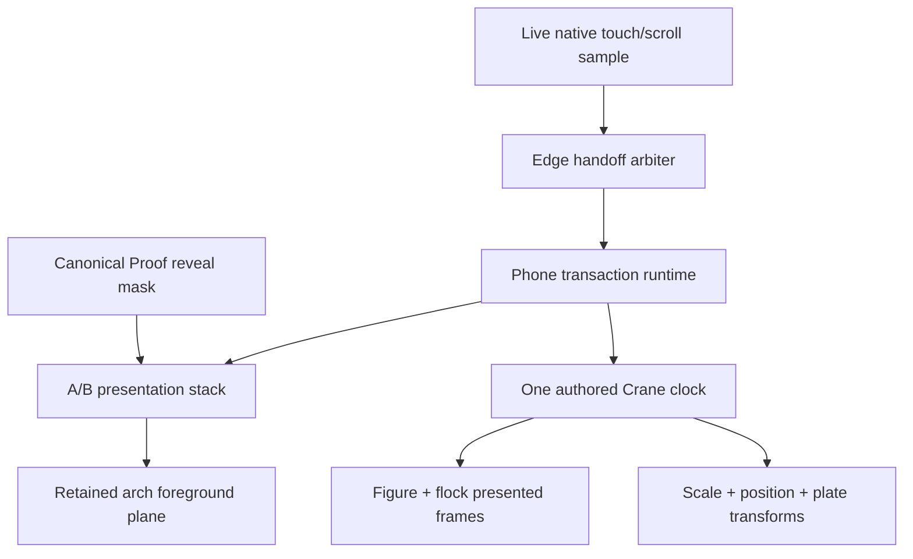
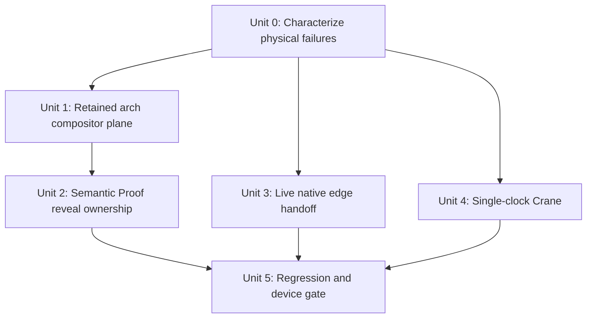

# fix: Restore Figure2 ownership, native handoff, and Crane clock parity

## Overview

The latest physical iPhone pass invalidates the current dirty build as an
acceptance candidate. The four visible symptoms are not independent styling
issues. They come from four ownership mismatches introduced or left unresolved
by the current phone projection:

| Area | Current owner mismatch | Required owner |
| --- | --- | --- |
| Method → Figure2 arch | The arch is clipped like the target but lives above the complete A/B/effect stack. | One retained foreground surface inside the same compositor stack, below the Ink effect and projected by the target contour. |
| Figure2 → Proof depth | A depth-atlas conceal mask is applied to the entire Figure2 A/B plane from the first scroll frame. | The opaque Proof ownership surface alone receives the canonical reveal mask; Figure2 remains the intact backing scene until Proof covers each swept pixel. |
| Services/Lab reading exit | Gesture eligibility is frozen within a 48–96 px corridor at `touchstart`, while document overscroll remains enabled. | Native scrolling owns the gesture until the live edge is reached; the same gesture then hands its remaining outward motion to the story exactly once. |
| Crane playback/camera | CSS scale/translation follows runtime progress while two Canvas videos start later through asynchronous native `play()`. | One authored Crane timeline maps the same presented time to both media lanes and camera transforms. |

The canonical story path is `services → ttg-animation → lab → ph-animation`.
This plan interprets “service 到 ph” as the existing `lab → ph-animation`
boundary. It does not add a new direct Services → PH route.

## Problem Frame and Findings

### F1 — Method → Figure2 arch is outside the transition stacking context

`app/src/production/phone-story/PhoneStoryShell.tsx` mounts
`.phone-story__retained-figure2-arch-layer` after `.phone-story__viewport`, not
inside `.phone-story__planes`. The retained layer has `z-index: 72`, while the
Ink effect is inside the isolated viewport/effect plane. Although
`app/src/production/phone-story/styles.css` copies `--phone-target-clip` onto
the arch, the arch still paints above the Ink boundary and cannot participate
in the same foreground/effect ordering as the Figure2 receiver.

The existing browser contract checks hidden/visible state and stable survival.
It does not verify matching contour revision, matching threshold, or physical
pixel ordering against the Ink Canvas. This explains why automation passes
while the arch still reads as an independently appearing overlay on iPhone.

### F2 — The P0 Figure2 disappearance is caused by whole-plane conceal masking

`app/src/transitions/shared/phoneInkLeaf.tsx` now returns both reveal and conceal
SVG mask URLs for the depth segment. `app/src/production/phone-story/presentation.ts`
then applies the conceal mask to the entire Figure2 source buffer immediately
when the transaction becomes live. During the first 72% media leg, effect
progress is still zero, but the source plane already owns the external SVG mask.

That topology differs from desktop. The desktop implementation in
`app/src/transitions/figure2-distance-expand/index.ts` masks the opaque Proof
ownership surface and leaves Figure2 intact underneath. Applying an atlas mask
whose definitions live in the effect subtree to the complete sibling A/B plane
is also a fragile iOS compositor boundary. A failed or empty fragment resolution
hides the people, background, and every other source layer together—the exact
P0 symptom reported on first scroll.

The current tests only assert that source and receiver CSS contain different
`depth-threshold` URLs. They never assert that the central people, middle
building, far arcade, clouds, and poster/Canvas remain physically painted.

### F3 — The rebound is caused by a frozen corridor heuristic plus browser overscroll

`createPhoneTouchArbiter()` in
`app/src/production/phone-story/PhoneStoryShell.tsx` records the edge distance
at `touchstart` and permanently denies story ownership when that distance is
greater than the 48–96 px corridor. Reaching the real document edge later in
the same gesture cannot change the decision. Meanwhile native-reading mode
sets `overscroll-behavior-y: auto` on the document roots, so Safari performs
its rubber-band before a later gesture can start the transition.

The present same-gesture test starts only 40 px from the edge and therefore
proves the heuristic, not the real Services/Lab interaction. It does not cover
an ordinary swipe that starts farther inside the final screen and reaches the
edge through live native scrolling.

### F4 — Crane uses two clocks, unlike desktop

`app/src/scenes/crane-animation/phone/PhoneCrane.tsx` applies
`renderPhoneCranePresentation()` from runtime progress. In the same runtime
state change, scene `render()` runs before the media owner receives the
`playing` phase. The flock then starts via asynchronous `video.play()`, the
figure waits until runtime progress reaches `1 / 6`, and the Canvas first-frame
callbacks arrive later still. CSS scale/rise can therefore advance before the
corresponding presented media frame.

The desktop renderer in `app/src/scenes/crane-animation/index.tsx` derives
figure media, flock media, scale, unmasking, and plate movement from one
timeline progress. Phone already has the correct lane projections in
`app/src/scenes/crane-animation/phone/PhoneCrane.autoplay.ts`; it should reuse
them as one clock instead of combining native media time with an independent
runtime camera clock.

The flock's portrait placement is a separate camera calibration. It should be
moved a small amount upward through the existing phone tuning variable only
after clock parity is restored, so position tuning cannot conceal a timing bug.

## Scope

### In scope

- Method → Figure2 retained-arch reveal and stacking order.
- Figure2 intro and Figure2 → Proof depth ownership in both directions.
- Native reading edge handoff for Services → TTG and Lab → PH, using the same
  shared policy for the other native boundaries.
- Crane media/camera synchronization and a small phone-only flock Y adjustment.
- Unit, browser, and physical-device evidence that checks pixels and timing,
  not only state-machine completion.

### Out of scope

- New media assets, re-encoding, or changes to Figure3 resolution.
- A new Services → PH route.
- Global gesture thresholds, global scene timing changes, or removal of native
  reading.
- Duplicating the Figure2 arch into both A/B scenes.
- Raising size budgets or freezing a candidate before the physical pass.

## Requirements Trace

- **R1 — Arch continuity:** The single retained arch is hidden while preparing,
  revealed by the exact Figure2 receiver contour, painted below the Ink effect,
  and unchanged across stable commit and rollback.
- **R2 — Figure2 P0:** Starting Figure2 playback never removes the people or any
  depth plate. During the depth leg, opaque Proof pixels replace Figure2 only
  where the canonical reveal mask has passed.
- **R3 — Bidirectional depth:** Forward and reverse use the same depth generation
  and camera transform. Figure2 and Proof never both disappear and never expose
  the page/coverage behind them.
- **R4 — One-gesture handoff:** A normal outward swipe may begin inside the last
  native-reading screen, reach the live edge, and start the next segment without
  Safari rubber-band or a second gesture. Interior/inward/control gestures stay
  native.
- **R5 — Crane single clock:** Flock motion, figure motion, scale, unmasking, and
  plate movement are projections of the same authored time. Camera movement may
  not lead the first current-generation Canvas frame.
- **R6 — Crane composition:** The flock is calibrated slightly higher on the
  phone viewport without clipping its authored path or changing desktop.
- **R7 — Acceptance:** No replacement candidate is frozen until focused pixel,
  timing, broad regression, and two-pass physical iPhone checks pass on one
  immutable production artifact.

## High-Level Technical Design

Key decisions:

1. Keep one retained arch DOM node, but place its layer inside the compositor
   stack as a first-class retained foreground plane. The effect plane remains
   above it for `above-both` segments.
2. Model Figure2 depth like desktop: Proof is an opaque canonical target whose
   reveal mask covers the intact Figure2 backing scene. Do not apply a conceal
   SVG mask to the whole Figure2 A/B buffer.
3. Replace the fixed touchstart corridor with live edge detection. Ownership
   changes only after the real scroll owner reaches the relevant edge and the
   finger continues outward.
4. Replace, rather than supplement, Crane's dual-clock path. The existing
   authored lane projection remains the source of timing truth; current-
   generation presented frames gate camera advancement.

## Implementation Units

- [x] **Unit 0: Add failure-first characterization and invalidate the current acceptance state**

**Goal:** Encode the four physical findings before changing behavior and stop
the current dirty build from being described as device-ready.

**Requirements:** R1–R7

**Dependencies:** None

**Files:**

- Modify: `docs/react-refactor/reports/r5-phone-clean-runtime-acceptance.md`
- Modify: `app/src/production/phone-story/PhoneStoryShell.test.tsx`
- Modify: `app/src/transitions/shared/phoneInkLeaf.test.tsx`
- Modify: `app/src/scenes/crane-animation/phone/PhoneCrane.test.tsx`
- Test: `app/e2e/r5-phone-clean-presentation.spec.ts`

**Execution note:** Characterization-first. Preserve the failing physical
contracts before changing implementation.

**Approach:**

- Record the latest physical pass as NO-GO and keep previous candidate tags as
  historical evidence.
- Add RED contracts for compositor ancestry/order, Figure2 pixel persistence,
  live edge crossing from outside the old corridor, and delayed Crane first
  frames.
- Make the browser trace record contour revision/threshold, semantic mask owner,
  key Figure2 layer rectangles/visibility, Canvas generation/media time, and
  Crane camera progress in the same sample.

**Test scenarios:**

- Method → Figure2 live frame proves the arch and receiver share one contour
  revision and threshold, with the Ink Canvas painted above the arch.
- During Figure2 intro progress `0..0.72`, people and all named depth plates have
  non-empty visible pixels and Proof owns none of the viewport.
- A native gesture starts more than 96 px from the bottom, reaches the live edge,
  continues outward, and produces one story intent.
- Crane `play()`/first rVFC is delayed while runtime progresses; the camera must
  not advance ahead of the presented generation.

**Patterns to follow:**

- Current frame recorder and Canvas/media sampling in
  `app/e2e/r5-phone-clean-presentation.spec.ts`.
- Current generation-bound delayed-media cases in
  `app/src/scenes/crane-animation/phone/PhoneCrane.test.tsx`.

**Verification:** Each physical symptom has a deterministic RED contract, and
the acceptance report no longer describes the dirty build as ready.

- [x] **Unit 1: Make the retained arch a first-class compositor plane**

**Goal:** Put the arch in the same spatial and stacking contract as the A/B
receiver without cloning or remounting it.

**Requirements:** R1, R3

**Dependencies:** Unit 0

**Files:**

- Modify: `app/src/production/phone-story/PhoneStoryShell.tsx`
- Modify: `app/src/production/phone-story/styles.css`
- Modify: `app/src/production/phone-story/manifest.ts`
- Modify: `app/src/production/phone-story/choreography.test.ts`
- Modify: `app/src/production/phone-story/PhoneStoryShell.test.tsx`
- Modify: `app/src/production/phone-story/presentation.ts`
- Modify: `app/src/production/phone-story/presentation.test.ts`
- Test: `app/e2e/r5-phone-clean-presentation.spec.ts`

**Approach:**

- Move the single retained layer into `.phone-story__planes` as a dedicated
  foreground plane that survives buffer role swaps. Once nested, change its
  geometry to local `inset: 0`/absolute visual-viewport coordinates instead of
  reapplying the outer fixed viewport offsets.
- Project source/target/shared ownership from the segment manifest, but apply
  the exact current effect ownership object rather than re-reading unrelated
  CSS variables later.
- Set explicit stack order: endpoint planes, retained foreground, then the Ink
  effect for `above-both`. Preserve the existing source/target foreground swap
  for other segments.
- Keep decode readiness, generation checks, stable Proof blur, rollback, and
  BFCache ownership on the same node.

**Test scenarios:**

- Forward Method → Figure2: prepare hidden; first live frame shares target clip;
  arch is below effect and above Figure2 content; stable commit has no gap.
- Reverse Figure2 → Method: polarity swaps and the same node leaves under the
  receiver/source contour.
- Figure2 → Proof shared foreground: arch stays visible and blurred while the
  background ownership changes underneath it.
- Proof → Brand: source-owned arch leaves with Proof and no stale layer remains.
- Rollback/reproject: old generation cleanup cannot hide the current arch.

**Patterns to follow:**

- Buffer-role and stable-plane ownership in
  `app/src/production/phone-story/presentation.ts`.
- Single retained-node lifecycle in
  `app/src/stage/PhoneRetainedFigure2Arch.tsx`.

**Verification:** One arch node shares the endpoint contour and stack for all
three Figure2 boundaries, with the Ink effect physically above it.

- [x] **Unit 2: Replace whole-plane complementary depth masks with semantic Proof reveal**

**Goal:** Fix the Figure2 disappearance P0 and preserve a true depth exchange.

**Requirements:** R2, R3

**Dependencies:** Unit 1

**Files:**

- Modify: `app/src/transitions/shared/phoneInkLeaf.tsx`
- Modify: `app/src/transitions/shared/phoneInkLeaf.test.tsx`
- Modify: `app/src/transitions/shared/depthThresholdMask.ts`
- Modify: `app/src/transitions/shared/depthThresholdMask.test.ts`
- Modify: `app/src/transitions/figure2-distance-expand/phone.tsx`
- Modify: `app/src/transitions/figure2-distance-expand/phone.test.tsx`
- Modify: `app/src/production/phone-story/manifest.ts`
- Modify: `app/src/production/phone-story/presentation.ts`
- Modify: `app/src/production/phone-story/presentation.test.ts`
- Modify: `app/src/production/phone-story/styles.css`
- Test: `app/e2e/r5-phone-clean-presentation.spec.ts`

**Approach:**

- Express depth ownership as a canonical Proof reveal surface, not a generic
  source/receiver complementary pair. Forward applies the reveal mask to the
  Proof receiver; reverse applies the same reveal mask to the Proof source.
- Mount the current generation's mask definitions under the common planes host
  and attach the mask to the registered Proof ownership root, rather than
  resolving an effect-subtree fragment URL on an entire sibling A/B buffer.
- Leave the Figure2 plane unmasked and intact beneath Proof. Because
  `.phone-story .r4-proof-compound` is opaque paper, every revealed Proof pixel
  occludes Figure2; every unrevealed pixel exposes Figure2. This matches the
  desktop ownership model without a fragile whole-plane conceal mask.
- Keep the depth mask generation alive for the complete transaction and update
  its camera transform from the same terminal Figure2 projection. Dispose it
  only after commit/rollback of that generation.
- Remove the current test assumption that both A/B planes must have mask URLs.
  Replace it with semantic owner and physical coverage assertions.

**Test scenarios:**

- Intro leg: no mask is applied to Figure2; person Canvas/poster and all depth
  plates remain visible while the media reaches its endpoint.
- Forward depth at 25/50/75%: Proof owns the swept pixels and Figure2 is visible
  only through the unswept remainder; there are no transparent holes.
- Reverse depth: the Proof source mask retreats monotonically to reveal the
  intact Figure2 receiver.
- Atlas decode failure: stable Figure2 remains visible and the transaction uses
  the existing recoverable rollback; no empty mask is attached.
- Slow/late mask generation: an old SVG definition cannot be referenced by the
  current semantic owner.

**Patterns to follow:**

- Target-only Proof ownership in
  `app/src/transitions/figure2-distance-expand/index.ts`.
- Opaque Proof surface contract in
  `app/src/scenes/figure2-proof/phone/PhoneFigure2Proof.css`.

**Verification:** Figure2 never loses its people or plates on intro, and the
depth leg exchanges pixels without masking the complete Figure2 buffer.

- [x] **Unit 3: Replace the touchstart corridor with live edge handoff**

**Goal:** Remove Services → TTG and Lab → PH rubber-band without stealing normal
document scrolling.

**Requirements:** R4

**Dependencies:** Unit 0

**Files:**

- Modify: `app/src/production/phone-story/PhoneStoryShell.tsx`
- Modify: `app/src/production/phone-story/PhoneStoryShell.test.tsx`
- Modify: `app/src/production/phone-story/styles.css`
- Modify if shared edge sampling changes: `app/src/production/phone-story/runtime.ts`
- Modify if shared edge sampling changes: `app/src/production/phone-story/runtime.test.ts`
- Test: `app/e2e/r5-phone-clean-presentation.spec.ts`

**Approach:**

- Track touch id, first direction, previous finger position, incremental motion,
  and live document scroll position. Do not decide story eligibility from a
  fixed distance at `touchstart`.
- On each move, compare current live distance-to-edge with that move's outward
  delta. Let native scrolling consume interior motion; when the projected move
  crosses the real edge with an outward remainder, prevent that crossing move,
  clamp/freeze the exact edge mirror, and publish one fresh intent. This avoids
  waiting for a later move after Safari has already entered rubber-band.
- Use a non-bouncing overscroll policy for the active native-reading document
  while preserving `pan-y`, toolbar behavior, native controls, and interior
  scrolling.
- Keep ownership immutable after publication; direction reversal, multi-touch,
  cancellation, or controls never produce a story intent.

**Test scenarios:**

- Services and Lab forward exits start in the final screen outside the old
  corridor, reach the bottom, and transition once in the same gesture.
- Reverse top-edge exits are symmetric.
- Interior swipe that never reaches an edge remains native.
- A gesture reaching the edge but reversing inward remains native.
- Multi-touch, cancel, links, buttons, fields, and contact controls leave no
  frozen mirror or queued transition.
- Toolbar height changes during the gesture use the live scroll maximum rather
  than the touchstart maximum.

**Patterns to follow:**

- Exact edge sampling in `phoneReadingEdges()` and mirror freezing in
  `app/src/production/phone-story/PhoneStoryShell.tsx`.
- Single-publication touch-id handling in the current arbiter.

**Verification:** Services → TTG and Lab → PH cross on one ordinary boundary
gesture, while interior reading and controls remain fully native.

- [x] **Unit 4: Restore one authored Crane clock, then tune flock height**

**Goal:** Synchronize animation and camera exactly as desktop does, then make
the flock sit slightly higher on phone.

**Requirements:** R5, R6

**Dependencies:** Unit 0

**Files:**

- Modify: `app/src/scenes/crane-animation/phone/PhoneCrane.tsx`
- Modify: `app/src/scenes/crane-animation/phone/PhoneCrane.motion.ts`
- Modify: `app/src/scenes/crane-animation/phone/PhoneCrane.autoplay.ts`
- Modify: `app/src/scenes/crane-animation/phone/PhoneCrane.css`
- Modify: `app/src/scenes/crane-animation/phone/PhoneCrane.test.tsx`
- Create: `app/src/scenes/crane-animation/phone/PhoneCrane.motion.test.ts`
- Create: `app/src/scenes/crane-animation/phone/PhoneCrane.autoplay.test.ts`
- Modify if command ordering must be generalized: `app/src/production/phone-story/runtime.ts`
- Modify if command ordering changes: `app/src/production/phone-story/runtime.test.ts`
- Test: `app/e2e/r5-phone-clean-presentation.spec.ts`

**Approach:**

- Reuse the desktop authored cues (`0s` flock, `0.5s` figure, `1.5s` full figure,
  `2.5s` flock retirement, `3s` authored end) and the existing phone media-lane
  projections.
- Establish the current generation's presented media clock before allowing
  camera progress. Until `0.5s`, the flock's presented media time is the master;
  while both lanes are active, use the slower presented authored time so the
  camera cannot lead either Canvas; after flock retirement, the figure lane
  owns `2.5s..3s`. Drive flock rise/scale, figure grow/unmask, and plate exit
  from that same authored time. Do not repair the lead with a timeout.
- Keep reverse as presented-frame sampling of the same clock mapping. Preserve
  terminal Canvas proof and the bounded 400 ms decode tail; the tail does not
  advance authored motion or camera.
- After synchronization passes, reduce the existing phone-only flock Y tune by
  a small measured amount (target 2–3 `lvh` upward), verifying that the opening,
  top arrival, and terminal crop all remain intact. Desktop values remain
  unchanged.
- Delete superseded delayed-figure/native-clock bookkeeping rather than adding
  another parallel clock path.

**Test scenarios:**

- Delayed `play()` and delayed first rVFC: camera remains at the matching frame,
  then media and camera advance monotonically together.
- Figure begins at authored `0.5s`; flock starts at `0s`; neither lane is
  replayed or prematurely paused.
- At sampled points, camera-derived progress and Canvas-derived authored time
  differ by no more than one presented frame.
- Forward reaches both terminal Canvas frames before Contact commit; the 400 ms
  tail holds the authored endpoint.
- Reverse samples both media lanes and camera from the same decreasing time.
- Phone portrait crop shows the flock 2–3 `lvh` higher without clipping; desktop
  snapshots and transforms are unchanged.

**Patterns to follow:**

- Timeline and lane projection in `app/src/scenes/crane-animation/index.tsx`.
- Existing current-generation Canvas evidence and reverse seeking in
  `app/src/scenes/crane-animation/phone/PhoneCrane.tsx` and
  `app/src/scenes/crane-animation/phone/PhoneCrane.autoplay.ts`.

**Verification:** Every visible camera sample corresponds to already presented
Crane media time; no scale/rise frame can precede its animation frame.

- [ ] **Unit 5: Run broad regression, physical acceptance, and freeze only after pass**

**Goal:** Prove the repaired pixels and gesture behavior on the exact artifact
before creating a new candidate.

**Requirements:** R7

**Dependencies:** Units 2, 3, and 4

**Files:**

- Modify: `app/e2e/r5-phone-clean-presentation.spec.ts`
- Modify: `docs/react-refactor/reports/r5-phone-clean-runtime-acceptance.md`
- Modify: `docs/react-refactor/reports/r5-phone-clean-runtime-baseline.md`
- Regenerate only after passing: `dist/r5-release-manifest.json`

**Approach:**

- Run focused unit and real-leaf browser tests first, followed by full Vitest,
  TypeScript, build, architecture/media gates, budget checks, and the complete
  phone WebKit traversal.
- Keep the unchanged JS/CSS caps. The worktree currently has almost no size
  margin, so Units 2–4 must replace the failed mask/corridor/dual-clock logic,
  not layer new compatibility paths on top.
- Build one immutable production artifact and run the four reported paths
  forward/reverse twice on physical iPhone Safari, including toolbar movement,
  background/foreground, low-power mode, and interrupted gestures.
- Inspect a screen recording frame-by-frame for arch/Ink ordering, Figure2
  pixel persistence, rebound, and Crane media/camera alignment.
- Freeze a new tag/manifest only after all rows pass; keep qualification
  `pending-memory` until its separate memory gate is executed.

**Acceptance matrix:**

| Path | Required physical result |
| --- | --- |
| Method → Figure2 | Arch enters under the same Ink edge; no independent pop. |
| Figure2 intro/depth | People and all plates remain; Proof covers swept pixels with no hole or full-scene disappearance. |
| Services → TTG / Lab → PH | One normal swipe crosses the edge without rubber-band or a second gesture. |
| Crane → Contact | Flock/figure motion and zoom start together; flock sits slightly higher; terminal frames are not cut off. |

**Patterns to follow:**

- Candidate identity and physical evidence format in
  `docs/react-refactor/reports/r5-phone-clean-runtime-acceptance.md`.

**Verification:** All automated gates and the two-pass physical matrix pass on
one immutable clean artifact before any new candidate identity is created.

**2026-08-12 automated checkpoint:** The implementation and automated portion
of this unit are complete: focused Phone WebKit is 7/7, full Vitest is 177
files / 1,364 tests, the production build and unchanged size budgets pass, and
the complete Phone WebKit project is 113/113 in one process without retry. The
unit remains unchecked until the same artifact completes the two-pass physical
iPhone matrix, memory qualification, and candidate freeze.

The subsequent Proof reproject transparency correction has a fresh production
build, full Vitest 177 files / 1,364 tests, and focused stable/reproject Phone
WebKit 2/2. The prior 113/113 run predates this CSS-only selector correction and
is retained as broad regression evidence, not exact-artifact completion.

## System-Wide Impact

- **Presentation:** Retained foreground becomes a real participant in the A/B
  stack. The single-node and atomic-commit invariants remain unchanged.
- **Depth effect:** Ownership changes from generic complementary plane masks to
  one semantic, opaque Proof reveal surface. Other Ink transitions are not
  changed.
- **Input:** Native reading remains the owner until the real boundary. Only the
  boundary continuation transfers to the story.
- **Media:** Crane keeps two decoders/Canvases but one authored time. Existing
  failure reporting, generation rejection, and terminal-frame proof remain.
- **Lifecycle:** Late mask, media, touch, toolbar, BFCache, and rollback callbacks
  must all be rejected when their transaction/generation is stale.

## Alternatives Rejected

| Alternative | Why rejected |
| --- | --- |
| Raise/lower only the arch z-index | It cannot place an external stacking context beneath an Ink effect that is isolated inside the viewport. |
| Keep complementary masks and tune SVG/CSS alpha | The P0 comes from masking the complete Figure2 plane; tuning does not restore semantic ownership or iOS reliability. |
| Fade Figure2 out during depth | It creates a global dissolve instead of the authored spatial sweep. |
| Increase the 96 px touch corridor | It still freezes the decision at touchstart and only moves the failure boundary. |
| Remove all snapping/timing thresholds | The rebound is an ownership transfer bug, not an excessive segment count. |
| Delay Crane zoom with a timer | Native playback/Canvas presentation can start late by a device-dependent amount; a timeout preserves two clocks. |
| Tune Crane Y before clock repair | It can make one sampled frame look better while motion and scale remain unsynchronized. |

## Risks and Mitigations

| Risk | Impact | Mitigation |
| --- | --- | --- |
| Proof reveal is not fully opaque on a phone path | Figure2 may bleed through swept pixels. | Keep the reveal owner on the opaque `.r4-proof-compound`; assert alpha/coverage at 25/50/75%. |
| Moving the arch changes stable Proof stacking | Foreground can hide copy or navigation. | Scope stacking to the planes, keep reading/nav above it, and test stable Figure2/Proof plus Proof → Brand. |
| Live edge handoff steals reading | Normal scroll becomes a transition. | Require real edge plus continued outward motion, one touch id, immutable direction, and control exclusions. |
| Presented-frame Crane clock stalls | Contact could wait forever. | Preserve bounded media deadlines and fail-closed rollback; never advance unproved camera pixels. |
| Size budgets are exceeded | Build gate fails. | Delete the old corridor and dual-clock branches; reuse existing helpers and do not introduce a generic framework. |

## Documentation and Operational Notes

- Do not create a commit, tag, push, deployment, or candidate as part of this
  planning step.
- The current physical findings supersede prior automated “GO for device
  testing” language for the dirty build.
- No new asset is required for these four fixes.
- Physical iPhone Safari remains the authoritative visual/gesture gate; WebKit
  automation is necessary but not sufficient.

## Sources and References

- Physical iPhone findings supplied on 2026-08-12.
- `docs/plans/2026-08-11-001-fix-phone-physical-handoff-parity-plan.md`
- `docs/react-refactor/inventory/figure2-proof-sequence.md`
- `app/src/production/phone-story/PhoneStoryShell.tsx`
- `app/src/production/phone-story/manifest.ts`
- `app/src/production/phone-story/presentation.ts`
- `app/src/production/phone-story/styles.css`
- `app/src/transitions/shared/phoneInkLeaf.tsx`
- `app/src/transitions/shared/depthThresholdMask.ts`
- `app/src/transitions/figure2-distance-expand/index.ts`
- `app/src/transitions/figure2-distance-expand/phone.tsx`
- `app/src/scenes/crane-animation/index.tsx`
- `app/src/scenes/crane-animation/phone/PhoneCrane.tsx`
- `app/src/scenes/crane-animation/phone/PhoneCrane.motion.ts`
- `app/src/scenes/crane-animation/phone/PhoneCrane.autoplay.ts`
