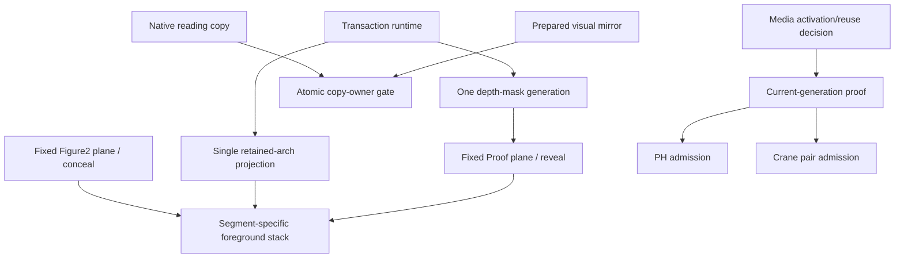
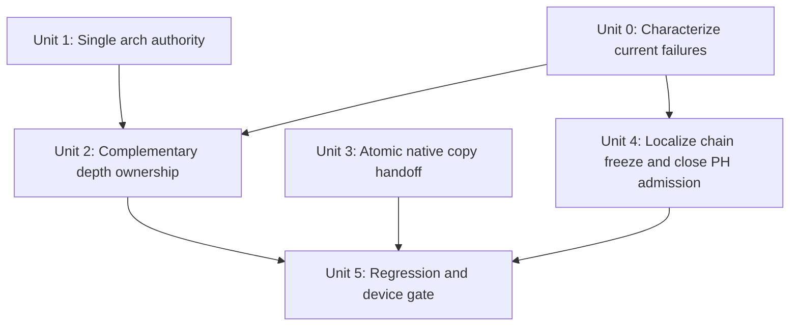

# fix: Close Figure2 depth, Proof copy, and packed-media authority gaps

## Implementation status — 2026-08-12

Units 0–4 are implemented, but Unit 5 remains open. The latest review reopened
two contracts and this checkpoint closes them in focused automation:

- Figure2 now applies `conceal` and Proof `reveal` to the two fixed viewport
  A/B planes, not to one-screen and three-screen semantic roots. The existing
  single depth atlas stores interleaved alpha-complement frame pairs and both
  masks consume one shared mutable frame transform, avoiding WebKit SVG filter
  inversion and two-update compositor skew. The atlas is still one resource
  and shrank from 11,184 B to 10,402 B.
- Runtime report-port rebind is semantically idempotent. A PH rebind within the
  same transaction preserves the admitted generation, moves report authority
  to the new binding, and continues the bounded first-frame probe. Only a new
  transaction, rollback, retirement, or disposal clears admission.

The artifact remains dirty and mutable. Trusted Chromium touch proves each
Services → TTG → Lab → PH edge once; Playwright WebKit cannot synthesize a
trusted swipe, so the same Safari touch path remains in the physical Unit 5
matrix. No candidate, commit, tag, push, or release signature may be created.

| Current automated gate | Exact result |
| --- | --- |
| Focused Vitest | 6 files / 222 tests passed |
| Full Vitest | 177 files / 1,377 tests passed |
| Trusted Chromium touch chain | 1/1 passed; all three exact edges committed once |
| Fixed-plane pixel complement | WebKit 2/2 and Chromium 2/2 passed; WebKit repeat 4/4 passed |
| Focused PH lifecycle | WebKit 1/1 passed |
| Phone WebKit project | Presentation file: 77 passed / 1 trusted-touch skip / 5 pressure failures in a 44.6-minute process; all five failed cases passed an immediate isolated 5/5 rerun, including the 60-leg traversal. Remaining project files passed 35/35. One uninterrupted all-green process remains open. |
| Production build | TypeScript, architecture, media, release-build, and budget gates passed |
| Build budget | 665,381 B Phone JS / 665,600 B; 76,695 B initial CSS; 11,918,200 B WebP |
| Artifact identity | `58c4884119f62e252acfd74ba7eaeab4d9d277a31c5215522615cb5526e93aa7` |
| Release state | **NO-GO** — `candidate=null`, `sourceDirty=true`, `pending-memory` |

## Overview

The latest physical-phone findings make the current dirty build a **NO-GO**.
The two active P0s belong to two separate ownership domains. Earlier arch,
copy, and Crane fixes remain in the dirty worktree but are not evidence that
these two contracts are correct:

| Symptom | Confirmed contract break | Required contract |
| --- | --- | --- |
| Figure2 remains visually intact or both scenes disappear during z-depth | Earlier variants masked only Proof, then masked semantic roots of different heights. A shared atlas was therefore sampled in incompatible 1×/3× coordinate systems; SVG-filter inversion also failed in WebKit. | One transaction-bound complementary exchange on equal fixed viewport planes: Figure2 plane=`conceal`, Proof plane=`reveal`; the retained arch is outside both masks and above the depth Ink. |
| Services-to-PH journey freezes | There is no `services-ph` segment; the real chain is Services → TTG → Lab → PH. Current diagnostics and tests do not preserve the exact physical edge/phase. The Lab → PH leaf can additionally enter preparation without a bounded post-activation redraw after an initially missed Canvas proof. | First identify the blocked segment and missing quorum on device. If it is `lab-ph`, the admitted PH generation must either re-prove its retained endpoint or keep probing the newly activated generation until one real Canvas frame is accepted or the existing fail-closed deadline rolls back. |

This plan supersedes the depth-ownership and media-handoff assumptions in
`docs/plans/2026-08-12-001-fix-phone-figure2-handoff-crane-clock-plan.md`.
Its completed gesture and Crane-clock work remains valid; the earlier
Proof-only depth mask and the assumption that one PH frame callback is always
sufficient do not.

## Findings

### F1 — The prior retained-arch ownership defect is closed in the dirty worktree

The earlier version let both Figure2 leaves claim and mutate the Shell-owned
arch. Unit 1 removed those private registrations/writers. The current
`PhoneStoryShell.tsx` owns the one retained image and its terminal projection;
the Figure2 and Proof roots no longer contain the arch. This fix must remain
unchanged while Unit 2 adds the missing source conceal target.

### F2 — The current stack excludes the arch; Unit 2 must not regress it

The current CSS raises the retained arch to z=45 only for
`figure2-distance-expand`, above the effect plane, and `phoneInkLeaf.render()`
uploads the current frame before exposing its Canvas. The arch is not a
descendant of either semantic scene root, so element-level Figure2/Proof masks
can exclude it without another special case. The segment-specific order remains:

- Method → Figure2: Ink above the incoming arch, so the arch enters with the
  transition;
- Figure2 → Proof depth: retained arch above the depth field, unchanged;
- Proof → Brand: Ink above the outgoing arch, so copy and arch leave together.

A single global arch/effect z-order cannot satisfy all three boundaries.

### F3 — Semantic-root masking cannot be pixel-complementary

Figure2's semantic root is one viewport high while the Proof compound is three
viewports high. Applying `mask-size: 100% 100%` to those roots stretches the
same atlas into different physical coordinate systems, so matching DOM
attributes do not imply matching pixels. The corrected contract targets the
active fixed A/B planes, whose rectangles are identical in both directions.

The previous conceal path also used an SVG alpha-inversion filter. Physical
WebKit probes showed that filter can collapse the conceal mask to transparent.
The corrected atlas therefore stores 32 interleaved reveal/conceal alpha pairs
in the existing 8×8 resource. One shared `<g>` transform selects the pair;
fixed reveal/conceal offsets select adjacent tiles. There is no runtime filter,
second resource, or second mutable frame update.

Figure2 may stay mounted for rollback, but its *visible pixels* must disappear
spatially with the depth sweep. At every threshold sample, reveal + conceal must
equal one, including reverse traversal.

### F4 — The prior Proof copy-ownership defect is closed and remains a regression guard

The Shell still renders a transition mirror and a native reading tree, but Unit
3 makes their paint ownership exclusive. This is not part of either active P0;
its tests remain because Unit 2 changes masks near the same Proof root and must
not make both copies visible again.

### F5 — The generation gate closed the PH/Crane flash but does not guarantee another PH proof attempt

Unit 4's first pass stopped pre-rebind proof from authorizing a replacement
generation and made Crane admission atomic. The latest failure was above that
gate: every Shell snapshot called report-port `rebind`, runtime minted a new
frame token even when the binding was semantically identical, and PH cleared
admission while its delayed first frame was still pending. Runtime now skips
such no-op rebinds; a genuine same-transaction plane revision migrates PH's
report authority without clearing its admitted generation or probe.

This remains specific to packed Canvas admission, not every animation scene:

| Scene family | Existing coverage | Current risk |
| --- | --- | --- |
| Hero, AOD, Figure2 | Poster remains until a verified Canvas frame is admitted. | Protected from blank-to-Canvas exposure; retain regression coverage. |
| Figure3 | Initial composite winner owns the static-to-video handoff. | Different path; audit only. |
| TTG | Native video frame is the presentation surface. | Different path; audit only. |
| PH | No poster; one admitted current-generation Canvas frame is required. | Active retry/proof gap to correlate with the physical `lab-ph` edge. |
| Crane | Two current generations are admitted as a pair. | Prior flash path closed; retain regression coverage. |

No new poster or media asset is required. The fix, if Unit 0 confirms
`lab-ph`, is to give the admitted PH generation a bounded real-frame proof
opportunity without weakening the existing fail-closed quorum.

### F6 — “Services → PH” is not one edge, and the current PH proof path has a retry hole

The canonical route is `services-ttg` → `ttg-lab` → `lab-ph`; there is no
`services-ph` segment in the manifest. A physical freeze must therefore be
localized before changing runtime policy:

| Device state | Actual failure domain |
| --- | --- |
| `segment=services-ttg` | TTG activation/frame preparation or the Services native-reading handoff |
| `segment=ttg-lab` | TTG terminal ownership or Lab reading commit |
| `segment=lab-ph`, `blocked-by=prepared-proof`, missing `canvas-drawn` | PH packed-alpha admission |
| No transaction; still `awaiting-leg-intent` | Touch/edge ownership, not PH media |

The concrete `lab-ph` path is now locked by
`activate → same-transaction rebind → delayed current-generation frame`.
The delayed frame reports through the latest binding and satisfies
`canvas-drawn`; stale generations and new transactions remain rejected.

The implementation must not guess that every reported Services-to-PH freeze is
this PH path. First capture `data-phone-segment`, `data-phone-phase`,
`data-phone-blocked-by`, `data-phone-missing-proof`, and the PH surface/admitted
generation on the failing phone. Then fix the identified edge; only the
`lab-ph` branch should change PH generation/probe behavior.

## Scope

### In scope

- Figure2 phase-1 → phase-2 arch continuity in both directions.
- Correct visible ownership for Figure2 → Proof depth, including the source,
  target, effect, and retained-arch stack.
- One visible copy owner for all native reading/mirror handoffs, with focused
  Proof coverage.
- Exact-edge localization for the Services → TTG → Lab → PH physical chain.
- Generation-bound first-presentation and bounded first-frame proof for PH;
  preserve the existing Crane pair gate.
- Static audit and regression checks for the other animation scene families.
- Focused browser evidence and physical iPhone acceptance on one immutable
  production build.

### Out of scope

- New posters, generated stills, or scene-video re-encoding. Rebuilding the
  existing semantic depth-mask atlas is explicitly in scope.
- A new compositor framework, double-buffer WebGL architecture, or global
  transition rewrite.
- Changes to scroll snapping, gesture thresholds, story order, or animation
  timing unrelated to these findings.
- Figure3 resolution work.
- Raising JS/CSS/media/resource budgets.
- Freezing a candidate before physical validation.

## Requirements

- **R1 — Arch continuity:** The same retained arch DOM node survives both
  Figure2 stages; phase 2 begins from the exact phase-1 terminal pixels with no
  remount, property reset, sharpen, opacity gap, or Ink paint over it.
- **R2 — Depth exclusivity:** At 25%, 50%, and 75% of phase 2, the fixed plane
  containing Figure2 has the complementary `conceal` mask and the fixed plane containing Proof has
  `reveal`, both from the same run. Every sampled output pixel belongs to
  exactly one of them. Figure2 may remain mounted for rollback but cannot remain
  visually intact behind the sweep.
- **R3 — Arch exclusion:** The retained arch receives neither depth reveal nor
  conceal mask and remains at the fixed blurred terminal endpoint throughout
  phase 2, forward and reverse.
- **R4 — One copy owner:** Stable native reading and same-scene reprojects paint
  only the reading copy. A cross-scene transaction paints only the frozen
  mirror after reading becomes hidden.
- **R5 — PH generation proof:** A PH canvas fact is accepted only after the
  activation decision and from the generation that remains visible. Reused
  endpoint frames are not cleared; a newly activated generation receives a
  bounded proof opportunity before the existing deadline fails closed.
- **R6 — Crane pair admission:** Figure and flock from the same activation are
  both ready before either becomes initially visible. Their two required frame
  facts may arrive independently, but target presentation cannot begin until
  the existing manifest quorum contains both.
- **R7 — Failure safety:** Missing/late/failed current-generation frames keep the
  candidate hidden and enter the existing fail-closed rollback; stale frames
  cannot restore visibility or satisfy proof.
- **R8 — Acceptance:** Forward/reverse, repeated traversal, the complete
  Services → TTG → Lab → PH touch chain, toolbar reproject,
  background recovery, reduced motion, and physical iPhone passes use the same
  production artifact and unchanged budgets.

## High-Level Technical Design

Key decisions:

1. Keep the arch as one Shell DOM node and one decode reporter. Scene leaves
   may depend on it for frame quorum, but they no longer register it as a
   private surface or independently reset its terminal style.
2. Keep one depth atlas and renderer. Give the two equal fixed A/B planes
   complementary masks for this transaction; the Shell arch remains a sibling
   above both and is never masked.
3. Keep both native DOM trees because the visual mirror is needed during
   transitions. Change paint ownership, not content structure.
4. Keep the existing packed-alpha surface and resource budgets. Fix ordering
   inside PH/Crane; do not add a second Canvas, poster, decoder, or WebGL context.

## Implementation Units

- [x] **Unit 0: Re-characterize the two current P0s and keep the build NO-GO**

**Goal:** Preserve deterministic evidence for the current Figure2 ownership
failure and identify the exact blocked edge/phase in the physical
Services → TTG → Lab → PH journey before changing behavior.

**Requirements:** R2, R5, R7, R8

**Dependencies:** None

**Files:**

- Modify: `docs/react-refactor/reports/r5-phone-clean-runtime-acceptance.md`
- Modify: `app/src/production/phone-story/PhoneStoryShell.test.tsx`
- Modify: `app/src/transitions/shared/phoneInkLeaf.test.tsx`
- Modify: `app/src/scenes/ph-animation/phone/PhonePh.tsx` for diagnostic-only
  admitted-generation evidence
- Modify: `app/src/scenes/ph-animation/phone/PhonePh.clean.test.tsx`
- Modify: `app/src/production/phone-story/scenes.tsx`
- Test: `app/e2e/r5-phone-clean-presentation.spec.ts`

**Approach:**

- Record the current dirty artifact as NO-GO; do not reuse earlier broad suite
  results as proof for the corrected build.
- Preserve diagnostics for mask targets/polarities and surface generation; add
  admitted PH generation only while formal diagnostics are enabled.
- On the failing phone, capture the first stable state and every transaction
  state from Services through PH: segment, source, candidate, phase,
  blocked-by, missing-proof, activation surfaces, stable commit sequence, PH
  compositor generation, admitted generation, and last presented media time.
- Correct diagnostics that currently report only source video surfaces for a
  segment even when choreography assigns activation to the target. Diagnostics
  must follow `activationOwner`; this is observability only and must not change
  machine behavior.
- First reproduce the Figure2 failure with exact phase-2 samples and the chain
  freeze with early, delayed, and absent PH first-frame callbacks.

**Test scenarios:**

- Depth at 50% proves Figure2 has no conceal mask and remains visible after the
  same atlas region has been revealed in Proof.
- A Lab → PH activation whose first Canvas callback/upload is withheld or
  arrives at the rebind/activation boundary records the phase and missing
  quorum instead of merely timing out.
- The real Services → TTG → Lab → PH touch chain identifies exactly one blocked
  segment; the test must not label the whole chain as “Services → PH”.

**Verification:** Figure2 first failed its complementary-target unit contract;
PH first failed its activation-boundary reprobe contract. Exact segment,
phase, blocked-by, missing-proof, commit, and admitted-generation diagnostics
are retained. Physical Safari correlation remains an explicit Unit 5 gate.

- [x] **Unit 1: Establish one retained-arch authority and phase contract**

**Goal:** Remove the phase-boundary flash and prevent scene rebinds from
changing the shared foreground.

**Requirements:** R1, R3, R7

**Dependencies:** Historical characterization completed before the current
Unit 0 reopening

**Files:**

- Modify: `app/src/production/phone-story/manifest.ts`
- Modify: `app/src/production/phone-story/presentation.ts`
- Modify: `app/src/production/phone-story/PhoneStoryShell.tsx`
- Modify: `app/src/production/phone-story/styles.css`
- Modify: `app/src/stage/PhoneRetainedFigure2Arch.tsx`
- Modify: `app/src/scenes/figure2-animation/phone/PhoneFigure2.tsx`
- Modify: `app/src/scenes/figure2-proof/phone/PhoneFigure2Proof.tsx`
- Modify: corresponding manifest, presentation, Shell, and scene tests

**Approach:**

- Remove `figure2-foreground-arch` from the two scene-private `surfaces` lists
  and registrations, while keeping it in frame dependencies/quorum. The
  Shell's existing generation-bound decode report remains the evidence owner.
- Delete the duplicate-surface exception in `presentation.ts`; the same surface
  id may no longer be claimed by two leaf mounts.
- Derive arch motion from transaction direction/stage: media leg = depth motion;
  depth leg, waiting boundary, stable Proof, and Proof → Brand = fixed terminal
  motion. Changing stage updates an attribute on the same image; it never
  changes the React key or image source.
- Remove Proof's imperative terminal writer. Encode the terminal values once in
  the retained-arch presentation contract so Figure2 and Proof cannot race.
- Add a segment/stage projection attribute to the Shell and use it for the
  required stack: depth Ink below arch only for `figure2-distance-expand`;
  Method and Proof → Brand Ink remain above arch.
- Update `presentation.validateStack()` and its tests to validate that
  segment-specific order instead of continuing to require every
  `above-both` effect at z=40.

**Test scenarios:**

- Forward stage 0 → wait → stage 1 retains the same image element, owner key,
  decoded state, blur, scale, brightness, and opacity.
- Reverse stage 0 → stage 1 keeps the arch fixed during reverse depth, then
  releases it to the reverse media leg without a second terminal write.
- Figure2 and Proof mounts no longer contain the shared arch surface, and the
  presentation rejects any attempted duplicate surface registration.
- Segment stack assertions cover all three Figure2 boundaries rather than one
  global z-order.

**Verification:** One Shell-owned arch node, one decode proof owner, one active
motion writer, and no visual delta at the staged boundary.

- [x] **Unit 2: Give Figure2 and Proof complementary depth ownership**

**Goal:** Make Figure2 visibly disappear with the same z-depth sweep that
reveals Proof, using equal fixed-plane coordinates without touching the
Shell-owned retained arch.

**Requirements:** R2, R3, R7

**Dependencies:** Units 0 and 1

**Files:**

- Modify: `app/src/transitions/shared/phoneInkLeaf.tsx`
- Modify: `app/src/transitions/shared/depthThresholdMask.ts` only if target
  restoration or generation checks are insufficient
- Modify: `app/src/production/phone-story/manifest.ts`
- Modify: `app/src/production/phone-story/presentation.ts` only for explicit
  depth diagnostics and atomic old-plane retirement
- Modify: `app/src/transitions/shared/phoneInkLeaf.test.tsx`
- Modify: `app/src/transitions/shared/depthThresholdMask.test.ts`
- Modify: `app/src/transitions/figure2-distance-expand/phone.test.tsx`
- Test: `app/e2e/r5-phone-clean-presentation.spec.ts`

**Approach:**

- Resolve the two active fixed planes by their semantic contents, independently
  of source/receiver direction: Figure2 plane=`conceal`, Proof plane=`reveal`.
- Bind one retained depth-mask object to the transaction id and attach both
  polarities in the same viewport coordinate system.
- Keep the Shell-owned arch outside both planes and above the depth Ink.
- Store reveal/conceal as adjacent alpha-complement tiles in the same frozen
  atlas. One shared mutable atlas-frame transform selects a pair, so WebKit
  cannot observe two frame-selection updates and no SVG filter is required.
- Keep both scene opacities at 1 for the binary depth exchange. The
  complementary atlas masks alone own spatial admission; Ink is seam coverage.
- Render and validate the current effect generation/frame before making the
  Ink Canvas visible; do not expose the prewarm texture as the first live
  phase-2 frame.
- Retain the mask through stage changes and dispose it only when the transaction
  retires, rolls back, or is superseded.
- On successful forward/reverse commit, hide/swap the old A/B scene plane
  before restoring managed mask styles. Cleanup must never briefly unmask the
  retiring Figure2 root while its buffer is still exposed.

**Test scenarios:**

- Before phase 2: Figure2 is fully visible, Proof fully hidden, and no endpoint
  mask causes a flash.
- Phase 2 at 25/50/75%: the Figure2 and Proof fixed planes carry `conceal` and
  `reveal`, expose the same run id/progress/transform, have identical physical
  rectangles, and a one-shot red/green compositor capture sees exactly one
  owner at every pixel.
- At the phase-2 endpoint: Figure2 contributes zero visible pixels while Proof
  is fully visible; the Figure2 DOM remains mounted only for rollback.
- Commit cleanup: the retiring Figure2 buffer becomes non-exposed before its
  conceal style is removed, so there is no endpoint reappearance frame.
- Arch has no depth-mask attributes/styles and its pixels remain stable while
  the edge crosses it.
- Reverse uses the same mask generation and swaps semantic direction without
  recreating the atlas.
- Decode failure leaves stable Figure2 intact and follows fail-closed rollback.

**Verification:** Figure2 itself is spatially concealed as Proof is revealed;
the DOM remains available only as non-visible rollback backing, and the arch is
unchanged above the depth field.

- [x] **Unit 3: Make native reading/mirror copy ownership atomic**

**Goal:** Keep the required mirror for transitions without ever painting it at
the same time as the native reading copy.

**Requirements:** R4, R7

**Dependencies:** Historical characterization completed before the current
Unit 0 reopening

**Files:**

- Modify: `app/src/production/phone-story/styles.css`
- Modify: `app/src/production/phone-story/PhoneStoryShell.tsx` only if an
  explicit copy-owner attribute is needed for diagnostics
- Modify: `app/src/production/phone-story/PhoneStoryShell.test.tsx`
- Modify: `app/src/scenes/figure2-proof/phone/PhoneFigure2Proof.test.tsx`
- Test: `app/e2e/r5-phone-clean-presentation.spec.ts`

**Approach:**

- Treat `data-phone-native-handoff="active"` as geometry preparation only.
- While `data-phone-reading="enabled"`, always hide every viewport native
  mirror, including an active handoff mirror.
- When a cross-scene transaction starts, the same Shell render disables/hides
  reading; the already-positioned mirror then becomes the sole copy owner.
- Same-scene toolbar/layout/BFCache reprojects never transfer copy ownership to
  the mirror.
- Keep Proof's transparent native background and retained-arch stacking; do not
  restore an opaque paper layer merely to hide the duplicate.

**Test scenarios:**

- Scroll all three Proof screens while triggering visual viewport resize/scroll:
  exactly one rendered instance of each visible line exists.
- Stable Proof reproject keeps reading visible, mirror hidden, scroll position
  stable, and arch pixel contribution unchanged.
- Proof → Brand and reverse Figure2 depth switch copy ownership atomically with
  no frame where both copies or neither copy paints.
- Apply the same assertion to Services, Lab, Education, and Contact mirrors.

**Verification:** Handoff geometry remains correct, but rendered copy count is
always one.

- [x] **Unit 4: Localize the chain freeze and close the PH first-proof gap**

**Goal:** Eliminate the actual blocked edge in Services → TTG → Lab → PH. If
device evidence identifies `lab-ph`, guarantee one accepted current-generation
PH frame or an explicit bounded rollback, without adding assets or resources.

**Requirements:** R5, R7, R8; preserve R6 as a regression invariant

**Dependencies:** Unit 0

**Files:**

- Modify: `app/src/scenes/ph-animation/phone/PhonePh.tsx`
- Modify: `app/src/scenes/ph-animation/phone/PhonePh.css`
- Modify: `app/src/scenes/ph-animation/phone/PhonePh.clean.test.tsx`
- Modify: `app/src/production/phone-story/runtime.ts` only if device evidence
  shows activation/proof ordering is lost above the leaf
- Modify: `app/src/production/phone-story/runtime.test.ts` if runtime behavior
  changes
- Test: `app/src/scenes/crane-animation/phone/PhoneCrane.clean.test.tsx`
- Modify: `app/src/media/phone-packed-alpha-surface.ts` only if a valid endpoint
  cannot be reused through the current `setMode(..., true)` path
- Modify: `app/src/media/phone-packed-alpha-surface.test.ts` if shared behavior
  changes
- Test: `app/e2e/r5-phone-clean-presentation.spec.ts`

**Approach:**

- The deterministic `lab-ph` activation-boundary RED test authorizes the
  bounded PH leaf repair, but does not relabel the earlier physical journey.
  A future device trace at `services-ttg`, `ttg-lab`, or touch ownership stays
  in its owning module.
- For `lab-ph`, do not probe/report a promoted prewarm Canvas in `rebind()`
  before activation has chosen reuse or replacement.
- If the retained generation proves the requested endpoint, preserve it with
  the existing mode switch and report it only after the reuse decision.
- Otherwise clear the scene-level presentation gate, activate a new generation,
  and accept/report only its real draw. Record an initial draw that occurs at
  the activation boundary, and arm a bounded post-activation probe until the
  current generation proves frame zero or the existing deadline fails closed.
  The probe does not create a success fallback and cannot outlive run/generation.
  The packed surface's existing frame deadline remains the only timeout owner;
  the probe stops on accepted frame, failure, pause, supersession, or disposal.
- Make report-port rebind semantically idempotent. Matching attempt, stage,
  leg, plane revision, allowed reports, and surface ids must not mint another
  frame token or call the leaf again.
- If a real plane revision rebind occurs within the same PH transaction,
  preserve admission/run/phase, migrate reporting to the new binding, and keep
  the existing generation-bound probe alive. Clear only on a new transaction,
  rollback, retirement, pause, or disposal.
- PH exposes its person only when the component's accepted generation gate is
  true, not merely when the shared compositor dataset says `verified`.
- Crane records readiness for figure and flock by their two expected current
  generations. Each fact is reported from its real callback; a single
  pair-ready CSS gate becomes true only after both facts exist, so the earlier
  lane cannot appear alone. The machine's existing two-slot quorum continues
  to gate target presentation.
- Stale, renewed, failed, or superseded callbacks may update neither the gate
  nor the machine proof.
- The PH CSS gate follows the admitted generation, not only the compositor's
  generic `verified` dataset; proof and first paint therefore share one owner.
- Preserve the completed Crane pair admission. Audit Hero, AOD, Figure2,
  Figure3, TTG, and Crane, but make no production changes unless the same
  ordering failure is reproduced.

**Test scenarios:**

- Full touch chain: Services → TTG → Lab → PH commits each edge once without a
  long disabled-input interval, rollback loop, or stable-scene reset.
- PH prewarm g1 → promote → replace g2: g1 cannot satisfy the transaction;
  Canvas stays unpresented until g2 draws, then appears once.
- PH first g2 upload is synchronously/early delivered at the activation
  boundary: it is either safely recorded and accepted after admission or a
  bounded g2 probe re-proves it; the machine cannot wait with no remaining draw
  opportunity.
- PH activate → semantically identical report-port rebind → delayed g2 draw:
  runtime does not call leaf rebind. PH activate → genuine same-transaction
  plane revision → delayed g2 draw: proof uses the new frame token without
  clearing g2 or restarting the decoder.
- PH g2 never draws: no unproved success occurs; the existing deadline rolls
  back to Lab with an explicit failure instead of leaving interaction frozen.
- PH exact endpoint reuse: activation does not clear the retained Canvas and
  no hidden/visible toggle occurs.
- Crane figure g2 arrives before flock g2: the real figure fact may be recorded,
  but neither lane is visually admitted and target presentation cannot begin;
  both appear together after flock g2 reports the second fact.
- Crane receives stale g1 after g2: pair gate and proof remain unchanged.
- Forward, reverse, background restore, Canvas renewal, and activation rejection
  preserve fail-closed behavior and current resource counts.

**Verification:** The deterministic Lab → PH proof gap is closed: it either
commits from one admitted frame or rolls back explicitly; no exposed scene
contains a blank-to-person first frame and no resource is added. The physical
blocked segment still has to be named from the real iPhone trace in Unit 5.

- [ ] **Unit 5: Run regression and physical-device gates on one artifact**

**Goal:** Verify the corrected ownership contracts and decide whether a new
candidate may be frozen.

**Requirements:** R1–R8

**Dependencies:** Units 2, 3, and 4

**Files:**

- Modify: `docs/react-refactor/reports/r5-phone-clean-runtime-acceptance.md`
- Modify: `docs/react-refactor/reports/r5-phone-clean-runtime-baseline.md`
- Modify: `docs/plans/2026-08-12-002-fix-phone-figure2-depth-copy-media-authority-plan.md`
- Generated only after all gates: `dist/r5-release-manifest.json`

**Automated verification order:**

1. [x] Focused Vitest for complementary Figure2 masks, report-port rebind,
   exact-edge diagnostics,
   and PH activation-boundary proof.
2. [x] Critical WebKit/Chromium fixed-plane pixels, PH lifecycle, and the uninterrupted trusted
   Chromium Services → TTG → Lab → PH touch chain. Trusted Safari touch remains
   physical because Playwright WebKit has no trusted swipe transport.
3. [x] Full Vitest on this exact source: 177 files / 1,377 tests.
4. [x] TypeScript, architecture/media contracts, production build, unchanged
   JS/CSS budgets, and `git diff --check`.
5. [ ] Full Phone WebKit only after focused contracts pass; no retry may conceal
   a deterministic failure. After reclaiming stale Chrome temporary clones,
   the presentation file completed at 77 passed / 1 trusted-touch skip / 5
   pressure failures in one 44.6-minute process. All five failed cases then
   passed an immediate isolated 5/5 rerun, including the 60-leg traversal;
   the remaining project files passed 35/35. This rules out a stable regression
   in those paths but is not one uninterrupted all-green project run. Earlier
   114/114 is not evidence for these corrected contracts.

**Physical iPhone matrix:**

| Path | Required observation |
| --- | --- |
| Figure2 phase 1 → wait → phase 2 | No arch flash; same blur/scale/position before and after the boundary. |
| Figure2 depth at 25/50/75%, forward/reverse | Figure2 visibly conceals exactly where Proof reveals; no overlap/hole; arch remains unchanged above the field. |
| Proof full scroll with toolbar collapse/expand | Exactly one copy; no doubled letters during scroll or reproject. |
| Services → TTG → Lab → PH, two uninterrupted passes | Every exact edge commits once; no long preparation freeze, rollback loop, or jump to an earlier stable screen. |
| Lab → PH, delayed/early first-frame variants | Person is present on the first exposed PH frame; a missing current frame rolls back visibly instead of freezing. |
| Education → Crane, two passes | Figure and flock appear together; neither flashes or arrives late. |
| Background/foreground and low-power mode | No stale generation becomes visible; failure rolls back rather than flashing. |

**Candidate rule:** Freeze a new commit/tag/manifest only after two consecutive
physical passes on the exact production artifact plus memory qualification.
Until then keep `candidate=null`, `sourceDirty=true`, and `pending-memory`.

## System-Wide Impact

- **Manifest/presentation:** Figure2 scene identity stops pretending the
  Shell-owned arch is private to both leaves. Frame quorum still requires the
  shared decoded image.
- **Transitions:** Figure2 depth uses complementary masks on equal fixed A/B
  planes. The retained arch remains outside that ownership exchange.
- **Native reading:** Paint ownership becomes globally exclusive, while scroll
  position and geometry handoff remain unchanged.
- **Media lifecycle:** PH/Crane proof ordering changes; decoder/Canvas/WebGL
  counts and authored timelines do not.
- **Failure handling:** Existing generation, deadline, and rollback lineage stay
  authoritative. No fallback silently commits an unproved frame.

## Alternatives Rejected

| Alternative | Rejection reason |
| --- | --- |
| Raise the arch globally above all effects | It would break Method → Figure2 and Proof → Brand, where Ink must own the arch boundary. |
| Keep Proof-only mask, even with target opacity 1 | It visually covers some pixels but never makes Figure2 own the complementary from-side retreat; it also cannot prove no overlap/hole. |
| Mask the one-screen Figure2 root and three-screen Proof compound | Their `100% 100%` mask coordinates differ, so matching atlas/progress values still produce physical holes. |
| Invert conceal with an SVG filter or CSS mask composite | WebKit probes produced transparent conceal or non-complementary pixels. Pre-baked alpha-complement tiles in the same atlas avoid that compositor dependency. |
| Make Proof reading opaque again | It hides the duplicate symptom but breaks the intended paper → arch → copy stack and leaves two copy owners. |
| Add PH/Crane posters or duplicate Canvases | New assets/resources hide an ordering bug, increase budgets, and are unnecessary when a valid current frame already exists. |
| Add arbitrary delays before showing PH/Crane | Device decode time is variable; only current-generation frame proof is deterministic. |

## Risks and Mitigations

| Risk | Mitigation |
| --- | --- |
| Figure2 remains mounted after being concealed | Assert zero Figure2 pixel contribution at the endpoint and restore the managed mask only on commit/rollback disposal. |
| Mask cleanup briefly reveals retired Figure2 | Require plane exposure to swap before managed styles are restored and sample the commit boundary frame-by-frame. |
| Segment-specific arch stacking regresses another Figure2 boundary | Test Method, depth, and Proof → Brand as three distinct stack contracts. |
| Hiding active mirrors blocks outgoing native transitions | Pre-position while reading is enabled; prove the first transaction render disables reading and exposes the mirror atomically. |
| PH waits with no remaining frame callback | Add a generation/run-bound proof opportunity and retain the existing deadline; never add an unproved timeout success path. |
| The phrase “Services → PH” hides the actual failing edge | Device diagnostics record segment/phase/quorum for all three canonical edges before any production fix is selected. |
| Crane pair gate increases first-frame latency | Candidate remains hidden during preparation; both current frames are already required by manifest, so latency is bounded by the existing multi-media deadline. |
| Tight bundle/media budget is exceeded | The interleaved 32-pair atlas is 10,402 B, smaller than the prior 11,184 B atlas; no second resource is added. Run budget checks after each unit. |

## Success Criteria

- The Figure2 retained arch has one logical surface owner and no phase-boundary
  pixel delta.
- Figure2 and Proof have complementary exclusive visible ownership at all depth
  samples; Figure2 visibly retreats with the sweep while its DOM remains only
  as concealed rollback backing, and the arch stays above the depth Ink.
- Proof and every other native scene paint one copy tree at a time.
- The exact frozen Services/TTG/Lab/PH edge is identified. Lab → PH cannot be
  stranded without another current-generation proof opportunity; PH and Crane
  expose only admitted frames and Crane's two lanes enter together.
- All automated gates pass under unchanged budgets.
- Two consecutive physical iPhone passes succeed on one immutable artifact
  before a candidate is frozen.
