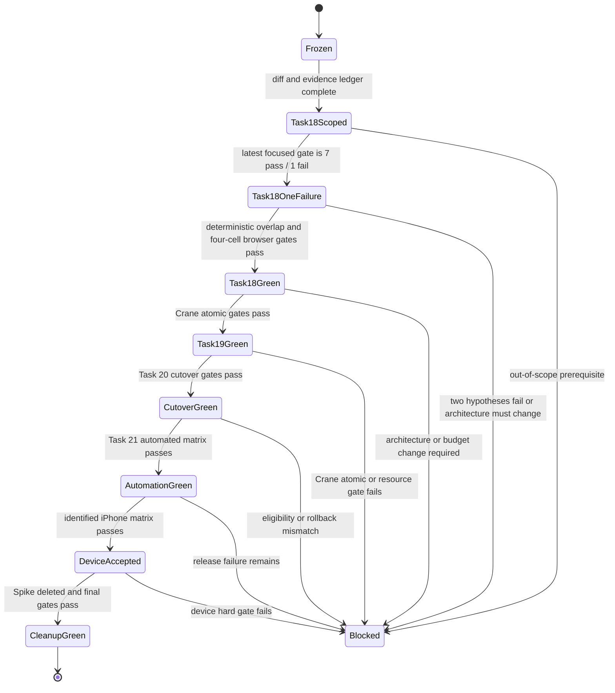
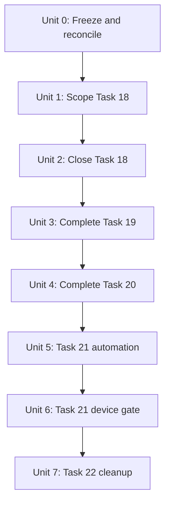
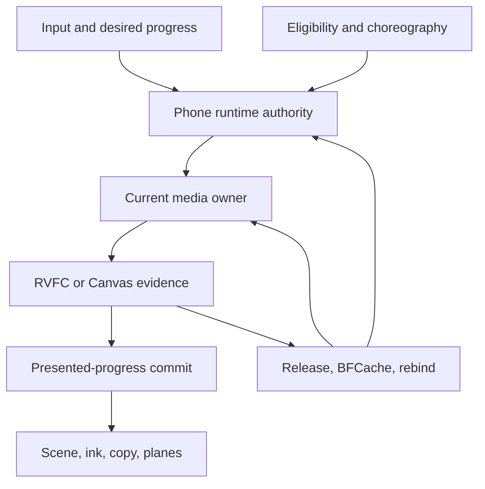

# fix: Close frame-lock migration without scope drift

## Overview

This plan resumes the approved frame-locked seek migration from the current
`codex/frame-lock-seek-migration` worktree, closes Task 18 without absorbing
unrelated release failures, and then completes Tasks 19–22 through explicit,
non-overlapping gates.

The plan is deliberately stricter about execution control than the origin
plan. It adds a durable failure ledger, a bounded test ladder, baseline/current
failure classification, explicit file allowlists, retry limits, and stop
conditions. It does not change the approved `GO_FULL` architecture, product
interaction, exact-frame standard, media budgets, or real-device exit gate.

## Problem Frame

The migration has produced substantial working code: Tasks 1–17 are committed,
Task 18 has a large uncommitted implementation. The latest recoverable state is
much narrower than the earlier release report: deterministic checks, typecheck,
build, initial/delayed Figure3, and delayed TTG checks are green; one known
WebKit repeated-traversal case remains red. The execution is not yet controlled
enough to continue safely:

| Area | Current evidence | Planning consequence |
| --- | --- | --- |
| Branch state | Branch HEAD is `9ec3e2b`; 19 tracked source/test/build files, one untracked presenter source, and two untracked planning/evidence documents are dirty | Preserve this tree; refresh its identity before implementation resumes |
| Task 18 deterministic gate | Latest reported targeted run is 9 Vitest files / 245 tests passed; typecheck and production build passed | Sync the stale ledger before relying on the result; do not rerun broadly yet |
| Build budget | Latest reported phone JS is `665516 / 665600` bytes, leaving 84 bytes | No budget increase and no net growth beyond the frozen cap |
| Task 18 focused browser gate | Latest reported focused result is 7 passed / 1 failed; the only known failure is phone-portrait WebKit, second `Brand → Figure3` traversal | Diagnose this one lifecycle race before any wider browser run |
| Known failure | The old presenter request is cleaned up while a new request overlaps on the retained decoder; the new request receives no RVFC and resolves to `poster-fallback` with `MEDIA_SEEK_FAILED` | Characterize logical-clock invalidation versus physical-driver teardown; keep fallback/error suppression out of the fix |
| Historical release matrix | The old 133 passed / 43 failed / 4 skipped report predates later fixes and is stale | Keep it as history only; do not treat 43 failures as current work |
| Shared blast radius | Current Task 18 work also touches the strict driver, frame clock tests, phone runtime, Shell, manifest, and Vite chunking | Require a causal test link for every shared change |
| Phase C evidence | `docs/superpowers/evidence/frame-lock-phase-c-review.md` is missing even though phone Tasks 15–17 were committed | Record the deviation honestly; never fabricate a historical pass |
| Real device | Device model, iOS/Safari version, support floor, and memory evidence are still unknown | Task 21 remains a hard user/device checkpoint |
| Main worktree | Tracked HEAD remains `6145cfe`, but `.playwright-cli/` is untracked | Do not call main fully clean and do not touch it during this plan |

The dominant risk is no longer the core clock architecture. It is execution
drift: broad fixes made in response to noisy full-matrix failures, repeated
browser runs without a stable artifact identity, and shared lifecycle changes
whose ownership is unclear.

## Requirements Trace

- **R1 — Preserve isolation:** Keep all implementation work in the existing
  `codex/frame-lock-seek-migration` worktree. Do not modify, merge, reset, or
  clean the main worktree; do not create another branch or worktree without
  explicit user approval.
- **R2 — Preserve approved architecture:** Keep integer-frame equality,
  desired/presented separation, RVFC evidence for direct video, Canvas evidence
  for composed surfaces, Crane atomicity, latest-wins stale rejection, and
  fail-closed lifecycle behavior from the origin specification.
- **R3 — Close Task 18 narrowly:** Figure3 and TTG must pass their exact unit
  and two-engine browser gates. Shared changes are allowed only when a named
  Task 18 or shared-lifecycle test proves they are necessary.
- **R4 — Classify before fixing:** Every browser failure must be classified as
  current-change regression, baseline failure, test-oracle defect, or
  infrastructure/flaky behavior before production code changes.
- **R5 — Use a bounded validation ladder:** Focused deterministic tests precede
  focused browser tests. Task 18's two spec files may themselves enumerate
  roughly 180 project/case rows; that spec-complete gate is run as four bounded
  cells only after focused cases are green. The separate six-project release
  matrix is reserved for Task 21 and is never a Task 18 debugging loop.
- **R6 — Preserve atomic boundaries:** Task 18, Task 19, Task 20, Task 21
  certification, and Task 22 cleanup remain separate review/commit boundaries.
- **R7 — Break retry loops:** Repeating the same failing run without new
  evidence is forbidden. Two unsuccessful implementation attempts against the
  same root cause trigger a stop-and-report checkpoint.
- **R8 — Keep evidence durable:** Every qualification run records the exact
  branch commit/tree identity, dirty state, browser project, test scope,
  pass/fail/skip counts, failure group, and artifact location.
- **R9 — Keep release claims honest:** Automated green does not substitute for
  real iPhone Safari certification. Task 22 cannot start while Task 21 device
  identity, lifecycle, frame, latency, and memory evidence are incomplete.
- **R10 — Do not weaken gates:** Do not relax exact-frame assertions, skip a
  failing eligible direction, increase budgets, accept `seeked/currentTime/rAF`
  as strict evidence, or update a test merely to match broken behavior.

## Scope Boundaries

- No interaction redesign: `snap`, `stagedSnap`, reading, gestures, cue
  thresholds, segment order, and visual design remain unchanged.
- No new runtime authority, state machine, media queue, persistent decoder,
  video, Canvas, WebGL context, worker, WebCodecs stack, or fallback clock.
- No opportunistic cleanup or unrelated P0/P1 repair during Tasks 18–20.
- No six-project release matrix during Task 18 or Task 19 debugging. Task 18's
  own two-spec/two-engine acceptance grid remains required after focused green.
- No edits outside the active worktree. Existing `.playwright-cli/` data and
  temporary worktrees are observed but not deleted by this plan.
- No push, merge, force operation, squash, or change to `main`.
- No historical evidence is reconstructed as a pass unless its exact output
  and artifact identity are recoverable.

## Context & Research

### Relevant Code and Patterns

- `docs/superpowers/specs/2026-08-30-frame-locked-seek-timeline-design.md`
  defines the immutable clock, evidence, lifecycle, budget, and support-policy
  invariants.
- `docs/superpowers/plans/2026-08-30-frame-locked-seek-timeline-migration.md`
  remains the source of truth for Task 18–22 functionality and original test
  coverage.
- `app/scripts/frame-lock-eligibility-contract.json` freezes `GO_FULL`, all
  desktop/phone direction IDs, the indivisible Crane group, and static
  fail-closed capability policy.
- `app/src/media/phone-frame-lock-presenter.ts` is the current shared Task 18
  presenter candidate. It must adapt existing strict clocks, not become a new
  lifecycle owner.
- `app/src/production/phone-story/runtime.ts` remains the sole transaction and
  presented-progress authority. Scene leaves may request/present frames but may
  not independently advance transactions.
- `app/src/production/phone-story/manifest.ts` is the canonical phone ownership
  and media-clock ledger.
- `app/playwright.release.config.ts` intentionally runs one worker and six
  release projects. Its complete matrix is a qualification tool, not a local
  debugging loop.

### Institutional Learnings

- `docs/react-refactor/ARCHITECTURE.md` requires one task per atomic boundary,
  targeted tests before commit, and Playwright at phase closure.
- `docs/plans/2026-07-15-006-fix-r5-choreography-proof-aod-flock-plan.md`
  explicitly warns against repeated partial Playwright runs and recommends
  deterministic unit/static checks before one unified release qualification.
- `docs/react-refactor/reports/r5-phone-clean-runtime-acceptance.md` separates
  automated artifact qualification from physical iPhone acceptance and records
  browser transport limitations rather than presenting them as product proof.
- Earlier R5 candidate records show that stale test oracles and shared lifecycle
  regressions can look like product failures. Oracle changes therefore require
  contract evidence, not convenience.

### External References

None. The remaining work is governed by repository-local architecture,
eligibility, test, and device-acceptance contracts.

## Key Technical Decisions

| Decision | Rationale |
| --- | --- |
| Keep the current architecture | The strict clock and phone authority contracts are already approved and implemented through Task 17; reopening architecture would guarantee further drift |
| Freeze before editing | The current uncommitted tree is recoverable but broad; every file needs an explicit owner and test before another change |
| Treat shared fixes as Task 18 only when causally required | Runtime/Shell/driver edits have a large blast radius and cannot be justified merely because a broad release test failed |
| Use representative-first browser triage | One deterministic Chromium reproduction establishes application state; WebKit is added after the root cause is understood, avoiding parallel noisy failures |
| Separate Task 18 spec acceptance from Task 21 release certification | The two Task 18 spec files can produce about 180 rows, but they cover only the phone portrait projects. The full six-project release matrix still belongs to Task 21 |
| Run browser qualification as bounded cells | One spec/project cell runs at a time against one immutable build. A stuck or red cell stops the grid before unrelated cells consume hours |
| Keep physical certification separate from automated green | Playwright WebKit and emulated phone projects cannot establish the supported iOS/Safari set or decoder/GPU memory ceiling |
| Do not retroactively fabricate Phase C | Missing checkpoint evidence is an audit deviation. The final release gate can supersede risk, but it cannot rewrite history |

## Open Questions

### Resolved During Planning

- **Is Task 18 complete?** No. Its implementation is substantially present,
  but the exact Figure3/TTG two-engine gate is not green on the latest tree.
- **Should the old 180-row command be rerun now?** No. First close the single
  WebKit case and its small sibling set. Then run the Task 18 two-spec/two-engine
  grid as four bounded cells. Do not confuse this with Task 21's six-project
  release matrix.
- **Are all 43 historical failures separate bugs?** No. They are stale and may
  include failures already fixed. None enters current scope without a fresh,
  exact reproduction on the accepted tree.
- **Does a baseline failure automatically belong in Task 18?** No. If it blocks
  an exact Task 18 gate, execution stops for a scope decision rather than
  silently absorbing it.
- **Can Task 22 start after automated green?** No. Real-device certification is
  a hard Task 21 prerequisite.

### Deferred to Execution

- Whether every current shared runtime/Shell/driver edit is causally required
  by Task 18. The diff audit and focused failure evidence decide this.
- Which presenter/clock lifetime owns terminal physical-driver disposal during
  the second Figure3 traversal. This is decided by a deterministic overlap
  test, not by speculative edits.
- The exact iPhone model, iOS/Safari version, supported-version set, and native
  decoder/Canvas/WebGL memory observations.

## High-Level Execution State

> *This illustrates the intended approach and is directional guidance for
> review, not implementation specification. The implementing agent should
> treat it as context, not code to reproduce.*

## Anti-Drift Execution Controls

### Test Ladder

| Level | Purpose | Allowed scope | Advancement rule |
| --- | --- | --- | --- |
| L0 | Tree and contract integrity | status, diff classification, generated-contract comparison, whitespace | Every dirty file has one requirement owner; no debug code |
| L1 | Deterministic behavior | named Vitest/Node tests for the current unit | All relevant cases pass on the same tree |
| L2a | Focused browser diagnosis | one named case, then its smallest sibling set | Current case passes twice in WebKit and once in Chromium without fallback/error |
| L2b | Task acceptance grid | Task 18's two spec files × phone portrait Chromium/WebKit, one cell at a time | All four cells pass against the same immutable build identity |
| L3 | Shared blast-radius regression | only scenarios touched by shared runtime/Shell/driver changes | No newly introduced regression remains |
| L4 | Full release qualification | all six release projects, only in Task 21 and final Task 22 closure | Entire configured matrix passes |
| L5 | Physical certification | identified real iPhone Safari rows | Frame, lifecycle, latency, alpha, and memory gates pass |

### Failure Classification

Every failure receives one ledger row before code changes:

| Field | Required value |
| --- | --- |
| Identity | branch commit/tree, dirty-state hash, build identity |
| Test | project, file, exact case, first failing assertion |
| Reproduction | deterministic / intermittent / not reproduced |
| Class | current regression / baseline failure / oracle defect / infrastructure |
| Root cause group | delayed module, activation, receipt, Canvas draw, lifecycle/BFCache, ownership, resource, or other named group |
| Scope owner | Task 18, 19, 20, 21, historical debt, or user decision required |
| Allowed files | explicit repo-relative allowlist |
| Closure proof | focused test, sibling regression test, and required higher ladder gate |

### Loop Breakers

- Do not rerun an unchanged failing command merely to hope for green.
- The current deterministic failure is WebKit-specific, so characterize its
  lifecycle timeline directly. Chromium is the sibling regression check, not
  the primary diagnosis platform for this blocker.
- A second implementation attempt against the same root cause must add a new
  failing characterization or invalidate the earlier hypothesis.
- After two unsuccessful implementation attempts, stop and report the
  hypothesis, evidence, modified files, and missing decision.
- Task 21 permits one initial full release run and one final full release rerun
  after all grouped failures are individually green. A third run requires a
  newly discovered failure group and a written reason in the ledger.
- Task 22 gets one final post-deletion full release run. A failure returns to
  the owning focused gate; it does not start repeated full-matrix retries.
- Only one task-owned preview server and one Playwright run may exist at a
  time. Stale task-owned processes are identified before termination; unrelated
  processes are never touched.
- Preview readiness has a five-minute ceiling. A single focused browser case
  has a fifteen-minute wall ceiling and may not remain silent for ten minutes.
  A Task 18 spec/project cell has a sixty-minute wall ceiling and must emit
  test progress at least every ten minutes. Crossing a ceiling terminates that
  task-owned run and records `INFRA_TIMEOUT`; it never rolls into an overnight
  wait.
- Publish a durable ledger checkpoint after every browser cell and a concise
  user status at least every thirty minutes during browser qualification.
- Root-cause work is limited to two implementation attempts and two hours of
  wall time before stop-and-report. More time requires a new hypothesis and
  explicit user approval.

## Implementation Units

- [x] **Unit 0: Freeze the current state and reconcile evidence debt**

**Goal:** Establish a durable, non-destructive recovery point and make all
known evidence gaps explicit before further implementation.

**Requirements:** R1, R6, R8, R9

**Dependencies:** None

**Files:**

- Create: `docs/superpowers/evidence/frame-lock-migration-closure-ledger.md`
- Review: `docs/superpowers/evidence/frame-lock-spike-results.md`
- Review: `docs/superpowers/plans/2026-08-30-frame-locked-seek-timeline-migration.md`
- Review: `app/scripts/frame-lock-eligibility-contract.json`
- Review: all current dirty files reported by the active worktree

**Approach:**

- Record branch HEAD, remote divergence, complete dirty-file inventory,
  tracked/untracked status, current build/test summaries, active task-owned
  processes, and missing artifacts.
- Record the missing Phase C review as `MISSING_HISTORICAL_EVIDENCE`. If exact
  output can be recovered, link it; otherwise do not claim a retrospective
  `PROCEED_TO_PHONE` pass.
- Record the earlier 133/43/4 matrix only as historical, non-current evidence
  until a result tied to a precise tree is available.
- Leave main, external temporary worktrees, and user-owned files untouched.

**Patterns to follow:**

- Evidence identity and superseded-history treatment in
  `docs/react-refactor/reports/r5-phone-clean-runtime-acceptance.md`.
- Frozen approval identity in
  `docs/superpowers/evidence/frame-lock-spike-results.md`.

**Test expectation:** none — this unit records state and evidence without
changing runtime behavior.

**Verification:**

- A reviewer can reconstruct exactly what is committed, what is dirty, what
  passed, what failed, and what is missing without reading task history.
- No production file changes during this unit.
- Completed by the initial closure ledger. Its test/build/browser summaries are
  now stale and must be refreshed in Unit 2 Resume Gate R0.

- [x] **Unit 1: Audit and lock the Task 18 change boundary**

**Goal:** Assign every current dirty file to a Task 18 requirement, an explicit
shared prerequisite, or an out-of-scope bucket before implementation resumes.

**Requirements:** R3, R4, R6, R7, R8

**Dependencies:** Unit 0

**Files:**

- Review/Create: `app/src/media/phone-frame-lock-presenter.ts`
- Review/Modify: `app/src/media/strict-timeline-video-driver.ts`
- Review/Test: `app/src/media/presented-frame-clock.test.ts`
- Review/Modify: `app/src/production/phone-story/runtime.ts`
- Review/Modify: `app/src/production/phone-story/PhoneStoryShell.tsx`
- Review/Test: `app/src/production/phone-story/PhoneStoryShell.test.tsx`
- Review/Modify: `app/src/production/phone-story/manifest.ts`
- Review/Test: `app/src/production/phone-story/choreography.test.ts`
- Review/Modify: `app/src/scenes/figure3-animation/phone/PhoneFigure3.tsx`
- Review/Test: `app/src/scenes/figure3-animation/phone/PhoneFigure3.test.tsx`
- Review/Test: `app/src/scenes/figure3-animation/phone/PhoneFigure3.clean.test.tsx`
- Review/Modify: `app/src/scenes/figure3-animation/phone/paper-compositor.ts`
- Review/Test: `app/src/scenes/figure3-animation/phone/paper-compositor.test.ts`
- Review/Modify: `app/src/scenes/ttg-animation/phone/PhoneTtg.tsx`
- Review/Test: `app/src/scenes/ttg-animation/phone/PhoneTtg.test.tsx`
- Review/Test: `app/src/scenes/ttg-animation/phone/PhoneTtg.clean.test.tsx`
- Review/Test: `app/e2e/r5-ttg-alpha.spec.ts`
- Review/Test: `app/e2e/r5-phone-clean-presentation.spec.ts`
- Review/Modify: `app/vite.config.ts`
- Update: `docs/superpowers/evidence/frame-lock-migration-closure-ledger.md`

**Approach:**

- Map each hunk to one of: Figure3 exact Canvas proof, TTG exact RVFC proof,
  manifest/choreography cutover, reusable presenter adaptation, retained-clock
  lifecycle, delayed-module activation, BFCache/attached-lease correctness,
  focused test coverage, or build chunk ownership.
- Remove no code during the audit. A hunk without a requirement/test owner is
  marked for user review instead of being silently kept or discarded.
- Shared runtime/Shell/driver changes remain eligible only when a focused
  failing test demonstrates that Task 18 cannot satisfy its contract without
  them.
- Temporary diagnostics and test-only bypasses are rejected.

**Patterns to follow:**

- One runtime authority in `app/src/production/phone-story/runtime.ts`.
- Existing strict driver queue in
  `app/src/media/strict-timeline-video-driver.ts`.
- Manifest-owned clock eligibility in
  `app/src/production/phone-story/manifest.ts`.

**Test expectation:** none — this is a scope and causal-ownership audit.

**Verification:**

- Every dirty hunk has an owner, required test, and disposition.
- Any out-of-scope prerequisite is surfaced before implementation continues.
- Completed by the ledger's 19-file ownership inventory. Completion freezes
  scope; it does not assert that Task 18 acceptance is green.

- [ ] **Unit 2: Close and commit Task 18 through focused gates**

**Goal:** Deliver exact Figure3 scene-Canvas and TTG direct-video frame locks
without introducing regressions in shared lifecycle ownership.

**Requirements:** R2, R3, R4, R5, R6, R7, R8, R10

**Dependencies:** Unit 1

**Files:**

- Primary implementation: `app/src/media/phone-frame-lock-presenter.ts`
- Primary deterministic test: `app/src/media/presented-frame-clock.test.ts`
- Conditional implementation: `app/src/media/strict-timeline-video-driver.ts`
  only when the overlap test proves presenter-only invalidation cannot preserve
  the live physical driver
- Conditional Figure3 lifecycle implementation:
  `app/src/scenes/figure3-animation/phone/PhoneFigure3.tsx`
- Test: `app/src/scenes/figure3-animation/phone/PhoneFigure3.test.tsx`
- Test: `app/src/scenes/figure3-animation/phone/PhoneFigure3.clean.test.tsx`
- Test: `app/src/scenes/figure3-animation/phone/paper-compositor.test.ts`
- Test: `app/src/scenes/ttg-animation/phone/PhoneTtg.test.tsx`
- Test: `app/src/scenes/ttg-animation/phone/PhoneTtg.clean.test.tsx`
- Test: `app/src/media/presented-frame-clock.test.ts`
- Test: `app/src/production/phone-story/runtime.test.ts`
- Test: `app/src/production/phone-story/PhoneStoryShell.test.tsx`
- Test: `app/src/production/phone-story/choreography.test.ts`
- Test: `app/e2e/r5-ttg-alpha.spec.ts`
- Test: `app/e2e/r5-phone-clean-presentation.spec.ts`
- Update: `docs/superpowers/evidence/frame-lock-migration-closure-ledger.md`

**Current resume snapshot:**

- Deterministic: latest reported 9 files / 245 tests passed.
- Static/build: typecheck, production build, and whitespace checks passed.
- Budget: `665516 / 665600` phone JS bytes; 84 bytes remain.
- Focused browser: 7 passed / 1 failed.
- Sole known blocker: phone-portrait WebKit, second `Brand → Figure3` cycle in
  `Figure3 slice commits forward and reverse twice without resource growth`.
- Failure signature: overlapping presenter requests on a retained video; the
  retired request is cleaned up, the replacement receives no RVFC, and the
  scene resolves to `poster-fallback` with `MEDIA_SEEK_FAILED`.
- Initial frame zero and delayed Figure3/TTG cases already passed in both phone
  engines. They are regressions to protect, not investigation targets.

### Resume Gate R0 — recover a trustworthy process and artifact state

**Time budget:** 15 minutes; no production edits.

- Confirm the neighbouring task is idle and that no Task 18 test/build command
  is still active.
- Identify and stop only preview, Chromium, and WebKit processes proven to be
  owned by this worktree. Earlier prose that servers were stopped is not
  accepted without a fresh port/process check.
- Record HEAD, dirty-file inventory, dirty-diff identity, Node/package state,
  build identity, and artifact age in the ledger.
- Replace the ledger's stale 244-test, 665578-byte, and broad-browser summaries
  with the latest recoverable 245-test, 665516-byte, and 7/1 summaries. If raw
  evidence cannot be recovered, label them `REPORTED_NOT_REPRODUCED` rather
  than presenting them as current proof.
- Start no browser server until R1/R2 determines which exact case is needed.

**Pass:** one recoverable worktree identity, zero stale task-owned processes,
and one honest ledger snapshot. **Fail/stop:** process ownership is ambiguous or
the dirty tree differs from the recorded Task 18 scope.

### Resume Gate R1 — characterize the overlap deterministically

**Time budget:** 45 minutes before the first implementation hypothesis.

Add or tighten a deterministic clock/presenter test with this exact timeline:

1. Request A is pending on a retained physical video/driver.
2. Figure3's activation generation or binding is replaced.
3. Request B starts on the same retained physical video before A fully settles.
4. Aborting/resetting A makes A stale but cannot terminally dispose the physical
   driver or RVFC path still owned by B.
5. B receives the exact current RVFC, paints the current Canvas, and returns
   `scene-canvas-draw`; A can never report or fail the current generation.

Add the matching Figure3 integration characterization: forward, reverse, and
second forward while the old causal promise overlaps. Assert one current owner,
no `MEDIA_SEEK_FAILED`, no `poster-fallback`, no stale report, and unchanged
decoder/Canvas/resource counts.

If unit-level mocks cannot reproduce the failure, add temporary test-only
diagnostics for request order, generation, binding identity, logical clock
identity, physical-driver identity, abort/reset cause, seek issue, and RVFC
delivery. Run the single WebKit case once, capture the timeline in the ledger,
then remove the diagnostics before acceptance. Do not add production logging or
guess from screenshots.

**Pass:** a red deterministic test or one captured WebKit event timeline that
distinguishes lifetime ownership. **Fail/stop:** no reproducible timeline after
one WebKit capture; report the evidence gap instead of editing production code.

### Resume Gate R2 — choose one root cause and one minimal causal fix

Only one row may be active per implementation attempt:

| Observed discriminator | Owning fix boundary | Required proof |
| --- | --- | --- |
| Presenter reset invalidates a logical request and also terminally tears down a driver still used by B | `phone-frame-lock-presenter.ts`; separate stale logical-clock invalidation from physical-driver retirement | A becomes stale; B still receives exact RVFC; final presenter disposal retires once |
| A strict clock/driver disposal can destroy a shared video driver while another live clock owns it | `strict-timeline-video-driver.ts`, but only after presenter-only handling is disproved | Two-clock same-video tests cover dispose order, ref/identity ownership, latest-wins, and final teardown |
| Figure3 opens B before A's binding/generation handoff is causally invalidated | `PhoneFigure3.tsx` lifecycle ordering | Old callback cannot report; retained decoder is reused; new binding becomes sole reporter |
| WebKit receives the correct new request but needs an activation nudge before the exact RVFC | Existing activation-nudge boundary only, hidden under the proved cover and paused before exposure | RVFC remains the sole direct-video proof; native playback never becomes a formal clock |

Non-solutions: delaying assertions, suppressing the red box, accepting
`poster-fallback`, widening timeouts, using `seeked/currentTime/rAF` as proof,
adding a second queue/authority, or replacing the retained decoder.

No further edits are permitted in runtime, Shell, manifest, choreography, TTG,
Vite config, Hero, AOD/Figure2, PH, or Crane during this blocker unless R1
produces a direct failing test for that file and the user approves the scope
change. Existing dirty hunks in those files are preserved.

### Resume Gate R3 — bounded implementation loop

For each attempt, in order:

1. Make one hypothesis-specific production change.
2. Run only the new red test and its immediate clock/Figure3 siblings.
3. If deterministic green, build once and run only the failing WebKit case.
4. If WebKit green, run the same case in Chromium.
5. Record hypothesis, diff, command scope, duration, and result before another
   edit.

Maximum: two implementation attempts, one WebKit run per attempt, and two hours
total root-cause wall time. Attempt two must add new evidence or explicitly
invalidate attempt one. Reaching either cap stops work in a recoverable state
and produces a user decision report; it does not start a third speculative
refactor.

### Resume Gate R4 — focused Task 18 acceptance

Against one fresh immutable build:

- Pass the formerly failing WebKit cycle twice in fresh browser contexts.
- Pass its Chromium sibling once.
- Pass the current eight-case focused Figure3/TTG set once in both phone
  engines, including initial frame zero and both delayed-chunk cases.
- Confirm every successful current request reports the permitted exact evidence,
  the second traversal never enters `poster-fallback`, no `MEDIA_SEEK_FAILED`
  appears, and resource counts return to the same ceiling.

Any red case returns only to its owning focused test. Do not start the
spec-complete grid while R4 is red.

### Resume Gate R5 — Task 18 spec-complete four-cell grid

Freeze the build/tree identity and run these cells sequentially, never in
parallel:

1. `r5-phone-clean-presentation.spec.ts` — phone portrait Chromium.
2. `r5-phone-clean-presentation.spec.ts` — phone portrait WebKit.
3. `r5-ttg-alpha.spec.ts` — phone portrait Chromium.
4. `r5-ttg-alpha.spec.ts` — phone portrait WebKit.

The aggregate may be about 180 rows. It is Task 18's two-spec acceptance gate,
not Task 21's six-project release matrix. Each cell has its own result artifact,
ledger checkpoint, ten-minute progress heartbeat, and sixty-minute wall cap.
A failed or timed-out cell stops the grid; later cells do not run. Characterize
one representative failure, fix it through R1–R4, then restart the four cells
against the new build identity. At most two complete grid attempts are allowed.

An unrelated-scene failure in the broad presentation spec is classified before
any edit. If it is caused by current shared Task 18 changes, close it through a
focused regression test. If it is baseline/historical debt or belongs to a later
task, stop for a scope decision; do not silently absorb it.

### Resume Gate R6 — deterministic/build/commit gate

- Run the named 9-file / 245-test suite on the final tree, plus every new
  overlap test.
- Run TypeScript typecheck, production build, and whitespace validation.
- Keep phone JS at or below `665600` bytes without raising the cap. Because only
  84 bytes remain, the lifecycle fix must be size-neutral or retire equivalent
  dead/duplicate code; no minifier-policy weakening or test-only bypass.
- Update the ledger with exact tree/build identity and all R4/R5 artifacts.
- Inspect the final diff for temporary diagnostics and scope creep.
- Commit Task 18 as one atomic feature boundary. Do not begin Task 19 until the
  commit succeeds and the worktree contains only the two planning/evidence
  documents intentionally carried forward.

**Task 18 completion definition:**

- Overlap ownership is deterministic and the second WebKit traversal passes.
- All named deterministic tests and the four Task 18 browser cells pass on one
  unchanged tree/build.
- No current-change regression, fallback, red error box, resource growth,
  budget increase, relaxed oracle, or unclassified failure remains.
- The Task 18 commit and ledger identify exactly what changed and why.

- [ ] **Unit 3: Complete Task 19 Crane atomic phone migration**

**Goal:** Migrate the phone Crane figure/flock pair as one exact presented-frame
barrier and prove resource retirement without reopening shared architecture.

**Requirements:** R2, R5, R6, R7, R8, R10

**Dependencies:** Unit 2

**Files:**

- Modify: `app/src/scenes/crane-animation/phone/PhoneCrane.tsx`
- Modify: `app/src/scenes/crane-animation/phone/PhoneCrane.motion.ts`
- Rename: `app/src/scenes/crane-animation/phone/PhoneCrane.autoplay.ts`
  to `app/src/scenes/crane-animation/phone/PhoneCrane.activation-nudge.ts`
- Test: `app/src/scenes/crane-animation/phone/PhoneCrane.test.tsx`
- Test: `app/src/scenes/crane-animation/phone/PhoneCrane.clean.test.tsx`
- Test: `app/src/media/presented-frame-barrier.test.ts`
- Test: `app/src/production/phone-story/runtime.test.ts`
- Modify: `app/src/production/phone-story/manifest.ts`
- Test: `app/src/production/phone-story/choreography.test.ts`
- Test: `app/e2e/r5-crane-media.spec.ts`
- Test: `app/e2e/r5-phone-rendering-lifecycle.spec.ts`
- Update: `docs/superpowers/evidence/frame-lock-migration-closure-ledger.md`

**Approach:**

- Keep exactly two videos, two Canvases, and two WebGL contexts.
- Use the existing `PresentedFrameBarrier`; do not add another queue or pair
  coordinator.
- Figure and flock must resolve the same logical sequence before any visual,
  copy, or machine progress commits.
- Native playback may remain only as a named activation nudge and must pause
  before formal exposure.
- Restrict production edits to this file allowlist. A required runtime or
  barrier contract change triggers a stop because it changes the approved
  shared architecture after three phone slices already depend on it.

**Execution note:** Test the barrier and retirement behavior before scene edits.

**Test scenarios:**

- **Happy path:** Figure-first and flock-first completion each produce one
  atomic receipt and zero logical-frame difference.
- **Edge:** Shorter flock terminal frame maps to the same master endpoint as the
  figure terminal frame.
- **Error:** One-side stale, timeout, draw failure, or context loss prevents
  both-side commit and follows fail-closed recovery.
- **Lifecycle:** Reverse, hidden retirement, BFCache, dispose, and reactivation
  cannot revive an old child receipt or leak a resource.
- **Integration:** Contact visibility/copy follows barrier presented progress;
  resource counts and process memory remain within existing ceilings.

**Verification:**

- Crane unit/barrier/runtime tests pass.
- Crane and rendering-lifecycle specs pass in phone portrait Chromium and
  WebKit.
- Memory evidence shows unchanged resource ceilings.
- Real iPhone Crane pressure evidence is captured here when available; if the
  device is unavailable, it remains an explicit Task 21 prerequisite and is
  not silently marked complete.

- [ ] **Unit 4: Complete Task 20 manifest cutover and retire migrated clocks**

**Goal:** Make the approved `GO_FULL` manifest/choreography contract exhaustive,
remove the migration kill switch and unreachable formal legacy clocks, and
prove rollback/evidence consistency before release qualification.

**Requirements:** R2, R5, R6, R8, R10

**Dependencies:** Unit 3

**Files:**

- Modify/Test: `app/src/story/types.ts`
- Modify/Test: `app/src/story/manifest.ts`
- Modify/Test: `app/src/media/timeline-video-driver.ts`
- Delete/Test: `app/src/media/frame-lock-rollout.ts`
- Delete/Test: `app/src/media/frame-lock-rollout.test.ts`
- Modify: `app/src/scenes/hero/index.tsx`
- Modify: `app/src/scenes/aod-animation/index.tsx`
- Modify: `app/src/scenes/figure2-animation/index.tsx`
- Modify: `app/src/scenes/figure3-animation/index.tsx`
- Modify: `app/src/scenes/ttg-animation/index.tsx`
- Modify: `app/src/scenes/ph-animation/index.tsx`
- Modify: `app/src/scenes/crane-animation/index.tsx`
- Modify: `app/src/scenes/hero/phone/PhoneHero.motion.ts`
- Modify: `app/src/scenes/aod-animation/phone/PhoneAod.tsx`
- Modify: `app/src/scenes/figure2-animation/phone/PhoneFigure2.tsx`
- Modify: `app/src/scenes/figure3-animation/phone/PhoneFigure3.tsx`
- Modify: `app/src/scenes/ttg-animation/phone/PhoneTtg.tsx`
- Modify: `app/src/scenes/ph-animation/phone/PhonePh.tsx`
- Modify: `app/src/scenes/crane-animation/phone/PhoneCrane.tsx`
- Modify: `app/src/scenes/crane-animation/phone/PhoneCrane.activation-nudge.ts`
- Create/Test: `app/scripts/verify-frame-lock-cutover.mjs`
- Create/Test: `app/scripts/verify-frame-lock-cutover.test.mjs`
- Modify: `app/package.json`
- Test: `app/src/production/release-manifest.test.ts`
- Modify: `docs/superpowers/evidence/frame-lock-spike-results.md`
- Update: `docs/superpowers/evidence/frame-lock-migration-closure-ledger.md`

**Approach:**

- Compare every desktop direction and phone choreography row against the frozen
  eligibility contract. `GO_FULL` permits no remaining eligible legacy owner.
- Archive the complete migration-kill-switch rollback matrix before deleting
  the switch.
- Delete only migration compatibility branches. Preserve static fail-closed
  recovery and activation nudges explicitly allowed by the contract.
- Make strict paths unreachable from the 50ms legacy tolerance.
- Run deterministic/static gates and the normal build gate, but reserve the
  complete release Playwright matrix for Unit 5.

**Test scenarios:**

- **Contract:** Every eligible direction is frame-lock and no unknown or split
  atomic group exists.
- **Rollback:** The migration helper restores only its reviewed tolerant path,
  never native playback as formal clock, before the helper is removed.
- **Error:** Missing RVFC/Canvas capability follows static fail-closed behavior,
  not a hidden legacy branch.
- **Lifecycle:** Retirement clears diagnostics, callbacks, and migrated legacy
  state.
- **Build integration:** Architecture, media, CDN, release manifest, and budget
  generators agree with the eligibility contract.

**Verification:**

- Cutover verifier and manifest tests pass.
- Full Vitest, typecheck, lint, build, deep-media, and packed-alpha checks pass.
- No migration kill-switch reference or reachable formal native clock remains
  in approved directions.
- Task 20 lands as its own atomic boundary.

- [ ] **Unit 5: Run Task 21 automated release qualification once per state**

**Goal:** Qualify the complete cutover across all configured release projects,
group failures by root cause, and reach a stable automated-green artifact
without full-matrix thrashing.

**Requirements:** R4, R5, R7, R8, R9, R10

**Dependencies:** Unit 4

**Files:**

- Modify/Test: `app/e2e/r5-homepage-media.spec.ts`
- Modify/Test: `app/e2e/r5-performance.spec.ts`
- Modify/Test: `app/e2e/r5-matrix.spec.ts`
- Modify/Test: `app/e2e/r5-phone-story.spec.ts`
- Modify/Test: `app/e2e/r5-phone-clean-runtime.spec.ts`
- Modify/Test: `app/e2e/r5-phone-clean-presentation.spec.ts`
- Modify/Test: `app/e2e/r5-phone-rendering-lifecycle.spec.ts`
- Modify/Test: `app/e2e/r5-crane-media.spec.ts`
- Modify: `docs/superpowers/evidence/frame-lock-spike-results.md`
- Update: `docs/superpowers/evidence/frame-lock-migration-closure-ledger.md`

**Approach:**

- Add only release assertions required by the origin Task 21: exact desired vs
  presented frame, stale rejection, monotonic sequence, endpoint evidence,
  eligibility mode, and permitted evidence type.
- Finish all deterministic/build/memory gates before the first full release
  matrix.
- Run the six-project matrix once and persist a result tied to the exact tree.
- Group failures by root cause. For each group, reproduce one representative,
  add/confirm a deterministic oracle, fix only the owning scope, run focused
  siblings, and update the ledger.
- After all known groups are individually green, run the complete matrix once
  more. Do not use the full matrix as the per-fix loop.
- Any code change after the final matrix invalidates automated certification and
  returns execution to the owning focused gate plus one justified final rerun.

**Test scenarios:**

- **Exactness:** Every strict committed receipt has equal target/presented frame
  and permitted evidence for its surface.
- **Concurrency:** Rapid overwrite, reverse, and abort never commit stale
  sequence/generation/frameToken data.
- **Lifecycle:** Direct entry, delayed chunks, visibility, BFCache, orientation,
  activation rejection/retry, and reduced motion recover through one authority.
- **Atomicity:** Crane figure/flock commit together and retire together.
- **Eligibility:** Every cinematic direction reports frame-lock under GO_FULL;
  capability failure reports the static policy without user-agent routing.
- **Performance/resources:** Media, CDN, JS, memory, decoder, Canvas, and WebGL
  ceilings remain unchanged.

**Verification:**

- Full unit, typecheck, lint, build, deep-media, packed-alpha, cutover, and
  release-memory gates pass.
- All six configured release projects pass on one exact artifact.
- The ledger contains no unclassified or current-regression failure.
- Automated green is recorded as `AUTOMATION_GREEN_DEVICE_PENDING`, not final
  release acceptance.

- [ ] **Unit 6: Complete Task 21 real iPhone Safari certification**

**Goal:** Establish the actual supported device/version evidence and close the
physical frame, lifecycle, alpha, latency, and resource gates.

**Requirements:** R2, R8, R9, R10

**Dependencies:** Unit 5

**Files:**

- Modify: `docs/superpowers/evidence/frame-lock-spike-results.md`
- Update: `docs/superpowers/evidence/frame-lock-migration-closure-ledger.md`

**Approach:**

- Record exact iPhone model, iOS version, Safari version, RVFC capability,
  tested build/tree identity, and whether the row is the product minimum,
  oldest accessible certified version, or current version.
- Exercise forward, reverse, endpoints, rapid direction change, direct entry,
  visibility/background, BFCache, orientation, activation retry, reduced
  motion, PH pause/resume, Figure3/TTG, and Crane atomic pressure.
- Capture integer frame equality, stale commits, P95/P99 seek-to-present,
  consecutive long frames, alpha/matte failures, decoder/Canvas/WebGL/resource
  observations, and release/disposal behavior.
- If the device reveals a code defect, stop certification. Return to the owning
  focused unit, invalidate automated green, and repeat Unit 5 after the fix.
- If the required minimum device/version is unavailable, report only the
  certified set and stop before Task 22.

**Test scenarios:**

- **Input/lifecycle:** Real touch navigation completes all named forward and
  reverse paths through background, BFCache, rotation, and retry.
- **Frame correctness:** Every accepted direct-video, packed-Canvas,
  scene-Canvas, and Crane barrier row has zero logical frame error.
- **Performance:** P95/P99 and consecutive-long-frame gates meet the origin
  thresholds without additional persistent resources.
- **Capability fallback:** Missing required capability exposes the approved
  static/unsupported policy and cannot emit strict evidence.

**Verification:**

- The certified device/version set and below-minimum policy are explicit.
- All origin hard gates pass on every claimed certified row.
- User confirms final real-device acceptance.
- Task 21 lands as a certification/evidence boundary only after both automated
  and physical gates are complete.

- [ ] **Unit 7: Execute Task 22 cleanup and final regression**

**Goal:** Delete the disposable Spike and migration-only tooling, finalize
documentation, and prove that cleanup did not remove production frame-lock
coverage or change behavior.

**Requirements:** R1, R2, R5, R6, R8, R9, R10

**Dependencies:** Unit 6

**Files:**

- Delete: `app/src/harness/frame-lock-spike/`
- Delete: `app/e2e/frame-lock-spike.spec.ts`
- Delete: `app/playwright.frame-lock.config.ts`
- Delete: `app/scripts/rebuild-frame-lock-spike-candidates.mjs`
- Delete: `app/scripts/rebuild-frame-lock-spike-candidates.test.mjs`
- Modify/Test: `app/src/harness/HarnessRouter.tsx`
- Modify: `docs/superpowers/specs/2026-08-30-frame-locked-seek-timeline-design.md`
- Modify: `docs/superpowers/evidence/frame-lock-spike-results.md`
- Finalize: `docs/superpowers/evidence/frame-lock-migration-closure-ledger.md`

**Approach:**

- Confirm no production import references the Spike before deletion.
- Delete only the disposable route, UI, probe queue, candidate generator, and
  Spike-only Playwright config. Keep production timebase/clock/barrier tests,
  frozen eligibility, baseline reporting, and release evidence.
- Mark the design implemented only with the final decision, release identity,
  certified device/version set, and zero unresolved hard gates.
- Run the complete deterministic/build gate and one final post-deletion release
  matrix.
- Do not clean unrelated main-worktree files or external temporary worktrees.

**Test scenarios:**

- **Routing:** The removed harness route is unreachable and unknown harness
  behavior remains unchanged.
- **Import boundary:** Production source, E2E, and scripts contain no disposable
  Spike imports or route references.
- **Regression:** Production strict clocks, Figure3/TTG, Crane atomicity,
  lifecycle recovery, and eligibility assertions remain green after deletion.
- **Release:** Full unit/static/build/memory and all six release browser projects
  pass on the final tree.

**Verification:**

- Spike and migration-only tooling are absent.
- Final evidence and design status reference one exact final commit/tree and the
  certified device set.
- The active worktree is clean after the final atomic cleanup boundary, apart
  from no user-owned or unrelated files.
- Main remains at its original tracked state and no merge/push occurred.

## System-Wide Impact

- **Interaction graph:** Input produces desired progress; runtime selects the
  manifest owner; owner returns exact evidence; runtime alone commits presented
  progress to all visual channels.
- **Error propagation:** Driver/Canvas/barrier failures reject or become stale,
  flow through existing fail-closed recovery, and never become approximate
  progress.
- **State lifecycle risks:** Detached leases, retained decoders, StrictMode
  replay, delayed chunks, BFCache, and reverse can all surface stale callbacks.
  Fresh generation/sequence/frameToken checks remain mandatory at every edge.
- **API surface parity:** Desktop and phone direction eligibility must agree
  with the frozen GO_FULL inventory; Crane remains indivisible.
- **Integration coverage:** Unit tests prove clock/barrier semantics; focused
  Playwright proves production leaves and lifecycle; Task 21 proves the entire
  artifact; real iPhone proves physical Safari behavior.
- **Unchanged invariants:** One runtime authority, existing A/B presentation,
  interaction policy, visual design, static fail-closed behavior, and all
  current resource/media budgets remain unchanged.

## Risks & Mitigations

| Risk | Likelihood | Impact | Mitigation |
| --- | --- | --- | --- |
| Shared Task 18 edits hide unrelated fixes | High | High | Hunk-level owner/test audit before another edit |
| Broad release failures trigger scope expansion | High | High | Failure classification, explicit allowlist, and user checkpoint for baseline/out-of-scope blockers |
| Repeated Playwright runs consume hours without new information | High | High | Test ladder, representative-first diagnosis, two-attempt loop breaker, bounded full-matrix runs |
| Stale preview/browser processes contaminate results | Medium | Medium | Record and terminate only identified task-owned processes before qualification; one server/run at a time |
| Test oracle is stale rather than production behavior | Medium | High | Require contract/spec evidence before changing an assertion |
| Missing Phase C evidence undermines auditability | Certain | Medium | Record the historical gap honestly; do not reconstruct a pass; require complete final qualification |
| Real-device defect arrives after automation | Medium | High | Device failure invalidates automation and returns to the owning focused gate |
| Device/version unavailable | Medium | High | Report certified set only and stop before cleanup/release claim |
| Task 20 deletes rollback too early | Low | High | Archive full rollback matrix before removing the migration helper |
| Cleanup deletes reusable production coverage | Medium | High | Explicit keep/delete inventory and final post-deletion full matrix |

## Success Metrics

- Task 18 focused unit and two-engine browser gates pass with no unclassified
  shared regression.
- Task 19 Crane commits with zero logical-frame difference and unchanged
  resources.
- Task 20 manifest/choreography exactly matches the frozen GO_FULL contract and
  contains no reachable migration clock in eligible directions.
- Task 21 deterministic/build/memory gates and all six release projects pass on
  one exact artifact.
- Every certified real iPhone row has zero wrong frame, zero stale commit, zero
  Crane mismatch, compliant latency/long-frame/alpha/resource results, and
  explicit device/version identity.
- Task 22 removes disposable code while keeping final regression green.
- No new branch, worktree, main modification, push, merge, budget increase,
  visual redesign, or relaxed correctness gate occurs.

## Documentation and Operational Notes

- `docs/superpowers/evidence/frame-lock-migration-closure-ledger.md` is the
  single execution ledger. Do not scatter status across chat-only summaries.
- Every gate entry includes artifact/tree identity. A passing run on an older
  dirty state is historical evidence, not a current pass.
- `docs/superpowers/evidence/frame-lock-spike-results.md` remains the approved
  decision and final release evidence document.
- The missing Phase C document remains an explicit historical deviation unless
  exact evidence is recovered; final Task 21 evidence closes current release
  risk but does not erase the deviation.

## Sources & References

- **Origin plan:** `docs/superpowers/plans/2026-08-30-frame-locked-seek-timeline-migration.md`
- **Architecture specification:** `docs/superpowers/specs/2026-08-30-frame-locked-seek-timeline-design.md`
- **Eligibility contract:** `app/scripts/frame-lock-eligibility-contract.json`
- **Decision evidence:** `docs/superpowers/evidence/frame-lock-spike-results.md`
- **Phone architecture:** `docs/react-refactor/ARCHITECTURE.md`
- **Prior automated/physical evidence discipline:** `docs/react-refactor/reports/r5-phone-clean-runtime-acceptance.md`
- **Prior bounded Playwright strategy:** `docs/plans/2026-07-15-006-fix-r5-choreography-proof-aod-flock-plan.md`
